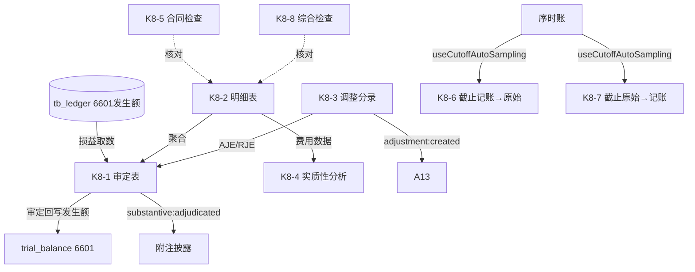

# Design Document: K8 销售费用底稿专属HTML精美组件

## Overview

K8销售费用底稿专属组件`k8-selling-expenses`。K循环损益类底稿（1个xlsx/12有效sheet/~120+公式）。科目6601销售费用（**损益类！取发生额**）。

核心架构：
- componentType `k8-selling-expenses`，主入口 GtK8SellingExpenses.vue
- **损益类科目！**从tb_ledger取发生额非余额（与资产/负债类根本不同）
- **实质性分析引擎 + 截止测试引擎独立composable**
- composable分层：useK8FormData + useK8FormulaEngine(纯函数) + useK8AnalysisEngine(纯函数) + useK8CutoffEngine + useK8CrossSheet + useK8DualMode + useK8ImportExport
- EventBus联动：TB回写(6601发生额) + 附注 + A13 + 截止自动抽样(useCutoffAutoSampling)

## Architecture

### sheetName分发模式

```
sheetName → regex提取编码(K8-1~K8-8/K8A/附注) → v-if匹配 → 子组件渲染
                                                    ↘ 未匹配 → OnlyOffice fallback
```

### 损益类取数逻辑

```
资产/负债类: TB取期末余额 → audited_amount = 期末余额
损益类(6601): TB取发生额  → audited_amount = 本期借方发生累计 - 贷方发生(红冲)
              来源: tb_ledger 明细科目发生额汇总，而非 tb_balance 期末余额
```

### 实质性分析

```
同比变动率 = (本期 - 上期) / 上期
占收入比   = 费用 / 营业收入
异常判断   = |同比变动率| > 阈值 OR |占比偏离| > 阈值
```

### 截止测试双向

```
K8-6 记账凭证 → 原始凭证：验证已入账费用有真实原始凭证支持且期间正确
K8-7 原始凭证 → 记账凭证：验证已发生费用及时完整入账（完整性）
自动抽样: useCutoffAutoSampling → 序时账期末±5天
跨期判断: 原始凭证日期与记账日期分属不同会计期间
```

### 文件结构

```
audit-platform/frontend/src/components/workpaper/
├── GtK8SellingExpenses.vue                  # 主入口 sheetName v-if分发
├── k8/
│   ├── core/
│   │   ├── K8TabIndex.vue                   # 底稿目录
│   │   ├── K8TabAdjudication.vue            # K8-1 审定表（损益类，73公式）
│   │   ├── K8TabDetail.vue                  # K8-2 明细表（27列3区段，48行）
│   │   ├── K8TabAdjustment.vue              # K8-3 调整分录
│   │   ├── K8TabDisclosureListed.vue        # 附注上市
│   │   └── K8TabDisclosureSoe.vue           # 附注国企
│   ├── analysis/
│   │   └── K8TabSubstantiveAnalysis.vue     # K8-4 实质性分析（25公式，39行）
│   ├── cutoff/
│   │   ├── K8TabCutoffV2S.vue               # K8-6 截止(记账→原始，44行)
│   │   └── K8TabCutoffS2V.vue               # K8-7 截止(原始→记账，44行)
│   └── inspection/
│       ├── K8TabContractCheck.vue           # K8-5 合同检查
│       └── K8TabSellingCheck.vue            # K8-8 综合检查
├── composables/
│   ├── useK8FormData.ts                     # selfLoad/writebackTB(6601发生额！)
│   ├── useK8FormulaEngine.ts                # 纯函数公式引擎（损益类！）
│   ├── useK8AnalysisEngine.ts               # 纯函数实质性分析引擎
│   ├── useK8CutoffEngine.ts                 # 截止测试引擎（自动抽样+跨期判断）
│   ├── useK8CrossSheet.ts                   # 跨sheet联动
│   ├── useK8DualMode.ts + useK8ImportExport.ts
│   └── useK8Adjudication.ts / useK8Detail.ts / useK8Analysis.ts / useK8Cutoff.ts / useK8Checks.ts

backend/app/routers/wp_render_strategies/
├── _k8_selling_expenses.py                  # render策略+RENDERER_DISPATCH（损益取数）
├── _k8_import_export.py                     # 导入导出3端点
└── _k8_ai_generate.py                       # AI生成
backend/data/wp_render_schema/k8-selling-expenses.yaml
```

## Composable接口设计

### useK8FormulaEngine.ts（纯函数，损益类）

```typescript
export function calcAuditedAmount(unadj: number, aje: number, rje: number): number
// 费用类发生额 = 借方发生 - 贷方发生(红冲)
export function calcIncomeStatementOccurrence(debitOcc: number, creditOcc: number): number
export function calcSubtotal(arr: number[]): number
// 注意：损益类没有"期末余额"概念，只有发生额！
```

### useK8AnalysisEngine.ts（纯函数）

```typescript
export function calcYoYChange(current: number, prior: number): number | null  // (本期-上期)/上期
export function calcRatioToRevenue(expense: number, revenue: number): number | null
export function isAbnormalFluctuation(changeRate: number, threshold: number): boolean
```

### useK8CutoffEngine.ts

```typescript
export function isCrossPeriod(sourceDate: string, bookDate: string, periodEnd: string): boolean
export function autoSampleCutoff(ledger: LedgerEntry[], periodEnd: string, days: number): CutoffSample[]
```

### useK8CrossSheet.ts

```typescript
export function useK8CrossSheet(allResponses: Ref<Map<string, any>>): {
  adjudicationVsDetail: ComputedRef<{ diff: number; isMatch: boolean }>
  analysisVsDetail: ComputedRef<{ isMatch: boolean }>  // K8-4 vs K8-2
}
```

## 跨Sheet数据流图



## Architecture Decision Records (ADR)

### ADR-1: K8是损益类，取发生额非余额

K8销售费用（6601）损益类，与资产/负债类根本不同：从tb_ledger取本期发生额（借方发生累计-贷方红冲），非tb_balance期末余额。期末余额结转本年利润后为0。回写TB时audited_amount为发生额。

### ADR-2: 实质性分析引擎独立composable

同比/环比/占收入比/异常波动是损益类审计核心分析程序。useK8AnalysisEngine纯函数实现，便于PBT验证同比变动率与占比公式。

### ADR-3: 截止双向复用useCutoffAutoSampling

K8-6/K8-7双向截止测试复用平台cutoff-test-auto-sampling能力，自动从序时账提取期末±5天凭证，跨期判断纯函数化便于验证。

## Correctness Properties

| ID | Property | 验证方式 |
|----|----------|---------|
| CP-K8-01 | 审定数=未审+AJE+RJE | PBT |
| CP-K8-02 | 费用类发生额=借方发生-贷方发生 | PBT |
| CP-K8-03 | 同比变动率=(本期-上期)/上期 | PBT |
| CP-K8-04 | 占收入比=费用/营业收入 | PBT |
| CP-K8-05 | 异常判断=|变动率|>阈值 | PBT |
| CP-K8-06 | 合计行恒等 | PBT |
| CP-K8-07 | 跨期判断确定性（不同期间→true） | PBT |

## 错误处理

| 场景 | 处理方式 |
|------|---------|
| selfLoad失败 | el-empty+重试 |
| TB无科目6601 | 提示导入试算表 |
| 损益取数返回期末余额 | 自动切换到发生额取数+黄色警告 |
| 上期为0(同比除零) | 返回null+显示"—" |
| 营业收入为0(占比除零) | 返回null |
| 序时账无期末凭证 | 提示无截止样本 |
| 48行/39行/44行渲染卡顿 | 虚拟滚动 |
| OO健康检查失败 | 降级HTML |
