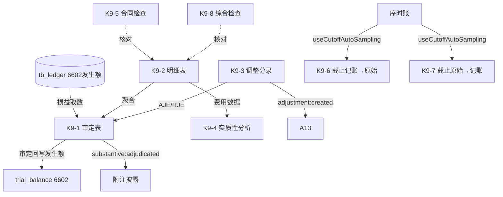

# Design Document: K9 管理费用底稿专属HTML精美组件

## Overview

K9管理费用底稿专属组件`k9-admin-expenses`。K循环损益类底稿（1个xlsx/12有效sheet/~120+公式）。科目6602管理费用（**损益类！取发生额**）。与K8销售费用同款损益类方法论。

核心架构：
- componentType `k9-admin-expenses`，主入口 GtK9AdminExpenses.vue
- **损益类科目！**从tb_ledger取发生额非余额
- **实质性分析引擎 + 截止测试引擎独立composable**
- composable分层：useK9FormData + useK9FormulaEngine(纯函数) + useK9AnalysisEngine(纯函数) + useK9CutoffEngine + useK9CrossSheet + useK9DualMode + useK9ImportExport
- EventBus联动：TB回写(6602发生额) + 附注 + A13 + 截止自动抽样(useCutoffAutoSampling)

## Architecture

### sheetName分发模式

```
sheetName → regex提取编码(K9-1~K9-8/K9A/附注) → v-if匹配 → 子组件渲染
                                                    ↘ 未匹配 → OnlyOffice fallback
```

### 损益类取数逻辑

```
损益类(6602): TB取发生额 → audited_amount = 本期借方发生累计 - 贷方发生(红冲)
              来源: tb_ledger 明细科目发生额汇总，而非 tb_balance 期末余额
```

### 实质性分析 + 截止双向

```
同比变动率 = (本期 - 上期) / 上期
占收入比   = 费用 / 营业收入
异常判断   = |同比变动率| > 阈值 OR |占比偏离| > 阈值

K9-6 记账凭证 → 原始凭证；K9-7 原始凭证 → 记账凭证
自动抽样 useCutoffAutoSampling → 序时账期末±5天；跨期判断=原始日期与记账日期分属不同期间
```

### 文件结构

```
audit-platform/frontend/src/components/workpaper/
├── GtK9AdminExpenses.vue                    # 主入口 sheetName v-if分发
├── k9/
│   ├── core/
│   │   ├── K9TabIndex.vue                   # 底稿目录
│   │   ├── K9TabAdjudication.vue            # K9-1 审定表（损益类，73公式，44行）
│   │   ├── K9TabDetail.vue                  # K9-2 明细表（25列3区段，55行）
│   │   ├── K9TabAdjustment.vue              # K9-3 调整分录
│   │   ├── K9TabDisclosureListed.vue        # 附注上市
│   │   └── K9TabDisclosureSoe.vue           # 附注国企
│   ├── analysis/
│   │   └── K9TabSubstantiveAnalysis.vue     # K9-4 实质性分析（16公式，48行）
│   ├── cutoff/
│   │   ├── K9TabCutoffV2S.vue               # K9-6 截止(记账→原始)
│   │   └── K9TabCutoffS2V.vue               # K9-7 截止(原始→记账)
│   └── inspection/
│       ├── K9TabContractCheck.vue           # K9-5 合同检查
│       └── K9TabAdminCheck.vue              # K9-8 综合检查
├── composables/
│   ├── useK9FormData.ts                     # selfLoad/writebackTB(6602发生额！)
│   ├── useK9FormulaEngine.ts                # 纯函数公式引擎（损益类！）
│   ├── useK9AnalysisEngine.ts               # 纯函数实质性分析引擎
│   ├── useK9CutoffEngine.ts                 # 截止测试引擎（自动抽样+跨期判断）
│   ├── useK9CrossSheet.ts                   # 跨sheet联动
│   ├── useK9DualMode.ts + useK9ImportExport.ts
│   └── useK9Adjudication.ts / useK9Detail.ts / useK9Analysis.ts / useK9Cutoff.ts / useK9Checks.ts

backend/app/routers/wp_render_strategies/
├── _k9_admin_expenses.py                    # render策略+RENDERER_DISPATCH（损益取数）
├── _k9_import_export.py                     # 导入导出3端点
└── _k9_ai_generate.py                       # AI生成
backend/data/wp_render_schema/k9-admin-expenses.yaml
```

## Composable接口设计

### useK9FormulaEngine.ts（纯函数，损益类）

```typescript
export function calcAuditedAmount(unadj: number, aje: number, rje: number): number
export function calcIncomeStatementOccurrence(debitOcc: number, creditOcc: number): number  // 借-贷
export function calcSubtotal(arr: number[]): number
```

### useK9AnalysisEngine.ts（纯函数）

```typescript
export function calcYoYChange(current: number, prior: number): number | null
export function calcRatioToRevenue(expense: number, revenue: number): number | null
export function isAbnormalFluctuation(changeRate: number, threshold: number): boolean
```

### useK9CutoffEngine.ts

```typescript
export function isCrossPeriod(sourceDate: string, bookDate: string, periodEnd: string): boolean
export function autoSampleCutoff(ledger: LedgerEntry[], periodEnd: string, days: number): CutoffSample[]
```

### useK9CrossSheet.ts

```typescript
export function useK9CrossSheet(allResponses: Ref<Map<string, any>>): {
  adjudicationVsDetail: ComputedRef<{ diff: number; isMatch: boolean }>
  analysisVsDetail: ComputedRef<{ isMatch: boolean }>
}
```

## 跨Sheet数据流图



## Architecture Decision Records (ADR)

### ADR-1: K9是损益类，取发生额非余额

K9管理费用（6602）损益类，从tb_ledger取本期发生额（借方发生累计-贷方红冲），非tb_balance期末余额。回写TB时audited_amount为发生额。与K8同款。

### ADR-2: 实质性分析引擎独立composable

同比/环比/占收入比/异常波动是损益类审计核心分析程序。useK9AnalysisEngine纯函数实现，便于PBT验证。

### ADR-3: 截止双向复用useCutoffAutoSampling

K9-6/K9-7双向截止测试复用平台cutoff-test-auto-sampling能力，自动从序时账提取期末±5天凭证，跨期判断纯函数化便于验证。

## Correctness Properties

| ID | Property | 验证方式 |
|----|----------|---------|
| CP-K9-01 | 审定数=未审+AJE+RJE | PBT |
| CP-K9-02 | 费用类发生额=借方发生-贷方发生 | PBT |
| CP-K9-03 | 同比变动率=(本期-上期)/上期 | PBT |
| CP-K9-04 | 占收入比=费用/营业收入 | PBT |
| CP-K9-05 | 异常判断=|变动率|>阈值 | PBT |
| CP-K9-06 | 合计行恒等 | PBT |
| CP-K9-07 | 跨期判断确定性 | PBT |

## 错误处理

| 场景 | 处理方式 |
|------|---------|
| selfLoad失败 | el-empty+重试 |
| TB无科目6602 | 提示导入试算表 |
| 损益取数返回期末余额 | 自动切换到发生额取数+黄色警告 |
| 上期为0(同比除零) | 返回null+显示"—" |
| 营业收入为0(占比除零) | 返回null |
| 序时账无期末凭证 | 提示无截止样本 |
| 55行/48行渲染卡顿 | 虚拟滚动 |
| OO健康检查失败 | 降级HTML |
