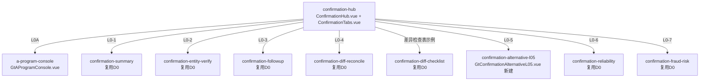

# Design Document: L0 债务循环函证模块

## Overview

L0债务循环（筹资循环）函证模块对齐D0实际架构：**复用D0共享函证组件** + **新建L0-5替代程序组件**。

D0函证模块已验证架构：9个跨循环共享componentType + confirmation-hub统一入口。E0/F0/G0/H0/K0/L0全部通过overrides映射复用，不为每个循环重复开发（🔴铁律：函证模块跨循环共享）。

**L0唯一需要新建的**：
- `confirmation-alternative-l05`：长期应付款/借款替代程序（4区块按债务循环科目）

参照D0-5(GtConfirmationAlternativeD05)模式，L0-5结构完全相同，只是4区块检查内容按债务循环科目不同（L0只有1个替代程序）。L0比H0多一个"函证差异检查表（示例）"→confirmation-diff-checklist（复用D0）。注意源模板L0A的tab名误写为"函证程序表F0A"，overrides以wp_code=L0A为准修正。

## Architecture

### D0共享函证架构（L0直接复用）



### 文件结构（仅新建部分）

```
audit-platform/frontend/src/components/workpaper/confirmation/
├── alternativeL05/
│   └── GtConfirmationAlternativeL05.vue    # 新建 (~400行, 参照alternativeD05)
├── l0-confirmation/composables/
│   ├── useAlternativeL05Data.ts            # 长期应付款/借款4区块数据管理
│   ├── useL0FormulaEngine.ts               # 合计/还款比例/对账差异纯函数
│   └── useL0ImportExport.ts                # 导入导出composable
└── ... (D0已有的shared目录不动)

backend/app/routers/wp_render_strategies/
├── _l0_confirmation.py                     # render策略 + 注册RENDERER_DISPATCH(1个)
├── _l0_confirmation_import_export.py       # 导入导出3端点
└── _l0_confirmation_ai.py                  # AI生成2 section
```

### L0-5 替代程序4区块设计

参照D0-5模式，L0-5的4区块为债务循环科目（每区块左右视觉分组：记账凭证5列 | 检查证据N列）：

| 区块 | 标题 | 记账凭证列 | 检查证据列 |
|------|------|-----------|-----------|
| ① | 期后付款/还款检查 | 日期/凭证编号/业务内容/对方科目/金额 | 还款审批单日期编号/是否恰当审批 \| 银行回单日期/收款方/还款本金/还款利息/索引号/是否异常 |
| ② | 期末余额支持性证据(借款合同/银行对账单) | 日期/凭证编号/业务内容/对方科目/金额 | 借款合同编号/债权人/合同金额/借款期限 \| 银行对账单日期/账面余额/对账差异/索引号/是否异常 |
| ③ | 本期借款检查 | 日期/凭证编号/业务内容/对方科目/金额 | 借款审批单日期编号/是否恰当审批 \| 到账银行回单日期/到账金额/借款利率/索引号/是否异常 |
| ④ | 抵质押/担保证据 | 日期/凭证编号/业务内容/对方科目/金额 | 抵质押合同编号/抵押物/抵押金额 \| 担保合同编号/担保方/担保金额 \| 他项权证编号/索引号/是否异常 |

## Components and Interfaces

### 组件接口（参照D0-5）

```typescript
// GtConfirmationAlternativeL05 props（与D05完全一致）
interface Props {
  htmlData: Record<string, any> | null
  sheetName: string
  wpId: string
  projectId: string
  readonly?: boolean
}

// 4区块配置
const BLOCKS_L05 = [
  { key: 'post_repayment',   title: '期后付款/还款检查',   columns: [...] },
  { key: 'balance_evidence', title: '期末余额支持性证据',   columns: [...] },
  { key: 'new_loan_check',   title: '本期借款检查',        columns: [...] },
  { key: 'mortgage_guarantee', title: '抵质押/担保证据',    columns: [...] },
]

// 余额汇总区
interface AlternativeL05Summary {
  investmentType: string       // 函证项目(长期应付款/借款)
  openingBalance: number       // 年初余额
  debitAmount: number          // 借方发生额
  creditAmount: number         // 贷方发生额
  closingBalance: number       // 期末余额
  currentLoan: number          // 本期借款金额
  repaymentCheckRatio: number  // 期后还款检查比例
  mortgageCheckRatio: number   // 抵质押证据检查比例
}
```

### 公式引擎接口

```typescript
// useL0FormulaEngine.ts（纯函数，可PBT）
function calcBlockTotal(amounts: number[]): number                    // Σ amounts, 空→0
function calcRepaymentRatio(repaid: number, balance: number): number  // balance>0 ? repaid/balance : 0
function calcReconcileDiff(book: number, statement: number): number   // 账面余额 - 银行对账单余额
function isAbnormal(variance: number): boolean                        // |variance| > 0
```

### 后端接口

```python
# _l0_confirmation.py
def render_l0_alternative(wp_id: str, config: dict) -> dict:
    """Render策略: confirmation-alternative-l05（复用confirmation通用renderer）"""

# _l0_confirmation_import_export.py
POST /api/workpapers/{wp_id}/l0/export-template?sheet=L0-5
POST /api/workpapers/{wp_id}/l0/export-data?sheet=L0-5
POST /api/workpapers/{wp_id}/l0/import-data?sheet=L0-5

# _l0_confirmation_ai.py
POST /api/workpapers/{wp_id}/l0/ai/{section}
# section: alternative-audit-note / alternative-audit-conclusion
```

### 数据流

```mermaid
graph LR
    L01[L0-1 函证结果汇总] -->|未回函公司列表| L05[L0-5 替代程序]
    L05 -->|检查结果| CONC[函证结论]
    OCR[/d4/contract-ocr] -->|行级OCR识别| L05
    L05 -->|autoSnapshot on save| VT[useVersionTrail 版本快照]
```

## Data Models

### 持久化（与D0-5模式一致）

item_id前缀：`L0-5-alt-{entity_id}-block{N}-rows`

存储在checklist_responses.remark (JSON数组)。余额汇总/抽样参数/审计说明结论分别用独立item_id存储（结构化数据不塞进textarea content）。

## Error Handling

1. **Master-Detail加载失败**：左侧公司列表加载失败时显示错误提示+重试按钮
2. **合计计算异常**：parseNum兜底（NaN→0），确保合计始终为数值
3. **还款比例除零**：期末余额=0时比例返回0（不显示NaN/Infinity）
4. **对账差异**：账面/对账单余额缺失时按0处理，差异列高亮提示补录
5. **导入格式错误**：后端返回详细错误列表（sheet名/行号/字段/原因），不写入脏数据
6. **OCR识别失败**：返回空结果时toast"未识别到有效借款信息"，保留原行
7. **反向联动失败**：L0-1未回函列表为空时，L0-5显示"暂无待替代程序公司"
8. **L0A tab名误写修正**：源模板tab名为"函证程序表F0A"，render schema/overrides以wp_code=L0A为准，避免误映射到F0

## Testing Strategy

| 类型 | 范围 | 框架 |
|------|------|------|
| Unit | L0-5 4区块列配置+CRUD+合计行 | vitest |
| PBT | useL0FormulaEngine P1~P4（合计/还款比例/对账差异/异常） | vitest + fast-check |
| Contract | VALID_COMPONENT_TYPES + htmlRendererRegistry包含l05 | vitest |
| Integration | confirmation-hub路由到L0-5 + 导入导出round-trip | vitest mock |

## Correctness Properties

### Property 1: 区块合计公式
∀ amounts ∈ ℝ*: calcBlockTotal(amounts) === Σ amounts；calcBlockTotal([]) === 0
**Validates: Requirements 5.1, 2.7**

### Property 2: 还款检查比例公式
∀ repaid ∈ ℝ≥0, balance ∈ ℝ: calcRepaymentRatio(repaid, balance) === balance>0 ? repaid/balance : 0
**Validates: Requirements 5.2, 2.3**

### Property 3: 对账差异公式与零差异恒等
∀ book, statement ∈ ℝ: calcReconcileDiff(book, statement) === book - statement；calcReconcileDiff(v, v) === 0
**Validates: Requirements 5.3**

### Property 4: 异常判定
∀ book, statement ∈ ℝ: isAbnormal(calcReconcileDiff(book, statement)) === (book ≠ statement)
**Validates: Requirements 5.4, 2.7**
