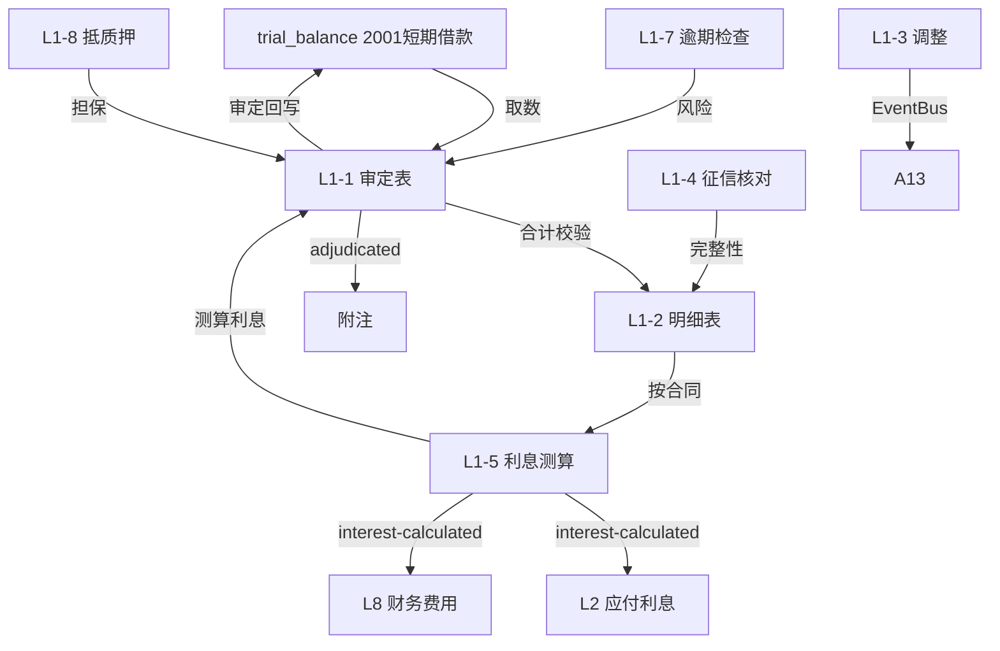

# Design Document: L1 短期借款底稿专属HTML精美组件

## Overview

L1短期借款底稿专属组件`l1-short-term-loans`。L筹资循环首个底稿（1个xlsx源模板/13有效sheet/~180+公式）。科目2001短期借款（**贷方/负债类！**）。

核心架构：
- componentType `l1-short-term-loans`，主入口 GtL1ShortTermLoans.vue
- **无内部el-tabs**：外层GtWpRenderer已有sheet目录行(chips)，专属组件接收`sheetName` prop用`v-if`分发
- 每个sheet独立子组件(200-500行) + 独立composable
- composable分层：useL1FormData + useL1FormulaEngine(纯函数) + useL1InterestEngine(纯函数) + useL1CrossSheet + useL1DualMode + useL1ImportExport
- **负债类贷方科目**：期末=期初+贷方-借方（与资产类相反！与H9同款）
- EventBus联动：TB回写(2001) + **L1利息测算→L2应付利息/L8财务费用** + 附注

## Architecture

### sheetName分发模式（非嵌套Tab）

GtL1ShortTermLoans.vue 接收 `sheetName` prop（完整中文名如"审定表L1-1"），用正则提取末尾编码(L1-1)，`v-if` 分发到对应子组件。未迁移的sheet走 OnlyOffice fallback。

```
sheetName → regex提取编码 → v-if匹配 → 子组件渲染
                                     ↘ 未匹配 → OnlyOffice fallback
```

### 文件结构

```
audit-platform/frontend/src/components/workpaper/
├── GtL1ShortTermLoans.vue                  # 主入口 sheetName v-if分发（defineAsyncComponent lazy）
├── l1/
│   ├── core/
│   │   ├── L1TabIndex.vue                  # 底稿目录（进度条+13行）
│   │   ├── L1TabAdjudication.vue           # L1-1 审定表（负债类贷方+分类小计）
│   │   ├── L1TabDetail.vue                 # L1-2 明细表（30列区段Tab）
│   │   ├── L1TabAdjustment.vue             # L1-3 调整分录（借贷平衡）
│   │   ├── L1TabDisclosureListed.vue       # 附注上市
│   │   └── L1TabDisclosureSoe.vue          # 附注国企
│   ├── interest/
│   │   └── L1TabInterestCalc.vue           # L1-5 利息测算表（核心！联动L2/L8）
│   └── inspection/
│       ├── L1TabCreditCheck.vue            # L1-4 征信报告核对
│       ├── L1TabContractCheck.vue          # L1-6 贷款合同检查（32列区段Tab+OCR）
│       ├── L1TabOverdueCheck.vue           # L1-7 逾期贷款检查
│       ├── L1TabPledgeCheck.vue            # L1-8 抵质押资产检查
│       └── L1TabStLoanCheck.vue            # L1-9 短期借款检查表
├── composables/
│   ├── useL1FormData.ts                    # 数据加载/保存/selfLoad/writebackTB(2001)
│   ├── useL1FormulaEngine.ts               # 纯函数公式引擎（负债类！贷方公式）
│   ├── useL1InterestEngine.ts              # 纯函数利息测算引擎（核心）
│   ├── useL1CrossSheet.ts                  # 跨sheet + L2/L8联动
│   ├── useL1DualMode.ts
│   ├── useL1ImportExport.ts
│   ├── useL1Adjudication.ts
│   ├── useL1Detail.ts
│   ├── useL1InterestCalc.ts
│   ├── useL1CreditCheck.ts
│   ├── useL1OverdueCheck.ts
│   ├── useL1PledgeCheck.ts
│   └── useL1Adjustment.ts
```

### 后端文件结构

```
audit-platform/backend/
├── app/workpaper_engine/renderers/
│   └── l1_short_term_loans_renderer.py     # RENDERER_DISPATCH注册
├── app/routers/
│   └── l1_short_term_loans.py              # 3端点 + 利息测算API
├── app/services/
│   └── l1_short_term_loans_service.py      # 利息测算+征信核对+逾期检查
└── data/wp_render_schema/
    └── l1-short-term-loans.yaml
```

## Composable接口设计

### useL1FormulaEngine.ts（负债类！）

```typescript
// 审定数
export function calcAuditedAmount(unadj: number, aje: number, rje: number): number
// 负债类期末（贷方科目）：期末=期初+贷方-借方
export function calcLiabilityEndBalance(begin: number, credit: number, debit: number): number
// 分类小计
export function calcSubtotal(arr: number[]): number
// 征信差异
export function calcCreditDiff(creditBalance: number, bookBalance: number): number
// 担保比例
export function calcPledgeRatio(guaranteedLoan: number, bookValue: number): number
```

### useL1InterestEngine.ts（核心纯函数）

```typescript
// 利息=本金×年利率×计息天数/365
export function calcInterest(principal: number, annualRate: number, days: number): number
// 逾期天数=报告日-到期日
export function calcOverdueDays(dueDate: string, reportDate: string): number
// 测算利息vs账载利息差异
export function calcInterestDiff(estimated: number, booked: number): number
// 边界：days=0或rate=0时利息=0
```

### useL1CrossSheet.ts

```typescript
export function useL1CrossSheet(allResponses: Ref<Map<string, any>>) {
  const adjudicationVsDetail: ComputedRef<{ diff: number; isMatch: boolean }>
  const creditVsDetail: ComputedRef<{ diff: number; isConsistent: boolean }>
  const interestToL2L8: ComputedRef<{ totalInterest: number; byContract: any[] }>
}
```

## 数据流图



## ADR

### ADR-1: L1是负债类贷方科目
L1短期借款是负债类科目（贷方余额），公式方向与资产类相反：期末=期初+贷方-借方。这是L筹资循环L1~L7所有底稿的共同铁律，需在Formula_Engine中明确区分（与H9租赁负债同款）。

### ADR-2: 利息测算是联动核心
L1-5利息测算不仅服务L1本身，其结果（每笔借款测算利息）通过EventBus联动L2应付利息（计提核对）和L8财务费用（利息支出测算）。采用**365天制**（致同2025修订版模板xlsx实际公式 `=本金×利率/365×天数`），与中国银行借款实务一致。

### ADR-3: 征信报告核对保证完整性
征信报告核对（L1-4）是短期借款完整性认定的关键程序：账面借款应≤征信借款，差异需说明。这是防止表外借款遗漏的核心控制。

### ADR-4: 30/32列宽表区段Tab拆分
明细表(30列)、合同检查(32列)超15列宽表，采用区段Tab切换（行同步）减少横滚，提升可操作性。

## Correctness Properties

| ID | Property | 验证方法 |
|----|----------|---------|
| P1 | ∀ u,a,r: calcAuditedAmount = u+a+r | PBT |
| P2 | ∀ b,cr,dr: calcLiabilityEndBalance = b+cr-dr（负债类！） | PBT |
| P3 | ∀ p,rate,days: calcInterest = p×rate×days/365 | PBT |
| P4 | days=0或rate=0时 calcInterest=0 | PBT |
| P5 | ∀ due,report: calcOverdueDays = report-due（可负） | PBT |
| P6 | ∀ loan,value: calcPledgeRatio = loan/value×100 | PBT |
| P7 | ∀ credit,book: calcCreditDiff = credit-book | PBT |
| P8 | ∀ arr: calcSubtotal = Σarr | PBT |

## 错误处理

| 场景 | 处理方式 |
|------|---------|
| selfLoad失败 | el-empty+重试 |
| TB无科目2001 | 提示导入试算表 |
| 计息天数为0 | 利息=0 + 黄色提示 |
| 征信差异≠0 | 红色高亮+要求填写说明 |
| 逾期天数>0 | 橙/红分级高亮 |
| L2/L8未创建 | 黄色提示"利息测算已就绪，待L2/L8订阅" |
| 明细合计≠审定 | 红色警告+差额 |
