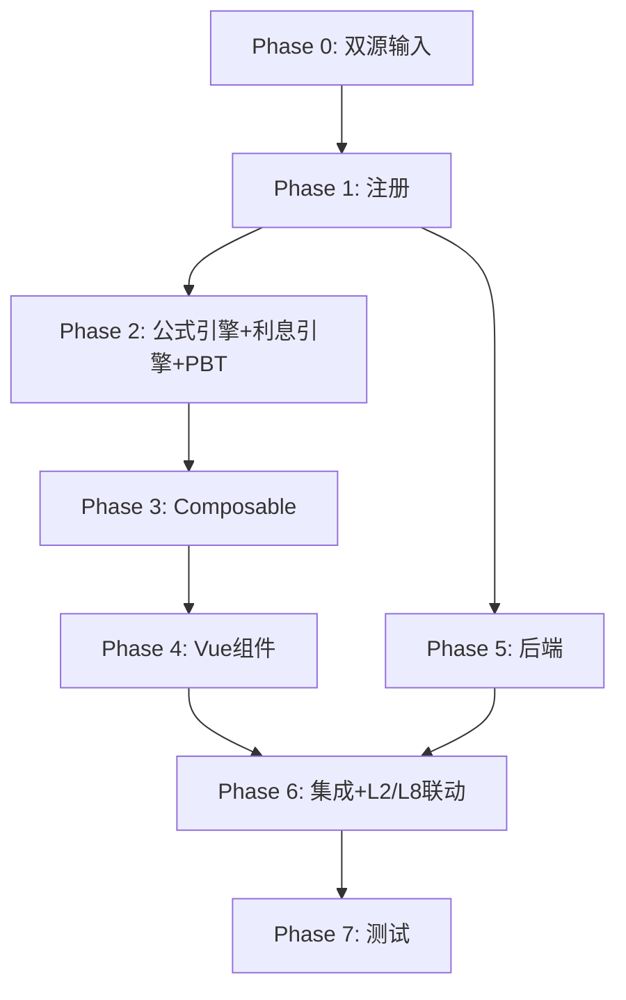

# Implementation Plan: L1 短期借款底稿专属HTML精美组件

## Overview

L1短期借款底稿专属组件`l1-short-term-loans`。L筹资循环首个底稿（13 sheet/1 xlsx/~180+公式）。

主入口 GtL1ShortTermLoans.vue（sheetName v-if，defineAsyncComponent lazy）+ 11个子组件 + 13个composable + 后端3个py文件。

科目：2001短期借款（贷方/负债类）
公式特征：**负债类贷方**期末=期初+贷方-借方；利息=本金×利率×天数/365；L1→L2/L8联动

## Tasks

### Phase 0: 双源输入验证

- [x] 0.1 openpyxl脚本读取L1短期借款.xlsx全部13 sheet
  - 提取结构（sheet名/列头/行数/公式）+ 确认利息测算表L1-5结构
  - 产出：l1_structure_summary.json
  - _Requirements: 双源输入流程_

- [x] 0.2 L筹资循环底稿模板库md交叉验证
  - 核对：负债类方向/利息测算/征信核对/逾期/抵质押/L2-L8联动
  - 产出：l1_conflict_resolution.md
  - _Requirements: 双源输入流程_

### Phase 1: 注册+契约测试

- [x] 1.1 注册componentType和映射
  - wp_code_overrides: L1/L1-1~L1-9/L1A → 'l1-short-term-loans'
  - VALID_COMPONENT_TYPES + htmlRendererRegistry注册
  - 创建 GtL1ShortTermLoans.vue 骨架（sheetName v-if + selfLoad）
  - _Requirements: 1.1-1.11_

- [x] 1.2 编写注册契约测试
  - htmlRendererRegistry / VALID_COMPONENT_TYPES / wp_code_overrides / RENDERER_DISPATCH
  - _Requirements: 1.6, 1.7, 1.8_

### Phase 2: 公式引擎+利息引擎+PBT

- [x] 2.1 创建 `useL1FormulaEngine.ts`（负债类！）
  - calcAuditedAmount / calcLiabilityEndBalance(b,cr,dr)=b+cr-dr
  - calcSubtotal / calcCreditDiff / calcPledgeRatio
  - _Requirements: 2.3-2.4, 5.2, 6.5_

- [x] 2.2 创建 `useL1InterestEngine.ts`（核心）
  - calcInterest / calcOverdueDays / calcInterestDiff
  - _Requirements: 4.2-4.3, 6.2, 9.1-9.4_

  - [x]* 2.3 编写 Property P1 PBT：审定数公式链
    - 断言：calcAuditedAmount(u, a, r) === u + a + r
    - **Feature: l1-short-term-loans, Property P1: 审定数公式链**

  - [x]* 2.4 编写 Property P2 PBT：负债类期末（贷方！）
    - 生成器：fc.float({min:0, max:1e9}) × 3
    - 断言：calcLiabilityEndBalance(b, cr, dr) === b + cr - dr
    - **Feature: l1-short-term-loans, Property P2: 负债类贷方期末余额**

  - [x]* 2.5 编写 Property P3 PBT：利息测算公式
    - 生成器：principal>0, rate∈(0,0.2), days∈[0,365]
    - 断言：calcInterest(p, rate, days) === p×rate×days/365
    - **Feature: l1-short-term-loans, Property P3: 利息测算公式**

  - [x]* 2.6 编写 Property P4 PBT：零天数/零利率利息为0
    - 断言：calcInterest(p, rate, 0)===0 && calcInterest(p, 0, days)===0
    - **Feature: l1-short-term-loans, Property P4: 利息边界恒等**

  - [x]* 2.7 编写 Property P5 PBT：逾期天数
    - 断言：calcOverdueDays(due, report) === 日期差（可负）
    - **Feature: l1-short-term-loans, Property P5: 逾期天数计算**

  - [x]* 2.8 编写 Property P6 PBT：担保比例
    - 生成器：loan≥0, value>0
    - 断言：calcPledgeRatio(loan, value) === loan/value×100
    - **Feature: l1-short-term-loans, Property P6: 担保比例**

  - [x]* 2.9 编写 Property P7 PBT：征信差异
    - 断言：calcCreditDiff(credit, book) === credit - book
    - **Feature: l1-short-term-loans, Property P7: 征信差异**

  - [x]* 2.10 编写 Property P8 PBT：小计求和
    - 断言：calcSubtotal(arr) === Σarr
    - **Feature: l1-short-term-loans, Property P8: 分类小计**

### Phase 3: Composable层

- [x] 3.1 创建 useL1FormData.ts
  - selfLoad + checklist_responses + writebackTB(2001)
  - _Requirements: 1.9, 1.10, 2.6_

- [x] 3.2 创建 useL1CrossSheet.ts
  - adjudicationVsDetail / creditVsDetail / interestToL2L8
  - _Requirements: 2.5, 3.6, 5.4, 10.1-10.4_

- [x] 3.3 创建 useL1DualMode.ts + useL1ImportExport.ts
  - 双模式切换 + 导入导出三级
  - _Requirements: 11.1, 11.2_

- [x] 3.4 创建 sheet-specific composables
  - useL1Adjudication / useL1Detail / useL1InterestCalc
  - useL1CreditCheck / useL1OverdueCheck / useL1PledgeCheck / useL1Adjustment
  - _Requirements: 2~8 全部_

### Phase 4: Vue子组件

- [x] 4.1 创建 L1TabIndex.vue 底稿目录
  - 13行+进度条
  - _Requirements: 1.2_

- [x] 4.2 创建 L1TabAdjudication.vue 审定表L1-1
  - 负债类单区块+分类小计+TB回写
  - _Requirements: 2.1-2.7_

- [x] 4.3 创建 L1TabDetail.vue 明细表L1-2
  - 30列区段Tab切换+动态行+导入导出
  - _Requirements: 3.1-3.6_

- [x] 4.4 创建 L1TabInterestCalc.vue 利息测算表（核心！）
  - 利息测算+差异高亮+按合同筛选+L2/L8联动publish
  - _Requirements: 4.1-4.7_

- [x] 4.5 创建 L1TabCreditCheck.vue + L1TabOverdueCheck.vue + L1TabPledgeCheck.vue
  - 征信核对+逾期检查(天数高亮)+抵质押(担保比例)
  - _Requirements: 5.1-5.5, 6.1-6.5_

- [x] 4.6 创建 L1TabContractCheck.vue + L1TabStLoanCheck.vue
  - 合同检查32列区段Tab+OCR + 检查表结论区
  - _Requirements: 7.1-7.4_

- [x] 4.7 创建 L1TabAdjustment.vue + L1TabDisclosureListed/Soe.vue
  - 调整借贷平衡 + 附注上市/国企切换
  - _Requirements: 8.1-8.3_

### Phase 5: 后端

- [x] 5.1 创建 l1_short_term_loans_renderer.py
  - RENDERER_DISPATCH注册 + 负债类公式验证
  - _Requirements: 1.6_

- [x] 5.2 创建 l1_short_term_loans.py 路由
  - 导出模板/导出数据/导入数据 + 利息测算API
  - _Requirements: 4.1, 11.2_

- [x] 5.3 创建 l1_short_term_loans_service.py
  - 利息测算+征信核对+逾期检查+担保比例
  - _Requirements: 4.2, 5.2, 6.2, 9.1-9.4_

### Phase 6: 集成

- [x] 6.1 EventBus集成
  - publish 'substantive:adjudicated' / 'l1:interest-calculated' / 'adjustment:created'
  - subscribe 附注刷新
  - _Requirements: 2.6, 2.7, 4.5, 10.1_

- [x] 6.2 跨底稿联动
  - L1-5利息测算 → L2应付利息/L8财务费用（cross_wp_ref + GtIndexChip）
  - L1审定 → TB回写(2001)
  - _Requirements: 4.5, 4.6, 10.1-10.4_

- [x] 6.3 版本链+复核对话集成
  - useVersionTrail(autoSnapshot) + provide openReviewDialog
  - _Requirements: 11.3, 11.4_

### Phase 7: 测试

- [x] 7.1 单元测试：useL1FormulaEngine + useL1InterestEngine
  - 负债类方向 + 利息测算 + 边界(days=0/rate=0)
  - _Requirements: P1-P8_

- [x] 7.2 集成测试：L1→L2/L8联动 + 征信核对 + 逾期检查
  - _Requirements: 4.5-4.6, 5.4, 10.1-10.4_

- [x] 7.3 Playwright E2E
  - 完整流程：打开L1→审定→明细→利息测算→征信核对→逾期→抵质押→保存
  - _Requirements: 全部_

## Task Dependency Graph

