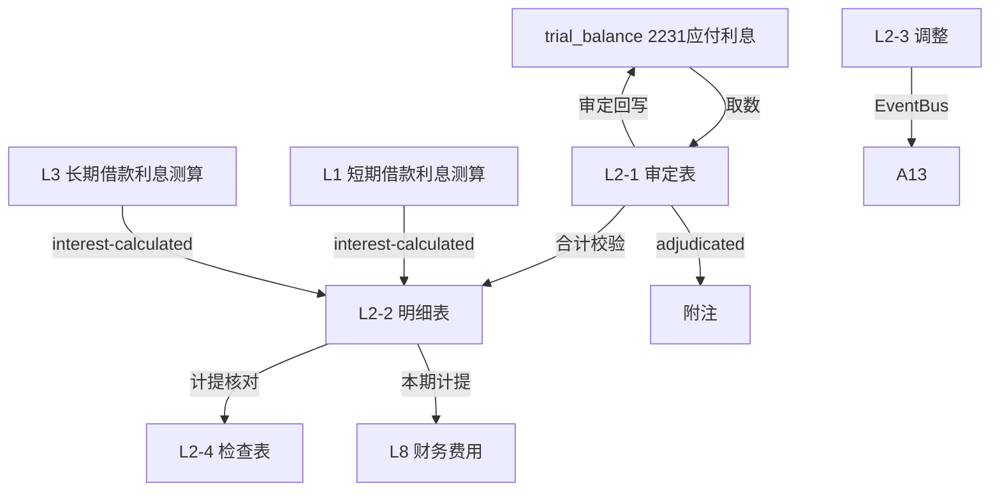

# Design Document: L2 应付利息底稿专属HTML精美组件

## Overview

L2应付利息底稿专属组件`l2-interest-payable`。L筹资循环底稿（1个xlsx源模板/8有效sheet/~100+公式）。科目2231应付利息（**贷方/负债类！**）。

核心架构：
- componentType `l2-interest-payable`，主入口 GtL2InterestPayable.vue
- **无内部el-tabs**：接收`sheetName` prop用`v-if`分发
- composable分层：useL2FormData + useL2FormulaEngine(纯函数) + useL2AccrualEngine(纯函数) + useL2CrossSheet + useL2DualMode + useL2ImportExport
- **负债类贷方科目**：期末=期初+贷方-借方
- EventBus联动：TB回写(2231) + **接收L1/L3利息测算** + 联动L8财务费用 + 附注

## Architecture

### sheetName分发模式

```
sheetName → regex提取编码 → v-if匹配 → 子组件渲染
                                     ↘ 未匹配 → OnlyOffice fallback
```

### 文件结构

```
audit-platform/frontend/src/components/workpaper/
├── GtL2InterestPayable.vue                 # 主入口 sheetName v-if分发（lazy）
├── l2/
│   ├── core/
│   │   ├── L2TabIndex.vue                  # 底稿目录
│   │   ├── L2TabAdjudication.vue           # L2-1 审定表（负债类贷方+按来源分类）
│   │   ├── L2TabDetail.vue                 # L2-2 明细表（27列区段Tab+计提核对）
│   │   ├── L2TabAdjustment.vue             # L2-3 调整分录（借贷平衡）
│   │   ├── L2TabDisclosureListed.vue       # 附注上市
│   │   └── L2TabDisclosureSoe.vue          # 附注国企
│   └── inspection/
│       └── L2TabInterestCheck.vue          # L2-4 应付利息检查表（计提核对结论）
├── composables/
│   ├── useL2FormData.ts                    # selfLoad/writebackTB(2231)
│   ├── useL2FormulaEngine.ts               # 纯函数公式引擎（负债类！贷方公式）
│   ├── useL2AccrualEngine.ts               # 纯函数计提核对引擎（接收L1/L3）
│   ├── useL2CrossSheet.ts                  # 跨sheet + L1/L3/L8联动
│   ├── useL2DualMode.ts
│   ├── useL2ImportExport.ts
│   ├── useL2Adjudication.ts
│   ├── useL2Detail.ts
│   ├── useL2InterestCheck.ts
│   └── useL2Adjustment.ts
```

### 后端文件结构

```
audit-platform/backend/
├── app/workpaper_engine/renderers/
│   └── l2_interest_payable_renderer.py
├── app/routers/
│   └── l2_interest_payable.py              # 3端点 + 计提核对API
├── app/services/
│   └── l2_interest_payable_service.py      # 计提核对+按来源汇总
└── data/wp_render_schema/
    └── l2-interest-payable.yaml
```

## Composable接口设计

### useL2FormulaEngine.ts（负债类！）

```typescript
export function calcAuditedAmount(unadj: number, aje: number, rje: number): number
// 负债类期末：期末=期初+贷方-借方
export function calcLiabilityEndBalance(begin: number, credit: number, debit: number): number
export function calcSubtotal(arr: number[]): number
```

### useL2AccrualEngine.ts（纯函数）

```typescript
// 计提差异=测算利息-账面计提
export function calcAccrualDiff(estimated: number, booked: number): number
// 按来源汇总应付利息
export function aggregateBySource(details: InterestDetail[]): Record<string, number>
```

### useL2CrossSheet.ts

```typescript
export function useL2CrossSheet(allResponses: Ref<Map<string, any>>) {
  const adjudicationVsDetail: ComputedRef<{ diff: number; isMatch: boolean }>
  const accrualVsL1L3: ComputedRef<{ diff: number; isConsistent: boolean }>
}
```

## 数据流图



## ADR

### ADR-1: L2是负债类贷方科目
L2应付利息是负债类科目（贷方余额），期末=期初+贷方-借方。L筹资循环L1~L7铁律。

### ADR-2: 应付利息是筹资循环利息计提的汇聚点
L2应付利息汇聚L1短期借款、L3长期借款、L4应付债券的利息计提。核对时接收L1/L3的利息测算（EventBus订阅），验证账面计提的准确性和完整性。本期计提额联动L8财务费用。

### ADR-3: 计提核对是核心程序
应付利息的准确性认定依赖计提核对：将L1/L3测算利息与账面计提对比，差异需说明。这防止利息计提遗漏或错误。

## Correctness Properties

| ID | Property | 验证方法 |
|----|----------|---------|
| P1 | ∀ u,a,r: calcAuditedAmount = u+a+r | PBT |
| P2 | ∀ b,cr,dr: calcLiabilityEndBalance = b+cr-dr（负债类！） | PBT |
| P3 | ∀ est,booked: calcAccrualDiff = est-booked | PBT |
| P4 | ∀ arr: calcSubtotal = Σarr | PBT |
| P5 | ∀ details: aggregateBySource 各来源之和 = 总额 | PBT |

## 错误处理

| 场景 | 处理方式 |
|------|---------|
| selfLoad失败 | el-empty+重试 |
| TB无科目2231 | 提示导入试算表 |
| L1/L3利息测算未就绪 | 黄色提示"待L1/L3利息测算完成" |
| 计提差异>阈值 | 红色高亮+要求填写说明 |
| 明细合计≠审定 | 红色警告+差额 |
