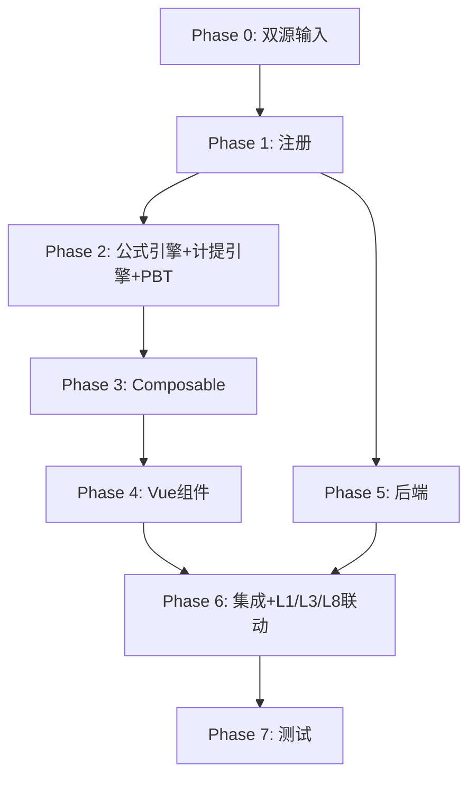

# Implementation Plan: L2 应付利息底稿专属HTML精美组件

## Overview

L2应付利息底稿专属组件`l2-interest-payable`（8 sheet/1 xlsx/~100+公式）。

主入口 GtL2InterestPayable.vue（sheetName v-if，lazy）+ 7个子组件 + 10个composable + 后端3个py文件。

科目：2231应付利息（贷方/负债类）
公式特征：**负债类贷方**期末=期初+贷方-借方；接收L1/L3利息测算计提核对

## Tasks

### Phase 0: 双源输入验证

- [x] 0.1 openpyxl脚本读取L2应付利息.xlsx全部8 sheet
  - 提取结构 + 确认审定表L2-1（79公式）+明细表L2-2结构
  - 产出：l2_structure_summary.json
  - _Requirements: 双源输入流程_

- [x] 0.2 L筹资循环底稿模板库md交叉验证
  - 核对：负债类方向/计提核对/L1-L3-L8联动
  - 产出：l2_conflict_resolution.md
  - _Requirements: 双源输入流程_

### Phase 1: 注册+契约测试

- [x] 1.1 注册componentType和映射
  - wp_code_overrides: L2/L2-1~L2-4/L2A → 'l2-interest-payable'
  - VALID_COMPONENT_TYPES + htmlRendererRegistry注册
  - 创建 GtL2InterestPayable.vue 骨架（sheetName v-if + selfLoad）
  - _Requirements: 1.1-1.11_

- [x] 1.2 编写注册契约测试
  - htmlRendererRegistry / VALID_COMPONENT_TYPES / wp_code_overrides / RENDERER_DISPATCH
  - _Requirements: 1.6, 1.7, 1.8_

### Phase 2: 公式引擎+计提引擎+PBT

- [x] 2.1 创建 `useL2FormulaEngine.ts`（负债类！）
  - calcAuditedAmount / calcLiabilityEndBalance(b,cr,dr)=b+cr-dr / calcSubtotal
  - _Requirements: 2.3-2.4_

- [x] 2.2 创建 `useL2AccrualEngine.ts`
  - calcAccrualDiff / aggregateBySource
  - _Requirements: 4.4, 6.1-6.2_

- [x]* 2.3 编写 Property P1 PBT：审定数公式链
  - 断言：calcAuditedAmount(u, a, r) === u + a + r
  - **Feature: l2-interest-payable, Property P1: 审定数公式链**
  - **Validates: Requirements 2.3**

- [x]* 2.4 编写 Property P2 PBT：负债类期末（贷方！）
  - 生成器：fc.float({min:0, max:1e9}) × 3
  - 断言：calcLiabilityEndBalance(b, cr, dr) === b + cr - dr
  - **Feature: l2-interest-payable, Property P2: 负债类贷方期末余额**
  - **Validates: Requirements 2.4**

- [x]* 2.5 编写 Property P3 PBT：计提差异
  - 断言：calcAccrualDiff(est, booked) === est - booked
  - **Feature: l2-interest-payable, Property P3: 计提差异**
  - **Validates: Requirements 4.4**

- [x]* 2.6 编写 Property P4 PBT：小计求和
  - 断言：calcSubtotal(arr) === Σarr
  - **Feature: l2-interest-payable, Property P4: 分类小计**
  - **Validates: Requirements 2.3**

- [x]* 2.7 编写 Property P5 PBT：按来源汇总守恒
  - 断言：Σ aggregateBySource(details).values === Σ details.amount
  - **Feature: l2-interest-payable, Property P5: 按来源汇总守恒**
  - **Validates: Requirements 6.2**

### Phase 3: Composable层

- [x] 3.1 创建 useL2FormData.ts
  - selfLoad + checklist_responses + writebackTB(2231)
  - _Requirements: 1.9, 1.10, 2.6_

- [x] 3.2 创建 useL2CrossSheet.ts
  - adjudicationVsDetail / accrualVsL1L3
  - _Requirements: 2.5, 4.1-4.6_

- [x] 3.3 创建 useL2DualMode.ts + useL2ImportExport.ts
  - _Requirements: 6.4, 6.5_

- [x] 3.4 创建 sheet-specific composables
  - useL2Adjudication / useL2Detail / useL2InterestCheck / useL2Adjustment
  - _Requirements: 2~5 全部_

### Phase 4: Vue子组件

- [x] 4.1 创建 L2TabIndex.vue 底稿目录
  - _Requirements: 1.2_

- [x] 4.2 创建 L2TabAdjudication.vue 审定表L2-1
  - 负债类单区块+按来源分类小计+TB回写
  - _Requirements: 2.1-2.7_

- [x] 4.3 创建 L2TabDetail.vue 明细表L2-2
  - 27列区段Tab+计提核对(接收L1/L3)+动态行+导入导出
  - _Requirements: 3.1-3.5, 4.1-4.5_

- [x] 4.4 创建 L2TabInterestCheck.vue 检查表L2-4
  - 计提核对清单+结论区+AI辅助
  - _Requirements: 5.1-5.2_

- [x] 4.5 创建 L2TabAdjustment.vue + L2TabDisclosureListed/Soe.vue
  - 调整借贷平衡 + 附注上市/国企切换
  - _Requirements: 5.3-5.5_

### Phase 5: 后端

- [x] 5.1 创建 l2_interest_payable_renderer.py
  - RENDERER_DISPATCH注册 + 负债类公式验证
  - _Requirements: 1.6_

- [x] 5.2 创建 l2_interest_payable.py 路由
  - 导出模板/导出数据/导入数据 + 计提核对API
  - _Requirements: 6.5_

- [x] 5.3 创建 l2_interest_payable_service.py
  - 计提核对+按来源汇总
  - _Requirements: 4.4, 6.1-6.2_

### Phase 6: 集成

- [x] 6.1 EventBus集成
  - publish 'substantive:adjudicated' / 'adjustment:created'
  - subscribe 'l1:interest-calculated' / 'l3:interest-calculated' + 附注刷新
  - _Requirements: 2.6, 4.1-4.2_

- [x] 6.2 跨底稿联动
  - L1/L3利息测算 → L2计提核对（cross_wp_ref + GtIndexChip）
  - L2本期计提 → L8财务费用
  - L2审定 → TB回写(2231)
  - _Requirements: 4.1-4.6_

- [x] 6.3 版本链+复核对话集成
  - useVersionTrail(autoSnapshot) + provide openReviewDialog
  - _Requirements: 6.6_

### Phase 7: 测试

- [x] 7.1 单元测试：useL2FormulaEngine + useL2AccrualEngine
  - 负债类方向 + 计提差异 + 按来源汇总
  - _Requirements: P1-P5_

- [x] 7.2 集成测试：L1/L3→L2计提核对 + L2→L8联动
  - _Requirements: 4.1-4.6_

- [x] 7.3 Playwright E2E
  - 完整流程：打开L2→审定→明细→计提核对→检查表→保存
  - _Requirements: 全部_

## Task Dependency Graph

