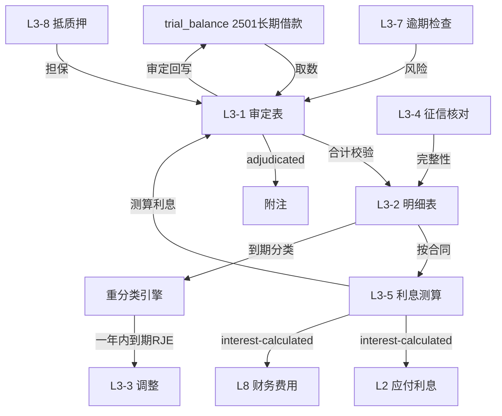

# Design Document: L3 长期借款底稿专属HTML精美组件

## Overview

L3长期借款底稿专属组件`l3-long-term-loans`。L筹资循环底稿（1个xlsx源模板/14有效sheet/~200+公式）。科目2501长期借款（**贷方/负债类！**）。

核心架构：
- componentType `l3-long-term-loans`，主入口 GtL3LongTermLoans.vue
- **无内部el-tabs**：接收`sheetName` prop用`v-if`分发
- composable分层：useL3FormData + useL3FormulaEngine(纯函数) + useL3InterestEngine(纯函数) + useL3ReclassEngine(纯函数) + useL3CrossSheet + useL3DualMode + useL3ImportExport
- **负债类贷方科目**：期末=期初+贷方-借方
- **一年内到期重分类**：识别一年内到期长期借款生成RJE
- EventBus联动：TB回写(2501) + **L3利息测算→L2/L8** + 附注

## Architecture

### sheetName分发模式

```
sheetName → regex提取编码 → v-if匹配 → 子组件渲染
                                     ↘ 未匹配 → OnlyOffice fallback
```

### 文件结构

```
audit-platform/frontend/src/components/workpaper/
├── GtL3LongTermLoans.vue                   # 主入口 sheetName v-if分发（lazy）
├── l3/
│   ├── core/
│   │   ├── L3TabIndex.vue                  # 底稿目录
│   │   ├── L3TabAdjudication.vue           # L3-1 审定表（负债类贷方+一年内到期列）
│   │   ├── L3TabDetail.vue                 # L3-2 明细表（32列区段Tab+到期分类）
│   │   ├── L3TabAdjustment.vue             # L3-3 调整分录（含重分类RJE）
│   │   ├── L3TabDisclosureListed.vue       # 附注上市
│   │   └── L3TabDisclosureSoe.vue          # 附注国企
│   ├── interest/
│   │   └── L3TabInterestCalc.vue           # L3-5 利息测算表（核心！联动L2/L8）
│   └── inspection/
│       ├── L3TabCreditCheck.vue            # L3-4 征信报告核对
│       ├── L3TabContractCheck.vue          # L3-6 贷款合同检查（区段Tab+OCR）
│       ├── L3TabOverdueCheck.vue           # L3-7 逾期贷款检查
│       ├── L3TabPledgeCheck.vue            # L3-8 抵质押资产检查
│       └── L3TabLtLoanCheck.vue            # L3-9 长期借款检查表
├── composables/
│   ├── useL3FormData.ts                    # selfLoad/writebackTB(2501)
│   ├── useL3FormulaEngine.ts               # 纯函数公式引擎（负债类！贷方公式）
│   ├── useL3InterestEngine.ts              # 纯函数利息测算引擎（核心）
│   ├── useL3ReclassEngine.ts               # 纯函数重分类引擎（一年内到期）
│   ├── useL3CrossSheet.ts                  # 跨sheet + L2/L8联动
│   ├── useL3DualMode.ts
│   ├── useL3ImportExport.ts
│   ├── useL3Adjudication.ts
│   ├── useL3Detail.ts
│   ├── useL3InterestCalc.ts
│   ├── useL3CreditCheck.ts
│   ├── useL3OverdueCheck.ts
│   ├── useL3PledgeCheck.ts
│   └── useL3Adjustment.ts
```

### 后端文件结构

```
audit-platform/backend/
├── app/workpaper_engine/renderers/
│   └── l3_long_term_loans_renderer.py
├── app/routers/
│   └── l3_long_term_loans.py               # 3端点 + 利息测算+重分类API
├── app/services/
│   └── l3_long_term_loans_service.py       # 利息测算+征信+逾期+重分类
└── data/wp_render_schema/
    └── l3-long-term-loans.yaml
```

## Composable接口设计

### useL3FormulaEngine.ts（负债类！）

```typescript
export function calcAuditedAmount(unadj: number, aje: number, rje: number): number
// 负债类期末：期末=期初+贷方-借方
export function calcLiabilityEndBalance(begin: number, credit: number, debit: number): number
export function calcSubtotal(arr: number[]): number
export function calcCreditDiff(creditBalance: number, bookBalance: number): number
export function calcPledgeRatio(guaranteedLoan: number, bookValue: number): number
```

### useL3InterestEngine.ts（核心纯函数）

```typescript
// 利息=本金×年利率×计息天数/360
export function calcInterest(principal: number, annualRate: number, days: number): number
export function calcOverdueDays(dueDate: string, reportDate: string): number
export function calcInterestDiff(estimated: number, booked: number): number
```

### useL3ReclassEngine.ts（重分类纯函数）

```typescript
// 一年内到期金额：报告日起一年内到期的长期借款
export function calcCurrentPortion(dueDate: string, reportDate: string, amount: number): number
// 生成重分类分录
export function buildReclassEntry(currentPortion: number): AdjustmentEntry
```

### useL3CrossSheet.ts

```typescript
export function useL3CrossSheet(allResponses: Ref<Map<string, any>>) {
  const adjudicationVsDetail: ComputedRef<{ diff: number; isMatch: boolean }>
  const creditVsDetail: ComputedRef<{ diff: number; isConsistent: boolean }>
  const interestToL2L8: ComputedRef<{ totalInterest: number; byContract: any[] }>
  const currentPortionTotal: ComputedRef<number>
}
```

## 数据流图



## ADR

### ADR-1: L3是负债类贷方科目
L3长期借款是负债类科目，期末=期初+贷方-借方。L筹资循环L1~L7铁律。

### ADR-2: 利息测算联动L2/L8
L3-5利息测算结果通过EventBus联动L2应付利息、L8财务费用，采用360天计息惯例。与L1一致。

### ADR-3: 一年内到期重分类是L3特有
L3相较L1增加"一年内到期的长期借款"重分类逻辑：报告日起一年内到期的部分重分类至流动负债（一年内到期的非流动负债），生成RJE。审定表单列显示。

### ADR-4: 32列宽表区段Tab拆分
明细表(32列)超15列，采用区段Tab切换（基础/金额/到期分类/担保，行同步）减少横滚。

## Correctness Properties

| ID | Property | 验证方法 |
|----|----------|---------|
| P1 | ∀ u,a,r: calcAuditedAmount = u+a+r | PBT |
| P2 | ∀ b,cr,dr: calcLiabilityEndBalance = b+cr-dr（负债类！） | PBT |
| P3 | ∀ p,rate,days: calcInterest = p×rate×days/360 | PBT |
| P4 | days=0或rate=0时 calcInterest=0 | PBT |
| P5 | ∀ due,report: calcOverdueDays = report-due | PBT |
| P6 | ∀ loan,value: calcPledgeRatio = loan/value×100 | PBT |
| P7 | 到期日>报告日+1年时 calcCurrentPortion=0 | PBT |
| P8 | ∀ arr: calcSubtotal = Σarr | PBT |

## 错误处理

| 场景 | 处理方式 |
|------|---------|
| selfLoad失败 | el-empty+重试 |
| TB无科目2501 | 提示导入试算表 |
| 计息天数为0 | 利息=0 + 黄色提示 |
| 征信差异≠0 | 红色高亮+要求填写说明 |
| 逾期天数>0 | 橙/红分级高亮 |
| 存在一年内到期 | 提示生成重分类RJE |
| 明细合计≠审定 | 红色警告+差额 |
