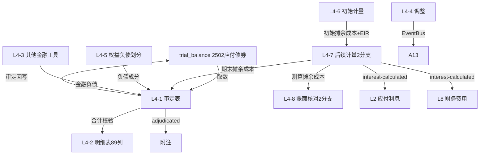

# Design Document: L4 应付债券底稿专属HTML精美组件

## Overview

L4应付债券底稿专属组件`l4-bonds-payable`。L筹资循环最复杂底稿（1个xlsx源模板/15有效sheet/~250+公式）。科目2502应付债券（**贷方/负债类！**）。

核心架构：
- componentType `l4-bonds-payable`，主入口 GtL4BondsPayable.vue
- **无内部el-tabs**：接收`sheetName` prop用`v-if`分发
- composable分层：useL4FormData + useL4FormulaEngine(纯函数) + useL4EIREngine(纯函数,核心) + useL4EquityLiabEngine(纯函数) + useL4CrossSheet + useL4DualMode + useL4ImportExport
- **负债类贷方科目**：期末=期初+贷方-借方
- **实际利率法EIR引擎是核心**：每期利息=期初摊余成本×实际利率；摊余成本滚动（2分支）
- **2分支选择器**：L4-7后续计量/L4-8账面核对各2版本（到期一次还本付息 / 分期付息到期一次还本）
- **89列极宽表**：L4-2区段Tab拆分
- EventBus联动：TB回写(2502) + **L4利息费用→L2/L8** + 附注

## Architecture

### sheetName分发模式

```
sheetName → regex提取编码 → v-if匹配 → 子组件渲染
                                     ↘ 未匹配 → OnlyOffice fallback
```

### L4-7/L4-8 分支选择器

```
el-segmented v-model="bondBranch"
  ├── "到期一次还本付息" → L4TabSubsequentBullet.vue / L4TabBookReconBullet.vue
  └── "分期付息到期一次还本" → L4TabSubsequentInstallment.vue / L4TabBookReconInstallment.vue
```

L4-7与L4-8分支状态共享（主入口provide bondBranch，二者inject同步）。

### 文件结构

```
audit-platform/frontend/src/components/workpaper/
├── GtL4BondsPayable.vue                    # 主入口 sheetName v-if分发 + bondBranch provide（lazy）
├── l4/
│   ├── core/
│   │   ├── L4TabIndex.vue                  # 底稿目录
│   │   ├── L4TabAdjudication.vue           # L4-1 审定表（负债类贷方+摊余成本）
│   │   ├── L4TabDetail.vue                 # L4-2 明细表（89列极宽表区段Tab！）
│   │   ├── L4TabAdjustment.vue             # L4-4 调整分录
│   │   ├── L4TabDisclosureListed.vue       # 附注上市
│   │   └── L4TabDisclosureSoe.vue          # 附注国企
│   ├── measurement/
│   │   ├── L4TabInitialMeasure.vue         # L4-6 初始计量（发行价-交易费用+IRR）
│   │   ├── L4TabSubsequentBullet.vue       # L4-7A 后续计量(到期一次还本付息)
│   │   ├── L4TabSubsequentInstallment.vue  # L4-7B 后续计量(分期付息到期一次还本)
│   │   ├── L4TabBookReconBullet.vue        # L4-8A 账面核对(到期一次还本付息)
│   │   └── L4TabBookReconInstallment.vue   # L4-8B 账面核对(分期付息到期一次还本)
│   ├── classification/
│   │   ├── L4TabEquityLiabCheck.vue        # L4-5 权益与负债划分检查
│   │   └── L4TabFinLiabOther.vue           # L4-3 划分为金融负债的其他金融工具
│   └── inspection/
│       └── L4TabBondCheck.vue              # L4-9 应付债券检查表
├── composables/
│   ├── useL4FormData.ts                    # selfLoad/writebackTB(2502)
│   ├── useL4FormulaEngine.ts               # 纯函数公式引擎（负债类！+初始计量）
│   ├── useL4EIREngine.ts                   # 纯函数实际利率法引擎（核心！2分支）
│   ├── useL4EquityLiabEngine.ts            # 纯函数权益负债划分引擎
│   ├── useL4CrossSheet.ts                  # 跨sheet + L2/L8联动
│   ├── useL4DualMode.ts
│   ├── useL4ImportExport.ts
│   ├── useL4Adjudication.ts
│   ├── useL4Detail.ts
│   ├── useL4InitialMeasure.ts
│   ├── useL4Subsequent.ts                  # 后续计量composable（2分支+摊销表生成）
│   ├── useL4BookRecon.ts
│   ├── useL4EquityLiabCheck.ts
│   └── useL4Adjustment.ts
```

### 后端文件结构

```
audit-platform/backend/
├── app/workpaper_engine/renderers/
│   └── l4_bonds_payable_renderer.py
├── app/routers/
│   └── l4_bonds_payable.py                 # 3端点 + 后续计量生成+IRR求解API
├── app/services/
│   └── l4_bonds_payable_service.py         # 实际利率法+权益负债划分+初始计量
└── data/wp_render_schema/
    └── l4-bonds-payable.yaml
```

## Composable接口设计

### useL4FormulaEngine.ts（负债类！+初始计量）

```typescript
export function calcAuditedAmount(unadj: number, aje: number, rje: number): number
// 负债类期末：期末=期初+贷方-借方
export function calcLiabilityEndBalance(begin: number, credit: number, debit: number): number
// 初始入账金额=发行价格-交易费用
export function calcInitialAmount(issuePrice: number, transactionCost: number): number
// 溢折价=初始入账金额-面值
export function calcPremiumDiscount(initialAmount: number, faceValue: number): number
export function calcSubtotal(arr: number[]): number
```

### useL4EIREngine.ts（核心纯函数！实际利率法）

```typescript
// 利息费用=期初摊余成本×实际利率
export function calcInterestExpense(amortizedCost: number, eir: number): number
// 到期一次还本付息：期末=期初+利息费用
export function calcEndAmortizedCost_Bullet(begin: number, interestExpense: number): number
// 分期付息到期一次还本：期末=期初+利息费用-实付利息
export function calcEndAmortizedCost_Installment(begin: number, interestExpense: number, couponPaid: number): number
// 生成完整后续计量表（按分支）
export function generateSchedule(
  initialCost: number, faceValue: number, couponRate: number,
  eir: number, periods: number, branch: 'bullet' | 'installment'
): EIRRow[]
// 验证：最后一期期末摊余成本≈面值
export function validateSchedule(schedule: EIRRow[], faceValue: number): { isValid: boolean; tailDiff: number }
// IRR求解（使未来现金流现值=初始入账金额）
export function solveEIR(cashFlows: number[], initialAmount: number): number

interface EIRRow {
  period: number
  beginCost: number
  couponInterest: number
  interestExpense: number   // 期初×EIR
  amortization: number      // 利息调整摊销
  endCost: number
}
```

### useL4EquityLiabEngine.ts（权益负债划分纯函数）

```typescript
// 负债成分=未来现金流现值（按市场利率折现）
export function calcLiabilityComponent(cashFlows: number[], marketRate: number): number
// 权益成分=发行总额-负债成分
export function calcEquityComponent(totalProceeds: number, liabilityComponent: number): number
```

### useL4CrossSheet.ts

```typescript
export function useL4CrossSheet(allResponses: Ref<Map<string, any>>) {
  const adjudicationVsDetail: ComputedRef<{ diff: number; isMatch: boolean }>
  const bookReconVsSubsequent: ComputedRef<{ diff: number; isMatch: boolean }>
  const interestToL2L8: ComputedRef<{ totalInterest: number }>
}
```

## 数据流图



## ADR

### ADR-1: L4是负债类贷方科目
L4应付债券是负债类科目，期末=期初+贷方-借方。L筹资循环L1~L7铁律。

### ADR-2: 实际利率法EIR引擎是核心
L4-7后续计量的实际利率法是整个L4的核心计算。每期利息费用=期初摊余成本×实际利率，利息调整（溢折价）在债券存续期内摊销，使期末摊余成本逐渐趋向面值。EIR引擎为纯函数，可PBT验证。

### ADR-3: 2分支付息方式用分支选择器
应付债券后续计量因付息方式不同分2分支：
- **到期一次还本付息**：期间不付息，利息资本化滚入摊余成本（期末=期初+利息费用）
- **分期付息到期一次还本**：期间付票面利息，期末=期初+利息费用-实付利息
L4-7/L4-8各2版本，用el-segmented分支选择器切换，主入口provide bondBranch保持L4-7与L4-8分支同步。

### ADR-4: 权益负债划分（复合工具分拆）
可转债等复合金融工具需分拆：先按市场利率折现负债成分，剩余归权益成分。权益成分=发行总额-负债成分现值。这决定应付债券（负债）与其他权益工具的分类。

### ADR-5: 89列极宽表区段Tab拆分
L4-2明细表89列，远超15列，必须区段Tab拆分（基础/发行/计息付息/摊余成本/兑付），行同步，导出时多区段分sheet。

## Correctness Properties

| ID | Property | 验证方法 |
|----|----------|---------|
| P1 | ∀ u,a,r: calcAuditedAmount = u+a+r | PBT |
| P2 | ∀ b,cr,dr: calcLiabilityEndBalance = b+cr-dr（负债类！） | PBT |
| P3 | ∀ cost,eir: calcInterestExpense = cost×eir | PBT |
| P4 | ∀ begin,ie: calcEndAmortizedCost_Bullet = begin+ie | PBT |
| P5 | ∀ begin,ie,cp: calcEndAmortizedCost_Installment = begin+ie-cp | PBT |
| P6 | ∀ schedule: 最后一期endCost≈faceValue | PBT |
| P7 | eir=0时 calcInterestExpense=0 | PBT |
| P8 | ∀ issue,cost: calcInitialAmount = issue-cost | PBT |
| P9 | ∀ total,liab: calcEquityComponent = total-liab | PBT |

## 错误处理

| 场景 | 处理方式 |
|------|---------|
| selfLoad失败 | el-empty+重试 |
| TB无科目2502 | 提示导入试算表 |
| EIR=0 | 利息费用=0 + 黄色提示 |
| 后续计量末期摊余成本≠面值 | 红色高亮最后一期尾差 |
| L4-8账面vs测算差异>阈值 | 红色高亮 |
| 权益成分<0 | 红色警告"分拆异常" |
| IRR不收敛 | 提示手动输入实际利率 |
| 分支未选择 | 默认"分期付息到期一次还本" |
| 明细合计≠审定 | 红色警告+差额 |
