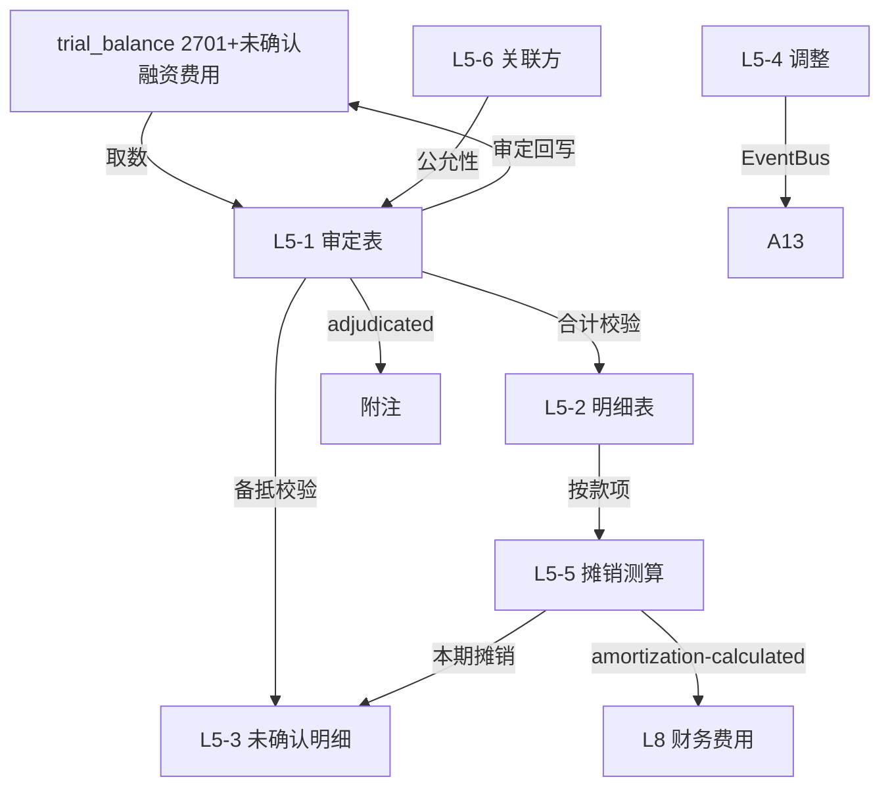

# Design Document: L5 长期应付款底稿专属HTML精美组件

## Overview

L5长期应付款底稿专属组件`l5-long-term-payables`。L筹资循环底稿（1个xlsx源模板/9有效sheet/~120+公式）。科目2701长期应付款（**贷方/负债类！**）+ 未确认融资费用（借方/负债备抵类）。

核心架构：
- componentType `l5-long-term-payables`，主入口 GtL5LongTermPayables.vue
- **无内部el-tabs**：接收`sheetName` prop用`v-if`分发
- composable分层：useL5FormData + useL5FormulaEngine(纯函数) + useL5AmortizationEngine(纯函数,核心) + useL5CrossSheet + useL5DualMode + useL5ImportExport
- **负债类贷方科目**：期末=期初+贷方-借方
- **未确认融资费用摊销**：实际利率法（每期摊销=期初摊余成本×实际利率，与H9同款）
- EventBus联动：TB回写(2701+未确认融资费用) + 本期摊销→L8财务费用 + 附注

## Architecture

### sheetName分发模式

```
sheetName → regex提取编码 → v-if匹配 → 子组件渲染
                                     ↘ 未匹配 → OnlyOffice fallback
```

### 文件结构

```
audit-platform/frontend/src/components/workpaper/
├── GtL5LongTermPayables.vue                # 主入口 sheetName v-if分发（lazy）
├── l5/
│   ├── core/
│   │   ├── L5TabIndex.vue                  # 底稿目录
│   │   ├── L5TabAdjudication.vue           # L5-1 审定表（负债类双区块+净额）
│   │   ├── L5TabDetail.vue                 # L5-2 明细表（30列区段Tab）
│   │   ├── L5TabUnrecognizedDetail.vue     # L5-3 未确认融资费用明细
│   │   ├── L5TabAdjustment.vue             # L5-4 调整分录（借贷平衡）
│   │   ├── L5TabDisclosureListed.vue       # 附注上市
│   │   └── L5TabDisclosureSoe.vue          # 附注国企
│   ├── amortization/
│   │   └── L5TabAmortization.vue           # L5-5 未确认融资费用测算表（核心！）
│   └── inspection/
│       ├── L5TabRelatedParty.vue           # L5-6 关联方及交易检查
│       └── L5TabLtPayableCheck.vue         # L5-7 长期应付款检查表
├── composables/
│   ├── useL5FormData.ts                    # selfLoad/writebackTB(2701+未确认融资费用)
│   ├── useL5FormulaEngine.ts               # 纯函数公式引擎（负债类！+净额）
│   ├── useL5AmortizationEngine.ts          # 纯函数摊销引擎（实际利率法，核心）
│   ├── useL5CrossSheet.ts                  # 跨sheet + L8联动
│   ├── useL5DualMode.ts
│   ├── useL5ImportExport.ts
│   ├── useL5Adjudication.ts
│   ├── useL5Detail.ts
│   ├── useL5UnrecognizedDetail.ts
│   ├── useL5Amortization.ts
│   ├── useL5RelatedParty.ts
│   └── useL5Adjustment.ts
```

### 后端文件结构

```
audit-platform/backend/
├── app/workpaper_engine/renderers/
│   └── l5_long_term_payables_renderer.py
├── app/routers/
│   └── l5_long_term_payables.py            # 3端点 + 摊销表生成API
├── app/services/
│   └── l5_long_term_payables_service.py    # 实际利率法摊销+净额+关联方
└── data/wp_render_schema/
    └── l5-long-term-payables.yaml
```

## Composable接口设计

### useL5FormulaEngine.ts（负债类！）

```typescript
export function calcAuditedAmount(unadj: number, aje: number, rje: number): number
// 负债类期末：期末=期初+贷方-借方
export function calcLiabilityEndBalance(begin: number, credit: number, debit: number): number
// 备抵类期末（未确认融资费用，借方）：期末=期初+借方-贷方
export function calcContraLiabilityEndBalance(begin: number, debit: number, credit: number): number
// 净额=长期应付款-未确认融资费用
export function calcNetPayable(payable: number, unrecognized: number): number
export function calcSubtotal(arr: number[]): number
```

### useL5AmortizationEngine.ts（核心纯函数！实际利率法）

```typescript
// 每期摊销=期初摊余成本×实际利率
export function calcAmortization(amortizedCost: number, eir: number): number
// 期末摊余成本
export function calcEndCost(begin: number, amortization: number, repayment: number): number
// 生成完整摊销表
export function generateSchedule(
  initialCost: number, repayments: number[], eir: number, periods: number
): AmortRow[]
// 验证：最后一期未确认余额≈0
export function validateSchedule(schedule: AmortRow[]): { isValid: boolean; tailDiff: number }

interface AmortRow {
  period: number
  beginCost: number
  amortization: number
  repayment: number
  endCost: number
}
```

### useL5CrossSheet.ts

```typescript
export function useL5CrossSheet(allResponses: Ref<Map<string, any>>) {
  const adjudicationVsDetail: ComputedRef<{ diff: number; isMatch: boolean }>
  const unrecognizedVsAmortization: ComputedRef<{ diff: number; isMatch: boolean }>
  const amortizationToL8: ComputedRef<{ periodAmortization: number }>
}
```

## 数据流图



## ADR

### ADR-1: L5是负债类贷方科目+未确认融资费用备抵
L5长期应付款是负债类科目（期末=期初+贷方-借方），未确认融资费用是借方备抵（期末=期初+借方-贷方）。净额=长期应付款-未确认融资费用。与H9租赁负债结构同款。

### ADR-2: 未确认融资费用摊销是核心（实际利率法）
L5-5测算表的实际利率法摊销是L5核心计算：每期摊销=期初摊余成本×实际利率，摊销计入财务费用（联动L8），使未确认融资费用在款项期限内系统冲销。摊销引擎为纯函数，可PBT验证。与H9摊销引擎同款。

### ADR-3: 联动L8财务费用
未确认融资费用本期摊销额通过EventBus联动L8财务费用（利息支出的一部分）。

## Correctness Properties

| ID | Property | 验证方法 |
|----|----------|---------|
| P1 | ∀ u,a,r: calcAuditedAmount = u+a+r | PBT |
| P2 | ∀ b,cr,dr: calcLiabilityEndBalance = b+cr-dr（负债类！） | PBT |
| P3 | ∀ b,dr,cr: calcContraLiabilityEndBalance = b+dr-cr（备抵） | PBT |
| P4 | ∀ p,u: calcNetPayable = p-u | PBT |
| P5 | ∀ cost,eir: calcAmortization = cost×eir | PBT |
| P6 | eir=0时 calcAmortization=0 | PBT |
| P7 | ∀ schedule: 最后一期未确认余额≈0 | PBT |

## 错误处理

| 场景 | 处理方式 |
|------|---------|
| selfLoad失败 | el-empty+重试 |
| TB无科目2701 | 提示导入试算表 |
| EIR=0 | 摊销=0 + 黄色提示 |
| 摊销表末期余额>1 | 红色高亮最后一期尾差 |
| L5-3未确认vs摊销不一致 | 红色警告+差额 |
| 净额<0 | 黄色提示"净额异常" |
| L8未创建 | 黄色提示"待L8订阅摊销" |
| 明细合计≠审定 | 红色警告+差额 |
