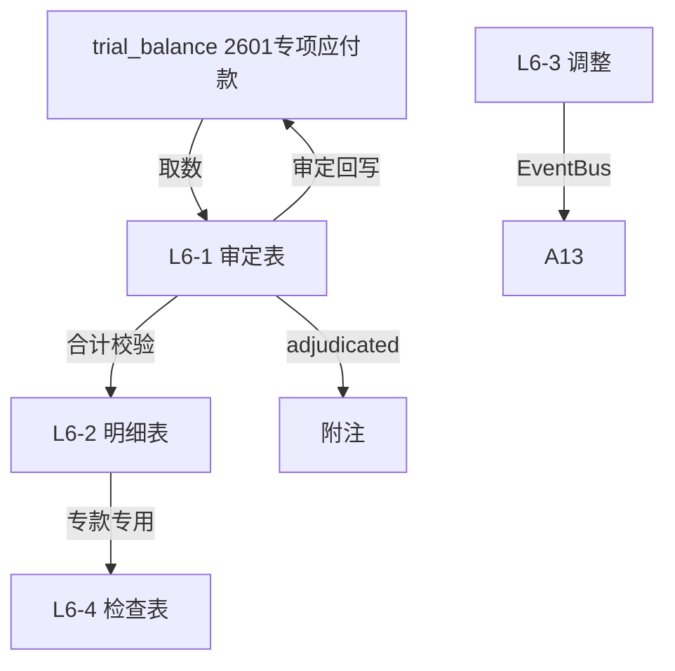

# Design Document: L6 专项应付款底稿专属HTML精美组件

## Overview

L6专项应付款底稿专属组件`l6-special-payables`。L筹资循环标准负债底稿（1个xlsx源模板/8有效sheet/~100+公式）。科目2601专项应付款（**贷方/负债类！**）。

核心架构：
- componentType `l6-special-payables`，主入口 GtL6SpecialPayables.vue
- **无内部el-tabs**：接收`sheetName` prop用`v-if`分发
- composable分层：useL6FormData + useL6FormulaEngine(纯函数) + useL6CrossSheet + useL6DualMode + useL6ImportExport
- **负债类贷方科目**：期末=期初+贷方-借方
- EventBus联动：TB回写(2601) + 附注

## Architecture

### sheetName分发模式

```
sheetName → regex提取编码 → v-if匹配 → 子组件渲染
                                     ↘ 未匹配 → OnlyOffice fallback
```

### 文件结构

```
audit-platform/frontend/src/components/workpaper/
├── GtL6SpecialPayables.vue                 # 主入口 sheetName v-if分发（lazy）
├── l6/
│   ├── core/
│   │   ├── L6TabIndex.vue                  # 底稿目录
│   │   ├── L6TabAdjudication.vue           # L6-1 审定表（负债类贷方+项目小计）
│   │   ├── L6TabDetail.vue                 # L6-2 明细表（33列区段Tab）
│   │   ├── L6TabAdjustment.vue             # L6-3 调整分录（借贷平衡）
│   │   ├── L6TabDisclosureListed.vue       # 附注上市
│   │   └── L6TabDisclosureSoe.vue          # 附注国企
│   └── inspection/
│       └── L6TabSpecialCheck.vue           # L6-4 专项应付款检查表（专款专用）
├── composables/
│   ├── useL6FormData.ts                    # selfLoad/writebackTB(2601)
│   ├── useL6FormulaEngine.ts               # 纯函数公式引擎（负债类！贷方公式）
│   ├── useL6CrossSheet.ts                  # 跨sheet
│   ├── useL6DualMode.ts
│   ├── useL6ImportExport.ts
│   ├── useL6Adjudication.ts
│   ├── useL6Detail.ts
│   ├── useL6SpecialCheck.ts
│   └── useL6Adjustment.ts
```

### 后端文件结构

```
audit-platform/backend/
├── app/workpaper_engine/renderers/
│   └── l6_special_payables_renderer.py
├── app/routers/
│   └── l6_special_payables.py              # 3端点
├── app/services/
│   └── l6_special_payables_service.py      # 负债类公式验证+专款专用核查
└── data/wp_render_schema/
    └── l6-special-payables.yaml
```

## Composable接口设计

### useL6FormulaEngine.ts（负债类！）

```typescript
export function calcAuditedAmount(unadj: number, aje: number, rje: number): number
// 负债类期末：期末=期初+贷方-借方
export function calcLiabilityEndBalance(begin: number, credit: number, debit: number): number
export function calcSubtotal(arr: number[]): number
```

### useL6CrossSheet.ts

```typescript
export function useL6CrossSheet(allResponses: Ref<Map<string, any>>) {
  const adjudicationVsDetail: ComputedRef<{ diff: number; isMatch: boolean }>
}
```

## 数据流图



## ADR

### ADR-1: L6是负债类贷方科目
L6专项应付款是负债类科目，期末=期初+贷方-借方。L筹资循环L1~L7铁律。

### ADR-2: 专款专用核查是核心程序
专项应付款多为政府专项拨款，需核查专款专用（实际用途vs批准用途），结余按规定处理。这是L6的关键合规审计程序。

### ADR-3: 33列宽表区段Tab拆分
明细表(33列)超15列，采用区段Tab切换（项目信息/资金变动/用途核查，行同步）减少横滚。

## Correctness Properties

| ID | Property | 验证方法 |
|----|----------|---------|
| P1 | ∀ u,a,r: calcAuditedAmount = u+a+r | PBT |
| P2 | ∀ b,cr,dr: calcLiabilityEndBalance = b+cr-dr（负债类！） | PBT |
| P3 | ∀ arr: calcSubtotal = Σarr | PBT |
| P4 | 明细合计 === 审定表合计 | PBT |
| P5 | 期末≥0（专项应付款不应为负） | PBT |

## 错误处理

| 场景 | 处理方式 |
|------|---------|
| selfLoad失败 | el-empty+重试 |
| TB无科目2601 | 提示导入试算表 |
| 实际用途≠批准用途 | 红色高亮 |
| 期末<0 | 黄色提示"余额异常" |
| 明细合计≠审定 | 红色警告+差额 |
