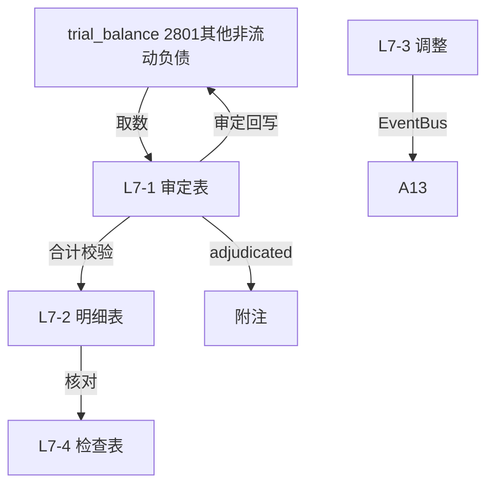

# Design Document: L7 其他非流动负债底稿专属HTML精美组件

## Overview

L7其他非流动负债底稿专属组件`l7-other-noncurrent-liabilities`。L筹资循环最简标准负债底稿（1个xlsx源模板/8有效sheet/~90+公式）。科目2801其他非流动负债（**贷方/负债类！**）。

核心架构：
- componentType `l7-other-noncurrent-liabilities`，主入口 GtL7OtherNoncurrentLiabilities.vue
- **无内部el-tabs**：接收`sheetName` prop用`v-if`分发
- composable分层：useL7FormData + useL7FormulaEngine(纯函数) + useL7CrossSheet + useL7DualMode + useL7ImportExport
- **负债类贷方科目**：期末=期初+贷方-借方
- EventBus联动：TB回写(2801) + 附注

## Architecture

### sheetName分发模式

```
sheetName → regex提取编码 → v-if匹配 → 子组件渲染
                                     ↘ 未匹配 → OnlyOffice fallback
```

### 文件结构

```
audit-platform/frontend/src/components/workpaper/
├── GtL7OtherNoncurrentLiabilities.vue      # 主入口 sheetName v-if分发（lazy）
├── l7/
│   ├── core/
│   │   ├── L7TabIndex.vue                  # 底稿目录
│   │   ├── L7TabAdjudication.vue           # L7-1 审定表（负债类贷方+项目小计）
│   │   ├── L7TabDetail.vue                 # L7-2 明细表（27列区段Tab）
│   │   ├── L7TabAdjustment.vue             # L7-3 调整分录（借贷平衡）
│   │   ├── L7TabDisclosureListed.vue       # 附注上市
│   │   └── L7TabDisclosureSoe.vue          # 附注国企
│   └── inspection/
│       └── L7TabOtherCheck.vue             # L7-4 其他非流动负债检查表
├── composables/
│   ├── useL7FormData.ts                    # selfLoad/writebackTB(2801)
│   ├── useL7FormulaEngine.ts               # 纯函数公式引擎（负债类！贷方公式）
│   ├── useL7CrossSheet.ts                  # 跨sheet
│   ├── useL7DualMode.ts
│   ├── useL7ImportExport.ts
│   ├── useL7Adjudication.ts
│   ├── useL7Detail.ts
│   ├── useL7OtherCheck.ts
│   └── useL7Adjustment.ts
```

### 后端文件结构

```
audit-platform/backend/
├── app/workpaper_engine/renderers/
│   └── l7_other_noncurrent_liabilities_renderer.py
├── app/routers/
│   └── l7_other_noncurrent_liabilities.py  # 3端点
├── app/services/
│   └── l7_other_noncurrent_liabilities_service.py   # 负债类公式验证
└── data/wp_render_schema/
    └── l7-other-noncurrent-liabilities.yaml
```

## Composable接口设计

### useL7FormulaEngine.ts（负债类！）

```typescript
export function calcAuditedAmount(unadj: number, aje: number, rje: number): number
// 负债类期末：期末=期初+贷方-借方
export function calcLiabilityEndBalance(begin: number, credit: number, debit: number): number
export function calcSubtotal(arr: number[]): number
```

### useL7CrossSheet.ts

```typescript
export function useL7CrossSheet(allResponses: Ref<Map<string, any>>) {
  const adjudicationVsDetail: ComputedRef<{ diff: number; isMatch: boolean }>
}
```

## 数据流图



## ADR

### ADR-1: L7是负债类贷方科目
L7其他非流动负债是负债类科目，期末=期初+贷方-借方。L筹资循环L1~L7铁律。

### ADR-2: L7是L筹资循环最简底稿
L7无复杂计算引擎（无利息测算/摊销/分支），仅需标准审定+明细+调整+附注+检查。属L循环最简标准负债底稿，可作为负债类底稿的最小模板。

### ADR-3: 27列宽表区段Tab拆分
明细表(27列)超15列，采用区段Tab切换（项目信息/金额变动，行同步）减少横滚。

## Correctness Properties

| ID | Property | 验证方法 |
|----|----------|---------|
| P1 | ∀ u,a,r: calcAuditedAmount = u+a+r | PBT |
| P2 | ∀ b,cr,dr: calcLiabilityEndBalance = b+cr-dr（负债类！） | PBT |
| P3 | ∀ arr: calcSubtotal = Σarr | PBT |
| P4 | 明细合计 === 审定表合计 | PBT |
| P5 | 期末≥0（其他非流动负债不应为负） | PBT |

## 错误处理

| 场景 | 处理方式 |
|------|---------|
| selfLoad失败 | el-empty+重试 |
| TB无科目2801 | 提示导入试算表 |
| 期末<0 | 黄色提示"余额异常" |
| 明细合计≠审定 | 红色警告+差额 |
