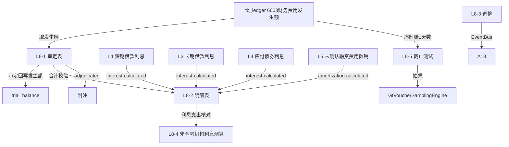

# Design Document: L8 财务费用底稿专属HTML精美组件

## Overview

L8财务费用底稿专属组件`l8-financial-expenses`。L筹资循环损益类底稿（1个xlsx源模板/10有效sheet/~150+公式）。科目6603财务费用（**损益类！取发生额**，从tb_ledger取本期借贷发生额）。

核心架构：
- componentType `l8-financial-expenses`，主入口 GtL8FinancialExpenses.vue
- **无内部el-tabs**：接收`sheetName` prop用`v-if`分发
- composable分层：useL8FormData + useL8FormulaEngine(纯函数) + useL8InterestEngine(纯函数) + useL8CutoffEngine(纯函数) + useL8CrossSheet + useL8DualMode + useL8ImportExport
- **损益类科目**：取发生额（借方发生-贷方发生），非余额！与L1~L7负债类根本不同
- EventBus联动：TB回写(6603发生额口径) + **接收L1/L3/L4利息测算+L5摊销** + 截止自动提取 + 附注

## Architecture

### sheetName分发模式

```
sheetName → regex提取编码 → v-if匹配 → 子组件渲染
                                     ↘ 未匹配 → OnlyOffice fallback
```

### 文件结构

```
audit-platform/frontend/src/components/workpaper/
├── GtL8FinancialExpenses.vue               # 主入口 sheetName v-if分发（lazy）
├── l8/
│   ├── core/
│   │   ├── L8TabIndex.vue                  # 底稿目录
│   │   ├── L8TabAdjudication.vue           # L8-1 审定表（损益类！发生额）
│   │   ├── L8TabDetail.vue                 # L8-2 明细表（23列区段Tab+费用项目分析）
│   │   ├── L8TabAdjustment.vue             # L8-3 调整分录（借贷平衡）
│   │   ├── L8TabDisclosureListed.vue       # 附注上市
│   │   └── L8TabDisclosureSoe.vue          # 附注国企
│   ├── interest/
│   │   └── L8TabNonFinInterest.vue         # L8-4 非金融机构利息支出测算
│   ├── cutoff/
│   │   └── L8TabCutoffTest.vue             # L8-5 截止性测试（序时账±天数）
│   └── inspection/
│       └── L8TabFinExpenseCheck.vue        # L8-6 财务费用检查表
├── composables/
│   ├── useL8FormData.ts                    # selfLoad/writebackTB(6603发生额)
│   ├── useL8FormulaEngine.ts               # 纯函数公式引擎（损益类！发生额）
│   ├── useL8InterestEngine.ts              # 纯函数利息支出测算引擎（接收L1/L3/L4/L5）
│   ├── useL8CutoffEngine.ts                # 纯函数截止测试引擎
│   ├── useL8CrossSheet.ts                  # 跨sheet + L1/L3/L4/L5联动
│   ├── useL8DualMode.ts
│   ├── useL8ImportExport.ts
│   ├── useL8Adjudication.ts
│   ├── useL8Detail.ts
│   ├── useL8NonFinInterest.ts
│   ├── useL8CutoffTest.ts
│   └── useL8Adjustment.ts
```

### 后端文件结构

```
audit-platform/backend/
├── app/workpaper_engine/renderers/
│   └── l8_financial_expenses_renderer.py
├── app/routers/
│   └── l8_financial_expenses.py            # 3端点 + 利息测算汇总+截止提取API
├── app/services/
│   └── l8_financial_expenses_service.py    # 损益类发生额+利息汇总+截止测试
└── data/wp_render_schema/
    └── l8-financial-expenses.yaml
```

## Composable接口设计

### useL8FormulaEngine.ts（损益类！取发生额）

```typescript
export function calcAuditedAmount(unadj: number, aje: number, rje: number): number
// 损益类本期发生额=借方发生-贷方发生（费用为借方）
export function calcOccurrence(debitOccur: number, creditOccur: number): number
// 净财务费用=利息支出-利息收入+汇兑损益+手续费+其他
export function calcNetFinanceExpense(interestExp: number, interestInc: number, fx: number, fee: number, other: number): number
// 变动率=(本期-上期)/上期×100
export function calcChangeRate(current: number, prior: number): number
export function calcSubtotal(arr: number[]): number
```

### useL8InterestEngine.ts（利息支出测算纯函数）

```typescript
// 汇总各来源利息（L1/L3/L4/L5）
export function aggregateInterest(l1: number, l3: number, l4: number, l5: number): number
// 测算vs账面差异
export function calcInterestDiff(estimated: number, booked: number): number
// 可扣除利息=本金×基准利率×天数/360
export function calcDeductibleInterest(principal: number, benchmarkRate: number, days: number): number
// 超标利息=账载-可扣除
export function calcExcessInterest(booked: number, deductible: number): number
```

### useL8CutoffEngine.ts（截止测试纯函数）

```typescript
// 是否跨期
export function isCrossPeriod(attributionPeriod: string, bookingPeriod: string): boolean
// 提取报告日±N天窗口序时账
export function extractCutoffWindow(ledger: LedgerEntry[], reportDate: string, days: number): LedgerEntry[]
```

### useL8CrossSheet.ts

```typescript
export function useL8CrossSheet(allResponses: Ref<Map<string, any>>) {
  const adjudicationVsDetail: ComputedRef<{ diff: number; isMatch: boolean }>
  const interestFromLCycle: ComputedRef<{ l1: number; l3: number; l4: number; l5: number; total: number }>
  const estimatedVsBooked: ComputedRef<{ diff: number; isConsistent: boolean }>
}
```

## 数据流图



## ADR

### ADR-1: L8是损益类科目（取发生额！）
L8财务费用是损益类科目，与L1~L7负债类根本不同：**取本期发生额（借方发生-贷方发生），不是期末余额**。审定表列示本期发生额/上期发生额/变动，从tb_ledger取数。回写TB时用发生额口径。这是L循环内L8与L1~L7的根本差异。

### ADR-2: L8是筹资循环利息的汇聚终点
L8财务费用汇聚整个L筹资循环的利息：L1短期借款利息、L3长期借款利息、L4应付债券利息费用、L5未确认融资费用摊销，全部通过EventBus联动到L8的利息支出测算。测算利息支出合计与账面对比验证完整性。

### ADR-3: 截止测试是损益类关键程序
财务费用作为损益类科目，截止测试（期末前后归属期间正确性）是关键程序。集成useCutoffAutoSampling自动提取报告日±N天序时账，识别跨期费用。

### ADR-4: 非金融机构利息税务提示
非金融机构借款利息超过同期金融机构利率部分不可税前扣除，L8-4测算超标利息，橙色提示税务调整。

## Correctness Properties

| ID | Property | 验证方法 |
|----|----------|---------|
| P1 | ∀ u,a,r: calcAuditedAmount = u+a+r | PBT |
| P2 | ∀ dr,cr: calcOccurrence = dr-cr（损益类发生额！） | PBT |
| P3 | ∀ ie,ii,fx,fee,o: calcNetFinanceExpense = ie-ii+fx+fee+o | PBT |
| P4 | ∀ cur,prior(≠0): calcChangeRate = (cur-prior)/prior×100 | PBT |
| P5 | ∀ l1,l3,l4,l5: aggregateInterest = l1+l3+l4+l5 | PBT |
| P6 | ∀ p,rate,days: calcDeductibleInterest = p×rate×days/360 | PBT |
| P7 | ∀ booked,deduct: calcExcessInterest = booked-deduct | PBT |

## 错误处理

| 场景 | 处理方式 |
|------|---------|
| selfLoad失败 | el-empty+重试 |
| tb_ledger无6603发生额 | 提示导入序时账 |
| L1/L3/L4/L5利息未就绪 | 黄色提示"待筹资循环各底稿利息测算完成" |
| 测算利息vs账面差异>阈值 | 红色高亮 |
| 超标利息>0 | 橙色提示税务调整 |
| 跨期费用（截止错误） | 红色高亮 |
| 变动率异常 | 高亮+要求说明 |
| 明细合计≠审定 | 红色警告+差额 |
