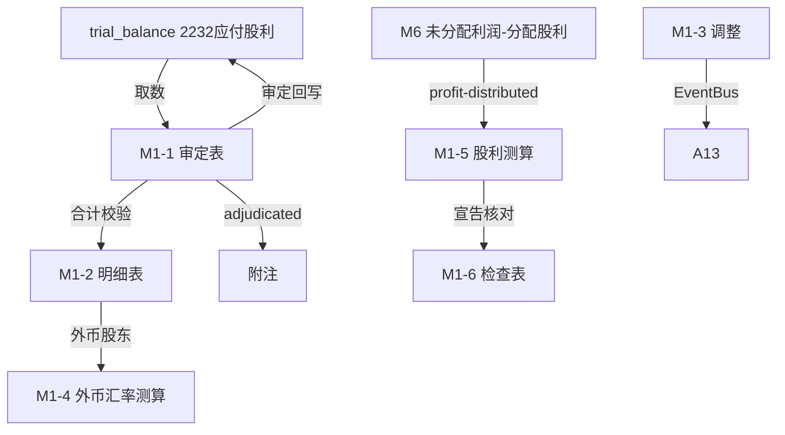

# Design Document: M1 应付股利（利润）底稿专属HTML精美组件

## Overview

M1应付股利（利润）底稿专属组件`m1-dividends-payable`。M股东权益循环底稿（1个xlsx源模板/10有效sheet/~100+公式）。科目2232应付股利（**贷方/负债类！**）。

核心架构：
- componentType `m1-dividends-payable`，主入口 GtM1DividendsPayable.vue
- **无内部el-tabs**：接收`sheetName` prop用`v-if`分发
- composable分层：useM1FormData + useM1FormulaEngine(纯函数) + useM1FxEngine(纯函数) + useM1DividendEngine(纯函数) + useM1CrossSheet + useM1DualMode + useM1ImportExport
- **负债类贷方科目**：期末=期初+贷方-借方（宣告在贷方，支付在借方）
- EventBus联动：TB回写(2232) + **接收M6利润分配（分配股利）** + 外币汇率折算 + 附注

## Architecture

### sheetName分发模式

```
sheetName → regex提取编码 → v-if匹配 → 子组件渲染
                                     ↘ 未匹配 → OnlyOffice fallback
```

### 文件结构

```
audit-platform/frontend/src/components/workpaper/
├── GtM1DividendsPayable.vue                 # 主入口 sheetName v-if分发（lazy）
├── m1/
│   ├── core/
│   │   ├── M1TabIndex.vue                   # 底稿目录
│   │   ├── M1TabAdjudication.vue            # M1-1 审定表（负债类贷方+按股东分类）
│   │   ├── M1TabDetail.vue                  # M1-2 明细表（27列区段Tab）
│   │   ├── M1TabAdjustment.vue              # M1-3 调整分录（借贷平衡）
│   │   ├── M1TabDisclosureListed.vue        # 附注上市
│   │   └── M1TabDisclosureSoe.vue           # 附注国企
│   ├── calc/
│   │   ├── M1TabFxRate.vue                  # M1-4 外币汇率测算（13公式）
│   │   └── M1TabDividendCalc.vue            # M1-5 股利测算（接收M6，13公式）
│   └── inspection/
│       └── M1TabDividendCheck.vue           # M1-6 应付股利检查表
├── composables/
│   ├── useM1FormData.ts                     # selfLoad/writebackTB(2232)
│   ├── useM1FormulaEngine.ts                # 纯函数公式引擎（负债类！贷方公式）
│   ├── useM1FxEngine.ts                     # 纯函数外币折算引擎
│   ├── useM1DividendEngine.ts               # 纯函数股利测算引擎（接收M6）
│   ├── useM1CrossSheet.ts                   # 跨sheet + M6联动
│   ├── useM1DualMode.ts
│   ├── useM1ImportExport.ts
│   ├── useM1Adjudication.ts
│   ├── useM1Detail.ts
│   ├── useM1DividendCheck.ts
│   └── useM1Adjustment.ts
```

### 后端文件结构

```
audit-platform/backend/
├── app/workpaper_engine/renderers/
│   └── m1_dividends_payable_renderer.py
├── app/routers/
│   └── m1_dividends_payable.py              # 3端点 + 外币折算/股利测算API
├── app/services/
│   └── m1_dividends_payable_service.py      # 外币折算+股利测算
└── data/wp_render_schema/
    └── m1-dividends-payable.yaml
```

## Composable接口设计

### useM1FormulaEngine.ts（负债类！）

```typescript
export function calcAuditedAmount(unadj: number, aje: number, rje: number): number
// 负债类期末：期末=期初+贷方-借方
export function calcLiabilityEndBalance(begin: number, credit: number, debit: number): number
export function calcSubtotal(arr: number[]): number
```

### useM1FxEngine.ts（纯函数）

```typescript
// 折算本位币=原币×期末汇率
export function calcFxConverted(amount: number, rate: number): number
// 汇兑差异=折算-账面
export function calcFxDiff(converted: number, booked: number): number
```

### useM1DividendEngine.ts（纯函数）

```typescript
// 应宣告股利=可供分配利润×分配比例
export function calcDeclaredDividend(profit: number, ratio: number): number
// 宣告差异=测算-账面
export function calcDeclareDiff(estimated: number, booked: number): number
```

### useM1CrossSheet.ts

```typescript
export function useM1CrossSheet(allResponses: Ref<Map<string, any>>) {
  const adjudicationVsDetail: ComputedRef<{ diff: number; isMatch: boolean }>
  const declareVsM6: ComputedRef<{ diff: number; isConsistent: boolean }>
}
```

## 数据流图



## ADR

### ADR-1: M1是负债类贷方科目
M1应付股利是负债类科目（贷方余额），期末=期初+贷方-借方。宣告分配时贷方增加，实际支付时借方减少。这是M股东权益循环中唯一的负债类科目（其余M2~M10均为权益类）。

### ADR-2: 应付股利是利润分配的下游负债
M6未分配利润宣告分配股利时，形成M1应付股利。股利测算表M1-5接收M6的分配股利（EventBus订阅），验证宣告的准确性与完整性。

### ADR-3: 外币应付股利需汇率折算
对境外股东的应付股利以外币计价，期末按即期汇率折算本位币，汇兑差异计入财务费用。M1-4外币汇率测算为独立引擎。

## Correctness Properties

| ID | Property | 验证方法 |
|----|----------|---------|
| P1 | ∀ u,a,r: calcAuditedAmount = u+a+r | PBT |
| P2 | ∀ b,cr,dr: calcLiabilityEndBalance = b+cr-dr（负债类！） | PBT |
| P3 | ∀ amt,rate: calcFxConverted = amt×rate | PBT |
| P4 | ∀ conv,booked: calcFxDiff = conv-booked | PBT |
| P5 | ∀ profit,ratio: calcDeclaredDividend = profit×ratio | PBT |
| P6 | ∀ arr: calcSubtotal = Σarr | PBT |

## 错误处理

| 场景 | 处理方式 |
|------|---------|
| selfLoad失败 | el-empty+重试 |
| TB无科目2232 | 提示导入试算表 |
| M6利润分配未就绪 | 黄色提示"待M6利润分配完成" |
| 汇兑差异>阈值 | 红色高亮+提示调整 |
| 宣告差异>阈值 | 红色高亮+要求填写说明 |
| 明细合计≠审定 | 红色警告+差额 |
