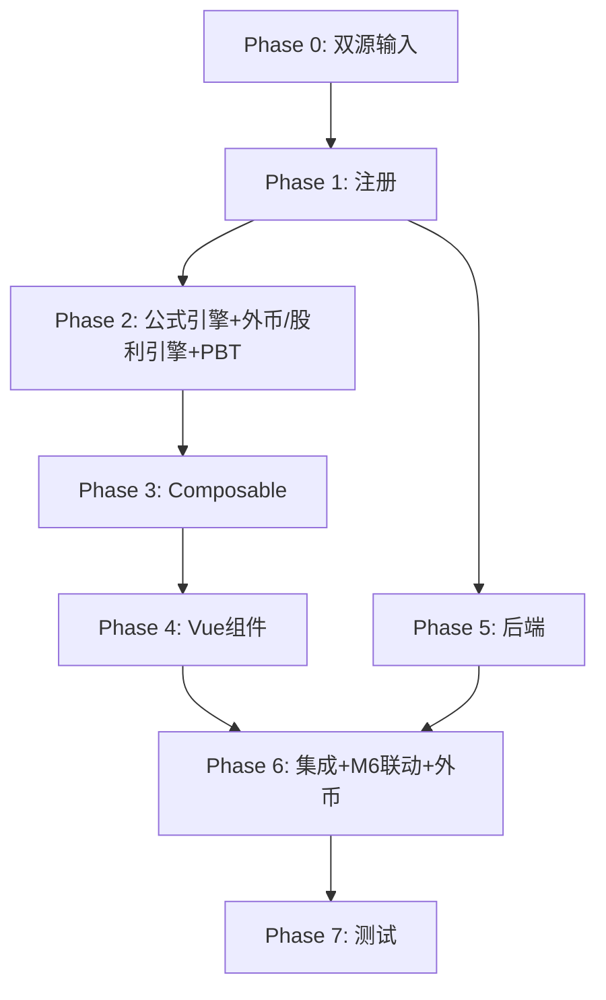

# Implementation Plan: M1 应付股利（利润）底稿专属HTML精美组件

## Overview

M1应付股利（利润）底稿专属组件`m1-dividends-payable`（10 sheet/1 xlsx/~100+公式）。

主入口 GtM1DividendsPayable.vue（sheetName v-if，lazy）+ 9个子组件 + 11个composable + 后端3个py文件。

科目：2232应付股利（贷方/负债类）
公式特征：**负债类贷方**期末=期初+贷方-借方；外币汇率折算；接收M6分配股利做宣告核对

## Tasks

### Phase 0: 双源输入验证

- [x] 0.1 openpyxl脚本读取M1应付股利（利润）.xlsx全部10 sheet
  - 提取结构 + 确认审定表M1-1（73公式）+外币汇率M1-4（13公式）+股利测算M1-5（13公式）
  - 产出：m1_structure_summary.json
  - _Requirements: 双源输入流程_

- [x] 0.2 M股东权益循环底稿模板库md交叉验证
  - 核对：负债类方向/外币折算/股利测算/M6联动
  - 产出：m1_conflict_resolution.md
  - _Requirements: 双源输入流程_

### Phase 1: 注册+契约测试

- [x] 1.1 注册componentType和映射
  - wp_code_overrides: M1/M1-1~M1-6 → 'm1-dividends-payable'
  - VALID_COMPONENT_TYPES + htmlRendererRegistry注册
  - 创建 GtM1DividendsPayable.vue 骨架（sheetName v-if + selfLoad）
  - _Requirements: 1.1-1.11_

- [x] 1.2 编写注册契约测试
  - htmlRendererRegistry / VALID_COMPONENT_TYPES / wp_code_overrides / RENDERER_DISPATCH
  - _Requirements: 1.6, 1.7, 1.8_

### Phase 2: 公式引擎+外币/股利引擎+PBT

- [x] 2.1 创建 `useM1FormulaEngine.ts`（负债类！）
  - calcAuditedAmount / calcLiabilityEndBalance(b,cr,dr)=b+cr-dr / calcSubtotal
  - _Requirements: 2.3-2.4, 7.5_

- [x] 2.2 创建 `useM1FxEngine.ts` + `useM1DividendEngine.ts`
  - calcFxConverted / calcFxDiff / calcDeclaredDividend / calcDeclareDiff
  - _Requirements: 4.2-4.3, 5.3-5.4, 7.1-7.4_

- [x]* 2.3 编写 Property P1 PBT：审定数公式链
  - 断言：calcAuditedAmount(u, a, r) === u + a + r
  - **Feature: m1-dividends-payable, Property P1: 审定数公式链**

- [x]* 2.4 编写 Property P2 PBT：负债类期末（贷方！）
  - 生成器：fc.float({min:0, max:1e9}) × 3
  - 断言：calcLiabilityEndBalance(b, cr, dr) === b + cr - dr
  - **Feature: m1-dividends-payable, Property P2: 负债类贷方期末余额**

- [x]* 2.5 编写 Property P3 PBT：外币折算
  - 断言：calcFxConverted(amt, rate) === amt × rate
  - **Feature: m1-dividends-payable, Property P3: 外币折算**

- [x]* 2.6 编写 Property P4 PBT：汇兑差异
  - 断言：calcFxDiff(conv, booked) === conv - booked
  - **Feature: m1-dividends-payable, Property P4: 汇兑差异**

- [x]* 2.7 编写 Property P5 PBT：应宣告股利
  - 断言：calcDeclaredDividend(profit, ratio) === profit × ratio
  - **Feature: m1-dividends-payable, Property P5: 应宣告股利测算**

- [x]* 2.8 编写 Property P6 PBT：小计求和
  - 断言：calcSubtotal(arr) === Σarr
  - **Feature: m1-dividends-payable, Property P6: 分类小计**

### Phase 3: Composable层

- [x] 3.1 创建 useM1FormData.ts
  - selfLoad + checklist_responses + writebackTB(2232)
  - _Requirements: 1.9, 1.10, 2.6_

- [x] 3.2 创建 useM1CrossSheet.ts
  - adjudicationVsDetail / declareVsM6
  - _Requirements: 2.5, 5.2, 5.6_

- [x] 3.3 创建 useM1DualMode.ts + useM1ImportExport.ts
  - _Requirements: 7.6, 7.7_

- [x] 3.4 创建 sheet-specific composables
  - useM1Adjudication / useM1Detail / useM1DividendCheck / useM1Adjustment
  - _Requirements: 2~6 全部_

### Phase 4: Vue子组件

- [x] 4.1 创建 M1TabIndex.vue 底稿目录
  - _Requirements: 1.2_

- [x] 4.2 创建 M1TabAdjudication.vue 审定表M1-1
  - 负债类单区块+按股东分类小计+TB回写
  - _Requirements: 2.1-2.7_

- [x] 4.3 创建 M1TabDetail.vue 明细表M1-2
  - 27列区段Tab+动态行(弹prompt股东名)+导入导出
  - _Requirements: 3.1-3.5_

- [x] 4.4 创建 M1TabFxRate.vue + M1TabDividendCalc.vue
  - 外币汇率测算(13公式) + 股利测算(接收M6,13公式)
  - _Requirements: 4.1-4.5, 5.1-5.6_

- [x] 4.5 创建 M1TabDividendCheck.vue 检查表M1-6
  - 核对清单+结论区+AI辅助
  - _Requirements: 6.1-6.2_

- [x] 4.6 创建 M1TabAdjustment.vue + M1TabDisclosureListed/Soe.vue
  - 调整借贷平衡 + 附注上市/国企切换
  - _Requirements: 6.3-6.5_

### Phase 5: 后端

- [x] 5.1 创建 m1_dividends_payable_renderer.py
  - RENDERER_DISPATCH注册 + 负债类公式验证
  - _Requirements: 1.6_

- [x] 5.2 创建 m1_dividends_payable.py 路由
  - 导出模板/导出数据/导入数据 + 外币折算/股利测算API
  - _Requirements: 7.7_

- [x] 5.3 创建 m1_dividends_payable_service.py
  - 外币折算+股利测算+按股东汇总
  - _Requirements: 4.2, 5.3_

### Phase 6: 集成

- [x] 6.1 EventBus集成
  - publish 'substantive:adjudicated' / 'adjustment:created'
  - subscribe 'm6:profit-distributed' + 附注刷新
  - _Requirements: 2.6, 5.2_

- [x] 6.2 跨底稿联动
  - M6分配股利 → M1股利测算核对（cross_wp_ref + GtIndexChip）
  - M1审定 → TB回写(2232)
  - _Requirements: 5.2, 5.6_

- [x] 6.3 版本链+复核对话集成
  - useVersionTrail(autoSnapshot) + provide openReviewDialog
  - _Requirements: 7.8_

### Phase 7: 测试

- [x] 7.1 单元测试：useM1FormulaEngine + useM1FxEngine + useM1DividendEngine
  - 负债类方向 + 外币折算 + 股利测算
  - _Requirements: P1-P6_

- [x] 7.2 集成测试：M6→M1股利核对 + 外币折算
  - _Requirements: 4.1-4.5, 5.1-5.6_

- [x] 7.3 Playwright E2E
  - 完整流程：打开M1→审定→明细→外币折算→股利测算→检查表→保存
  - _Requirements: 全部_

## Task Dependency Graph

