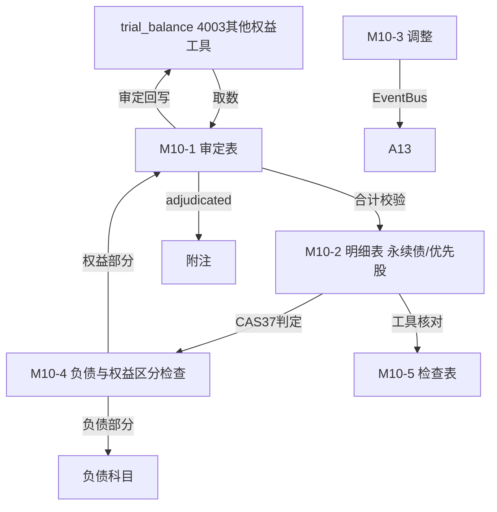

# Design Document: M10 其他权益工具底稿专属HTML精美组件

## Overview

M10其他权益工具底稿专属组件`m10-other-equity-instruments`。M股东权益循环底稿（1个xlsx源模板/10有效sheet含1个Q10A修订前skip/~60+公式）。科目4003其他权益工具（**贷方/权益类！**）。

核心架构：
- componentType `m10-other-equity-instruments`，主入口 GtM10OtherEquityInstruments.vue
- **无内部el-tabs**：接收`sheetName` prop用`v-if`分发
- composable分层：useM10FormData + useM10FormulaEngine(纯函数) + useM10ClassificationEngine(纯函数) + useM10CrossSheet + useM10DualMode + useM10ImportExport
- **权益类贷方科目**：期末=期初+贷方-借方
- **CAS37负债权益区分**：永续债/优先股按合同义务判定分类
- EventBus联动：TB回写(4003) + 负债权益区分(负债部分→负债科目) + 附注

## Architecture

### sheetName分发模式

```
sheetName → regex提取编码 → v-if匹配 → 子组件渲染
                                     ↘ 未匹配/Q10A修订前 → OnlyOffice fallback或跳过
```

### 文件结构

```
audit-platform/frontend/src/components/workpaper/
├── GtM10OtherEquityInstruments.vue          # 主入口 sheetName v-if分发（lazy）
├── m10/
│   ├── core/
│   │   ├── M10TabIndex.vue                   # 底稿目录
│   │   ├── M10TabAdjudication.vue            # M10-1 审定表（权益类贷方+按工具类型）
│   │   ├── M10TabDetail.vue                  # M10-2 明细表（30列区段Tab 永续债/优先股）
│   │   ├── M10TabAdjustment.vue              # M10-3 调整分录（借贷平衡）
│   │   ├── M10TabDisclosureListed.vue        # 附注上市
│   │   └── M10TabDisclosureSoe.vue           # 附注国企
│   └── inspection/
│       ├── M10TabClassificationCheck.vue     # M10-4 负债与权益区分检查（CAS37，64×8）
│       └── M10TabInstrumentCheck.vue         # M10-5 其他权益工具检查表
├── composables/
│   ├── useM10FormData.ts                     # selfLoad/writebackTB(4003)
│   ├── useM10FormulaEngine.ts                # 纯函数公式引擎（权益类！贷方公式）
│   ├── useM10ClassificationEngine.ts         # 纯函数负债权益区分引擎（CAS37）
│   ├── useM10CrossSheet.ts                   # 跨sheet + 负债科目联动
│   ├── useM10DualMode.ts
│   ├── useM10ImportExport.ts
│   ├── useM10Adjudication.ts
│   ├── useM10Detail.ts
│   ├── useM10ClassificationCheck.ts
│   ├── useM10InstrumentCheck.ts
│   └── useM10Adjustment.ts
```

### 后端文件结构

```
audit-platform/backend/
├── app/workpaper_engine/renderers/
│   └── m10_other_equity_instruments_renderer.py
├── app/routers/
│   └── m10_other_equity_instruments.py       # 3端点 + 负债权益区分API
├── app/services/
│   └── m10_other_equity_instruments_service.py  # CAS37分类判定
└── data/wp_render_schema/
    └── m10-other-equity-instruments.yaml
```

## Composable接口设计

### useM10FormulaEngine.ts（权益类！）

```typescript
export function calcAuditedAmount(unadj: number, aje: number, rje: number): number
// 权益类期末：期末=期初+贷方-借方
export function calcEquityEndBalance(begin: number, credit: number, debit: number): number
export function calcSubtotal(arr: number[]): number
```

### useM10ClassificationEngine.ts（纯函数，CAS37）

```typescript
// 有交付现金/金融资产的合同义务→金融负债；无→权益工具
export function classifyInstrument(hasContractualObligation: boolean): 'equity' | 'liability'
// 负债部分=总额-权益部分
export function splitAmount(total: number, equityPart: number): number
// 分类一致性：权益+负债===总额
export function calcClassificationConsistency(equity: number, liability: number, total: number): boolean
```

### useM10CrossSheet.ts

```typescript
export function useM10CrossSheet(allResponses: Ref<Map<string, any>>) {
  const adjudicationVsDetail: ComputedRef<{ diff: number; isMatch: boolean }>
  const classificationConsistency: ComputedRef<{ isConsistent: boolean }>
}
```

## 数据流图



## ADR

### ADR-1: M10是权益类贷方科目
M10其他权益工具是权益类科目（贷方余额），期末=期初+贷方-借方。发行时贷方增加，赎回/转换时借方减少。

### ADR-2: 负债与权益区分是核心（CAS37）
永续债、优先股等金融工具需按CAS37《金融工具列报》判定分类为权益工具或金融负债。关键判定：发行方是否存在交付现金/其他金融资产的合同义务，是否强制付息，是否有到期赎回义务。无合同义务→权益工具（计入M10 4003）；有合同义务→金融负债（计入负债科目）。M10-4逐条判定是本底稿最核心程序。

### ADR-3: 权益+负债金额守恒
一项复合金融工具可能拆分为权益部分与负债部分，两者之和等于工具总额。M10-4校验分类金额守恒，防止拆分错误。

## Correctness Properties

| ID | Property | 验证方法 |
|----|----------|---------|
| P1 | ∀ u,a,r: calcAuditedAmount = u+a+r | PBT |
| P2 | ∀ b,cr,dr: calcEquityEndBalance = b+cr-dr（权益类！） | PBT |
| P3 | ∀ obligation: classifyInstrument = obligation?'liability':'equity' | PBT |
| P4 | ∀ total,eq: splitAmount = total-eq | PBT |
| P5 | ∀ eq,liab,total: calcClassificationConsistency ⟺ eq+liab===total | PBT |
| P6 | ∀ arr: calcSubtotal = Σarr | PBT |

## 错误处理

| 场景 | 处理方式 |
|------|---------|
| selfLoad失败 | el-empty+重试 |
| TB无科目4003 | 提示导入试算表 |
| 判定为负债 | 黄色提示"应计入负债科目而非权益" |
| 权益+负债≠总额 | 红色警告+差额 |
| 分类判定要素缺失 | 黄色提示补充CAS37判定要素 |
| 明细合计≠审定 | 红色警告+差额 |
