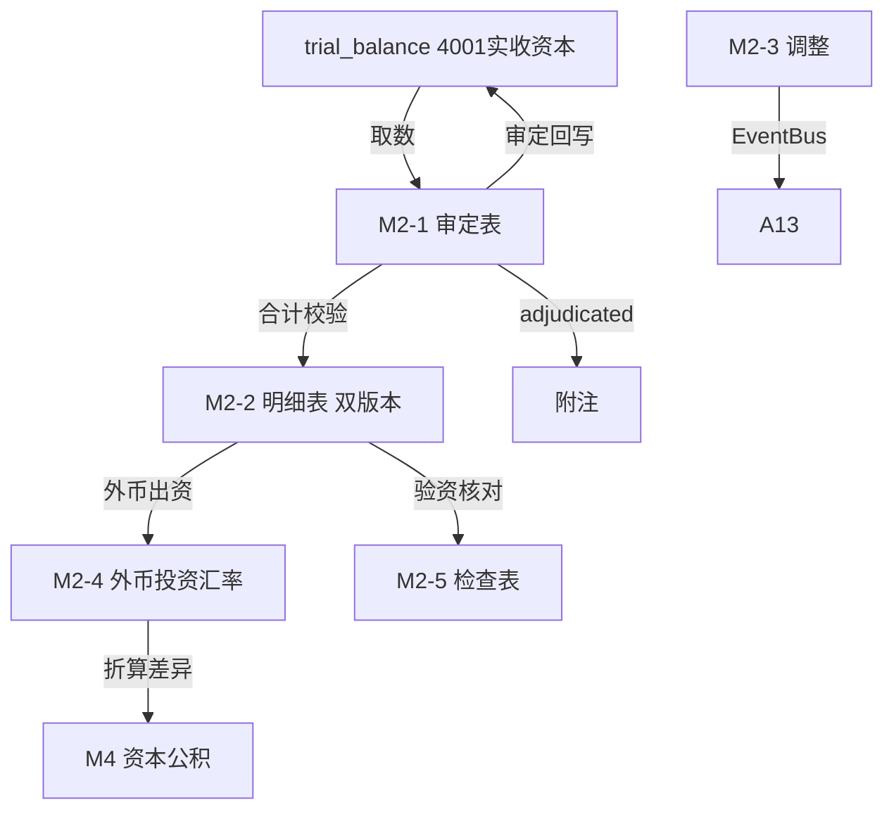

# Design Document: M2 实收资本（股本）底稿专属HTML精美组件

## Overview

M2实收资本（股本）底稿专属组件`m2-paid-in-capital`。M股东权益循环底稿（1个xlsx源模板/11有效sheet/~130+公式）。科目4001实收资本/股本（**贷方/权益类！**）。

核心架构：
- componentType `m2-paid-in-capital`，主入口 GtM2PaidInCapital.vue
- **无内部el-tabs**：接收`sheetName` prop用`v-if`分发
- composable分层：useM2FormData + useM2FormulaEngine(纯函数) + useM2FxEngine(纯函数) + useM2VerifyEngine(纯函数) + useM2CrossSheet + useM2DualMode + useM2ImportExport
- **权益类贷方科目**：期末=期初+贷方-借方（增资在贷方，减资在借方）
- **上市/非上市双版本明细**用分支选择器（el-segmented）
- EventBus联动：TB回写(4001) + 验资核对 + 外币投资折算(差异→M4资本公积) + 附注

## Architecture

### sheetName分发模式

```
sheetName → regex提取编码 → v-if匹配 → 子组件渲染
                                     ↘ 未匹配 → OnlyOffice fallback
```

### M2-2 明细分支选择器

```
el-segmented v-model="detailBranch"
  ├── "上市公司版"   → M2TabDetailListed.vue（38×36 股份）
  └── "非上市公司版" → M2TabDetailUnlisted.vue（37×24 出资）
```

### 文件结构

```
audit-platform/frontend/src/components/workpaper/
├── GtM2PaidInCapital.vue                    # 主入口 sheetName v-if分发（lazy）
├── m2/
│   ├── core/
│   │   ├── M2TabIndex.vue                    # 底稿目录
│   │   ├── M2TabAdjudication.vue             # M2-1 审定表（权益类贷方）
│   │   ├── M2TabDetail.vue                   # M2-2 明细表（分支选择器容器）
│   │   ├── M2TabDetailListed.vue             # M2-2 上市公司版（38×36）
│   │   ├── M2TabDetailUnlisted.vue           # M2-2 非上市公司版（37×24）
│   │   ├── M2TabAdjustment.vue               # M2-3 调整分录（借贷平衡）
│   │   ├── M2TabDisclosureListed.vue         # 附注上市
│   │   └── M2TabDisclosureSoe.vue            # 附注国企
│   ├── calc/
│   │   └── M2TabFxInvest.vue                 # M2-4 外币投资汇率测算（13公式）
│   └── inspection/
│       └── M2TabCapitalCheck.vue             # M2-5 检查表（含验资核对）
├── composables/
│   ├── useM2FormData.ts                      # selfLoad/writebackTB(4001)
│   ├── useM2FormulaEngine.ts                 # 纯函数公式引擎（权益类！贷方公式）
│   ├── useM2FxEngine.ts                      # 纯函数外币投资折算引擎
│   ├── useM2VerifyEngine.ts                  # 纯函数验资核对引擎
│   ├── useM2CrossSheet.ts                    # 跨sheet + M4联动
│   ├── useM2DualMode.ts
│   ├── useM2ImportExport.ts
│   ├── useM2Adjudication.ts
│   ├── useM2Detail.ts                        # 双版本分支状态
│   ├── useM2CapitalCheck.ts
│   └── useM2Adjustment.ts
```

### 后端文件结构

```
audit-platform/backend/
├── app/workpaper_engine/renderers/
│   └── m2_paid_in_capital_renderer.py
├── app/routers/
│   └── m2_paid_in_capital.py                 # 3端点 + 外币折算/验资核对API
├── app/services/
│   └── m2_paid_in_capital_service.py         # 外币折算+验资核对
└── data/wp_render_schema/
    └── m2-paid-in-capital.yaml
```

## Composable接口设计

### useM2FormulaEngine.ts（权益类！）

```typescript
export function calcAuditedAmount(unadj: number, aje: number, rje: number): number
// 权益类期末：期末=期初+贷方-借方
export function calcEquityEndBalance(begin: number, credit: number, debit: number): number
export function calcSubtotal(arr: number[]): number
```

### useM2FxEngine.ts（纯函数）

```typescript
export function calcFxConverted(amount: number, rate: number): number  // 原币×汇率
export function calcFxDiff(converted: number, booked: number): number   // 折算-账面
```

### useM2VerifyEngine.ts（纯函数）

```typescript
export function calcVerifyDiff(paid: number, verified: number): number      // 实缴-验资
export function calcPaidInRate(paid: number, subscribed: number): number    // 实缴/认缴
```

### useM2CrossSheet.ts

```typescript
export function useM2CrossSheet(allResponses: Ref<Map<string, any>>) {
  const adjudicationVsDetail: ComputedRef<{ diff: number; isMatch: boolean }>
  const detailBranch: Ref<'listed' | 'unlisted'>
}
```

## 数据流图



## ADR

### ADR-1: M2是权益类贷方科目
M2实收资本是权益类科目（贷方余额），期末=期初+贷方-借方。增资时贷方增加，减资时借方减少。M股东权益循环M2/M4/M5/M6/M7/M8/M9/M10均为权益类贷方（M3库存股为权益备抵借方，M1应付股利为负债贷方）。

### ADR-2: 上市/非上市明细双版本用分支选择器
上市公司按股份（股数×比例）列示，非上市公司按出资（金额×比例）列示，结构差异大。采用el-segmented分支选择器切换两个独立子组件，而非合并成一张表，保持各自结构清晰。

### ADR-3: 验资是实收资本的核心程序
实收资本的存在与准确性认定依赖验资核对：将账面实缴出资与验资报告金额对比。出资到位率<100%需关注认缴未实缴风险。

### ADR-4: 外币出资折算差异计入资本公积
外币出资按出资日汇率折算，与账面差异计入资本公积（M4），M2-4折算差异联动M4。

## Correctness Properties

| ID | Property | 验证方法 |
|----|----------|---------|
| P1 | ∀ u,a,r: calcAuditedAmount = u+a+r | PBT |
| P2 | ∀ b,cr,dr: calcEquityEndBalance = b+cr-dr（权益类！） | PBT |
| P3 | ∀ amt,rate: calcFxConverted = amt×rate | PBT |
| P4 | ∀ conv,booked: calcFxDiff = conv-booked | PBT |
| P5 | ∀ paid,verified: calcVerifyDiff = paid-verified | PBT |
| P6 | ∀ paid,sub(sub≠0): calcPaidInRate = paid/sub | PBT |
| P7 | ∀ arr: calcSubtotal = Σarr | PBT |

## 错误处理

| 场景 | 处理方式 |
|------|---------|
| selfLoad失败 | el-empty+重试 |
| TB无科目4001 | 提示导入试算表 |
| 折算差异>阈值 | 红色高亮+提示计入M4 |
| 验资差异>阈值 | 红色高亮+要求填写说明 |
| 出资到位率<100% | 黄色提示认缴未实缴风险 |
| 明细合计≠审定 | 红色警告+差额 |
| 分支切换 | 保留各版本独立数据，不互相覆盖 |
