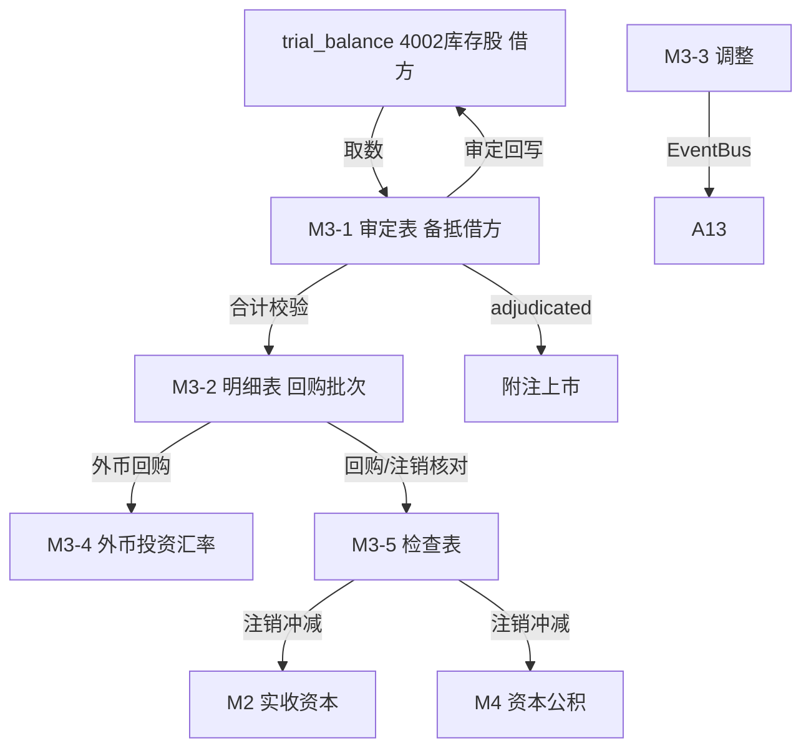

# Design Document: M3 库存股底稿专属HTML精美组件

## Overview

M3库存股底稿专属组件`m3-treasury-stock`。M股东权益循环底稿（1个xlsx源模板/有效sheet含1个会计规定辅助skip/~90+公式）。科目4002库存股（**借方/权益备抵类！**）。

核心架构：
- componentType `m3-treasury-stock`，主入口 GtM3TreasuryStock.vue
- **无内部el-tabs**：接收`sheetName` prop用`v-if`分发
- composable分层：useM3FormData + useM3FormulaEngine(纯函数) + useM3FxEngine(纯函数) + useM3TreasuryEngine(纯函数) + useM3CrossSheet + useM3DualMode + useM3ImportExport
- **权益备抵类借方科目**：期末=期初+借方-贷方（回购在借方，注销/再售在贷方，与其他M权益类方向相反！）
- EventBus联动：TB回写(4002) + 回购/注销核对(冲减M2/M4) + 外币折算 + 附注

## Architecture

### sheetName分发模式

```
sheetName → regex提取编码 → v-if匹配 → 子组件渲染
                                     ↘ 未匹配/会计规定辅助 → OnlyOffice fallback或跳过
```

### 文件结构

```
audit-platform/frontend/src/components/workpaper/
├── GtM3TreasuryStock.vue                    # 主入口 sheetName v-if分发（lazy）
├── m3/
│   ├── core/
│   │   ├── M3TabIndex.vue                    # 底稿目录
│   │   ├── M3TabAdjudication.vue             # M3-1 审定表（权益备抵借方！标注提示）
│   │   ├── M3TabDetail.vue                   # M3-2 明细表（19列区段Tab）
│   │   ├── M3TabAdjustment.vue               # M3-3 调整分录（借贷平衡）
│   │   └── M3TabDisclosureListed.vue         # 附注上市
│   ├── calc/
│   │   └── M3TabFxInvest.vue                 # M3-4 外币投资汇率测算
│   └── inspection/
│       └── M3TabTreasuryCheck.vue            # M3-5 检查表（回购/注销核对）
├── composables/
│   ├── useM3FormData.ts                      # selfLoad/writebackTB(4002)
│   ├── useM3FormulaEngine.ts                 # 纯函数公式引擎（备抵借方！）
│   ├── useM3FxEngine.ts                      # 纯函数外币折算引擎
│   ├── useM3TreasuryEngine.ts                # 纯函数回购/注销引擎
│   ├── useM3CrossSheet.ts                    # 跨sheet + M2/M4联动
│   ├── useM3DualMode.ts
│   ├── useM3ImportExport.ts
│   ├── useM3Adjudication.ts
│   ├── useM3Detail.ts
│   ├── useM3TreasuryCheck.ts
│   └── useM3Adjustment.ts
```

### 后端文件结构

```
audit-platform/backend/
├── app/workpaper_engine/renderers/
│   └── m3_treasury_stock_renderer.py
├── app/routers/
│   └── m3_treasury_stock.py                  # 3端点 + 外币折算/回购注销API
├── app/services/
│   └── m3_treasury_stock_service.py          # 外币折算+回购注销核对
└── data/wp_render_schema/
    └── m3-treasury-stock.yaml
```

## Composable接口设计

### useM3FormulaEngine.ts（备抵借方！）

```typescript
export function calcAuditedAmount(unadj: number, aje: number, rje: number): number
// 权益备抵类期末（借方！）：期末=期初+借方-贷方
export function calcContraEquityEndBalance(begin: number, debit: number, credit: number): number
export function calcSubtotal(arr: number[]): number
```

### useM3FxEngine.ts（纯函数）

```typescript
export function calcFxConverted(amount: number, rate: number): number  // 原币×汇率
export function calcFxDiff(converted: number, booked: number): number   // 折算-账面
```

### useM3TreasuryEngine.ts（纯函数）

```typescript
export function calcRepurchaseAmount(shares: number, price: number): number  // 股数×单价
// 注销冲减差额=注销金额-冲减实收资本-冲减资本公积
export function calcCancelDiff(cancelAmount: number, deductCapital: number, deductReserve: number): number
```

### useM3CrossSheet.ts

```typescript
export function useM3CrossSheet(allResponses: Ref<Map<string, any>>) {
  const adjudicationVsDetail: ComputedRef<{ diff: number; isMatch: boolean }>
}
```

## 数据流图



## ADR

### ADR-1: M3库存股是权益备抵借方科目（铁律！）
库存股（4002）是**所有者权益的备抵科目**，在资产负债表所有者权益项下以**负数（借方余额）**列示。**期末=期初+借方-贷方**：回购股份时借方增加库存股，注销/再出售时贷方减少库存股。这与M2/M4/M5/M6等权益类（贷方增加）方向**完全相反**，是M3的核心铁律，公式引擎与UI必须显著区分。

### ADR-2: 回购与注销是核心业务
库存股来源于股份回购（借记库存股，贷记银行存款）。注销时冲减实收资本（按面值）和资本公积（差额），差额不足冲减盈余公积/未分配利润。M3-5核对注销冲减联动M2/M4。

### ADR-3: 外币回购折算独立引擎
境外回购以外币计价，按回购日汇率折算，M3-4独立外币引擎。

## Correctness Properties

| ID | Property | 验证方法 |
|----|----------|---------|
| P1 | ∀ u,a,r: calcAuditedAmount = u+a+r | PBT |
| P2 | ∀ b,dr,cr: calcContraEquityEndBalance = b+dr-cr（**备抵借方！**） | PBT |
| P3 | ∀ shares,price: calcRepurchaseAmount = shares×price | PBT |
| P4 | ∀ ca,dc,dr: calcCancelDiff = ca-dc-dr | PBT |
| P5 | ∀ amt,rate: calcFxConverted = amt×rate | PBT |
| P6 | ∀ arr: calcSubtotal = Σarr | PBT |

## 错误处理

| 场景 | 处理方式 |
|------|---------|
| selfLoad失败 | el-empty+重试 |
| TB无科目4002 | 提示导入试算表 |
| 方向混淆 | UI强制标注"备抵借方"，公式引擎独立函数防误用 |
| 折算差异>阈值 | 红色高亮 |
| 注销冲减差额≠0 | 红色警告+提示冲减盈余公积/未分配利润 |
| 明细合计≠审定 | 红色警告+差额 |
