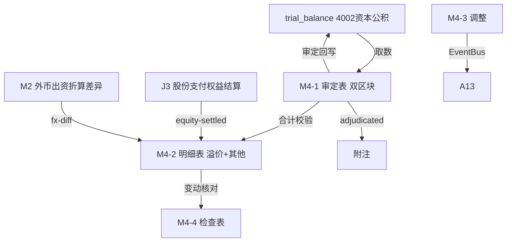

# Design Document: M4 资本公积底稿专属HTML精美组件

## Overview

M4资本公积底稿专属组件`m4-capital-reserve`。M股东权益循环底稿（1个xlsx源模板/9有效sheet/~90+公式）。科目4002资本公积（**贷方/权益类！**）。

核心架构：
- componentType `m4-capital-reserve`，主入口 GtM4CapitalReserve.vue
- **无内部el-tabs**：接收`sheetName` prop用`v-if`分发
- composable分层：useM4FormData + useM4FormulaEngine(纯函数) + useM4ReserveEngine(纯函数) + useM4CrossSheet + useM4DualMode + useM4ImportExport
- **权益类贷方科目**：期末=期初+贷方-借方
- **双区块**：资本溢价(股本溢价) + 其他资本公积
- EventBus联动：TB回写(4002资本公积) + **接收J3股份支付权益结算** + 接收M2外币折算差异 + 附注

## Architecture

### sheetName分发模式

```
sheetName → regex提取编码 → v-if匹配 → 子组件渲染
                                     ↘ 未匹配 → OnlyOffice fallback
```

### 文件结构

```
audit-platform/frontend/src/components/workpaper/
├── GtM4CapitalReserve.vue                   # 主入口 sheetName v-if分发（lazy）
├── m4/
│   ├── core/
│   │   ├── M4TabIndex.vue                    # 底稿目录
│   │   ├── M4TabAdjudication.vue             # M4-1 审定表（双区块：资本溢价+其他资本公积）
│   │   ├── M4TabDetail.vue                   # M4-2 明细表（24列区段Tab）
│   │   ├── M4TabAdjustment.vue               # M4-3 调整分录（借贷平衡）
│   │   ├── M4TabDisclosureListed.vue         # 附注上市
│   │   └── M4TabDisclosureSoe.vue            # 附注国企
│   └── inspection/
│       └── M4TabReserveCheck.vue             # M4-4 检查表
├── composables/
│   ├── useM4FormData.ts                      # selfLoad/writebackTB(4002资本公积)
│   ├── useM4FormulaEngine.ts                 # 纯函数公式引擎（权益类！贷方公式）
│   ├── useM4ReserveEngine.ts                 # 纯函数资本公积变动引擎（接收J3）
│   ├── useM4CrossSheet.ts                    # 跨sheet + J3/M2联动
│   ├── useM4DualMode.ts
│   ├── useM4ImportExport.ts
│   ├── useM4Adjudication.ts
│   ├── useM4Detail.ts
│   ├── useM4ReserveCheck.ts
│   └── useM4Adjustment.ts
```

### 后端文件结构

```
audit-platform/backend/
├── app/workpaper_engine/renderers/
│   └── m4_capital_reserve_renderer.py
├── app/routers/
│   └── m4_capital_reserve.py                 # 3端点 + 资本公积变动API
├── app/services/
│   └── m4_capital_reserve_service.py         # 资本公积汇总+股份支付核对
└── data/wp_render_schema/
    └── m4-capital-reserve.yaml
```

## Composable接口设计

### useM4FormulaEngine.ts（权益类！）

```typescript
export function calcAuditedAmount(unadj: number, aje: number, rje: number): number
// 权益类期末：期末=期初+贷方-借方
export function calcEquityEndBalance(begin: number, credit: number, debit: number): number
export function calcSubtotal(arr: number[]): number
```

### useM4ReserveEngine.ts（纯函数）

```typescript
// 股份支付确认差异=J3确认金额-账面增加
export function calcShareBasedDiff(j3Amount: number, booked: number): number
// 资本溢价+其他资本公积汇总
export function aggregateReserve(details: ReserveDetail[]): { premium: number; other: number; total: number }
```

### useM4CrossSheet.ts

```typescript
export function useM4CrossSheet(allResponses: Ref<Map<string, any>>) {
  const adjudicationVsDetail: ComputedRef<{ diff: number; isMatch: boolean }>
  const shareBasedVsJ3: ComputedRef<{ diff: number; isConsistent: boolean }>
}
```

## 数据流图



## ADR

### ADR-1: M4是权益类贷方科目
M4资本公积是权益类科目（贷方余额），期末=期初+贷方-借方。资本公积来源包括资本溢价（出资超面值）、其他资本公积（股份支付、外币折算差异等）。

### ADR-2: 资本公积是权益变动的汇聚点
资本公积接收多个来源：J3股份支付权益结算（等待期确认计入其他资本公积）、M2外币出资折算差异（计入资本溢价）。M4-2按来源分区段列示，检查表核对与来源底稿的一致性。

### ADR-3: 资本溢价与其他资本公积分区块
资本溢价（股本溢价）与其他资本公积在会计与披露上性质不同，审定表与明细表均分两区块，防止混淆。

## Correctness Properties

| ID | Property | 验证方法 |
|----|----------|---------|
| P1 | ∀ u,a,r: calcAuditedAmount = u+a+r | PBT |
| P2 | ∀ b,cr,dr: calcEquityEndBalance = b+cr-dr（权益类！） | PBT |
| P3 | ∀ j3,booked: calcShareBasedDiff = j3-booked | PBT |
| P4 | ∀ details: aggregateReserve.total = premium+other | PBT |
| P5 | ∀ arr: calcSubtotal = Σarr | PBT |
| P6 | ∀ details: aggregateReserve 各分类之和 = 总额 | PBT |

## 错误处理

| 场景 | 处理方式 |
|------|---------|
| selfLoad失败 | el-empty+重试 |
| TB无科目4002资本公积 | 提示导入试算表 |
| J3股份支付未就绪 | 黄色提示"待J3股份支付确认" |
| 股份支付确认差异>阈值 | 红色高亮+要求说明 |
| 明细合计≠审定 | 红色警告+差额 |
