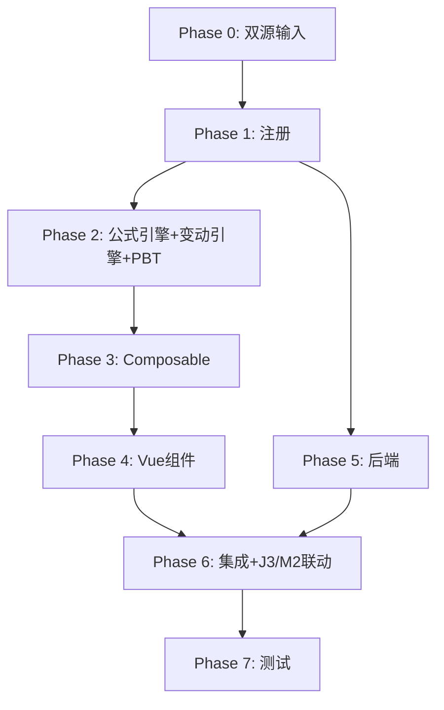

# Implementation Plan: M4 资本公积底稿专属HTML精美组件

## Overview

M4资本公积底稿专属组件`m4-capital-reserve`（9 sheet/1 xlsx/~90+公式）。

主入口 GtM4CapitalReserve.vue（sheetName v-if，lazy）+ 7个子组件 + 10个composable + 后端3个py文件。

科目：4002资本公积（贷方/权益类）
公式特征：**权益类贷方**期末=期初+贷方-借方；资本溢价+其他资本公积双区块；接收J3股份支付+M2外币折算差异

## Tasks

### Phase 0: 双源输入验证

- [x] 0.1 openpyxl脚本读取M4资本公积.xlsx全部9 sheet
  - 提取结构 + 确认审定表M4-1（41公式）+明细M4-2（50×24，31公式）
  - 产出：m4_structure_summary.json
  - _Requirements: 双源输入流程_

- [x] 0.2 M股东权益循环底稿模板库md交叉验证
  - 核对：权益类方向/资本溢价+其他资本公积/J3-M2联动
  - 产出：m4_conflict_resolution.md
  - _Requirements: 双源输入流程_

### Phase 1: 注册+契约测试

- [x] 1.1 注册componentType和映射
  - wp_code_overrides: M4/M4-1~M4-4/M4A → 'm4-capital-reserve'
  - VALID_COMPONENT_TYPES + htmlRendererRegistry注册
  - 创建 GtM4CapitalReserve.vue 骨架（sheetName v-if + selfLoad）
  - _Requirements: 1.1-1.11_

- [x] 1.2 编写注册契约测试
  - htmlRendererRegistry / VALID_COMPONENT_TYPES / wp_code_overrides / RENDERER_DISPATCH
  - _Requirements: 1.6, 1.7, 1.8_

### Phase 2: 公式引擎+变动引擎+PBT

- [x] 2.1 创建 `useM4FormulaEngine.ts`（权益类！）
  - calcAuditedAmount / calcEquityEndBalance(b,cr,dr)=b+cr-dr / calcSubtotal
  - _Requirements: 2.3-2.4, 6.3_

- [x] 2.2 创建 `useM4ReserveEngine.ts`
  - calcShareBasedDiff / aggregateReserve
  - _Requirements: 4.3, 6.1-6.2_

- [x]* 2.3 编写 Property P1 PBT：审定数公式链
  - 断言：calcAuditedAmount(u, a, r) === u + a + r
  - **Feature: m4-capital-reserve, Property P1: 审定数公式链**

- [x]* 2.4 编写 Property P2 PBT：权益类期末（贷方！）
  - 生成器：fc.float({min:0, max:1e9}) × 3
  - 断言：calcEquityEndBalance(b, cr, dr) === b + cr - dr
  - **Feature: m4-capital-reserve, Property P2: 权益类贷方期末余额**

- [x]* 2.5 编写 Property P3 PBT：股份支付确认差异
  - 断言：calcShareBasedDiff(j3, booked) === j3 - booked
  - **Feature: m4-capital-reserve, Property P3: 股份支付确认差异**

- [x]* 2.6 编写 Property P4 PBT：资本公积汇总
  - 断言：aggregateReserve.total === premium + other
  - **Feature: m4-capital-reserve, Property P4: 资本公积汇总**

- [x]* 2.7 编写 Property P5 PBT：小计求和
  - 断言：calcSubtotal(arr) === Σarr
  - **Feature: m4-capital-reserve, Property P5: 分类小计**

- [x]* 2.8 编写 Property P6 PBT：按分类汇总守恒
  - 断言：Σ aggregateReserve各分类 === Σ details.amount
  - **Feature: m4-capital-reserve, Property P6: 按分类汇总守恒**

### Phase 3: Composable层

- [x] 3.1 创建 useM4FormData.ts
  - selfLoad + checklist_responses + writebackTB(4002资本公积)
  - _Requirements: 1.9, 1.10, 2.6_

- [x] 3.2 创建 useM4CrossSheet.ts
  - adjudicationVsDetail / shareBasedVsJ3
  - _Requirements: 2.5, 4.1-4.6_

- [x] 3.3 创建 useM4DualMode.ts + useM4ImportExport.ts
  - _Requirements: 6.4, 6.5_

- [x] 3.4 创建 sheet-specific composables
  - useM4Adjudication / useM4Detail / useM4ReserveCheck / useM4Adjustment
  - _Requirements: 2~5 全部_

### Phase 4: Vue子组件

- [x] 4.1 创建 M4TabIndex.vue 底稿目录
  - _Requirements: 1.2_

- [x] 4.2 创建 M4TabAdjudication.vue 审定表M4-1
  - 双区块(资本溢价+其他资本公积)+TB回写
  - _Requirements: 2.1-2.7_

- [x] 4.3 创建 M4TabDetail.vue 明细表M4-2
  - 24列区段Tab(资本溢价/其他)+31公式+接收J3/M2+动态行+导入导出
  - _Requirements: 3.1-3.6, 4.1-4.6_

- [x] 4.4 创建 M4TabReserveCheck.vue 检查表M4-4
  - 核对清单+结论区+AI辅助
  - _Requirements: 5.1-5.2_

- [x] 4.5 创建 M4TabAdjustment.vue + M4TabDisclosureListed/Soe.vue
  - 调整借贷平衡 + 附注上市/国企切换
  - _Requirements: 5.3-5.5_

### Phase 5: 后端

- [x] 5.1 创建 m4_capital_reserve_renderer.py
  - RENDERER_DISPATCH注册 + 权益类公式验证
  - _Requirements: 1.6_

- [x] 5.2 创建 m4_capital_reserve.py 路由
  - 导出模板/导出数据/导入数据 + 资本公积变动API
  - _Requirements: 6.5_

- [x] 5.3 创建 m4_capital_reserve_service.py
  - 资本公积汇总+股份支付核对
  - _Requirements: 4.3, 6.1-6.2_

### Phase 6: 集成

- [x] 6.1 EventBus集成
  - publish 'substantive:adjudicated' / 'adjustment:created'
  - subscribe 'j3:equity-settled' / 'm2:fx-diff' + 附注刷新
  - _Requirements: 2.6, 4.1, 4.5_

- [x] 6.2 跨底稿联动
  - J3股份支付权益结算 → M4其他资本公积（cross_wp_ref + GtIndexChip）
  - M2外币折算差异 → M4资本溢价
  - M4审定 → TB回写(4002资本公积)
  - _Requirements: 4.1-4.6_

- [x] 6.3 版本链+复核对话集成
  - useVersionTrail(autoSnapshot) + provide openReviewDialog
  - _Requirements: 6.6_

### Phase 7: 测试

- [x] 7.1 单元测试：useM4FormulaEngine + useM4ReserveEngine
  - 权益类方向 + 股份支付差异 + 资本公积汇总
  - _Requirements: P1-P6_

- [x] 7.2 集成测试：J3→M4 + M2→M4 + 审定回写
  - _Requirements: 4.1-4.6_

- [x] 7.3 Playwright E2E
  - 完整流程：打开M4→审定(双区块)→明细→J3联动核对→检查表→保存
  - _Requirements: 全部_

## Task Dependency Graph

