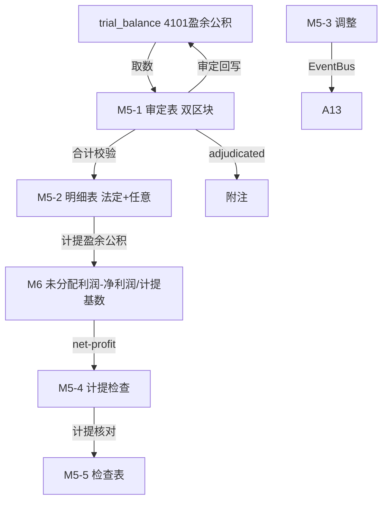

# Design Document: M5 盈余公积底稿专属HTML精美组件

## Overview

M5盈余公积底稿专属组件`m5-surplus-reserve`。M股东权益循环底稿（1个xlsx源模板/10有效sheet/~80+公式）。科目4101盈余公积（**贷方/权益类！**）。

核心架构：
- componentType `m5-surplus-reserve`，主入口 GtM5SurplusReserve.vue
- **无内部el-tabs**：接收`sheetName` prop用`v-if`分发
- composable分层：useM5FormData + useM5FormulaEngine(纯函数) + useM5AccrualEngine(纯函数) + useM5CrossSheet + useM5DualMode + useM5ImportExport
- **权益类贷方科目**：期末=期初+贷方-借方
- **双区块**：法定盈余公积 + 任意盈余公积
- EventBus联动：TB回写(4101) + **接收M6未分配利润(计提基数)** + 任意盈余公积计提联动M6 + 附注

## Architecture

### sheetName分发模式

```
sheetName → regex提取编码 → v-if匹配 → 子组件渲染
                                     ↘ 未匹配 → OnlyOffice fallback
```

### 文件结构

```
audit-platform/frontend/src/components/workpaper/
├── GtM5SurplusReserve.vue                   # 主入口 sheetName v-if分发（lazy）
├── m5/
│   ├── core/
│   │   ├── M5TabIndex.vue                    # 底稿目录
│   │   ├── M5TabAdjudication.vue             # M5-1 审定表（双区块：法定+任意）
│   │   ├── M5TabDetail.vue                   # M5-2 明细表（法定+任意）
│   │   ├── M5TabAdjustment.vue               # M5-3 调整分录（借贷平衡）
│   │   ├── M5TabDisclosureListed.vue         # 附注上市
│   │   └── M5TabDisclosureSoe.vue            # 附注国企
│   ├── calc/
│   │   └── M5TabAccrualTest.vue              # M5-4 计提检查（法定10%测试，11公式）
│   └── inspection/
│       └── M5TabReserveCheck.vue             # M5-5 检查表
├── composables/
│   ├── useM5FormData.ts                      # selfLoad/writebackTB(4101)
│   ├── useM5FormulaEngine.ts                 # 纯函数公式引擎（权益类！贷方公式）
│   ├── useM5AccrualEngine.ts                 # 纯函数计提引擎（法定10%，接收M6）
│   ├── useM5CrossSheet.ts                    # 跨sheet + M6/M1联动
│   ├── useM5DualMode.ts
│   ├── useM5ImportExport.ts
│   ├── useM5Adjudication.ts
│   ├── useM5Detail.ts
│   ├── useM5AccrualTest.ts
│   └── useM5Adjustment.ts
```

### 后端文件结构

```
audit-platform/backend/
├── app/workpaper_engine/renderers/
│   └── m5_surplus_reserve_renderer.py
├── app/routers/
│   └── m5_surplus_reserve.py                 # 3端点 + 计提测试API
├── app/services/
│   └── m5_surplus_reserve_service.py         # 法定计提测试+汇总
└── data/wp_render_schema/
    └── m5-surplus-reserve.yaml
```

## Composable接口设计

### useM5FormulaEngine.ts（权益类！）

```typescript
export function calcAuditedAmount(unadj: number, aje: number, rje: number): number
// 权益类期末：期末=期初+贷方-借方
export function calcEquityEndBalance(begin: number, credit: number, debit: number): number
export function calcSubtotal(arr: number[]): number
```

### useM5AccrualEngine.ts（纯函数）

```typescript
// 法定计提=计提基数×10%
export function calcStatutoryAccrual(base: number, rate: number = 0.1): number
// 计提差异=应计提-账面
export function calcAccrualDiff(estimated: number, booked: number): number
// 累计法定盈余公积≥注册资本50%可停止计提
export function isAccrualCeilingReached(accumulated: number, registeredCapital: number): boolean
```

### useM5CrossSheet.ts

```typescript
export function useM5CrossSheet(allResponses: Ref<Map<string, any>>) {
  const adjudicationVsDetail: ComputedRef<{ diff: number; isMatch: boolean }>
  const accrualVsM6: ComputedRef<{ diff: number; isConsistent: boolean }>
}
```

## 数据流图



## ADR

### ADR-1: M5是权益类贷方科目
M5盈余公积是权益类科目（贷方余额），期末=期初+贷方-借方。计提时贷方增加，转增资本/弥补亏损时借方减少。

### ADR-2: 法定盈余公积计提是核心程序
公司制企业按净利润（弥补以前年度亏损后）的10%计提法定盈余公积，累计达注册资本50%时可不再计提。M5-4计提测试接收M6净利润/计提基数，验证计提合规性。

### ADR-3: 盈余公积与利润分配双向联动
M6未分配利润提供计提基数（净利润），M5计提盈余公积后回流影响M6的可供分配利润。M5-M6形成利润分配闭环，M6是分配结转核心。

## Correctness Properties

| ID | Property | 验证方法 |
|----|----------|---------|
| P1 | ∀ u,a,r: calcAuditedAmount = u+a+r | PBT |
| P2 | ∀ b,cr,dr: calcEquityEndBalance = b+cr-dr（权益类！） | PBT |
| P3 | ∀ base: calcStatutoryAccrual = base×0.1 | PBT |
| P4 | ∀ est,booked: calcAccrualDiff = est-booked | PBT |
| P5 | ∀ acc,cap: isAccrualCeilingReached ⟺ acc≥cap×0.5 | PBT |
| P6 | ∀ arr: calcSubtotal = Σarr | PBT |

## 错误处理

| 场景 | 处理方式 |
|------|---------|
| selfLoad失败 | el-empty+重试 |
| TB无科目4101 | 提示导入试算表 |
| M6净利润未就绪 | 黄色提示"待M6净利润确认" |
| 计提差异>阈值 | 红色高亮+要求说明 |
| 累计达注册资本50% | 提示"可不再计提法定盈余公积" |
| 明细合计≠审定 | 红色警告+差额 |
