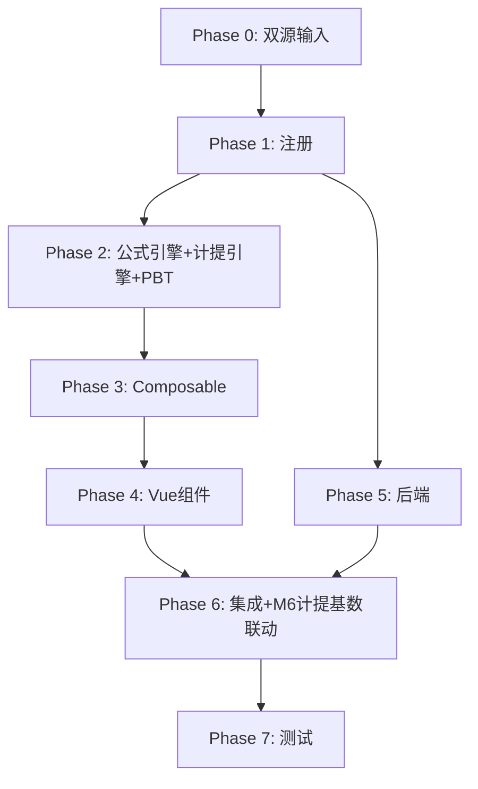

# Implementation Plan: M5 盈余公积底稿专属HTML精美组件

## Overview

M5盈余公积底稿专属组件`m5-surplus-reserve`（10 sheet/1 xlsx/~80+公式）。

主入口 GtM5SurplusReserve.vue（sheetName v-if，lazy）+ 8个子组件 + 10个composable + 后端3个py文件。

科目：4101盈余公积（贷方/权益类）
公式特征：**权益类贷方**期末=期初+贷方-借方；法定盈余公积10%计提测试；接收M6净利润；M5-M6利润分配闭环

## Tasks

### Phase 0: 双源输入验证

- [x] 0.1 openpyxl脚本读取M5盈余公积.xlsx全部10 sheet
  - 提取结构 + 确认审定表M5-1（57公式）+明细M5-2（12公式）+计提检查M5-4（42×9，11公式）
  - 产出：m5_structure_summary.json
  - _Requirements: 双源输入流程_

- [x] 0.2 M股东权益循环底稿模板库md交叉验证
  - 核对：权益类方向/法定10%计提/注册资本50%上限/M6-M1联动
  - 产出：m5_conflict_resolution.md
  - _Requirements: 双源输入流程_

### Phase 1: 注册+契约测试

- [x] 1.1 注册componentType和映射
  - wp_code_overrides: M5/M5-1~M5-5/M5A → 'm5-surplus-reserve'
  - VALID_COMPONENT_TYPES + htmlRendererRegistry注册
  - 创建 GtM5SurplusReserve.vue 骨架（sheetName v-if + selfLoad）
  - _Requirements: 1.1-1.11_

- [x] 1.2 编写注册契约测试
  - htmlRendererRegistry / VALID_COMPONENT_TYPES / wp_code_overrides / RENDERER_DISPATCH
  - _Requirements: 1.6, 1.7, 1.8_

### Phase 2: 公式引擎+计提引擎+PBT

- [x] 2.1 创建 `useM5FormulaEngine.ts`（权益类！）
  - calcAuditedAmount / calcEquityEndBalance(b,cr,dr)=b+cr-dr / calcSubtotal
  - _Requirements: 2.3-2.4, 6.4_

- [x] 2.2 创建 `useM5AccrualEngine.ts`
  - calcStatutoryAccrual(base,0.1) / calcAccrualDiff / isAccrualCeilingReached
  - _Requirements: 4.3-4.5, 6.1-6.3_

- [x]* 2.3 编写 Property P1 PBT：审定数公式链
  - 断言：calcAuditedAmount(u, a, r) === u + a + r
  - **Feature: m5-surplus-reserve, Property P1: 审定数公式链**

- [x]* 2.4 编写 Property P2 PBT：权益类期末（贷方！）
  - 生成器：fc.float({min:0, max:1e9}) × 3
  - 断言：calcEquityEndBalance(b, cr, dr) === b + cr - dr
  - **Feature: m5-surplus-reserve, Property P2: 权益类贷方期末余额**

- [x]* 2.5 编写 Property P3 PBT：法定计提10%
  - 断言：calcStatutoryAccrual(base) === base × 0.1
  - **Feature: m5-surplus-reserve, Property P3: 法定盈余公积10%计提**

- [x]* 2.6 编写 Property P4 PBT：计提差异
  - 断言：calcAccrualDiff(est, booked) === est - booked
  - **Feature: m5-surplus-reserve, Property P4: 计提差异**

- [x]* 2.7 编写 Property P5 PBT：计提上限判断
  - 断言：isAccrualCeilingReached(acc, cap) ⟺ acc ≥ cap × 0.5
  - **Feature: m5-surplus-reserve, Property P5: 注册资本50%计提上限**

- [x]* 2.8 编写 Property P6 PBT：小计求和
  - 断言：calcSubtotal(arr) === Σarr
  - **Feature: m5-surplus-reserve, Property P6: 分类小计**

### Phase 3: Composable层

- [x] 3.1 创建 useM5FormData.ts
  - selfLoad + checklist_responses + writebackTB(4101)
  - _Requirements: 1.9, 1.10, 2.6_

- [x] 3.2 创建 useM5CrossSheet.ts
  - adjudicationVsDetail / accrualVsM6
  - _Requirements: 2.5, 4.2_

- [x] 3.3 创建 useM5DualMode.ts + useM5ImportExport.ts
  - _Requirements: 6.5, 6.6_

- [x] 3.4 创建 sheet-specific composables
  - useM5Adjudication / useM5Detail / useM5AccrualTest / useM5Adjustment
  - _Requirements: 2~5 全部_

### Phase 4: Vue子组件

- [x] 4.1 创建 M5TabIndex.vue 底稿目录
  - _Requirements: 1.2_

- [x] 4.2 创建 M5TabAdjudication.vue 审定表M5-1
  - 双区块(法定+任意)+TB回写
  - _Requirements: 2.1-2.7_

- [x] 4.3 创建 M5TabDetail.vue 明细表M5-2
  - 法定+任意两区段+12公式+动态行+导入导出
  - _Requirements: 3.1-3.5_

- [x] 4.4 创建 M5TabAccrualTest.vue 计提检查M5-4
  - 法定10%计提测试(接收M6)+50%上限判断+11公式
  - _Requirements: 4.1-4.7_

- [x] 4.5 创建 M5TabReserveCheck.vue 检查表M5-5
  - 核对清单+结论区+AI辅助
  - _Requirements: 5.1-5.2_

- [x] 4.6 创建 M5TabAdjustment.vue + M5TabDisclosureListed/Soe.vue
  - 调整借贷平衡 + 附注上市/国企切换
  - _Requirements: 5.3-5.5_

### Phase 5: 后端

- [x] 5.1 创建 m5_surplus_reserve_renderer.py
  - RENDERER_DISPATCH注册 + 权益类公式验证
  - _Requirements: 1.6_

- [x] 5.2 创建 m5_surplus_reserve.py 路由
  - 导出模板/导出数据/导入数据 + 计提测试API
  - _Requirements: 6.6_

- [x] 5.3 创建 m5_surplus_reserve_service.py
  - 法定计提测试+汇总
  - _Requirements: 4.3, 6.1_

### Phase 6: 集成

- [x] 6.1 EventBus集成
  - publish 'substantive:adjudicated' / 'adjustment:created'
  - subscribe 'm6:net-profit' + 附注刷新
  - _Requirements: 2.6, 4.2_

- [x] 6.2 跨底稿联动
  - M6净利润/计提基数 → M5计提测试（cross_wp_ref + GtIndexChip）
  - M5计提盈余公积 → M6可供分配利润
  - M5审定 → TB回写(4101)
  - _Requirements: 4.2_

- [x] 6.3 版本链+复核对话集成
  - useVersionTrail(autoSnapshot) + provide openReviewDialog
  - _Requirements: 6.7_

### Phase 7: 测试

- [x] 7.1 单元测试：useM5FormulaEngine + useM5AccrualEngine
  - 权益类方向 + 法定10%计提 + 50%上限
  - _Requirements: P1-P6_

- [x] 7.2 集成测试：M6→M5计提测试 + M5-M6闭环
  - _Requirements: 4.1-4.7_

- [x] 7.3 Playwright E2E
  - 完整流程：打开M5→审定(双区块)→明细→计提测试→检查表→保存
  - _Requirements: 全部_

## Task Dependency Graph

