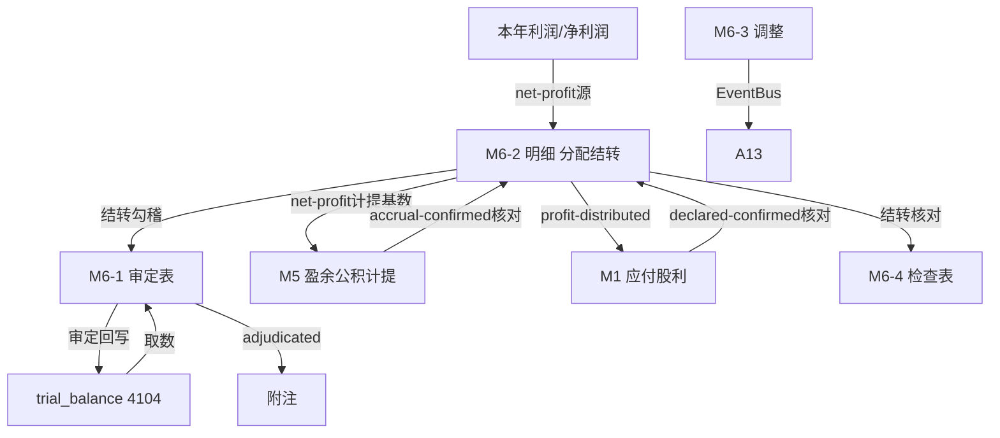

# Design Document: M6 未分配利润底稿专属HTML精美组件

## Overview

M6未分配利润底稿专属组件`m6-retained-earnings`。M股东权益循环底稿（1个xlsx源模板/9有效sheet含1个Q6A修订前skip/~80+公式）。科目4104利润分配-未分配利润（**贷方/权益类！**）。

核心架构：
- componentType `m6-retained-earnings`，主入口 GtM6RetainedEarnings.vue
- **无内部el-tabs**：接收`sheetName` prop用`v-if`分发
- composable分层：useM6FormData + useM6FormulaEngine(纯函数) + useM6DistributionEngine(纯函数，核心！) + useM6CrossSheet + useM6DualMode + useM6ImportExport
- **权益类贷方科目**：期末=期初+贷方-借方
- **利润分配结转核心**：期末未分配利润=期初+本年净利润-提取盈余公积-分配股利
- EventBus联动：TB回写(4104) + **驱动M5盈余公积计提+M1股利分配** + 接收本年利润 + 附注

## Architecture

### sheetName分发模式

```
sheetName → regex提取编码 → v-if匹配 → 子组件渲染
                                     ↘ 未匹配/Q6A修订前 → OnlyOffice fallback或跳过
```

### 文件结构

```
audit-platform/frontend/src/components/workpaper/
├── GtM6RetainedEarnings.vue                 # 主入口 sheetName v-if分发（lazy）
├── m6/
│   ├── core/
│   │   ├── M6TabIndex.vue                    # 底稿目录
│   │   ├── M6TabAdjudication.vue             # M6-1 审定表（权益类贷方）
│   │   ├── M6TabDetail.vue                   # M6-2 明细表（利润分配结转公式链！）
│   │   ├── M6TabAdjustment.vue               # M6-3 调整分录（借贷平衡）
│   │   ├── M6TabDisclosureListed.vue         # 附注上市
│   │   └── M6TabDisclosureSoe.vue            # 附注国企
│   └── inspection/
│       └── M6TabRetainedCheck.vue            # M6-4 检查表
├── composables/
│   ├── useM6FormData.ts                      # selfLoad/writebackTB(4104)
│   ├── useM6FormulaEngine.ts                 # 纯函数公式引擎（权益类！贷方公式）
│   ├── useM6DistributionEngine.ts            # 纯函数利润分配结转引擎（核心！）
│   ├── useM6CrossSheet.ts                    # 跨sheet + M5/M1联动枢纽
│   ├── useM6DualMode.ts
│   ├── useM6ImportExport.ts
│   ├── useM6Adjudication.ts
│   ├── useM6Detail.ts
│   ├── useM6RetainedCheck.ts
│   └── useM6Adjustment.ts
```

### 后端文件结构

```
audit-platform/backend/
├── app/workpaper_engine/renderers/
│   └── m6_retained_earnings_renderer.py
├── app/routers/
│   └── m6_retained_earnings.py               # 3端点 + 利润分配结转API
├── app/services/
│   └── m6_retained_earnings_service.py        # 分配结转+联动核对
└── data/wp_render_schema/
    └── m6-retained-earnings.yaml
```

## Composable接口设计

### useM6FormulaEngine.ts（权益类！）

```typescript
export function calcAuditedAmount(unadj: number, aje: number, rje: number): number
// 权益类期末：期末=期初+贷方-借方
export function calcEquityEndBalance(begin: number, credit: number, debit: number): number
export function calcSubtotal(arr: number[]): number
```

### useM6DistributionEngine.ts（纯函数，核心！）

```typescript
// 利润分配结转核心公式链：期末=期初+本年净利润-提取盈余公积-分配股利
export function calcRetainedEnd(begin: number, netProfit: number, surplusAccrual: number, dividend: number): number
// 可供分配利润=期初+本年净利润
export function calcDistributable(begin: number, netProfit: number): number
// 联动差异=M6值-来源值
export function calcLinkageDiff(m6Value: number, sourceValue: number): number
```

### useM6CrossSheet.ts

```typescript
export function useM6CrossSheet(allResponses: Ref<Map<string, any>>) {
  const adjudicationVsDetail: ComputedRef<{ diff: number; isMatch: boolean }>
  const surplusVsM5: ComputedRef<{ diff: number; isConsistent: boolean }>
  const dividendVsM1: ComputedRef<{ diff: number; isConsistent: boolean }>
}
```

## 数据流图



## ADR

### ADR-1: M6是权益类贷方科目
M6未分配利润是权益类科目（贷方余额），期末=期初+贷方-借方。本年净利润转入时贷方增加，分配（提取盈余公积、宣告股利）时借方减少。

### ADR-2: M6是利润分配结转的枢纽（核心！）
未分配利润是M股东权益循环的结转枢纽。核心公式链：**期末未分配利润=期初未分配利润+本年净利润-提取法定盈余公积-提取任意盈余公积-应付普通股股利**。上游接收本年利润（利润表结转），下游驱动M5盈余公积计提与M1股利分配。M6-2明细表逐行呈现分配全过程并勾稽。

### ADR-3: 双向联动核对防止分配不一致
M6发布净利润/分配额给M5/M1，同时接收M5实际计提、M1实际宣告做反向核对，形成闭环验证。任何一环差异都会红色高亮，确保利润分配全链一致。

## Correctness Properties

| ID | Property | 验证方法 |
|----|----------|---------|
| P1 | ∀ u,a,r: calcAuditedAmount = u+a+r | PBT |
| P2 | ∀ b,cr,dr: calcEquityEndBalance = b+cr-dr（权益类！） | PBT |
| P3 | ∀ b,np,sa,d: calcRetainedEnd = b+np-sa-d（结转核心！） | PBT |
| P4 | ∀ b,np: calcDistributable = b+np | PBT |
| P5 | ∀ m6,src: calcLinkageDiff = m6-src | PBT |
| P6 | ∀ arr: calcSubtotal = Σarr | PBT |
| P7 | calcRetainedEnd = calcDistributable-sa-d（公式链一致性） | PBT |

## 错误处理

| 场景 | 处理方式 |
|------|---------|
| selfLoad失败 | el-empty+重试 |
| TB无科目4104 | 提示导入试算表 |
| 本年利润未就绪 | 黄色提示"待本年利润结转" |
| M5计提差异>阈值 | 红色高亮+核对M5 |
| M1股利差异>阈值 | 红色高亮+核对M1 |
| 结转公式链不勾稽 | 红色警告+定位差异行 |
| 明细合计≠审定 | 红色警告+差额 |
