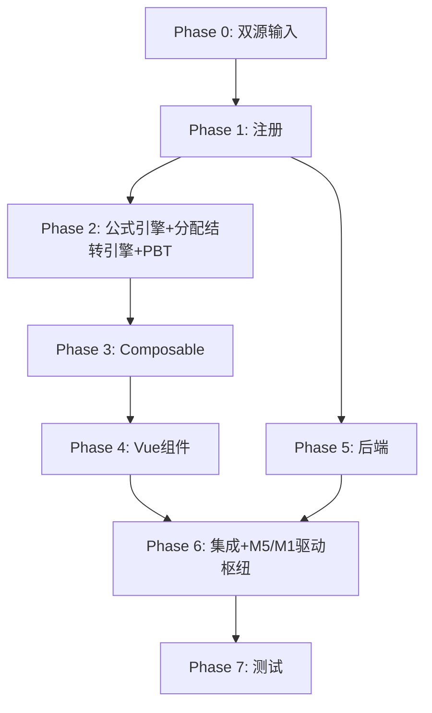

# Implementation Plan: M6 未分配利润底稿专属HTML精美组件

## Overview

M6未分配利润底稿专属组件`m6-retained-earnings`（9 sheet含1个Q6A修订前skip/1 xlsx/~80+公式）。

主入口 GtM6RetainedEarnings.vue（sheetName v-if，lazy）+ 7个子组件 + 10个composable + 后端3个py文件。

科目：4104利润分配-未分配利润（贷方/权益类）
公式特征：**权益类贷方**期末=期初+贷方-借方；**利润分配结转核心公式链**：期末=期初+本年净利润-提取盈余公积-分配股利；驱动M5+M1联动枢纽

## Tasks

### Phase 0: 双源输入验证

- [x] 0.1 openpyxl脚本读取M6未分配利润.xlsx全部9 sheet
  - 提取结构 + 确认审定表M6-1（33公式）+明细M6-2（32×19，13公式结转链）；识别Q6A修订前sheet跳过
  - 产出：m6_structure_summary.json
  - _Requirements: 双源输入流程_

- [x] 0.2 M股东权益循环底稿模板库md交叉验证
  - 核对：权益类方向/利润分配结转公式链/M5-M1驱动联动
  - 产出：m6_conflict_resolution.md
  - _Requirements: 双源输入流程_

### Phase 1: 注册+契约测试

- [x] 1.1 注册componentType和映射
  - wp_code_overrides: M6/M6-1~M6-4/M6A → 'm6-retained-earnings'
  - VALID_COMPONENT_TYPES + htmlRendererRegistry注册
  - 创建 GtM6RetainedEarnings.vue 骨架（sheetName v-if + selfLoad）
  - _Requirements: 1.1-1.11_

- [x] 1.2 编写注册契约测试
  - htmlRendererRegistry / VALID_COMPONENT_TYPES / wp_code_overrides / RENDERER_DISPATCH
  - _Requirements: 1.6, 1.7, 1.8_

### Phase 2: 公式引擎+分配结转引擎+PBT

- [x] 2.1 创建 `useM6FormulaEngine.ts`（权益类！）
  - calcAuditedAmount / calcEquityEndBalance(b,cr,dr)=b+cr-dr / calcSubtotal
  - _Requirements: 2.3-2.4, 6.4_

- [x] 2.2 创建 `useM6DistributionEngine.ts`（核心！）
  - calcRetainedEnd(b,np,sa,d)=b+np-sa-d / calcDistributable / calcLinkageDiff
  - _Requirements: 3.2, 4.5, 6.1-6.3_

- [x]* 2.3 编写 Property P1 PBT：审定数公式链
  - 断言：calcAuditedAmount(u, a, r) === u + a + r
  - **Feature: m6-retained-earnings, Property P1: 审定数公式链**

- [x]* 2.4 编写 Property P2 PBT：权益类期末（贷方！）
  - 生成器：fc.float({min:0, max:1e9}) × 3
  - 断言：calcEquityEndBalance(b, cr, dr) === b + cr - dr
  - **Feature: m6-retained-earnings, Property P2: 权益类贷方期末余额**

- [x]* 2.5 编写 Property P3 PBT：利润分配结转核心公式链
  - 生成器：fc.float × 4（begin/netProfit/surplusAccrual/dividend）
  - 断言：calcRetainedEnd(b, np, sa, d) === b + np - sa - d
  - **Feature: m6-retained-earnings, Property P3: 利润分配结转核心公式链**

- [x]* 2.6 编写 Property P4 PBT：可供分配利润
  - 断言：calcDistributable(b, np) === b + np
  - **Feature: m6-retained-earnings, Property P4: 可供分配利润**

- [x]* 2.7 编写 Property P5 PBT：联动差异
  - 断言：calcLinkageDiff(m6, src) === m6 - src
  - **Feature: m6-retained-earnings, Property P5: 联动差异**

- [x]* 2.8 编写 Property P6 PBT：小计求和
  - 断言：calcSubtotal(arr) === Σarr
  - **Feature: m6-retained-earnings, Property P6: 分类小计**

- [x]* 2.9 编写 Property P7 PBT：结转公式链一致性
  - 断言：calcRetainedEnd(b,np,sa,d) === calcDistributable(b,np) - sa - d
  - **Feature: m6-retained-earnings, Property P7: 结转公式链一致性**

### Phase 3: Composable层

- [x] 3.1 创建 useM6FormData.ts
  - selfLoad + checklist_responses + writebackTB(4104)
  - _Requirements: 1.9, 1.10, 2.6_

- [x] 3.2 创建 useM6CrossSheet.ts（联动枢纽）
  - adjudicationVsDetail / surplusVsM5 / dividendVsM1
  - _Requirements: 2.5, 4.1-4.7_

- [x] 3.3 创建 useM6DualMode.ts + useM6ImportExport.ts
  - _Requirements: 6.5, 6.6_

- [x] 3.4 创建 sheet-specific composables
  - useM6Adjudication / useM6Detail / useM6RetainedCheck / useM6Adjustment
  - _Requirements: 2~5 全部_

### Phase 4: Vue子组件

- [x] 4.1 创建 M6TabIndex.vue 底稿目录
  - _Requirements: 1.2_

- [x] 4.2 创建 M6TabAdjudication.vue 审定表M6-1
  - 权益类单区块+净利润转入/分配+TB回写
  - _Requirements: 2.1-2.7_

- [x] 4.3 创建 M6TabDetail.vue 明细表M6-2（核心！）
  - 利润分配结转公式链逐行勾稽+前期差错调整+13公式+动态行+导入导出
  - _Requirements: 3.1-3.6_

- [x] 4.4 创建 M6TabRetainedCheck.vue 检查表M6-4
  - 结转核对清单+M5/M1联动核对+结论区+AI辅助
  - _Requirements: 4.1-4.7, 5.1-5.2_

- [x] 4.5 创建 M6TabAdjustment.vue + M6TabDisclosureListed/Soe.vue
  - 调整借贷平衡 + 附注上市/国企切换
  - _Requirements: 5.3-5.5_

### Phase 5: 后端

- [x] 5.1 创建 m6_retained_earnings_renderer.py
  - RENDERER_DISPATCH注册 + 权益类公式验证
  - _Requirements: 1.6_

- [x] 5.2 创建 m6_retained_earnings.py 路由
  - 导出模板/导出数据/导入数据 + 利润分配结转API
  - _Requirements: 6.6_

- [x] 5.3 创建 m6_retained_earnings_service.py
  - 分配结转+M5/M1联动核对
  - _Requirements: 3.2, 4.5_

### Phase 6: 集成

- [x] 6.1 EventBus集成
  - publish 'substantive:adjudicated' / 'm6:net-profit' / 'm6:profit-distributed'
  - subscribe 'm5:accrual-confirmed' / 'm1:declared-confirmed' + 附注刷新
  - _Requirements: 2.6, 4.1-4.4_

- [x] 6.2 跨底稿联动（枢纽）
  - M6净利润 → M5盈余公积计提（cross_wp_ref + GtIndexChip）
  - M6分配股利 → M1应付股利
  - M6接收本年利润（利润表结转）
  - M6审定 → TB回写(4104)
  - _Requirements: 4.1-4.7_

- [x] 6.3 版本链+复核对话集成
  - useVersionTrail(autoSnapshot) + provide openReviewDialog
  - _Requirements: 6.7_

### Phase 7: 测试

- [x] 7.1 单元测试：useM6FormulaEngine + useM6DistributionEngine
  - 权益类方向 + 分配结转公式链 + 联动差异
  - _Requirements: P1-P7_

- [x] 7.2 集成测试：M6→M5/M1驱动 + 反向核对闭环
  - _Requirements: 4.1-4.7_

- [x] 7.3 Playwright E2E
  - 完整流程：打开M6→审定→明细(分配结转链)→M5/M1联动核对→检查表→保存
  - _Requirements: 全部_

## Task Dependency Graph

