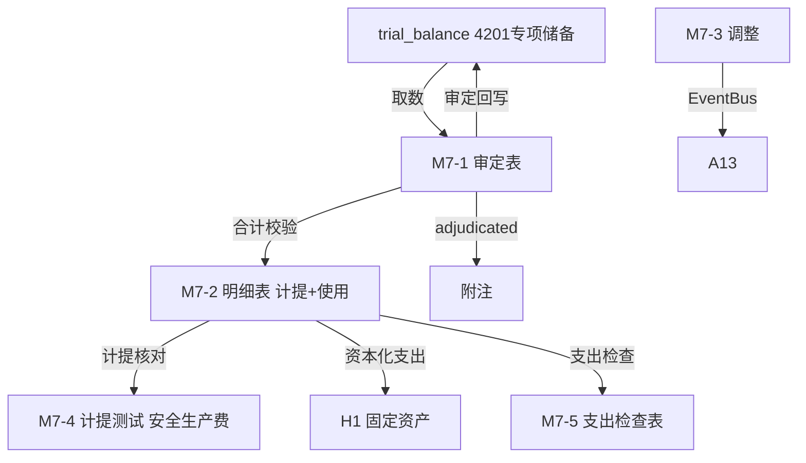

# Design Document: M7 专项储备底稿专属HTML精美组件

## Overview

M7专项储备底稿专属组件`m7-special-reserve`。M股东权益循环底稿（1个xlsx源模板/9有效sheet/~90+公式）。科目4201专项储备（**贷方/权益类！**）。

核心架构：
- componentType `m7-special-reserve`，主入口 GtM7SpecialReserve.vue
- **无内部el-tabs**：接收`sheetName` prop用`v-if`分发
- composable分层：useM7FormData + useM7FormulaEngine(纯函数) + useM7AccrualEngine(纯函数) + useM7CrossSheet + useM7DualMode + useM7ImportExport
- **权益类贷方科目**：期末=期初+贷方-借方（计提在贷方，使用在借方）
- EventBus联动：TB回写(4201) + 安全生产费计提测试 + 支出检查(资本化转固定资产H1) + 附注

## Architecture

### sheetName分发模式

```
sheetName → regex提取编码 → v-if匹配 → 子组件渲染
                                     ↘ 未匹配 → OnlyOffice fallback
```

### 文件结构

```
audit-platform/frontend/src/components/workpaper/
├── GtM7SpecialReserve.vue                   # 主入口 sheetName v-if分发（lazy）
├── m7/
│   ├── core/
│   │   ├── M7TabIndex.vue                    # 底稿目录
│   │   ├── M7TabAdjudication.vue             # M7-1 审定表（权益类贷方）
│   │   ├── M7TabDetail.vue                   # M7-2 明细表（27列区段Tab 计提+使用）
│   │   ├── M7TabAdjustment.vue               # M7-3 调整分录（借贷平衡）
│   │   ├── M7TabDisclosureListed.vue         # 附注上市
│   │   └── M7TabDisclosureSoe.vue            # 附注国企
│   ├── calc/
│   │   └── M7TabAccrualTest.vue              # M7-4 计提测试（安全生产费，9公式）
│   └── inspection/
│       └── M7TabExpenditureCheck.vue         # M7-5 支出检查表
├── composables/
│   ├── useM7FormData.ts                      # selfLoad/writebackTB(4201)
│   ├── useM7FormulaEngine.ts                 # 纯函数公式引擎（权益类！贷方公式）
│   ├── useM7AccrualEngine.ts                 # 纯函数安全生产费计提引擎（产量/收入）
│   ├── useM7CrossSheet.ts                    # 跨sheet + H1联动
│   ├── useM7DualMode.ts
│   ├── useM7ImportExport.ts
│   ├── useM7Adjudication.ts
│   ├── useM7Detail.ts
│   ├── useM7AccrualTest.ts
│   └── useM7Adjustment.ts
```

### 后端文件结构

```
audit-platform/backend/
├── app/workpaper_engine/renderers/
│   └── m7_special_reserve_renderer.py
├── app/routers/
│   └── m7_special_reserve.py                 # 3端点 + 计提测试API
├── app/services/
│   └── m7_special_reserve_service.py          # 安全生产费计提测试
└── data/wp_render_schema/
    └── m7-special-reserve.yaml
```

## Composable接口设计

### useM7FormulaEngine.ts（权益类！）

```typescript
export function calcAuditedAmount(unadj: number, aje: number, rje: number): number
// 权益类期末：期末=期初+贷方-借方
export function calcEquityEndBalance(begin: number, credit: number, debit: number): number
export function calcSubtotal(arr: number[]): number
```

### useM7AccrualEngine.ts（纯函数）

```typescript
// 按产量分档计提：Σ(各档产量×档位标准)
export function calcAccrualByOutput(tiers: { output: number; rate: number }[]): number
// 按营业收入计提：营业收入×比例
export function calcAccrualByRevenue(revenue: number, rate: number): number
// 计提差异=应计提-账面
export function calcAccrualDiff(estimated: number, booked: number): number
```

### useM7CrossSheet.ts

```typescript
export function useM7CrossSheet(allResponses: Ref<Map<string, any>>) {
  const adjudicationVsDetail: ComputedRef<{ diff: number; isMatch: boolean }>
}
```

## 数据流图



## ADR

### ADR-1: M7是权益类贷方科目
M7专项储备是权益类科目（贷方余额），期末=期初+贷方-借方。计提（如安全生产费）时贷方增加，使用时借方减少。虽在权益中列示，但具有特殊的计提使用属性。

### ADR-2: 安全生产费按产量或营业收入分档计提
高危行业（煤矿、非煤矿山、危险品、烟花爆竹等）按产量分档计提，其他按营业收入比例计提。M7-4计提测试支持两种计提基础，验证计提标准与合规性。

### ADR-3: 专项储备支出区分资本化与费用化
费用性支出直接冲减专项储备；资本性支出形成固定资产（联动H1），同时全额计提折旧冲减专项储备。M7-5支出检查区分两类处理。

## Correctness Properties

| ID | Property | 验证方法 |
|----|----------|---------|
| P1 | ∀ u,a,r: calcAuditedAmount = u+a+r | PBT |
| P2 | ∀ b,cr,dr: calcEquityEndBalance = b+cr-dr（权益类！） | PBT |
| P3 | ∀ tiers: calcAccrualByOutput = Σ(output×rate) | PBT |
| P4 | ∀ rev,rate: calcAccrualByRevenue = rev×rate | PBT |
| P5 | ∀ est,booked: calcAccrualDiff = est-booked | PBT |
| P6 | ∀ arr: calcSubtotal = Σarr | PBT |

## 错误处理

| 场景 | 处理方式 |
|------|---------|
| selfLoad失败 | el-empty+重试 |
| TB无科目4201 | 提示导入试算表 |
| 计提差异>阈值 | 红色高亮+要求说明 |
| 资本化支出未联动H1 | 黄色提示核对H1 |
| 明细合计≠审定 | 红色警告+差额 |
