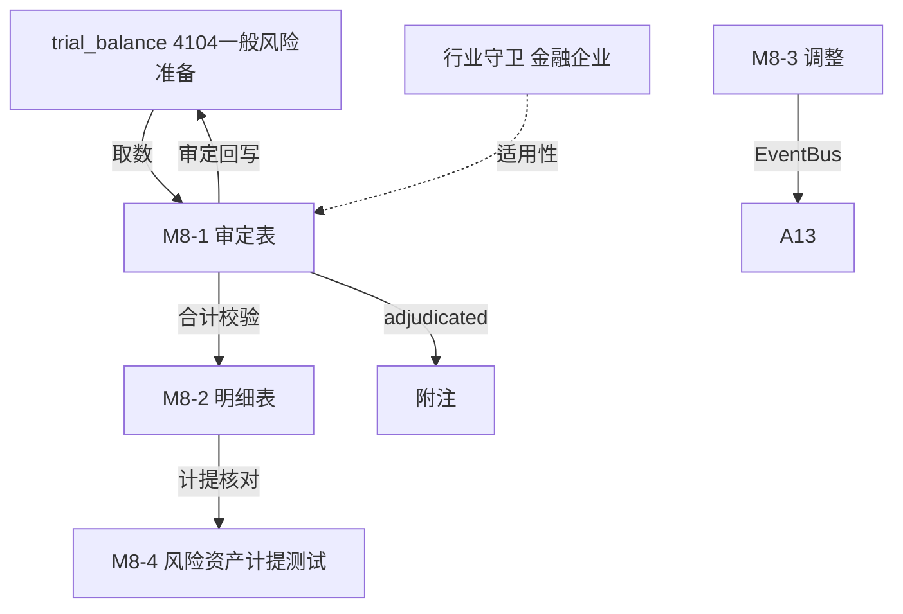

# Design Document: M8 一般风险准备底稿专属HTML精美组件

## Overview

M8一般风险准备底稿专属组件`m8-general-risk-reserve`。M股东权益循环底稿（1个xlsx源模板/9有效sheet含1个Q8A修订前+1个针对性测试删除skip/~80+公式）。科目4104一般风险准备（**贷方/权益类！**）。金融企业专属。

核心架构：
- componentType `m8-general-risk-reserve`，主入口 GtM8GeneralRiskReserve.vue
- **无内部el-tabs**：接收`sheetName` prop用`v-if`分发
- composable分层：useM8FormData + useM8FormulaEngine(纯函数) + useM8RiskEngine(纯函数) + useM8CrossSheet + useM8DualMode + useM8ImportExport
- **权益类贷方科目**：期末=期初+贷方-借方
- **行业守卫**：金融/银行/证券/保险适用
- EventBus联动：TB回写(4104一般风险准备) + 风险资产计提测试 + 附注

## Architecture

### sheetName分发模式

```
sheetName → regex提取编码 → v-if匹配 → 子组件渲染
                                     ↘ 未匹配/Q8A修订前/针对性测试删除 → OnlyOffice fallback或跳过
```

### 文件结构

```
audit-platform/frontend/src/components/workpaper/
├── GtM8GeneralRiskReserve.vue               # 主入口 sheetName v-if分发（lazy）+ 行业守卫
├── m8/
│   ├── core/
│   │   ├── M8TabIndex.vue                    # 底稿目录（适用性状态）
│   │   ├── M8TabAdjudication.vue             # M8-1 审定表（权益类贷方）
│   │   ├── M8TabDetail.vue                   # M8-2 明细表（22公式）
│   │   ├── M8TabAdjustment.vue               # M8-3 调整分录（借贷平衡）
│   │   ├── M8TabDisclosureListed.vue         # 附注上市
│   │   └── M8TabDisclosureSoe.vue            # 附注国企
│   └── calc/
│       └── M8TabRiskTest.vue                 # M8-4 风险资产计提测试（13公式）
├── composables/
│   ├── useM8FormData.ts                      # selfLoad/writebackTB(4104一般风险准备)
│   ├── useM8FormulaEngine.ts                 # 纯函数公式引擎（权益类！贷方公式）
│   ├── useM8RiskEngine.ts                    # 纯函数风险资产计提引擎
│   ├── useM8CrossSheet.ts                    # 跨sheet
│   ├── useM8DualMode.ts
│   ├── useM8ImportExport.ts
│   ├── useM8Adjudication.ts
│   ├── useM8Detail.ts
│   ├── useM8RiskTest.ts
│   └── useM8Adjustment.ts
```

### 后端文件结构

```
audit-platform/backend/
├── app/workpaper_engine/renderers/
│   └── m8_general_risk_reserve_renderer.py
├── app/routers/
│   └── m8_general_risk_reserve.py            # 3端点 + 风险计提测试API
├── app/services/
│   └── m8_general_risk_reserve_service.py     # 风险资产计提测试
└── data/wp_render_schema/
    └── m8-general-risk-reserve.yaml
```

## Composable接口设计

### useM8FormulaEngine.ts（权益类！）

```typescript
export function calcAuditedAmount(unadj: number, aje: number, rje: number): number
// 权益类期末：期末=期初+贷方-借方
export function calcEquityEndBalance(begin: number, credit: number, debit: number): number
export function calcSubtotal(arr: number[]): number
```

### useM8RiskEngine.ts（纯函数）

```typescript
// 应计提余额=风险资产期末余额×计提比例
export function calcRiskProvision(riskAssets: number, rate: number): number
// 计提差异=应计提-账面
export function calcProvisionDiff(estimated: number, booked: number): number
```

### useM8CrossSheet.ts

```typescript
export function useM8CrossSheet(allResponses: Ref<Map<string, any>>) {
  const adjudicationVsDetail: ComputedRef<{ diff: number; isMatch: boolean }>
  const isFinancialEntity: ComputedRef<boolean>  // 行业守卫
}
```

## 数据流图



## ADR

### ADR-1: M8是权益类贷方科目
M8一般风险准备是权益类科目（贷方余额），期末=期初+贷方-借方。从净利润中计提时贷方增加，转回时借方减少。

### ADR-2: 一般风险准备是金融企业专属
一般风险准备是金融企业（银行、证券、保险等）从净利润中计提、用于弥补尚未识别的可能性损失的权益类准备。非金融企业不适用，通过行业守卫判断适用性。

### ADR-3: 按风险资产期末余额计提测试
金融企业一般风险准备原则上不低于风险资产期末余额的1.5%。M8-4测试将风险资产×计提比例与账面对比，验证计提是否充足。

## Correctness Properties

| ID | Property | 验证方法 |
|----|----------|---------|
| P1 | ∀ u,a,r: calcAuditedAmount = u+a+r | PBT |
| P2 | ∀ b,cr,dr: calcEquityEndBalance = b+cr-dr（权益类！） | PBT |
| P3 | ∀ ra,rate: calcRiskProvision = ra×rate | PBT |
| P4 | ∀ est,booked: calcProvisionDiff = est-booked | PBT |
| P5 | ∀ arr: calcSubtotal = Σarr | PBT |

## 错误处理

| 场景 | 处理方式 |
|------|---------|
| selfLoad失败 | el-empty+重试 |
| TB无科目4104一般风险准备 | 提示导入试算表 |
| 非金融企业 | 提示"仅适用金融企业"+可标记不适用 |
| 计提差异>阈值 | 红色高亮+要求说明 |
| 计提余额<风险资产1.5% | 黄色提示计提可能不足 |
| 明细合计≠审定 | 红色警告+差额 |
