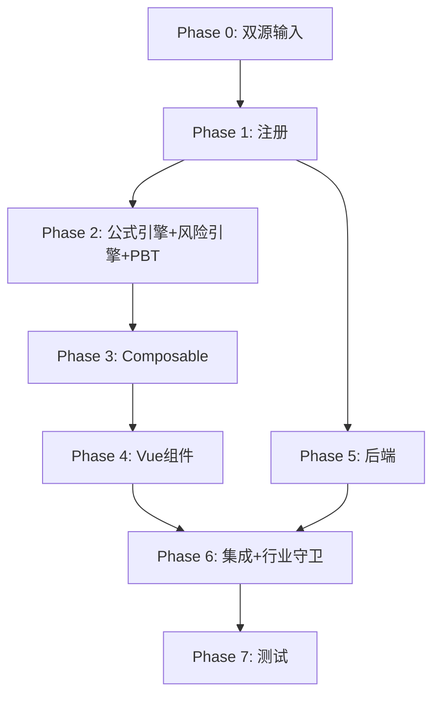

# Implementation Plan: M8 一般风险准备底稿专属HTML精美组件

## Overview

M8一般风险准备底稿专属组件`m8-general-risk-reserve`（9 sheet含1 Q8A修订前+1针对性测试删除skip/1 xlsx/~80+公式）。

主入口 GtM8GeneralRiskReserve.vue（sheetName v-if，lazy）+ 7个子组件 + 10个composable + 后端3个py文件。

科目：4104一般风险准备（贷方/权益类）
公式特征：**权益类贷方**期末=期初+贷方-借方；金融企业行业守卫；按风险资产计提测试

## Tasks

### Phase 0: 双源输入验证

- [x] 0.1 openpyxl脚本读取M8一般风险准备.xlsx全部9 sheet
  - 提取结构 + 确认审定表M8-1（72公式）+明细M8-2（22公式）+测试M8-4（30×11，13公式）；识别Q8A修订前/针对性测试删除sheet跳过
  - 产出：m8_structure_summary.json
  - _Requirements: 双源输入流程_

- [x] 0.2 M股东权益循环底稿模板库md交叉验证
  - 核对：权益类方向/金融企业适用性/风险资产1.5%计提
  - 产出：m8_conflict_resolution.md
  - _Requirements: 双源输入流程_

### Phase 1: 注册+契约测试

- [x] 1.1 注册componentType和映射
  - wp_code_overrides: M8/M8-1~M8-4/M8A → 'm8-general-risk-reserve'
  - VALID_COMPONENT_TYPES + htmlRendererRegistry注册
  - 创建 GtM8GeneralRiskReserve.vue 骨架（sheetName v-if + selfLoad + 行业守卫）
  - _Requirements: 1.1-1.11_

- [x] 1.2 编写注册契约测试
  - htmlRendererRegistry / VALID_COMPONENT_TYPES / wp_code_overrides / RENDERER_DISPATCH
  - _Requirements: 1.6, 1.7, 1.8_

### Phase 2: 公式引擎+风险引擎+PBT

- [x] 2.1 创建 `useM8FormulaEngine.ts`（权益类！）
  - calcAuditedAmount / calcEquityEndBalance(b,cr,dr)=b+cr-dr / calcSubtotal
  - _Requirements: 2.3-2.4, 6.3-6.4_

- [x] 2.2 创建 `useM8RiskEngine.ts`
  - calcRiskProvision / calcProvisionDiff
  - _Requirements: 3.4-3.5, 6.1-6.2_

- [x]* 2.3 编写 Property P1 PBT：审定数公式链
  - 断言：calcAuditedAmount(u, a, r) === u + a + r
  - **Feature: m8-general-risk-reserve, Property P1: 审定数公式链**

- [x]* 2.4 编写 Property P2 PBT：权益类期末（贷方！）
  - 生成器：fc.float({min:0, max:1e9}) × 3
  - 断言：calcEquityEndBalance(b, cr, dr) === b + cr - dr
  - **Feature: m8-general-risk-reserve, Property P2: 权益类贷方期末余额**

- [x]* 2.5 编写 Property P3 PBT：风险资产计提
  - 断言：calcRiskProvision(ra, rate) === ra × rate
  - **Feature: m8-general-risk-reserve, Property P3: 风险资产计提**

- [x]* 2.6 编写 Property P4 PBT：计提差异
  - 断言：calcProvisionDiff(est, booked) === est - booked
  - **Feature: m8-general-risk-reserve, Property P4: 计提差异**

- [x]* 2.7 编写 Property P5 PBT：小计求和
  - 断言：calcSubtotal(arr) === Σarr
  - **Feature: m8-general-risk-reserve, Property P5: 分类小计**

### Phase 3: Composable层

- [x] 3.1 创建 useM8FormData.ts
  - selfLoad + checklist_responses + writebackTB(4104一般风险准备)
  - _Requirements: 1.9, 1.10, 2.6_

- [x] 3.2 创建 useM8CrossSheet.ts
  - adjudicationVsDetail / isFinancialEntity行业守卫
  - _Requirements: 2.5, 5.1-5.3_

- [x] 3.3 创建 useM8DualMode.ts + useM8ImportExport.ts
  - _Requirements: 6.5, 6.6_

- [x] 3.4 创建 sheet-specific composables
  - useM8Adjudication / useM8Detail / useM8RiskTest / useM8Adjustment
  - _Requirements: 2~4 全部_

### Phase 4: Vue子组件

- [x] 4.1 创建 M8TabIndex.vue 底稿目录（适用性状态）
  - _Requirements: 1.2, 5.3_

- [x] 4.2 创建 M8TabAdjudication.vue 审定表M8-1
  - 权益类单区块+计提/转回+TB回写
  - _Requirements: 2.1-2.7_

- [x] 4.3 创建 M8TabDetail.vue 明细表M8-2
  - 22公式+动态行+导入导出
  - _Requirements: 3.1-3.2, 3.8_

- [x] 4.4 创建 M8TabRiskTest.vue 风险测试M8-4
  - 按风险资产1.5%计提测试+13公式
  - _Requirements: 3.3-3.7_

- [x] 4.5 创建 M8TabAdjustment.vue + M8TabDisclosureListed/Soe.vue
  - 调整借贷平衡 + 附注上市/国企切换 + AI辅助
  - _Requirements: 4.1-4.4_

### Phase 5: 后端

- [x] 5.1 创建 m8_general_risk_reserve_renderer.py
  - RENDERER_DISPATCH注册 + 权益类公式验证
  - _Requirements: 1.6_

- [x] 5.2 创建 m8_general_risk_reserve.py 路由
  - 导出模板/导出数据/导入数据 + 风险计提测试API
  - _Requirements: 6.6_

- [x] 5.3 创建 m8_general_risk_reserve_service.py
  - 风险资产计提测试+汇总
  - _Requirements: 3.4_

### Phase 6: 集成

- [x] 6.1 EventBus集成
  - publish 'substantive:adjudicated' / 'adjustment:created' + 附注刷新
  - _Requirements: 2.6_

- [x] 6.2 跨底稿联动 + 行业守卫
  - M8审定 → TB回写(4104一般风险准备)
  - 行业守卫适用性判断
  - _Requirements: 5.1-5.3_

- [x] 6.3 版本链+复核对话集成
  - useVersionTrail(autoSnapshot) + provide openReviewDialog
  - _Requirements: 6.7_

### Phase 7: 测试

- [x] 7.1 单元测试：useM8FormulaEngine + useM8RiskEngine
  - 权益类方向 + 风险资产计提 + 计提差异
  - _Requirements: P1-P5_

- [x] 7.2 集成测试：风险测试 + 行业守卫适用性
  - _Requirements: 3.3-3.7, 5.1-5.3_

- [x] 7.3 Playwright E2E
  - 完整流程：打开M8→审定→明细→风险测试→保存
  - _Requirements: 全部_

## Task Dependency Graph

