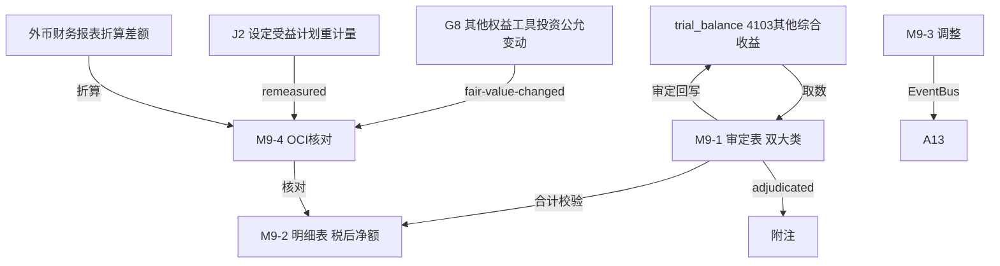

# Design Document: M9 其他综合收益底稿专属HTML精美组件

## Overview

M9其他综合收益底稿专属组件`m9-other-comprehensive-income`。M股东权益循环底稿（1个xlsx源模板/9有效sheet/~80+公式）。科目4103其他综合收益（**贷方/权益类！**）。

核心架构：
- componentType `m9-other-comprehensive-income`，主入口 GtM9OtherComprehensiveIncome.vue
- **无内部el-tabs**：接收`sheetName` prop用`v-if`分发
- composable分层：useM9FormData + useM9FormulaEngine(纯函数) + useM9OciEngine(纯函数) + useM9CrossSheet + useM9DualMode + useM9ImportExport
- **权益类贷方科目**：期末=期初+贷方-借方
- **双大类**：不能重分类进损益 + 能重分类进损益
- EventBus联动：TB回写(4103) + **OCI核对（接收G8公允变动+J2重计量+外币折算）** + 附注

## Architecture

### sheetName分发模式

```
sheetName → regex提取编码 → v-if匹配 → 子组件渲染
                                     ↘ 未匹配 → OnlyOffice fallback
```

### 文件结构

```
audit-platform/frontend/src/components/workpaper/
├── GtM9OtherComprehensiveIncome.vue         # 主入口 sheetName v-if分发（lazy）
├── m9/
│   ├── core/
│   │   ├── M9TabIndex.vue                    # 底稿目录
│   │   ├── M9TabAdjudication.vue             # M9-1 审定表（双大类：不可/可重分类）
│   │   ├── M9TabDetail.vue                   # M9-2 明细表（30列区段Tab 税后净额）
│   │   ├── M9TabAdjustment.vue               # M9-3 调整分录（借贷平衡）
│   │   ├── M9TabDisclosureListed.vue         # 附注上市
│   │   └── M9TabDisclosureSoe.vue            # 附注国企（67×21，20公式）
│   └── inspection/
│       └── M9TabOciReconcile.vue             # M9-4 OCI核对表（多来源，13公式）
├── composables/
│   ├── useM9FormData.ts                      # selfLoad/writebackTB(4103)
│   ├── useM9FormulaEngine.ts                 # 纯函数公式引擎（权益类！贷方公式）
│   ├── useM9OciEngine.ts                     # 纯函数OCI引擎（税后净额+多来源核对）
│   ├── useM9CrossSheet.ts                    # 跨sheet + G8/J2联动
│   ├── useM9DualMode.ts
│   ├── useM9ImportExport.ts
│   ├── useM9Adjudication.ts
│   ├── useM9Detail.ts
│   ├── useM9OciReconcile.ts
│   └── useM9Adjustment.ts
```

### 后端文件结构

```
audit-platform/backend/
├── app/workpaper_engine/renderers/
│   └── m9_other_comprehensive_income_renderer.py
├── app/routers/
│   └── m9_other_comprehensive_income.py      # 3端点 + OCI核对API
├── app/services/
│   └── m9_other_comprehensive_income_service.py  # OCI税后净额+多来源核对
└── data/wp_render_schema/
    └── m9-other-comprehensive-income.yaml
```

## Composable接口设计

### useM9FormulaEngine.ts（权益类！）

```typescript
export function calcAuditedAmount(unadj: number, aje: number, rje: number): number
// 权益类期末：期末=期初+贷方-借方
export function calcEquityEndBalance(begin: number, credit: number, debit: number): number
export function calcSubtotal(arr: number[]): number
```

### useM9OciEngine.ts（纯函数）

```typescript
// 本期税后净额=本期税前发生-所得税影响
export function calcAfterTaxNet(preTax: number, taxEffect: number): number
// 核对差异=来源金额-账面OCI增加
export function calcReconcileDiff(source: number, booked: number): number
// 不可重分类+可重分类汇总
export function aggregateOci(items: OciItem[]): { nonReclass: number; reclass: number; total: number }
```

### useM9CrossSheet.ts

```typescript
export function useM9CrossSheet(allResponses: Ref<Map<string, any>>) {
  const adjudicationVsDetail: ComputedRef<{ diff: number; isMatch: boolean }>
  const ociVsG8: ComputedRef<{ diff: number; isConsistent: boolean }>
  const ociVsJ2: ComputedRef<{ diff: number; isConsistent: boolean }>
}
```

## 数据流图



## ADR

### ADR-1: M9是权益类贷方科目
M9其他综合收益是权益类科目（贷方余额），期末=期初+贷方-借方。OCI增加时贷方增加，减少/重分类进损益时借方减少。

### ADR-2: OCI是多来源汇聚的核对枢纽（核心！）
其他综合收益汇聚多个来源：G8其他权益工具投资公允价值变动（不可重分类）、J2设定受益计划重计量（不可重分类）、其他债权投资公允变动/现金流量套期/外币折算差额（可重分类）。M9-4核对表接收各来源（EventBus订阅），验证OCI完整性与准确性。

### ADR-3: OCI按税后净额列示并分两大类
OCI各项目在报表按税后净额列示（税前发生-所得税影响）。按"以后不能重分类进损益"和"以后能重分类进损益"两大类分别披露，审定表与明细表均分两大类。

## Correctness Properties

| ID | Property | 验证方法 |
|----|----------|---------|
| P1 | ∀ u,a,r: calcAuditedAmount = u+a+r | PBT |
| P2 | ∀ b,cr,dr: calcEquityEndBalance = b+cr-dr（权益类！） | PBT |
| P3 | ∀ pre,tax: calcAfterTaxNet = pre-tax | PBT |
| P4 | ∀ src,booked: calcReconcileDiff = src-booked | PBT |
| P5 | ∀ items: aggregateOci.total = nonReclass+reclass | PBT |
| P6 | ∀ arr: calcSubtotal = Σarr | PBT |

## 错误处理

| 场景 | 处理方式 |
|------|---------|
| selfLoad失败 | el-empty+重试 |
| TB无科目4103 | 提示导入试算表 |
| G8/J2来源未就绪 | 黄色提示"待G8/J2数据就绪" |
| 核对差异>阈值 | 红色高亮+定位差异来源 |
| 税后净额≠税前-税额 | 红色警告 |
| 明细合计≠审定 | 红色警告+差额 |
