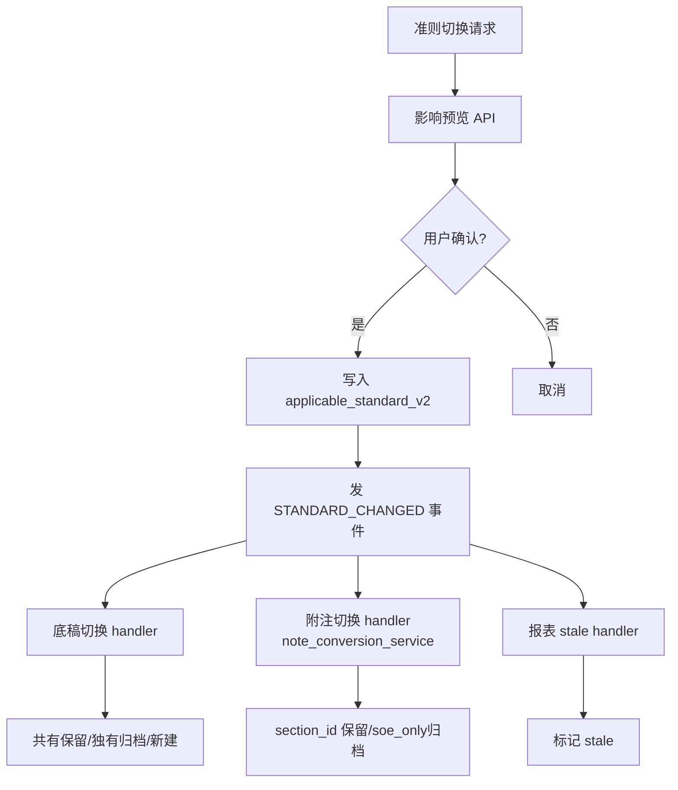

# 设计文档：多准则状态统一

## 概述

建立统一准则状态源（`applicable_standard_v2` 结构化 JSONB）+ 底稿层切换能力（复用附注层 note_conversion 模式）+ 事件驱动各模块联动。核心是"收口散落口径到一个源 + 补底稿层缺失的切换能力"。

## 数据模型

### 新增字段：`projects.applicable_standard_v2`（JSONB）

```json
{
  "entity_type": "soe" | "listed" | "private",
  "scope": "standalone" | "consolidated",
  "stage": "normal" | "ipo" | "transfer" | "restructure" | "fraud_response"
}
```

迁移：`V0XX__add_applicable_standard_v2.sql`（ALTER TABLE projects ADD COLUMN IF NOT EXISTS applicable_standard_v2 JSONB）

### 新增事件：`STANDARD_CHANGED`

```python
class EventType(str, Enum):
    STANDARD_CHANGED = "standard_changed"
    # payload: {project_id, year, old_standard: dict, new_standard: dict, changed_by: UUID}
```

## 架构



## 关键设计决策

### D1：底稿切换复用附注层模式

附注层 `note_conversion_service` 的核心模式：
- 共有章节：保留 section_id + 用户编辑不丢
- 源准则独有：归档（is_deleted=True + deletion_reason）
- 目标准则独有：从模板创建

底稿层复用同款模式：
- 共有底稿（两准则都有的 wp_code）：保留 parsed_data + working_paper 不动
- 源准则独有底稿：soft delete（is_deleted=True）+ 记录 conversion_reason
- 目标准则独有底稿：从模板生成（调 generate_from_codes 的子逻辑）

### D2：准则差异数据源

底稿的"哪些是 SOE 独有 / Listed 独有 / 共有"信息来源：
- `wp_template_init_service._filter_files_by_scenario` 已有 scenario→文件过滤逻辑
- `gt_template_library.json` 的 `applicable_standard` 字段标注每个模板适用准则
- 本 spec 需要把这些信息结构化为"SOE 底稿集 / Listed 底稿集 / 共有集"的映射

### D3：向后兼容（双写迁移期）

- 写入 `applicable_standard_v2` 时同步写旧字段（template_type / scenario / current_standard / applicable_standard）
- 读取时优先读 `applicable_standard_v2`，fallback 到旧字段（迁移期）
- 迁移脚本一次性从旧字段推断填充 `applicable_standard_v2`

### D4：切换前置条件

- 所有底稿无未保存编辑（dirty=false）
- 项目非归档状态
- 无进行中的生成/导出任务

## 正确性属性

**Property 1: 统一源一致性**
对任意准则切换操作，切换后 `applicable_standard_v2` 与各模块的旧字段（template_type/current_standard/scenario/applicable_standard）值一致。

**Property 2: 底稿数据不丢失**
对任意准则切换，共有底稿的 `parsed_data` 在切换前后保持不变。

**Property 3: 切换可逆性**
对任意 SOE→Listed 切换后再 Listed→SOE 切换，共有底稿的 `parsed_data` 与初始状态一致（roundtrip 不变量，复用附注层 PBT 模式）。

**Property 4: 事件完整性**
对任意准则切换，`STANDARD_CHANGED` 事件 SHALL 被发出且 payload 含 old/new standard。

## 测试策略

- 单元测试：准则映射（旧字段→新字段推断）/ 底稿分类（共有/独有判定）/ 切换逻辑
- PBT：roundtrip 不变量（SOE→Listed→SOE parsed_data 不变）/ 统一源一致性
- 集成测试：对真实项目执行切换，验证底稿/附注/报表三模块联动正确

## 文件变更清单

### 新增
- `backend/migrations/V0XX__add_applicable_standard_v2.sql`
- `backend/app/services/standard_unification_service.py`（统一源读写 + 切换编排 + 影响预览）
- `backend/app/services/wp_standard_conversion_service.py`（底稿层切换逻辑）
- `backend/app/routers/standard_conversion.py`（切换 API + 预览 API）
- `backend/scripts/migrate_applicable_standard.py`（一次性迁移脚本）

### 修改
- `backend/app/models/core.py`：Project 模型加 `applicable_standard_v2` 字段
- `backend/app/services/event_types.py`：加 `STANDARD_CHANGED`
- `backend/app/services/event_handlers.py`：注册 STANDARD_CHANGED handler
- 各模块读准则的地方：改为读 `applicable_standard_v2`（渐进替换）
