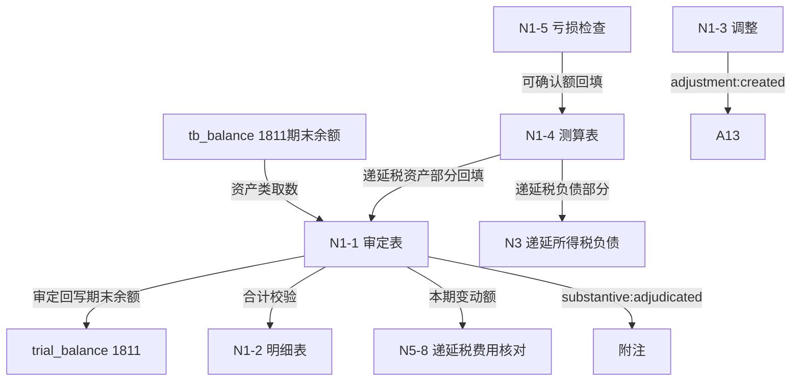

# Design Document: N1 递延所得税资产底稿专属HTML精美组件

## Overview

N1递延所得税资产底稿专属组件`n1-deferred-tax-assets`。N税费循环资产类底稿（1个xlsx/9 sheet/~120+公式）。科目1811递延所得税资产（**借方/资产类科目**）。

核心架构：
- componentType `n1-deferred-tax-assets`，主入口 GtN1DeferredTaxAssets.vue
- **资产类科目**：期末=期初+借方-贷方（与N2/N3负债类、N4/N5损益类不同）
- **税务核心引擎**：递延所得税资产=可抵扣暂时性差异×适用税率（独立纯函数）
- **可弥补亏损确认引擎**：可确认额=min(未弥补亏损, 预计未来应纳税所得额)×税率
- **与N3对应**：N1-4测算表同源产出资产/负债两部分，不能抵销的分列
- composable分层：useN1FormData + useN1FormulaEngine + useN1DeferredTaxEngine(纯函数) + useN1LossCompensationEngine(纯函数) + useN1CrossSheet + useN1DualMode + useN1ImportExport
- EventBus联动：TB回写(1811期末余额) + N3对应 + N5递延税费用核对 + 附注

## Architecture

### sheetName分发模式（非嵌套Tab）

GtN1DeferredTaxAssets.vue 接收 `sheetName` prop（完整中文名如"审定表N1-1"），正则提取末尾编码(N1-1)，`v-if` 分发到对应子组件。未迁移的sheet走 OnlyOffice fallback。

```
sheetName → regex提取编码 → v-if匹配 → 子组件渲染
                                     ↘ 未匹配 → OnlyOffice fallback
```

### 资产类取数逻辑

```
资产类(N1):   期末余额=期初+本期借方-本期贷方；TB取期末余额
              1811借方科目：借增贷减，audited_amount=期末余额
              来源: tb_balance (direction=借)，而非 tb_ledger 发生额
```

### 递延所得税测算逻辑（核心引擎）

```
暂时性差异 = 账面价值 - 计税基础
  资产项: 账面 > 计税基础 → 应纳税暂时性差异 → 递延所得税负债(N3)
          账面 < 计税基础 → 可抵扣暂时性差异 → 递延所得税资产(N1)
递延所得税 = 暂时性差异 × 适用税率
可弥补亏损: 可确认递延税资产 = min(未弥补亏损, 预计未来应纳税所得额) × 税率
```

### 文件结构

```
audit-platform/frontend/src/components/workpaper/
├── GtN1DeferredTaxAssets.vue                # 主入口 sheetName v-if分发
├── n1/
│   ├── core/
│   │   ├── N1TabIndex.vue                   # 底稿目录（9行+进度条）
│   │   ├── N1TabAdjudication.vue            # N1-1 审定表（78公式，资产类期末）
│   │   ├── N1TabDetail.vue                  # N1-2 明细表（14列14公式）
│   │   ├── N1TabAdjustment.vue              # N1-3 调整分录
│   │   ├── N1TabDisclosureListed.vue        # 附注上市（54×11）
│   │   └── N1TabDisclosureSoe.vue           # 附注国企（74×256）
│   └── calc/
│       ├── N1TabCalcTable.vue               # N1-4 测算表（63×15，21公式，核心）
│       └── N1TabLossCheck.vue               # N1-5 可弥补亏损检查（30×13）
├── composables/
│   ├── useN1FormData.ts                     # 数据加载/selfLoad/writebackTB（期末余额！1811）
│   ├── useN1FormulaEngine.ts                # 纯函数公式引擎（资产类！期末余额）
│   ├── useN1DeferredTaxEngine.ts            # 纯函数递延税测算引擎（差异×税率）
│   ├── useN1LossCompensationEngine.ts       # 纯函数可弥补亏损确认引擎
│   ├── useN1CrossSheet.ts                   # 跨sheet + N3/N5跨底稿联动
│   ├── useN1DualMode.ts
│   ├── useN1ImportExport.ts
│   ├── useN1Adjudication.ts
│   ├── useN1Detail.ts
│   ├── useN1CalcTable.ts
│   └── useN1LossCheck.ts
```

### 后端文件结构

```
audit-platform/backend/
├── app/workpaper_engine/renderers/
│   └── n1_deferred_tax_assets_renderer.py
├── app/routers/
│   └── n1_deferred_tax_assets.py            # 3端点（导出模板/导出数据/导入数据）
├── app/services/
│   └── n1_deferred_tax_assets_service.py    # 资产类取数+递延税测算+亏损确认
└── data/wp_render_schema/
    └── n1-deferred-tax-assets.yaml
```

## Composable接口设计

### useN1FormulaEngine.ts（资产类！）

```typescript
// 审定数
export function calcAuditedAmount(unadj: number, aje: number, rje: number): number
// 资产类期末余额：期初+本期借方-本期贷方（1811借方科目）
export function calcAssetEndBalance(begin: number, debit: number, credit: number): number
// 合计
export function calcSubtotal(arr: number[]): number
// 占比
export function calcProportion(item: number, total: number): number
```

### useN1DeferredTaxEngine.ts（纯函数，核心）

```typescript
// 暂时性差异=账面价值-计税基础
export function calcTemporaryDifference(bookValue: number, taxBase: number): number
// 递延所得税=暂时性差异×适用税率
export function calcDeferredTax(tempDiff: number, taxRate: number): number
// 加权平均税率
export function calcWeightedAvgRate(taxAmounts: number[], diffs: number[]): number
```

### useN1LossCompensationEngine.ts（纯函数）

```typescript
// 未弥补亏损=亏损金额-已弥补金额
export function calcUnrecoveredLoss(lossAmount: number, recovered: number): number
// 可确认递延税资产=min(未弥补亏损, 预计未来应纳税所得额)×税率
export function calcRecognizableAsset(unrecovered: number, futureTaxableIncome: number, taxRate: number): number
// 弥补期限是否届满
export function isCompensationExpired(lossYear: number, currentYear: number, maxYears: number): boolean
```

### useN1CrossSheet.ts

```typescript
export function useN1CrossSheet(allResponses: Ref<Map<string, any>>) {
  const adjudicationVsDetail: ComputedRef<{ diff: number; isMatch: boolean }>
  const adjudicationVsCalcTable: ComputedRef<{ diff: number; isMatch: boolean }>
  const lossCheckToCalcTable: ComputedRef<{ total: number }>
  const n1ToN3Correspondence: ComputedRef<{ assetPart: number; liabilityPart: number }>
  const deferredTaxChange: ComputedRef<{ change: number }>  // 供N5核对
}
```

## 数据流图



## ADR

### ADR-1: N1是资产类，期末余额取数

N1递延所得税资产（科目1811）是资产类借方科目：期末=期初+本期借方-本期贷方，TB从tb_balance取期末余额（direction=借），与N2/N3负债类、N4/N5损益类根本不同。

### ADR-2: 递延所得税测算引擎独立纯函数

递延所得税=暂时性差异×适用税率是税务核心引擎，抽为useN1DeferredTaxEngine独立纯函数便于PBT验证与N3复用。N1-4测算表同源产出资产/负债两部分。

### ADR-3: 可弥补亏损确认遵循谨慎性

递延税资产确认以"很可能取得用来抵扣的未来应纳税所得额"为限，可确认额=min(未弥补亏损, 预计未来应纳税所得额)×税率，不足部分不确认。弥补期限一般5年（高新10年）。

### ADR-4: N1与N3不能抵销的分列

同一纳税主体的递延税资产与负债可抵销后净额列示；不同纳税主体不能抵销，需分别在N1/N3列示。测算表N1-4统一测算，审定分列。

## Correctness Properties

| ID | Property | 验证方法 |
|----|----------|---------|
| P1 | ∀ u,a,r: calcAuditedAmount = u+a+r | PBT |
| P2 | ∀ b,d,c: calcAssetEndBalance = b+d-c（资产类！） | PBT |
| P3 | ∀ bv,tb: calcTemporaryDifference = bv-tb | PBT |
| P4 | ∀ diff,rate: calcDeferredTax = diff×rate | PBT |
| P5 | ∀ arr: calcSubtotal = Σarr | PBT |
| P6 | ∀ loss,rec: calcUnrecoveredLoss = loss-rec | PBT |
| P7 | ∀ unrec,fti,rate: calcRecognizableAsset = min(unrec,fti)×rate | PBT |

## 错误处理

| 场景 | 处理方式 |
|------|---------|
| selfLoad失败 | el-empty+重试 |
| TB无科目1811 | 提示导入试算表 |
| 资产类取数返回发生额 | 自动切换到期末余额取数+黄色警告 |
| 税率缺失/超范围(0~25%) | 红色校验提示 |
| 预计未来应纳税所得额不足 | 黄色警告，不确认递延税资产 |
| 弥补期限届满 | 标红提示不可确认 |
| N3数据未创建 | 黄色提示"N3未编制" |
| OO健康检查失败 | 降级HTML |
