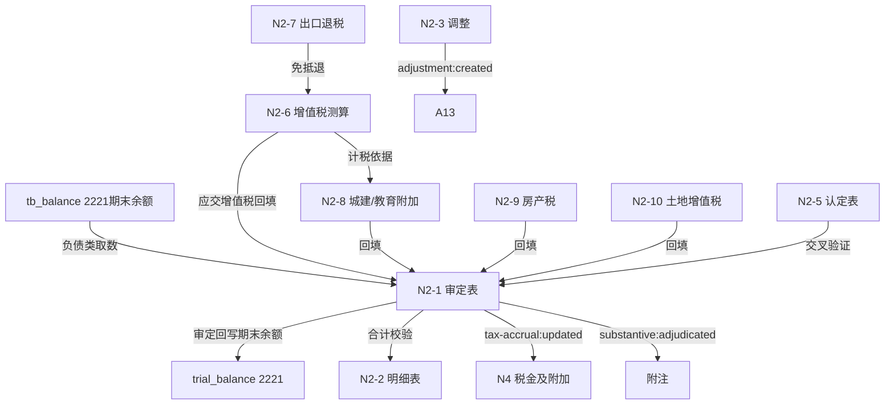

# Design Document: N2 应交税费底稿专属HTML精美组件

## Overview

N2应交税费底稿专属组件`n2-taxes-payable`。N税费循环最复杂底稿（1个xlsx/18 sheet/~180+公式）。科目2221应交税费（**贷方/负债类科目**）。

核心架构：
- componentType `n2-taxes-payable`，主入口 GtN2TaxesPayable.vue
- **负债类科目**：期末=期初+贷方-借方（与N1资产类、N4/N5损益类不同）
- **多税种测算引擎**（N循环最复杂）：增值税/城建税及附加/房产税/土地增值税/其他税费，各税种独立测算子表
- **增值税测算引擎**：应交增值税=销项税额-(进项税额-进项转出)
- **出口退税核对**：免抵退税额测算
- composable分层：useN2FormData + useN2FormulaEngine + useN2MultiTaxEngine(纯函数) + useN2VatEngine(纯函数) + useN2CrossSheet + useN2DualMode + useN2ImportExport
- EventBus联动：TB回写(2221期末余额) + N4税金及附加计提联动 + 附注
- O1A原底稿/出口退税额复核示例标记skip

## Architecture

### sheetName分发模式（非嵌套Tab）

GtN2TaxesPayable.vue 接收 `sheetName` prop，正则提取末尾编码，`v-if` 分发。O1A原底稿/出口退税额复核示例走 OnlyOffice fallback（skip HTML组件化）。

```
sheetName → regex提取编码 → v-if匹配 → 子组件渲染
                                     ↘ skip/未匹配 → OnlyOffice fallback
```

### 负债类取数逻辑

```
负债类(N2):   期末余额=期初+本期贷方-本期借方；TB取期末余额
              2221贷方科目：贷增借减，audited_amount=期末余额
              来源: tb_balance (direction=贷)
```

### 多税种测算逻辑（核心引擎）

```
增值税:     应交增值税 = 销项税额 - (进项税额 - 进项转出)；销项=销售额×税率
城建税:     (增值税+消费税) × 7%/5%/1%（市区/县城/其他）
教育费附加: (增值税+消费税) × 3%
地方教育附加:(增值税+消费税) × 2%
房产税:     从价=原值×(1-扣除比例)×1.2%；从租=租金×12%
土地增值税: 增值额×累进税率 - 扣除项目×速算扣除系数（四级30/40/50/60%）
出口退税:   免抵退税额测算
```

### 文件结构

```
audit-platform/frontend/src/components/workpaper/
├── GtN2TaxesPayable.vue                     # 主入口 sheetName v-if分发
├── n2/
│   ├── core/
│   │   ├── N2TabIndex.vue                   # 底稿目录（进度条+联动状态）
│   │   ├── N2TabAdjudication.vue            # N2-1 审定表（85公式，负债类，多税种分行）
│   │   ├── N2TabDetail.vue                  # N2-2 明细表（23列区段Tab，22公式）
│   │   ├── N2TabAdjustment.vue              # N2-3 调整分录
│   │   ├── N2TabDisclosureListed.vue        # 附注上市（27×11）
│   │   └── N2TabDisclosureSoe.vue           # 附注国企（24×11）
│   ├── inspection/
│   │   ├── N2TabPolicyCheck.vue             # N2-4 税收政策检查
│   │   ├── N2TabRecognition.vue             # N2-5 应交税金认定（54×15）
│   │   └── N2TabTaxCheck.vue                # N2-11 应交税费检查
│   └── calc/
│       ├── N2TabVatCalc.vue                 # N2-6 增值税测算（48×8）
│       ├── N2TabExportRefund.vue            # N2-7 出口退税核对
│       ├── N2TabOtherTaxCalc.vue            # N2-8 其他税费测算（26×9，11公式）
│       ├── N2TabPropertyTax.vue             # N2-9 房产税测算（30×7）
│       └── N2TabLvt.vue                     # N2-10 土地增值税测算（51×7）
├── composables/
│   ├── useN2FormData.ts                     # 数据加载/selfLoad/writebackTB（期末余额！2221贷方）
│   ├── useN2FormulaEngine.ts                # 纯函数公式引擎（负债类！期末余额）
│   ├── useN2MultiTaxEngine.ts               # 纯函数多税种测算引擎（城建/教育附加/房产/土增）
│   ├── useN2VatEngine.ts                    # 纯函数增值税测算引擎（销项-进项）
│   ├── useN2CrossSheet.ts                   # 跨sheet + N4跨底稿联动
│   ├── useN2DualMode.ts
│   ├── useN2ImportExport.ts                 # 多税种分sheet导出
│   ├── useN2Adjudication.ts
│   ├── useN2Detail.ts
│   ├── useN2VatCalc.ts
│   ├── useN2OtherTaxCalc.ts
│   ├── useN2PropertyTax.ts
│   ├── useN2Lvt.ts
│   └── useN2ExportRefund.ts
```

### 后端文件结构

```
audit-platform/backend/
├── app/workpaper_engine/renderers/
│   └── n2_taxes_payable_renderer.py
├── app/routers/
│   └── n2_taxes_payable.py                  # 3端点
├── app/services/
│   └── n2_taxes_payable_service.py          # 负债类取数+多税种测算+出口退税
└── data/wp_render_schema/
    └── n2-taxes-payable.yaml
```

## Composable接口设计

### useN2FormulaEngine.ts（负债类！）

```typescript
export function calcAuditedAmount(unadj: number, aje: number, rje: number): number
// 负债类期末余额：期初+本期贷方-本期借方（2221贷方科目）
export function calcLiabilityEndBalance(begin: number, credit: number, debit: number): number
export function calcSubtotal(arr: number[]): number
export function calcDiff(bookAmount: number, declaredAmount: number): number  // 账面-申报表
```

### useN2VatEngine.ts（纯函数）

```typescript
// 销项税额=销售额×税率
export function calcOutputVat(salesAmount: number, taxRate: number): number
// 应交增值税=销项税额-(进项税额-进项转出)
export function calcPayableVat(outputVat: number, inputVat: number, inputTransferOut: number): number
// 增值税税负率=应交增值税/销售额
export function calcVatBurdenRate(payableVat: number, salesAmount: number): number
```

### useN2MultiTaxEngine.ts（纯函数，核心）

```typescript
// 城建税及附加=(增值税+消费税)×税率
export function calcSurtax(vat: number, consumptionTax: number, rate: number): number
// 房产税从价=原值×(1-扣除比例)×1.2%
export function calcPropertyTaxByValue(originalValue: number, deductRate: number): number
// 房产税从租=租金×12%
export function calcPropertyTaxByRent(rentIncome: number): number
// 土地增值税=增值额×税率-扣除项目×速算扣除系数
export function calcLandVat(appreciation: number, taxRate: number, deductItems: number, quickDeductCoef: number): number
// 增值率=增值额/扣除项目
export function calcAppreciationRate(appreciation: number, deductItems: number): number
```

### useN2CrossSheet.ts

```typescript
export function useN2CrossSheet(allResponses: Ref<Map<string, any>>) {
  const adjudicationVsDetail: ComputedRef<{ diff: number; isMatch: boolean }>
  const adjudicationVsCalcTables: ComputedRef<{ tax: string; diff: number; isMatch: boolean }[]>
  const vatToSurtax: ComputedRef<{ base: number }>       // N2-6→N2-8计税依据
  const accrualToN4: ComputedRef<{ tax: string; amount: number }[]>  // 计提→N4
}
```

## 数据流图



## ADR

### ADR-1: N2是负债类，贷方期末余额取数

N2应交税费（科目2221）是负债类贷方科目：期末=期初+本期贷方-本期借方，TB从tb_balance取期末余额（direction=贷），与N1资产类、N4/N5损益类根本不同。

### ADR-2: 多税种测算引擎拆分（N循环最复杂）

N2涵盖增值税/城建税及附加/房产税/土地增值税/出口退税多个税种，每个税种测算逻辑独立。拆为useN2VatEngine（增值税）+useN2MultiTaxEngine（其他税种）两个纯函数引擎，便于PBT验证。各测算子表结果回填审定表N2-1。

### ADR-3: 增值税测算独立引擎

增值税=销项-进项是最核心税种，销项税额=销售额×税率，应交增值税=销项-(进项-进项转出)，税负率分析。抽为useN2VatEngine独立纯函数，同时为N2-8城建税及附加提供计税依据。

### ADR-4: 计提联动N4税金及附加

应交税费的计提（城建税/教育费附加/房产税/土地使用税/印花税）对应N4税金及附加的费用确认。通过EventBus publish 'tax-accrual:updated'实现联动，各税种计提额与N4交叉验证。

### ADR-5: 辅助sheet标记skip

O1A原底稿（增值税原始底稿）、出口退税额复核示例为参考性辅助sheet，不做HTML组件化，走OnlyOffice fallback，减少开发量聚焦核心18-2=16个有效sheet。

## Correctness Properties

| ID | Property | 验证方法 |
|----|----------|---------|
| P1 | ∀ u,a,r: calcAuditedAmount = u+a+r | PBT |
| P2 | ∀ b,c,d: calcLiabilityEndBalance = b+c-d（负债类！） | PBT |
| P3 | ∀ sales,rate: calcOutputVat = sales×rate | PBT |
| P4 | ∀ out,in,trans: calcPayableVat = out-(in-trans) | PBT |
| P5 | ∀ vat,ct,rate: calcSurtax = (vat+ct)×rate | PBT |
| P6 | ∀ ov,dr: calcPropertyTaxByValue = ov×(1-dr)×1.2% | PBT |
| P7 | ∀ app,rate,di,coef: calcLandVat = app×rate-di×coef | PBT |
| P8 | ∀ arr: calcSubtotal = Σarr | PBT |
| P9 | ∀ app,di(≠0): calcAppreciationRate = app/di | PBT |

## 错误处理

| 场景 | 处理方式 |
|------|---------|
| selfLoad失败 | el-empty+重试 |
| TB无科目2221 | 提示导入试算表 |
| 负债类取数返回借方期末 | 自动切换到贷方期末+黄色警告 |
| 税率缺失/超范围 | 红色校验提示 |
| 增值税进项>销项(留抵) | 提示留抵税额，不计应交 |
| 账面与申报表差异 | 红色高亮差异行 |
| 土增税增值率区间边界 | 提示适用税率档次 |
| 出口退税与批复不符 | 黄色警告差异 |
| N4数据未创建 | 黄色提示"N4未编制" |
| OO健康检查失败 | 降级HTML |
