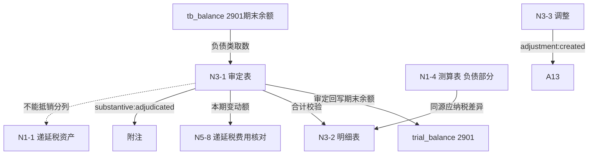

# Design Document: N3 递延所得税负债底稿专属HTML精美组件

## Overview

N3递延所得税负债底稿专属组件`n3-deferred-tax-liabilities`。N税费循环负债类底稿（1个xlsx/6 sheet/~92+公式）。科目2901递延所得税负债（**贷方/负债类科目**）。N3是N循环最简底稿。

核心架构：
- componentType `n3-deferred-tax-liabilities`，主入口 GtN3DeferredTaxLiabilities.vue
- **负债类科目**：期末=期初+贷方-借方（与N1资产类、N4/N5损益类不同）
- **税务核心引擎**：递延所得税负债=应纳税暂时性差异×适用税率（独立纯函数，与N1复用同源逻辑）
- **与N1对应**：N1-4测算表同源产出资产/负债两部分，N3接收负债部分，不能抵销的分列
- composable分层：useN3FormData + useN3FormulaEngine + useN3DeferredTaxEngine(纯函数) + useN3CrossSheet + useN3DualMode + useN3ImportExport
- EventBus联动：TB回写(2901期末余额) + N1对应 + N5递延税费用核对 + 附注

## Architecture

### sheetName分发模式（非嵌套Tab）

GtN3DeferredTaxLiabilities.vue 接收 `sheetName` prop（完整中文名如"审定表N3-1"），正则提取末尾编码(N3-1)，`v-if` 分发到对应子组件。未迁移的sheet走 OnlyOffice fallback。

```
sheetName → regex提取编码 → v-if匹配 → 子组件渲染
                                     ↘ 未匹配 → OnlyOffice fallback
```

### 负债类取数逻辑

```
负债类(N3):   期末余额=期初+本期贷方-本期借方；TB取期末余额
              2901贷方科目：贷增借减，audited_amount=期末余额
              来源: tb_balance (direction=贷)，而非 tb_ledger 发生额
```

### 递延所得税测算逻辑（核心引擎，与N1同源）

```
暂时性差异 = 账面价值 - 计税基础
  账面 > 计税基础(资产) → 应纳税暂时性差异 → 递延所得税负债(N3)
  账面 < 计税基础(负债) → 应纳税暂时性差异 → 递延所得税负债(N3)
递延所得税负债 = 应纳税暂时性差异 × 适用税率
不确认特殊项: 商誉初始确认 / 长期股权投资拟长期持有（不确认递延税负债）
```

### 文件结构

```
audit-platform/frontend/src/components/workpaper/
├── GtN3DeferredTaxLiabilities.vue           # 主入口 sheetName v-if分发
├── n3/
│   └── core/
│       ├── N3TabIndex.vue                   # 底稿目录（6行+进度条）
│       ├── N3TabAdjudication.vue            # N3-1 审定表（24×14，78公式，负债类期末）
│       ├── N3TabDetail.vue                  # N3-2 明细表（31×14，14公式）
│       ├── N3TabAdjustment.vue              # N3-3 调整分录
│       └── N3TabDisclosure.vue              # 附注披露
├── composables/
│   ├── useN3FormData.ts                     # 数据加载/selfLoad/writebackTB（期末余额！2901）
│   ├── useN3FormulaEngine.ts                # 纯函数公式引擎（负债类！期末余额）
│   ├── useN3DeferredTaxEngine.ts            # 纯函数递延税测算引擎（应纳税差异×税率）
│   ├── useN3CrossSheet.ts                   # 跨sheet + N1/N5跨底稿联动
│   ├── useN3DualMode.ts
│   ├── useN3ImportExport.ts
│   ├── useN3Adjudication.ts
│   └── useN3Detail.ts
```

### 后端文件结构

```
audit-platform/backend/
├── app/workpaper_engine/renderers/
│   └── n3_deferred_tax_liabilities_renderer.py
├── app/routers/
│   └── n3_deferred_tax_liabilities.py       # 3端点（导出模板/导出数据/导入数据）
├── app/services/
│   └── n3_deferred_tax_liabilities_service.py  # 负债类取数+递延税测算+跨底稿合计
└── data/wp_render_schema/
    └── n3-deferred-tax-liabilities.yaml
```

## Composable接口设计

### useN3FormulaEngine.ts（负债类！）

```typescript
// 审定数
export function calcAuditedAmount(unadj: number, aje: number, rje: number): number
// 负债类期末余额：期初+本期贷方-本期借方（2901贷方科目）
export function calcLiabilityEndBalance(begin: number, credit: number, debit: number): number
// 合计
export function calcSubtotal(arr: number[]): number
// 占比
export function calcProportion(item: number, total: number): number
```

### useN3DeferredTaxEngine.ts（纯函数，核心，与N1同源）

```typescript
// 应纳税暂时性差异=账面价值-计税基础
export function calcTaxableTemporaryDifference(bookValue: number, taxBase: number): number
// 递延所得税负债=应纳税暂时性差异×适用税率
export function calcDeferredTaxLiability(taxableDiff: number, taxRate: number): number
// 加权平均税率
export function calcWeightedAvgRate(taxAmounts: number[], diffs: number[]): number
```

### useN3CrossSheet.ts

```typescript
export function useN3CrossSheet(allResponses: Ref<Map<string, any>>) {
  const adjudicationVsDetail: ComputedRef<{ diff: number; isMatch: boolean }>
  const n3ToN1Correspondence: ComputedRef<{ assetPart: number; liabilityPart: number }>
  const deferredTaxChange: ComputedRef<{ change: number }>  // 供N5核对
}
```

## 数据流图



## ADR

### ADR-1: N3是负债类，贷方期末余额取数

N3递延所得税负债（科目2901）是负债类贷方科目：期末=期初+本期贷方-本期借方，TB从tb_balance取期末余额（direction=贷），与N1资产类、N4/N5损益类根本不同。

### ADR-2: 递延所得税测算引擎与N1同源

递延所得税负债=应纳税暂时性差异×适用税率，与N1递延税资产测算逻辑同源（暂时性差异=账面-计税基础）。抽为useN3DeferredTaxEngine独立纯函数便于PBT验证。N1-4测算表统一测算资产/负债两部分，N3接收负债部分。

### ADR-3: N3与N1不能抵销的分列

同一纳税主体的递延税资产与负债可抵销后净额列示；不同纳税主体不能抵销，需分别在N1/N3列示。N3展示与N1的对应关系提示。

### ADR-4: 不确认递延税负债的特殊项

商誉初始确认、拟长期持有的长期股权投资不确认递延所得税负债（准则例外），N3对这些特殊项提供说明标注而不计入测算。

## Correctness Properties

| ID | Property | 验证方法 |
|----|----------|---------|
| P1 | ∀ u,a,r: calcAuditedAmount = u+a+r | PBT |
| P2 | ∀ b,c,d: calcLiabilityEndBalance = b+c-d（负债类！） | PBT |
| P3 | ∀ bv,tb: calcTaxableTemporaryDifference = bv-tb | PBT |
| P4 | ∀ diff,rate: calcDeferredTaxLiability = diff×rate | PBT |
| P5 | ∀ arr: calcSubtotal = Σarr | PBT |

## 错误处理

| 场景 | 处理方式 |
|------|---------|
| selfLoad失败 | el-empty+重试 |
| TB无科目2901 | 提示导入试算表 |
| 负债类取数返回借方期末 | 自动切换到贷方期末+黄色警告 |
| 税率缺失/超范围(0~25%) | 红色校验提示 |
| 商誉/长期股权投资特殊项 | 提示不确认递延税负债 |
| N1数据未创建 | 黄色提示"N1未编制" |
| OO健康检查失败 | 降级HTML |
