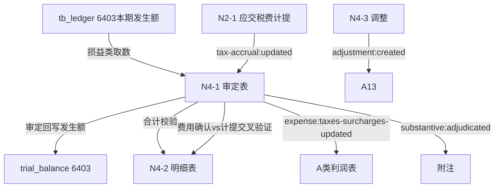

# Design Document: N4 税金及附加底稿专属HTML精美组件

## Overview

N4税金及附加底稿专属组件`n4-taxes-and-surcharges`。N税费循环损益类底稿（1个xlsx/9 sheet/~110+公式，其中O2A原底稿标记skip）。科目6403税金及附加（**损益类科目**）。

核心架构：
- componentType `n4-taxes-and-surcharges`，主入口 GtN4TaxesAndSurcharges.vue
- **损益类科目**：取本期发生额（从tb_ledger借方发生额，与H10资产处置损益、I6研发费用同款；与N1资产类、N2/N3负债类的期末余额不同）
- **多税种测算引擎**（与N2同源）：城建税及附加/房产税/印花税/土地使用税等
- **与N2计提对应**：费用确认=应交税费计提额，cross_wp_ref联动
- **与A类利润表勾稽**
- composable分层：useN4FormData + useN4FormulaEngine + useN4MultiTaxEngine(纯函数) + useN4CrossSheet + useN4DualMode + useN4ImportExport
- EventBus联动：TB回写(6403发生额) + N2计提对应 + A利润表 + 附注
- O2A原底稿标记skip

## Architecture

### sheetName分发模式（非嵌套Tab）

GtN4TaxesAndSurcharges.vue 接收 `sheetName` prop（完整中文名如"审定表N4-1"），正则提取末尾编码(N4-1)，`v-if` 分发到对应子组件。O2A原底稿走 OnlyOffice fallback（skip HTML组件化）。

```
sheetName → regex提取编码 → v-if匹配 → 子组件渲染
                                     ↘ skip/未匹配 → OnlyOffice fallback
```

### 损益类取数逻辑（关键！）

```
损益类(N4):   本期发生额（借方发生额）；从 tb_ledger 取发生额
              6403损益类科目：借方登记费用发生，audited_amount=本期发生额
              来源: tb_ledger (发生额)，而非 tb_balance 期末余额
              与H10资产处置损益、I6研发费用同款取数逻辑
```

### 多税种测算逻辑（与N2同源）

```
城建税及附加: (增值税+消费税) × 7%/5%/1%（城建）、3%（教育费附加）、2%（地方教育附加）
房产税:       从价=原值×(1-扣除比例)×1.2%；从租=租金×12%
印花税:       计税金额 × 适用税率（按合同类型：购销0.3‰/租赁1‰/借款0.05‰等）
土地使用税:   占地面积 × 单位税额
车船税/资源税: 按法定计税方式
```

### 文件结构

```
audit-platform/frontend/src/components/workpaper/
├── GtN4TaxesAndSurcharges.vue               # 主入口 sheetName v-if分发
├── n4/
│   └── core/
│       ├── N4TabIndex.vue                   # 底稿目录（9行+进度条）
│       ├── N4TabAdjudication.vue            # N4-1 审定表（24×14，83公式，损益类发生额）
│       ├── N4TabDetail.vue                  # N4-2 明细表（34×11，18公式）
│       ├── N4TabAdjustment.vue              # N4-3 调整分录
│       ├── N4TabDisclosureListed.vue        # 附注上市（18×12）
│       └── N4TabDisclosureSoe.vue           # 附注国企（17×11）
├── composables/
│   ├── useN4FormData.ts                     # 数据加载/selfLoad/writebackTB（发生额！6403损益类）
│   ├── useN4FormulaEngine.ts                # 纯函数公式引擎（损益类！发生额）
│   ├── useN4MultiTaxEngine.ts               # 纯函数多税种测算引擎（与N2同源）
│   ├── useN4CrossSheet.ts                   # 跨sheet + N2计提对应 + A利润表勾稽
│   ├── useN4DualMode.ts
│   ├── useN4ImportExport.ts
│   ├── useN4Adjudication.ts
│   └── useN4Detail.ts
```

### 后端文件结构

```
audit-platform/backend/
├── app/workpaper_engine/renderers/
│   └── n4_taxes_and_surcharges_renderer.py
├── app/routers/
│   └── n4_taxes_and_surcharges.py           # 3端点（导出模板/导出数据/导入数据）
├── app/services/
│   └── n4_taxes_and_surcharges_service.py   # 损益类取数(tb_ledger发生额)+多税种测算+N2对应
└── data/wp_render_schema/
    └── n4-taxes-and-surcharges.yaml
```

## Composable接口设计

### useN4FormulaEngine.ts（损益类！）

```typescript
// 审定数
export function calcAuditedAmount(unadj: number, aje: number, rje: number): number
// 损益类本期发生额（借方发生额，从tb_ledger取；净额=借方发生-贷方发生）
export function calcPeriodAmount(debitOccur: number, creditOccur: number): number
// 合计
export function calcSubtotal(arr: number[]): number
// 同比变动=(本期-上期)/上期
export function calcYoyChange(current: number, prior: number): number
```

### useN4MultiTaxEngine.ts（纯函数，核心，与N2同源）

```typescript
// 城建税及附加=(增值税+消费税)×税率
export function calcSurtax(vat: number, consumptionTax: number, rate: number): number
// 房产税从价=原值×(1-扣除比例)×1.2%
export function calcPropertyTaxByValue(originalValue: number, deductRate: number): number
// 印花税=计税金额×适用税率
export function calcStampTax(taxableAmount: number, rate: number): number
// 土地使用税=占地面积×单位税额
export function calcLandUseTax(area: number, unitTax: number): number
```

### useN4CrossSheet.ts

```typescript
export function useN4CrossSheet(allResponses: Ref<Map<string, any>>) {
  const adjudicationVsDetail: ComputedRef<{ diff: number; isMatch: boolean }>
  const n4VsN2Accrual: ComputedRef<{ tax: string; expense: number; accrual: number; diff: number }[]>
  const toIncomeStatement: ComputedRef<{ amount: number }>  // 供A利润表勾稽
}
```

## 数据流图



## ADR

### ADR-1: N4是损益类，取本期发生额（从tb_ledger）

N4税金及附加（科目6403）是损益类科目：取本期发生额（借方发生额），从tb_ledger取发生额，与H10资产处置损益、I6研发费用同款，而与N1资产类、N2/N3负债类的期末余额取数根本不同。这是N循环取数方向的第三种模式（发生额）。

### ADR-2: 多税种测算引擎与N2同源

N4各税种（城建税及附加/房产税/印花税/土地使用税等）测算逻辑与N2应交税费同源（计税依据×税率）。抽为useN4MultiTaxEngine纯函数便于PBT验证。计税依据取自N2测算结果。

### ADR-3: N4费用确认与N2计提对应

税金及附加的费用确认（N4）应等于应交税费的本期计提额（N2）。N4 subscribe 'tax-accrual:updated' 接收N2计提额并交叉验证，差异标红。这是N循环内部最重要的勾稽关系。

### ADR-4: 辅助sheet标记skip

O2A原底稿为参考性辅助sheet，不做HTML组件化，走OnlyOffice fallback，减少开发量聚焦核心有效sheet。

## Correctness Properties

| ID | Property | 验证方法 |
|----|----------|---------|
| P1 | ∀ u,a,r: calcAuditedAmount = u+a+r | PBT |
| P2 | ∀ d,c: calcPeriodAmount = d-c（损益类发生额！） | PBT |
| P3 | ∀ arr: calcSubtotal = Σarr | PBT |
| P4 | ∀ vat,ct,rate: calcSurtax = (vat+ct)×rate | PBT |
| P5 | ∀ ov,dr: calcPropertyTaxByValue = ov×(1-dr)×1.2% | PBT |
| P6 | ∀ amt,rate: calcStampTax = amt×rate | PBT |

## 错误处理

| 场景 | 处理方式 |
|------|---------|
| selfLoad失败 | el-empty+重试 |
| TB无科目6403 | 提示导入序时账 |
| 损益类取数返回期末余额 | 自动切换到本期发生额取数+黄色警告 |
| 税率缺失/超范围 | 红色校验提示 |
| 费用确认与N2计提额不一致 | 红色高亮差异行 |
| 上期数为0导致同比除零 | 显示"—"，不计算同比 |
| N2数据未创建 | 黄色提示"N2未编制" |
| OO健康检查失败 | 降级HTML |
