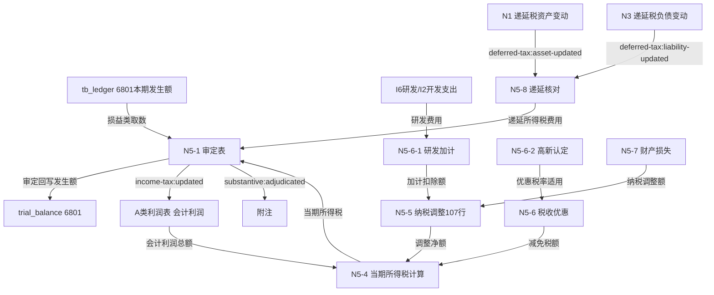

# Design Document: N5 所得税费用底稿专属HTML精美组件

## Overview

N5所得税费用底稿专属组件`n5-income-tax-expense`。N税费循环最复杂底稿（1个xlsx/15 sheet/~95+公式，含82行当期计算表+107行纳税调整大表，其中N3A原底稿标记skip）。科目6801所得税费用（**损益类科目**）。

核心架构：
- componentType `n5-income-tax-expense`，主入口 GtN5IncomeTaxExpense.vue
- **损益类科目**：取本期发生额（从tb_ledger，与N4/H10/I6同款）
- **所得税计算引擎**（核心）：应纳税所得额=会计利润±纳税调整；当期所得税=应纳税所得额×税率；所得税费用=当期+递延（独立纯函数）
- **纳税调整引擎**：调增/调减净额（107行大表虚拟滚动）
- **递延所得税费用核对**：接收N1递延税资产/N3递延税负债本期变动
- **研发加计扣除**：接收I6研发费用/I2开发支出
- **会计利润接收**：A类利润表
- composable分层：useN5FormData + useN5FormulaEngine + useN5IncomeTaxEngine(纯函数) + useN5TaxAdjustmentEngine(纯函数) + useN5CrossSheet + useN5DualMode + useN5ImportExport
- EventBus联动：TB回写(6801发生额) + N1/N3递延核对 + I6/I2研发 + A利润表 + 附注
- N3A原底稿标记skip

## Architecture

### sheetName分发模式（非嵌套Tab）

GtN5IncomeTaxExpense.vue 接收 `sheetName` prop（完整中文名如"当期所得税费用计算表N5-4"），正则提取末尾编码(N5-4/N5-6-1)，`v-if` 分发到对应子组件。N3A原底稿走 OnlyOffice fallback（skip HTML组件化）。

```
sheetName → regex提取编码 → v-if匹配 → 子组件渲染
                                     ↘ skip/未匹配 → OnlyOffice fallback
```

### 损益类取数逻辑

```
损益类(N5):   本期发生额；从 tb_ledger 取发生额
              6801损益类科目：借方登记所得税费用，audited_amount=本期发生额
              来源: tb_ledger (发生额)，而非 tb_balance 期末余额
              与N4税金及附加、H10资产处置损益、I6研发费用同款
```

### 所得税计算逻辑（核心引擎）

```
会计利润总额（A利润表） 
  + 纳税调增（N5-5） - 纳税调减（N5-5，含研发加计N5-6-1、财产损失N5-7）
  = 应纳税所得额
  × 适用税率（高新15%/一般25%，N5-6-2认定）
  - 减免税额/抵免（N5-6税收优惠）
  = 当期所得税费用（N5-4）

递延所得税费用 = 递延税负债本期增加(N3) - 递延税资产本期增加(N1)  （N5-8）

所得税费用 = 当期所得税费用 + 递延所得税费用   （N5-1）
有效税率 = 所得税费用 / 会计利润总额
```

### 文件结构

```
audit-platform/frontend/src/components/workpaper/
├── GtN5IncomeTaxExpense.vue                 # 主入口 sheetName v-if分发
├── n5/
│   ├── core/
│   │   ├── N5TabIndex.vue                   # 底稿目录（15行+进度条）
│   │   ├── N5TabAdjudication.vue            # N5-1 审定表（28×14，36公式，损益类，当期+递延）
│   │   ├── N5TabDetail.vue                  # N5-2 明细表（38×10，8公式）
│   │   ├── N5TabAdjustment.vue              # N5-3 调整分录
│   │   ├── N5TabDisclosureListed.vue        # 附注上市（29×12）
│   │   └── N5TabDisclosureSoe.vue           # 附注国企（32×255）
│   ├── calc/
│   │   ├── N5TabCurrentTaxCalc.vue          # N5-4 当期所得税计算（82×7，核心）
│   │   ├── N5TabTaxAdjustment.vue           # N5-5 纳税调整明细（107×8，虚拟滚动）
│   │   └── N5TabDeferredReconcile.vue       # N5-8 递延所得税费用核对（44×10，12公式）
│   └── benefit/
│       ├── N5TabTaxBenefit.vue              # N5-6 税收优惠（54×6，10公式）
│       ├── N5TabRdSuperDeduction.vue        # N5-6-1 研发加计扣除（43×7，17公式）
│       ├── N5TabHighTechCheck.vue           # N5-6-2 高新认定检查（18×13）
│       └── N5TabPropertyLoss.vue            # N5-7 财产损失（15×7，12公式）
├── composables/
│   ├── useN5FormData.ts                     # 数据加载/selfLoad/writebackTB（发生额！6801损益类）
│   ├── useN5FormulaEngine.ts                # 纯函数公式引擎（损益类！发生额）
│   ├── useN5IncomeTaxEngine.ts              # 纯函数所得税引擎（应纳税所得额×税率+当期+递延）
│   ├── useN5TaxAdjustmentEngine.ts          # 纯函数纳税调整引擎（调增/调减净额）
│   ├── useN5CrossSheet.ts                   # 跨sheet + N1/N3/I6/I2/A跨底稿联动
│   ├── useN5DualMode.ts
│   ├── useN5ImportExport.ts                 # 纳税调整明细分sheet导出
│   ├── useN5CurrentTaxCalc.ts
│   ├── useN5TaxAdjustment.ts
│   ├── useN5RdSuperDeduction.ts
│   └── useN5DeferredReconcile.ts
```

### 后端文件结构

```
audit-platform/backend/
├── app/workpaper_engine/renderers/
│   └── n5_income_tax_expense_renderer.py
├── app/routers/
│   └── n5_income_tax_expense.py             # 3端点（导出模板/导出数据/导入数据）
├── app/services/
│   └── n5_income_tax_expense_service.py     # 损益类取数(tb_ledger)+当期所得税计算+递延核对+研发加计
└── data/wp_render_schema/
    └── n5-income-tax-expense.yaml
```

## Composable接口设计

### useN5FormulaEngine.ts（损益类！）

```typescript
export function calcAuditedAmount(unadj: number, aje: number, rje: number): number
// 损益类本期发生额（从tb_ledger）
export function calcPeriodAmount(debitOccur: number, creditOccur: number): number
export function calcSubtotal(arr: number[]): number
// 有效税率=所得税费用/会计利润
export function calcEffectiveTaxRate(incomeTax: number, accountingProfit: number): number
```

### useN5IncomeTaxEngine.ts（纯函数，核心）

```typescript
// 应纳税所得额=会计利润+纳税调增-纳税调减
export function calcTaxableIncome(accountingProfit: number, addBack: number, deduct: number): number
// 当期所得税=应纳税所得额×适用税率
export function calcCurrentTax(taxableIncome: number, taxRate: number): number
// 所得税费用=当期所得税费用+递延所得税费用
export function calcIncomeTaxExpense(currentTax: number, deferredTax: number): number
// 递延所得税费用=递延税负债本期增加-递延税资产本期增加
export function calcDeferredTaxExpense(liabilityIncrease: number, assetIncrease: number): number
// 研发费用加计扣除额=研发费用×加计比例
export function calcRdSuperDeduction(rdExpense: number, superRate: number): number
```

### useN5TaxAdjustmentEngine.ts（纯函数）

```typescript
// 纳税调整净额=Σ调增-Σ调减
export function calcNetAdjustment(addBacks: number[], deducts: number[]): number
// 财产损失纳税调整额=账面损失-税前扣除额
export function calcPropertyLossAdjustment(bookLoss: number, deductibleLoss: number): number
```

### useN5CrossSheet.ts

```typescript
export function useN5CrossSheet(allResponses: Ref<Map<string, any>>) {
  const adjudicationVsCalc: ComputedRef<{ current: number; deferred: number; total: number }>
  const deferredReconcile: ComputedRef<{ n1Change: number; n3Change: number; deferredExpense: number }>
  const rdFromI6I2: ComputedRef<{ expensed: number; capitalized: number }>
  const profitFromIncomeStatement: ComputedRef<{ accountingProfit: number }>
  const effectiveTaxRate: ComputedRef<{ rate: number }>
}
```

## 数据流图



## ADR

### ADR-1: N5是损益类，取本期发生额（从tb_ledger）

N5所得税费用（科目6801）是损益类科目：取本期发生额，从tb_ledger取发生额，与N4税金及附加、H10资产处置损益、I6研发费用同款，而与N1资产类、N2/N3负债类的期末余额取数不同。

### ADR-2: 所得税计算引擎独立纯函数

当期所得税=应纳税所得额×税率，应纳税所得额=会计利润±纳税调整，所得税费用=当期+递延，是所得税审计核心逻辑。抽为useN5IncomeTaxEngine独立纯函数便于PBT验证。计算链跨N5-4/N5-5/N5-6/N5-8多表。

### ADR-3: 纳税调整107行大表虚拟滚动

N5-5纳税调整明细107行8列，直接渲染性能差。采用虚拟滚动（el-table-v2或vue-virtual-scroller）优化，分类小计。调整净额=Σ调增-Σ调减回填N5-4。

### ADR-4: 递延所得税费用核对接收N1/N3

递延所得税费用=递延税负债本期增加-递延税资产本期增加。N5-8 subscribe 'deferred-tax:asset-updated'(N1)+'deferred-tax:liability-updated'(N3)接收本期变动并交叉验证，避免重复计算。

### ADR-5: 研发加计扣除接收I6/I2

研发费用加计扣除额=研发费用×加计比例。N5-6-1接收I6研发费用（费用化）+I2开发支出（资本化），区分当期加计与按摊销加计。加计扣除额回填N5-5调减项。

### ADR-6: 辅助sheet标记skip

N3A原底稿为参考性辅助sheet，不做HTML组件化，走OnlyOffice fallback。

## Correctness Properties

| ID | Property | 验证方法 |
|----|----------|---------|
| P1 | ∀ u,a,r: calcAuditedAmount = u+a+r | PBT |
| P2 | ∀ d,c: calcPeriodAmount = d-c（损益类发生额！） | PBT |
| P3 | ∀ ap,add,ded: calcTaxableIncome = ap+add-ded | PBT |
| P4 | ∀ ti,rate: calcCurrentTax = ti×rate | PBT |
| P5 | ∀ cur,def: calcIncomeTaxExpense = cur+def | PBT |
| P6 | ∀ li,ai: calcDeferredTaxExpense = li-ai | PBT |
| P7 | ∀ rd,rate: calcRdSuperDeduction = rd×rate | PBT |
| P8 | ∀ adds,deds: calcNetAdjustment = Σadds-Σdeds | PBT |
| P9 | ∀ arr: calcSubtotal = Σarr | PBT |
| P10 | ∀ bl,dl: calcPropertyLossAdjustment = bl-dl | PBT |

## 错误处理

| 场景 | 处理方式 |
|------|---------|
| selfLoad失败 | el-empty+重试 |
| TB无科目6801 | 提示导入序时账 |
| 损益类取数返回期末余额 | 自动切换到本期发生额取数+黄色警告 |
| 税率缺失/超范围 | 红色校验提示 |
| 应纳税所得额为负（亏损） | 当期所得税=0，提示可结转以后年度弥补（联动N1亏损检查） |
| 递延核对与N1/N3不一致 | 红色高亮差异 |
| 高新认定条件不满足 | 红色警告，15%优惠税率不适用 |
| 会计利润为0导致有效税率除零 | 显示"—"，不计算有效税率 |
| A利润表/N1/N3/I6数据未创建 | 黄色提示对应底稿未编制 |
| 107行大表渲染卡顿 | 启用虚拟滚动 |
| OO健康检查失败 | 降级HTML |
