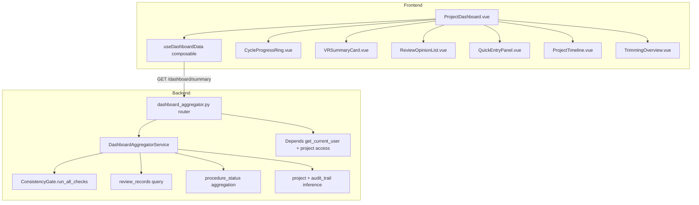

# Design Document — 合伙人仪表盘 (Partner Dashboard)

## 变更记录

| 版本 | 日期 | 变更内容 |
|------|------|----------|
| v0.1 | 2026-05-20 | 初始设计 |

---

## Overview

本设计实现项目级合伙人仪表盘页面 `/projects/:id/dashboard`，通过单个后端聚合端点 `GET /api/projects/{pid}/dashboard/summary` 组合 `consistency_gate` + `review_records` + `procedure_status` 三大数据源，前端使用 Vue 3 + ECharts（环形图）+ Element Plus 渲染 6 个核心模块。

核心设计原则：
- **单端点聚合**：一次请求获取全部仪表盘数据，减少前端并发请求数
- **零 PG 迁移**：纯聚合已有数据，不新增表/列
- **角色差异化前端控制**：后端返回全量数据，前端按角色控制模块显隐
- **优雅降级**：任一子查询失败不阻断整体响应，失败字段标记为 null + error

---

## Architecture

### 系统分层



### 数据流

1. 用户进入 `/projects/:id/dashboard` → `useDashboardData` 自动调用聚合端点
2. 后端 `DashboardAggregatorService` 并发执行 4 个子查询（cycle_progress / vr_summary / open_reviews / timeline），任一失败降级为 null
3. 前端接收响应 → 按角色过滤模块显隐 → ECharts 渲染环形图 + Element Plus 渲染列表/卡片/时间线
4. 用户点击"刷新"按钮 → composable 重新调用端点 → 响应式更新所有模块

---

## Components and Interfaces

### 页面布局（响应式网格）

```
┌─────────────────────────────────────────────────────────┐
│  项目名称 + 审计年度 + 最后更新时间 + [刷新]            │  Header
├───────────────────────────┬─────────────────────────────┤
│  Cycle Progress Ring      │  VR Summary Card            │  Row 1 (50% / 50%)
│  (ECharts 11 环形图)      │  (blocking 汇总)            │
├───────────────────────────┼─────────────────────────────┤
│  Review Opinion List      │  Quick Entry Panel          │  Row 2 (60% / 40%)
│  (优先级排序列表)          │  (B15/A15/B50-4 卡片)       │
├───────────────────────────┼─────────────────────────────┤
│  Project Timeline         │  Trimming Overview          │  Row 3 (60% / 40%)
│  (四阶段里程碑)            │  (条件渲染)                  │
└───────────────────────────┴─────────────────────────────┘
```

使用 Element Plus `el-row` + `el-col` 实现 24 栅格响应式布局：
- Row 1: `<el-col :span="12">` × 2
- Row 2: `<el-col :span="14">` + `<el-col :span="10">`
- Row 3: `<el-col :span="14">` + `<el-col :span="10">`

### 前端组件层级

```
views/ProjectDashboard.vue              ← 页面入口（路由组件）
├── components/dashboard/
│   ├── CycleProgressRing.vue           ← ECharts 环形图 × 11
│   ├── VRSummaryCard.vue               ← Blocking VR 汇总
│   ├── ReviewOpinionList.vue           ← 复核意见列表
│   ├── QuickEntryPanel.vue             ← 关键判断点入口
│   ├── ProjectTimeline.vue             ← 项目时间线
│   └── TrimmingOverview.vue            ← 裁剪汇总（条件渲染）
composables/useDashboardData.ts         ← 数据获取 + 状态管理
```

### 前端 Composable

```typescript
// useDashboardData.ts
export function useDashboardData(projectId: Ref<string>) {
  const data: Ref<DashboardSummary | null>
  const loading: Ref<boolean>
  const error: Ref<string | null>
  const lastUpdated: Ref<string | null>

  async function refresh(): Promise<void>   // 手动刷新
  function startPolling(intervalMs?: number): void  // 可选轮询（默认不启用）
  function stopPolling(): void

  // 计算属性
  const cycleProgress: ComputedRef<CycleProgressItem[]>
  const vrSummary: ComputedRef<VRSummaryData | null>
  const openReviews: ComputedRef<ReviewItem[]>
  const timeline: ComputedRef<TimelineData | null>
  const trimmingOverview: ComputedRef<TrimmingData | null>

  return { data, loading, error, lastUpdated, refresh, startPolling, stopPolling,
           cycleProgress, vrSummary, openReviews, timeline, trimmingOverview }
}
```

### 后端路由

```python
# backend/app/routers/dashboard_aggregator.py
router = APIRouter(prefix="/api/projects/{project_id}/dashboard")

@router.get("/summary")  # 聚合端点，返回全量仪表盘数据
```

### 后端服务

```python
# backend/app/services/dashboard_aggregator_service.py
class DashboardAggregatorService:
    async def get_summary(self, *, db: AsyncSession, project_id: str, user_id: str) -> DashboardSummaryResponse:
        """并发聚合 4 个子查询，任一失败降级为 null"""

    async def _aggregate_cycle_progress(self, db, project_id) -> list[CycleProgressItem] | None
    async def _aggregate_vr_summary(self, db, project_id) -> VRSummaryData | None
    async def _aggregate_open_reviews(self, db, project_id) -> list[ReviewItem] | None
    async def _aggregate_timeline(self, db, project_id) -> TimelineData | None
    async def _aggregate_trimming(self, db, project_id) -> TrimmingData | None
```

---

## Data Models

### API Response Schema

```python
class DashboardSummaryResponse(BaseModel):
    project_name: str
    audit_year: int
    last_updated: str  # ISO 8601

    cycle_progress: list[CycleProgressItem] | None = None
    vr_summary: VRSummaryData | None = None
    open_reviews: OpenReviewsData | None = None
    timeline: TimelineData | None = None
    trimming_overview: TrimmingData | None = None

    errors: dict[str, str] | None = None  # {"vr_summary": "ConsistencyGate timeout", ...}

class CycleProgressItem(BaseModel):
    cycle: str                    # "D" | "E" | ... | "N"
    cycle_name: str               # "销售收入" | "货币资金" | ...
    total_procedures: int
    completed_procedures: int
    trimmed_procedures: int
    progress_rate: float          # 0.0 ~ 100.0

class VRSummaryData(BaseModel):
    total_rules: int
    blocking_failed: int
    all_passed: bool
    by_cycle: list[CycleVRStat]

class CycleVRStat(BaseModel):
    cycle: str
    blocking_failed: int
    failed_rules: list[FailedRuleItem]

class FailedRuleItem(BaseModel):
    rule_id: str
    rule_name: str
    details: str | None = None

class OpenReviewsData(BaseModel):
    total: int
    by_layer: dict[str, int]      # {"L5": 2, "L4": 5, ...}
    items: list[ReviewItem]

class ReviewItem(BaseModel):
    id: str
    review_layer: str             # "L5" | "L4" | "L3" | "L2" | "L1"
    summary: str                  # 前 80 字符
    created_at: str
    wp_code: str
    sheet_name: str | None = None
    cell_ref: str | None = None

class TimelineData(BaseModel):
    current_stage: str            # "planning" | "execution" | "review" | "reporting"
    stages: list[StageItem]

class StageItem(BaseModel):
    name: str
    status: str                   # "completed" | "current" | "pending"
    entered_at: str | None = None
    completed_at: str | None = None
    summary: str | None = None    # 执行阶段时显示全循环完成率

class TrimmingData(BaseModel):
    available: bool               # procedure-applicability-trimming 是否已实施
    total_procedures: int
    trimmed_count: int
    trim_rate: float
    by_cycle: list[CycleTrimStat]

class CycleTrimStat(BaseModel):
    cycle: str
    total: int
    trimmed: int
    rate: float
    warning: bool                 # rate > 50%
```

### 进度率计算公式

```python
def calc_progress_rate(total: int, completed: int, trimmed: int) -> float:
    """计算循环完成率，保证结果 ∈ [0.0, 100.0]"""
    denominator = total - trimmed
    if denominator <= 0:
        return 100.0  # 全部裁剪视为完成
    rate = (completed / denominator) * 100.0
    return max(0.0, min(100.0, rate))
```

### 复核意见排序规则

```python
LAYER_PRIORITY = {"L5": 5, "L4": 4, "L3": 3, "L2": 2, "L1": 1}

def sort_reviews(items: list[ReviewItem]) -> list[ReviewItem]:
    """按层级优先级降序，同层级内按创建时间降序"""
    return sorted(items, key=lambda x: (
        -LAYER_PRIORITY.get(x.review_layer, 0),
        x.created_at  # ISO string 天然支持字典序比较（降序需 reverse）
    ), reverse=False)
    # 实际实现：primary key = -priority (desc), secondary key = -created_at (desc)
```

---

## ADR (Architecture Decision Records)

**ADR-1: 单聚合端点而非多端点**

- 决策：使用单个 `GET /api/projects/{pid}/dashboard/summary` 返回全部仪表盘数据
- 理由：①减少前端并发请求数（6 模块 → 1 请求）②降低网络延迟累积 ③简化前端 loading 状态管理 ④后端可并发执行子查询共享 DB 连接
- 权衡：响应体较大（~5-10KB），但仪表盘场景可接受；后续如需按模块懒加载可拆分

**ADR-2: ECharts 环形图而非自定义 SVG**

- 决策：使用已有 ECharts 依赖渲染 11 个循环进度环形图
- 理由：①ECharts 已在 package.json 中（零新增依赖）②环形图（gauge/pie）开箱即用 ③支持动画/tooltip/响应式 ④团队已有 ECharts 使用经验
- 权衡：ECharts 包体积较大，但已引入无增量成本

**ADR-3: 优雅降级（Graceful Degradation）**

- 决策：后端聚合端点中任一子查询失败时，将该字段设为 null 并在 `errors` 字段附带错误描述，不阻断整体响应
- 理由：①仪表盘是只读汇总页面，部分数据缺失不影响其他模块 ②避免单点故障导致整页白屏 ③前端可按字段 null 判断显示"数据获取失败"提示
- 权衡：前端需处理每个模块的 null 状态（增加少量条件渲染逻辑）

**ADR-4: 后端返回全量数据 + 前端角色控制显隐**

- 决策：后端不按角色裁剪响应体，前端通过 `currentUser.role` 控制模块显隐
- 理由：①简化后端逻辑（无需按角色分支查询）②前端角色切换时无需重新请求 ③缓存友好（同一 project 所有角色共享缓存）
- 权衡：assistant 角色会收到不展示的数据（~2KB 额外传输），可接受

---

## Correctness Properties

*A property is a characteristic or behavior that should hold true across all valid executions of a system — essentially, a formal statement about what the system should do. Properties serve as the bridge between human-readable specifications and machine-verifiable correctness guarantees.*

### Property 1: Progress rate bounds

*For any* cycle with `total_procedures >= 0`, `completed_procedures >= 0`, and `trimmed_procedures >= 0` where `completed <= total` and `trimmed <= total`, the computed `progress_rate` must satisfy `0.0 <= progress_rate <= 100.0`. Furthermore, when `total - trimmed == 0` (all trimmed), the rate must be exactly `100.0`.

**Validates: Requirements 2.2**

### Property 2: Blocking count monotone (upper bound)

*For any* VR summary response, `blocking_failed <= total_rules` must hold. Additionally, the sum of `blocking_failed` across all `by_cycle` entries must equal the top-level `blocking_failed` count (sum conservation).

**Validates: Requirements 3.1, 3.2**

### Property 3: Review sort stability

*For any* list of open review items with varying `review_layer` values and `created_at` timestamps, after sorting: (a) for any two adjacent items where `LAYER_PRIORITY[items[i].review_layer] > LAYER_PRIORITY[items[i+1].review_layer]`, the higher-priority item must come first; (b) for any two adjacent items with the same `review_layer`, the one with the more recent `created_at` must come first (time descending within same layer).

**Validates: Requirements 4.2**

---

## Error Handling

| 场景 | HTTP Code | 处理方式 |
|------|-----------|----------|
| 未认证用户 | 401 | `get_current_user` 守卫拦截 |
| 用户无项目访问权限 | 403 | 校验 project membership |
| project_id 不存在 | 404 | 标准 404 |
| 某子查询超时/异常 | 200 | 对应字段 null + errors 描述 |
| 全部子查询失败 | 200 | 所有字段 null + errors 全量描述 |
| ConsistencyGate 不可用 | 200 | vr_summary = null |
| review_records 查询失败 | 200 | open_reviews = null |

### 前端错误处理

- 整体请求失败（网络错误/401/403/404）：全页错误提示 + 重试按钮
- 部分字段 null：对应模块显示"数据获取失败，点击重试"占位卡片
- 骨架屏：loading 期间所有模块位置显示 `el-skeleton` 占位

---

## Testing Strategy

### 双重测试方法

- **单元测试**：验证具体示例、边界条件、错误处理、UI 渲染、RBAC 显隐
- **属性测试**：验证 progress_rate 边界、blocking 计数约束、排序稳定性

### 属性测试配置

- **后端库**：`hypothesis`（Python），最小 100 iterations
- **前端库**：`fast-check`（TypeScript），最小 100 iterations
- **标签格式**：`Feature: partner-dashboard, Property {N}: {property_text}`
- **每个 correctness property 对应一个 property-based test**

### 后端测试文件

| 文件 | 覆盖范围 |
|------|----------|
| `backend/tests/test_dashboard_aggregator.py` | 聚合端点 + 认证 + 降级 + 响应结构 |
| `backend/tests/test_dashboard_aggregator_service.py` | 服务层各子查询 + 排序 + 计算逻辑 |
| `backend/tests/test_dashboard_pbt.py` | Property 1-3 属性测试 |

### 前端测试文件

| 文件 | 覆盖范围 |
|------|----------|
| `frontend/src/views/__tests__/ProjectDashboard.spec.ts` | 页面渲染 + 模块显隐 + RBAC |
| `frontend/src/composables/__tests__/useDashboardData.spec.ts` | 数据拉取 + 刷新 + 错误处理 |
| `frontend/src/components/dashboard/__tests__/CycleProgressRing.spec.ts` | 环形图渲染 + 颜色映射 |
| `frontend/src/components/dashboard/__tests__/VRSummaryCard.spec.ts` | VR 汇总 + 展开 + 降级 |
| `frontend/src/components/dashboard/__tests__/ReviewOpinionList.spec.ts` | 列表排序 + 跳转 + 空状态 |

### Property → Test 映射

| Property | 测试文件 | 标签 |
|----------|----------|------|
| P1 progress rate bounds | test_dashboard_pbt.py | `Feature: partner-dashboard, Property 1: progress rate bounds` |
| P2 blocking count monotone | test_dashboard_pbt.py | `Feature: partner-dashboard, Property 2: blocking count monotone` |
| P3 review sort stability | test_dashboard_pbt.py | `Feature: partner-dashboard, Property 3: review sort stability` |

### 单元测试重点

- **具体示例**：11 循环全部 100% / 全部 0% / 混合状态
- **边界条件**：total=0 / trimmed=total / blocking=0 / reviews 为空
- **错误条件**：子查询超时 / 无权限 / project 不存在
- **RBAC**：partner 看全量 / assistant 看简化 / manager 看除裁剪外全部
- **集成点**：聚合端点 → ConsistencyGate + review_records + procedure_status 联合查询
