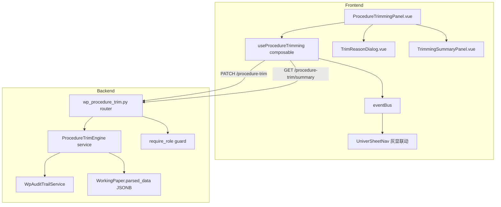

# Design Document — 程序适用性裁剪 UI

## 变更记录

| 版本 | 日期 | 变更内容 |
|------|------|----------|
| v0.1 | 2026-05-20 | 初始设计 |

---

## Overview

本设计实现"程序适用性裁剪"功能：在 WorkpaperAuditNav 中新增"程序适用性"tab，允许项目经理（manager+）对审计程序行执行单行/批量 N/A 标记、撤销恢复，并联动 sheet 灰显、审计日志、合伙人/质控汇总面板。

核心设计原则：
- **数据层零迁移**：裁剪元数据存储在 `parsed_data.trimming_metadata`（JSONB 扩展），不新增 PG 表
- **单端点批量**：前后端统一使用 `PATCH /api/projects/{pid}/workpapers/{wpId}/procedure-trim` 处理单行和批量操作
- **事件驱动联动**：裁剪/恢复后通过 `eventBus.emit('procedure-status:changed')` 触发 sheet 导航灰显刷新
- **审计日志完整性**：所有裁剪/恢复操作通过 `WpAuditTrailService.log_procedure_trim` 写入哈希链

---

## Architecture

### 系统分层



### 数据流

1. 用户在 ProcedureTrimmingPanel 点击"标记 N/A" → 弹出 TrimReasonDialog
2. 确认后前端调用 `PATCH /api/projects/{pid}/workpapers/{wpId}/procedure-trim`
3. 后端 ProcedureTrimEngine 更新 `parsed_data.procedure_status[sheetKey].{Rxx}.status = 'not_applicable'`
4. 同时写入 `parsed_data.trimming_metadata[sheetKey].{Rxx}` 记录裁剪理由/操作人/时间
5. 调用 `WpAuditTrailService.log_procedure_trim` 写入审计日志
6. 返回操作结果 → 前端 `eventBus.emit('procedure-status:changed')` → sheet 导航刷新灰显

---

## Components and Interfaces

### 前端组件层级

```
WorkpaperEditor.vue
└── WorkpaperAuditNav.vue
    ├── [现有] 认定卡片 / 风险评估 / 程序执行进度
    └── [新增] ProcedureTrimmingPanel.vue  ← 新 tab "程序适用性"
        ├── TrimmingStatsBar.vue          ← 顶部统计摘要
        ├── TrimmingProcedureList.vue     ← 程序行列表（状态 + N/A 标记）
        ├── TrimReasonDialog.vue          ← 裁剪理由选择弹窗
        ├── BatchTrimSelector.vue         ← 批量筛选器（循环/认定/风险等级）
        └── TrimmingSummaryPanel.vue      ← 合伙人/质控汇总面板
```

### 前端 Composable

```typescript
// useProcedureTrimming.ts
export function useProcedureTrimming(projectId: string, wpId: string, sheetKey: string) {
  // 状态
  const rows: Ref<TrimRow[]>           // 程序行列表（含裁剪状态）
  const stats: ComputedRef<TrimStats>  // 统计摘要
  const loading: Ref<boolean>
  const trimHistory: Ref<TrimLogEntry[]>  // 裁剪操作历史

  // 操作
  async function trimRows(rowIds: string[], reason: TrimReason): Promise<TrimResult>
  async function revertRows(rowIds: string[]): Promise<TrimResult>
  async function refresh(): Promise<void>
  async function fetchSummary(): Promise<TrimSummary>
  async function fetchHistory(filters?: HistoryFilter): Promise<TrimLogEntry[]>

  return { rows, stats, loading, trimHistory, trimRows, revertRows, refresh, fetchSummary, fetchHistory }
}
```

### 后端路由

```python
# backend/app/routers/wp_procedure_trim.py
router = APIRouter(prefix="/api/projects/{project_id}/workpapers/{wp_id}")

@router.patch("/procedure-trim")          # 单行/批量裁剪 + 恢复
@router.get("/procedure-trim/summary")    # 裁剪汇总（合伙人/质控视图）
@router.get("/procedure-trim/history")    # 裁剪操作历史（审计日志）
```

### 后端服务

```python
# backend/app/services/procedure_trim_engine.py
class ProcedureTrimEngine:
    async def trim(self, *, db, wp_id, sheet_key, row_ids, reason, user_id) -> TrimResult
    async def revert(self, *, db, wp_id, sheet_key, row_ids, user_id) -> TrimResult
    async def get_summary(self, *, db, wp_id) -> TrimSummary
    async def get_history(self, *, db, wp_id, filters) -> list[TrimLogEntry]
```

---

## Data Models

### parsed_data.trimming_metadata 结构

```json
{
  "trimming_metadata": {
    "e1a": {
      "R17": {
        "reason_code": "no_related_business",
        "reason_text": null,
        "trimmed_by": "user-uuid",
        "trimmed_at": "2026-05-20T10:30:00Z",
        "batch_id": "batch-uuid-or-null"
      },
      "R22": {
        "reason_code": "other",
        "reason_text": "客户无海外业务，外币程序不适用",
        "trimmed_by": "user-uuid",
        "trimmed_at": "2026-05-20T10:31:00Z",
        "batch_id": "batch-uuid"
      }
    }
  }
}
```

### 裁剪理由枚举

```python
class TrimReasonCode(str, Enum):
    NO_RELATED_BUSINESS = "no_related_business"      # 无相关业务
    LOW_RISK_ASSESSMENT = "low_risk_assessment"      # 风险评估为低
    CONTROL_TEST_EFFECTIVE = "control_test_effective" # 控制测试有效
    OTHER = "other"                                   # 其他（需自定义文本）
```

### API Request/Response Schema

```python
# PATCH /procedure-trim 请求体
class ProcedureTrimRequest(BaseModel):
    action: Literal["trim", "revert"]
    sheet_key: str
    row_ids: list[str]                    # ["R17", "R22", ...]
    reason_code: TrimReasonCode | None = None  # revert 时可为 None
    reason_text: str | None = None        # "其他"时必填，≥5 字符

# 响应体
class ProcedureTrimResponse(BaseModel):
    ok: bool
    action: str
    succeeded: list[str]    # 成功处理的 row_ids
    skipped: list[str]      # 跳过的 row_ids（已为目标状态）
    failed: list[str]       # 失败的 row_ids
    message: str | None = None

# GET /procedure-trim/summary 响应
class TrimSummaryResponse(BaseModel):
    total_procedures: int
    trimmed_count: int
    trim_rate: float                      # 百分比
    by_cycle: list[CycleTrimStat]         # 按循环分组
    by_reason: list[ReasonTrimStat]       # 按理由分组
    warnings: list[str]                   # 裁剪率 > 50% 的循环警告

class CycleTrimStat(BaseModel):
    cycle: str
    total: int
    trimmed: int
    rate: float
    warning: bool                         # rate > 50%

# GET /procedure-trim/history 响应
class TrimHistoryEntry(BaseModel):
    id: str
    action: Literal["trim", "revert"]
    row_ids: list[str]
    reason_code: str | None
    reason_text: str | None
    user_id: str
    user_name: str | None
    created_at: str
```

### ADR (Architecture Decision Records)

**ADR-1: 数据存储在 parsed_data 而非新 PG 表**

- 决策：裁剪元数据存储在 `WorkingPaper.parsed_data.trimming_metadata`
- 理由：①与 `procedure_status` 同层级，读写原子性好 ②不需要 Alembic 迁移 ③单底稿维度查询性能足够（单底稿程序行 ≤ 100）
- 权衡：跨底稿汇总查询需遍历多个底稿的 parsed_data，但合伙人汇总面板频率低（可接受）

**ADR-2: 单端点处理 trim + revert + 批量**

- 决策：`PATCH /procedure-trim` 通过 `action` 字段区分 trim/revert，`row_ids` 数组支持单行和批量
- 理由：①减少端点数量 ②前端调用逻辑统一 ③批量操作共享同一个 reason，天然适合数组传参
- 权衡：payload 校验稍复杂（trim 必须有 reason_code，revert 不需要）

**ADR-3: eventBus 复用现有 procedure-status:changed 事件**

- 决策：裁剪/恢复后 emit `procedure-status:changed`，不新增事件类型
- 理由：①`useProcedureStatus` 已订阅此事件并自动 refresh ②sheet 导航灰显逻辑可直接复用 ③减少事件类型膨胀
- 权衡：事件粒度较粗，但裁剪操作频率低，全量刷新可接受

**ADR-4: RBAC 使用 require_role 依赖注入**

- 决策：裁剪/恢复端点使用 `Depends(require_role(["admin", "partner", "manager"]))`
- 理由：①与现有 workhour_approve / staff handover 等端点模式一致 ②前端通过 `currentUser.role` 控制按钮显隐
- 权衡：无额外权衡，完全复用现有机制

**ADR-5: 审计日志扩展 details 字段**

- 决策：扩展 `WpAuditTrailService.log_procedure_trim` 的 details 结构，增加 `action_type`（trim/revert）、`reason_code`、`reason_text`、`batch_id` 字段
- 理由：①现有方法签名已有 `trimmed_procedures` + `reason` 参数 ②只需扩展 details dict 内容 ③审计日志查询通过 JSONB 操作符过滤
- 权衡：无


---

## Correctness Properties

*A property is a characteristic or behavior that should hold true across all valid executions of a system — essentially, a formal statement about what the system should do. Properties serve as the bridge between human-readable specifications and machine-verifiable correctness guarantees.*

### Property 1: Trim-revert round trip

*For any* procedure row in `pending` status, trimming it with a valid reason and then immediately reverting should restore the row to `pending` status with no residual trimming_metadata for that row.

**Validates: Requirements 2.4, 4.1**

### Property 2: Batch trim idempotence

*For any* set of procedure rows where some are already `not_applicable`, performing a batch trim on the entire set should: (a) skip rows already in `not_applicable` status, (b) transition remaining rows to `not_applicable`, and (c) applying the same batch trim again should produce zero additional state changes (all rows skipped).

**Validates: Requirements 3.3, 3.5**

### Property 3: Count invariant — trimmed + active = total

*For any* workpaper with N total procedure rows, after any sequence of trim and revert operations, the count of `not_applicable` rows plus the count of non-`not_applicable` rows must always equal N.

**Validates: Requirements 1.4, 7.1**

### Property 4: Batch result count conservation

*For any* batch trim/revert request with K row_ids, the response must satisfy: `len(succeeded) + len(skipped) + len(failed) == K`, and the union of these three lists must equal the input row_ids set (no duplicates, no missing).

**Validates: Requirements 3.4**

### Property 5: Sheet graying iff all associated rows N/A

*For any* sheet and its associated procedure rows, the sheet should be marked as grayed (fully not_applicable) if and only if every one of its associated procedure rows has status `not_applicable`. If at least one row is not `not_applicable`, the sheet must not be fully grayed.

**Validates: Requirements 5.1, 5.3, 5.4**

### Property 6: Audit log completeness and immutability

*For any* trim or revert operation, a new audit log entry must be created containing: action_type (trim/revert), row_ids list, reason_code, reason_text (if applicable), user_id, and timestamp. Furthermore, *for any* revert operation, all prior trim log entries for the same rows must remain unchanged in the audit log.

**Validates: Requirements 4.2, 4.3, 6.1, 6.2**

### Property 7: RBAC enforcement

*For any* user with role NOT in `["admin", "partner", "manager"]`, calling the trim or revert endpoint must return HTTP 403. *For any* user with role IN the allowed set, the same request (with valid payload) must not return 403.

**Validates: Requirements 8.1, 8.3**

### Property 8: Custom reason text validation

*For any* trim request with `reason_code = "other"`, if `reason_text` is null or has fewer than 5 characters, the request must be rejected (HTTP 422). *For any* `reason_text` with 5 or more characters, the request must be accepted.

**Validates: Requirements 2.3, 2.5**

### Property 9: Trim rate warning threshold

*For any* cycle in the trim summary, if the cycle's trim rate exceeds 50%, the cycle must appear in the warnings list. If the rate is ≤ 50%, it must not appear in warnings.

**Validates: Requirements 7.2**

### Property 10: History ordering

*For any* set of trim/revert audit log entries returned by the history endpoint, entries must be ordered by `created_at` descending (most recent first). For any two adjacent entries in the list, `entries[i].created_at >= entries[i+1].created_at`.

**Validates: Requirements 6.3**

---

## Error Handling

| 场景 | HTTP Code | 错误消息 | 处理方式 |
|------|-----------|----------|----------|
| 未选择裁剪理由 | 422 | "reason_code is required for trim action" | 前端阻止提交 + 后端二次校验 |
| "其他"理由文本 < 5 字符 | 422 | "reason_text must be at least 5 characters" | 前端实时校验 + 后端校验 |
| 非授权角色调用 | 403 | "权限不足" | require_role 守卫自动拦截 |
| 底稿不存在 | 404 | "workpaper not found" | 标准 404 |
| row_id 不存在于 procedure_status | 400 | "row {row_id} not found in sheet {sheet_key}" | 返回在 failed 列表中 |
| 并发冲突（乐观锁） | 409 | "workpaper data has been modified" | 前端提示刷新后重试 |
| 批量操作部分失败 | 200 | 正常返回，failed 列表非空 | 前端展示操作结果摘要 |

### 前端错误处理

- TrimReasonDialog 表单校验：reason_code 必选 + "其他"时 reason_text ≥ 5 字符
- 网络错误：toast 提示 + 自动重试 1 次
- 403 响应：toast "权限不足，请联系项目经理" + 隐藏操作按钮
- 批量操作部分失败：弹窗展示成功/跳过/失败明细

---

## Testing Strategy

### 双重测试方法

本功能采用 **单元测试 + 属性测试** 双轨覆盖：

- **单元测试**：验证具体示例、边界条件、错误处理、UI 渲染
- **属性测试**：验证跨所有输入的通用属性（裁剪/恢复 round-trip、幂等性、计数守恒等）

### 属性测试配置

- **库选择**：后端使用 `hypothesis`（Python），前端使用 `fast-check`（TypeScript）
- **最小迭代次数**：每个 property test 至少 100 次迭代
- **标签格式**：`Feature: procedure-applicability-trimming, Property {N}: {property_text}`
- **每个 correctness property 对应一个 property-based test**

### 后端测试文件

| 文件 | 覆盖范围 |
|------|----------|
| `backend/tests/test_procedure_trimming.py` | API 端点 + RBAC + 审计日志集成 |
| `backend/tests/test_procedure_trim_engine.py` | ProcedureTrimEngine 服务逻辑 |
| `backend/tests/test_procedure_trim_pbt.py` | Property 1-4, 6-10 属性测试 |

### 前端测试文件

| 文件 | 覆盖范围 |
|------|----------|
| `frontend/src/composables/__tests__/useProcedureTrimming.spec.ts` | composable 状态管理 + 批量操作 |
| `frontend/src/components/workpaper/__tests__/ProcedureTrimmingPanel.spec.ts` | 面板渲染 + 交互 + RBAC 按钮显隐 |
| `frontend/src/components/workpaper/__tests__/TrimReasonDialog.spec.ts` | 理由选择 + 表单校验 |
| `frontend/src/components/workpaper/__tests__/ProcedureTrimming.pbt.spec.ts` | Property 5, 9 前端属性测试 |

### Property → Test 映射

| Property | 测试文件 | 标签 |
|----------|----------|------|
| P1 trim-revert round trip | test_procedure_trim_pbt.py | `Feature: procedure-applicability-trimming, Property 1: trim-revert round trip` |
| P2 batch idempotence | test_procedure_trim_pbt.py | `Feature: procedure-applicability-trimming, Property 2: batch trim idempotence` |
| P3 count invariant | test_procedure_trim_pbt.py | `Feature: procedure-applicability-trimming, Property 3: count invariant` |
| P4 batch result count | test_procedure_trim_pbt.py | `Feature: procedure-applicability-trimming, Property 4: batch result count conservation` |
| P5 sheet graying | ProcedureTrimming.pbt.spec.ts | `Feature: procedure-applicability-trimming, Property 5: sheet graying iff all rows N/A` |
| P6 audit log completeness | test_procedure_trim_pbt.py | `Feature: procedure-applicability-trimming, Property 6: audit log completeness` |
| P7 RBAC enforcement | test_procedure_trim_pbt.py | `Feature: procedure-applicability-trimming, Property 7: RBAC enforcement` |
| P8 custom reason validation | test_procedure_trim_pbt.py | `Feature: procedure-applicability-trimming, Property 8: custom reason text validation` |
| P9 trim rate warning | ProcedureTrimming.pbt.spec.ts | `Feature: procedure-applicability-trimming, Property 9: trim rate warning threshold` |
| P10 history ordering | test_procedure_trim_pbt.py | `Feature: procedure-applicability-trimming, Property 10: history ordering` |

### 单元测试重点

- **具体示例**：单行裁剪 happy path / 批量裁剪 3 行 / 恢复单行
- **边界条件**：空 row_ids 数组 / reason_text 恰好 5 字符 / 裁剪率恰好 50%
- **错误条件**：无效 reason_code / 不存在的 row_id / 并发修改
- **集成点**：裁剪 → eventBus 事件 → sheet 灰显刷新 / 裁剪 → 审计日志写入 → 汇总面板读取
