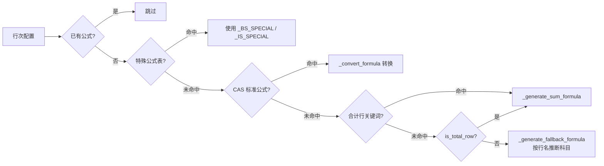

# Design Document: Report Module Enhancement

## Overview

本设计文档覆盖报表模块从 ~85% 完成度推进到生产就绪的七大增强领域：

1. **种子数据公式补全** — 利用 `ReportFormulaService.fill_all_formulas()` 的多策略公式生成管线，将 4 标准 × 4 报表类型的公式覆盖率提升至 95%+
2. **审计日志路由注册修复** — 在 `router_registry/system.py` 注册已存在的 `audit_logs` router
3. **多标准公式覆盖验证** — 新建 CLI 验证脚本，扫描 report_config 表并输出覆盖率报告
4. **CFS 自动调整规则扩展** — 在 `AUTO_ADJUSTMENT_RULES` 中补充行业常见调整项
5. **报表 API 测试基础设施修复** — 统一测试路径、依赖注入和前置条件处理
6. **报表公式 DSL 解析器健壮性** — 验证所有合法语法和边界情况的正确处理
7. **报表生成跨标准一致性** — 验证 4 个标准间行次结构和计算结果的一致性

设计原则：
- 仅修改后端代码，保持向后兼容
- 复用现有 Formula DSL 语法，不引入新语法
- 幂等操作：已有公式不覆盖，重复执行无副作用

## Architecture

```mermaid
graph TD
    subgraph "Report Module"
        RFS[ReportFormulaService<br/>公式填充]
        RE[ReportEngine<br/>公式执行]
        FP[FormulaParser<br/>DSL 解析器]
        RCS[ReportConfigService<br/>配置管理]
        CFSE[CFSWorksheetEngine<br/>现金流量表]
    end

    subgraph "Data Layer"
        RC[(report_config<br/>行次配置)]
        FR[(financial_report<br/>报表数据)]
        TB[(trial_balance<br/>试算表)]
        SEED[report_config_seed.json]
    end

    subgraph "Infrastructure"
        RR[RouterRegistry<br/>路由注册]
        REDIS[(Redis Cache)]
        VS[ValidationScript<br/>覆盖率验证]
    end

    RFS -->|fill formulas| RC
    RCS -->|load seed| SEED
    RCS -->|write| RC
    RE -->|read config| RC
    RE -->|execute formula| FP
    FP -->|resolve TB()| TB
    RE -->|write results| FR
    RE -->|cache| REDIS
    CFSE -->|read| TB
    CFSE -->|write adjustments| FR
    RR -->|register| audit_logs_router
    VS -->|scan| RC
```

### 公式填充管线（5 策略优先级）



## Components and Interfaces

### 1. ReportFormulaService（已存在，需增强）

**文件**: `backend/app/services/report_formula_service.py`

**现有接口**:
```python
class ReportFormulaService:
    async def fill_all_formulas(self, db: AsyncSession, standard: str = "all") -> dict:
        """填充 report_config 表的 formula 字段
        Returns: {total, updated, skipped, no_formula, coverage_pct}
        """
```

**增强点**:
- 补充 `_BS_SPECIAL` / `_IS_SPECIAL` 中缺失的行名映射（如金融行业特有科目）
- 确保 `_CFS_INDIRECT_SPECIAL` 覆盖 Requirement 4 中列出的所有调整项
- 标题行识别逻辑：`row_name.endswith("：") or row_name.endswith(":")` 跳过

### 2. Router Registry 修复

**文件**: `backend/app/router_registry/system.py`

**变更**: 在 `register_system_routers()` 中添加：
```python
from app.routers.audit_logs import router as audit_logs_router
app.include_router(audit_logs_router, prefix="/api", tags=["audit-logs"])
```

**注意**: `audit_logs.py` 中 router 已定义 `prefix="/audit-logs"`，注册时使用 `/api` 前缀使最终路径为 `/api/audit-logs/verify-chain`。

### 3. 覆盖率验证脚本

**文件**: `backend/scripts/validate_formula_coverage.py`

**接口**:
```python
async def validate_coverage(
    standard: str = "all",
    verbose: bool = False,
) -> dict[str, dict[str, Any]]:
    """扫描 report_config 表，返回覆盖率统计
    
    Returns: {
        "soe_consolidated": {
            "balance_sheet": {"total": N, "with_formula": N, "missing": [...], "pct": float},
            ...
        },
        ...
    }
    """
```

**CLI 参数**:
- `--standard`: 指定标准（默认 all）
- `--verbose`: 输出缺失行次详情
- 退出码：覆盖率 < 95% 时返回 1

### 4. CFS 自动调整规则扩展

**文件**: `backend/app/services/cfs_worksheet_engine.py`

**变更**: 扩展 `AUTO_ADJUSTMENT_RULES` 列表，新增规则：

| 描述 | 科目编码 | cf_row_code | category |
|------|----------|-------------|----------|
| 资产减值损失 | 6702 | CF-S04 | supplementary |
| 处置长期资产损失 | 6115 | CF-S11 | supplementary |
| 固定资产报废损失 | 6711 | CF-S11 | supplementary |
| 存货跌价准备 | 1471 | CF-S04 | supplementary |
| 坏账准备 | 1231 | CF-S04 | supplementary |
| 存货的减少 | 1401 | CF-S12 | supplementary |
| 经营性应收项目的减少 | 1122 | CF-S13 | supplementary |
| 经营性应付项目的增加 | 2202 | CF-S14 | supplementary |
| 递延所得税资产减少 | 1811 | CF-S10 | supplementary |
| 递延所得税负债增加 | 2901 | CF-S15 | supplementary |

**设计决策**: 
- 资产负债表变动项（存货/应收/应付）使用期初期末差额计算
- 减值/损失类使用本期发生额（`audited_amount - opening_balance`）
- 科目不存在时静默跳过（已有逻辑：`if tb_row is None: continue`）

### 5. 测试基础设施修复

**文件**: `backend/tests/test_report_engine.py` 及相关测试文件

**修复策略**:
- 使用 `override_auth` 模式统一注入 `get_current_user` 和 `get_db`
- 路径对齐：确认生产路由为 `GET /api/reports/{project_id}/{year}/{report_type}`
- 前置条件：通过 fixture 预先 seed report_config 数据
- prerequisite_checker mock：通过 `app.dependency_overrides` 绕过

## Data Models

### ReportConfig（已存在）

```python
class ReportConfig(Base, SoftDeleteMixin, TimestampMixin):
    report_type: Mapped[FinancialReportType]      # balance_sheet | income_statement | ...
    row_number: Mapped[int]                        # 行序号
    row_code: Mapped[str]                          # BS-001, IS-001, CF-001, EQ-001
    row_name: Mapped[str]                          # 行次名称
    indent_level: Mapped[int]                      # 缩进层级
    formula: Mapped[str | None]                    # Formula DSL 表达式
    formula_category: Mapped[str | None]           # auto_calc | logic_check | reasonability
    formula_source: Mapped[str | None]             # special | cas | auto_total | fallback_prefix
    applicable_standard: Mapped[str]               # soe_consolidated | listed_standalone | ...
    is_total_row: Mapped[bool]                     # 是否合计行
    parent_row_code: Mapped[str | None]            # 父行 row_code
```

### AUTO_ADJUSTMENT_RULES 数据结构

```python
# 每条规则的 TypedDict 结构
class AdjustmentRule(TypedDict):
    description: str                    # 调整项描述
    account_code: str                   # 试算表科目编码
    keywords: list[str]                 # 科目名称关键词（用于匹配）
    category: CashFlowCategory          # supplementary
    line_item: str                      # 现金流量表行项目名称
    cf_row_code: str                    # 对应 CFS 行次编码
```

### Formula DSL 语法（已存在，不变）

| 函数 | 语法 | 语义 |
|------|------|------|
| TB | `TB('code','col')` | 取试算表单科目值 |
| SUM_TB | `SUM_TB('start~end','col')` | 取试算表范围科目合计 |
| ROW | `ROW('row_code')` | 引用同报表其他行 |
| SUM_ROW | `SUM_ROW('start','end')` | 引用行范围合计 |
| PREV | `PREV('code','col')` | 上期值 |
| REPORT | `REPORT('row_code','col')` | 跨报表引用 |
| NOTE | `NOTE('section','table','cell')` | 附注引用 |
| WP | `WP('wp_code','cell')` | 底稿引用 |
| AUX | `AUX('code','dim','col')` | 辅助数据引用 |

支持算术运算：`+`, `-`, `*`, `/` 和括号。


## Correctness Properties

*A property is a characteristic or behavior that should hold true across all valid executions of a system — essentially, a formal statement about what the system should do. Properties serve as the bridge between human-readable specifications and machine-verifiable correctness guarantees.*

### Property 1: Formula DSL round-trip

*For any* valid Formula DSL expression (composed of TB, SUM_TB, ROW, SUM_ROW, PREV, REPORT, NOTE, WP, AUX functions with arithmetic operators), parsing the expression into an AST and then serializing it back should produce a semantically equivalent expression.

**Validates: Requirements 3.6, 6.9**

### Property 2: Formula column matches report type

*For any* non-title row in report_config where `fill_all_formulas` generates a TB() or SUM_TB() formula, the column parameter should be `'期末余额'` for balance_sheet rows and `'本期发生额'` for income_statement rows.

**Validates: Requirements 1.5, 1.6**

### Property 3: Total rows use ROW/SUM_ROW references

*For any* row where `is_total_row == True` or `row_name` contains "合计"/"小计"/"总计", if `fill_all_formulas` generates a formula, that formula should contain only ROW() or SUM_ROW() function calls (no direct TB references).

**Validates: Requirements 1.7**

### Property 4: Title rows are skipped

*For any* row where `row_name` ends with "：" or ":", running `fill_all_formulas` should leave the `formula` field as null.

**Validates: Requirements 1.8**

### Property 5: Formula fill idempotence

*For any* report_config row that already has a non-null formula, running `fill_all_formulas` should not modify that formula value.

**Validates: Requirements 1.9**

### Property 6: Missing account returns zero

*For any* formula referencing a TB('code', 'col') where 'code' does not exist in the trial_balance table, the ReportFormulaParser.execute() should return a result that treats that reference as Decimal("0") without raising an exception.

**Validates: Requirements 6.6**

### Property 7: Auto-adjustment calculation correctness

*For any* AUTO_ADJUSTMENT_RULE and any trial_balance row matching that rule's account_code, the generated adjustment amount should equal `abs(audited_amount - opening_balance)` (i.e., the period change). If the account_code does not exist in trial_balance, no adjustment should be created for that rule.

**Validates: Requirements 4.4, 4.6**

### Property 8: Auto-adjustment rules have valid metadata

*For all* rules in AUTO_ADJUSTMENT_RULES, the `category` field should be a valid CashFlowCategory enum value, and the `cf_row_code` field should match the pattern `CF-S\d{2}`.

**Validates: Requirements 4.5**

### Property 9: Cross-standard row count consistency

*For any* pair of applicable_standards in {soe_consolidated, soe_standalone, listed_consolidated, listed_standalone}, the number of rows for balance_sheet (and income_statement) should differ by no more than 20% (i.e., `max_count / min_count <= 1.2`).

**Validates: Requirements 7.4, 7.5**

### Property 10: Cross-standard shared rows produce same results

*For any* row_code that exists in both soe_consolidated and listed_consolidated report_config with the same formula, executing that formula against the same trial_balance data should produce identical Decimal results.

**Validates: Requirements 7.3**

### Property 11: Validation script correctly identifies missing formulas

*For any* set of report_config rows, the validation script should report as "missing" exactly those rows where `formula IS NULL` AND `row_name` does not end with "：" or ":".

**Validates: Requirements 3.3**

## Error Handling

### Formula Execution Errors

| Scenario | Behavior | Return Value |
|----------|----------|--------------|
| Formula is null/empty | Silent return | `Decimal("0")` |
| Referenced account not in TB | Silent return | `Decimal("0")` |
| Division by zero | Catch ZeroDivisionError | `Decimal("0")` |
| Invalid formula syntax | Log warning | `Decimal("0")` |
| ROW() references non-existent row | Use row_cache default | `Decimal("0")` |
| SUM_TB range has no matching accounts | Empty sum | `Decimal("0")` |

### CFS Auto-Adjustment Errors

| Scenario | Behavior |
|----------|----------|
| Account code not in trial_balance | Skip rule silently |
| Period change is zero | Skip (no adjustment created) |
| Amount calculation overflow | Log warning, skip rule |

### Router Registration Errors

| Scenario | Behavior |
|----------|----------|
| audit_logs module import fails | App startup fails (intentional — fail fast) |
| Duplicate prefix conflict | FastAPI raises on startup |

### Validation Script Errors

| Scenario | Behavior |
|----------|----------|
| Database connection fails | Exit code 2, stderr message |
| No report_config data found | Exit code 0, warning to stdout |
| Coverage < 95% | Exit code 1, list missing rows |

## Testing Strategy

### Testing Framework

- **Unit tests**: pytest + pytest-asyncio
- **Property-based tests**: hypothesis (Python PBT library, already in project)
- **Minimum iterations**: 15 per property test (hypothesis `settings(max_examples=15)`) — 项目约定，保证速度
- **Tag format**: Comment `# Feature: report-module-enhancement, Property N: {title}`

### Unit Tests

1. **Router registration** — verify `/api/audit-logs/verify-chain` returns 200 (not 404) after registration
2. **Coverage threshold** — seed data with known coverage, verify script exit code
3. **CFS rules presence** — verify all required adjustment items exist in `AUTO_ADJUSTMENT_RULES`
4. **Formula fill coverage** — run `fill_all_formulas` against real seed data, verify ≥ 95% per standard
5. **Test infrastructure** — verify report API endpoints respond correctly with proper auth injection

### Property-Based Tests

Each property from the Correctness Properties section maps to exactly one hypothesis test:

| Property | Test Strategy | Generator |
|----------|--------------|-----------|
| P1: Round-trip | Generate random valid ASTs, serialize → parse → compare | `st.recursive` for nested expressions |
| P2: Column match | Generate random row_name from `_NAME_TO_ACCOUNT` keys | `st.sampled_from(list(_BS_SPECIAL.keys()))` |
| P3: Total rows | Generate row configs with is_total_row=True + child rows | Custom strategy for config lists |
| P4: Title skip | Generate row_names ending with "：" or ":" | `st.text() + st.sampled_from(["：", ":"])` |
| P5: Idempotence | Generate rows with pre-existing formulas | `st.text(min_size=1)` for formula field |
| P6: Missing account | Generate random 4-digit codes not in TB fixture | `st.from_regex(r"[0-9]{4}")` filtered |
| P7: Adjustment calc | Generate TB rows with random opening/closing balances | `st.decimals(min_value=0, max_value=10**8)` |
| P8: Rule metadata | Iterate all rules, validate enum + regex | Exhaustive (not random) |
| P9: Row count | Load seed data, compare all standard pairs | Data-driven |
| P10: Shared formula | Generate shared row_codes + random TB data | `st.builds(TrialBalance, ...)` |
| P11: Missing detection | Generate mixed rows (with/without formula, title/non-title) | `st.lists(st.builds(FakeRow, ...))` |

### Test File Organization

```
backend/tests/
├── test_report_formula_service.py      # P2, P3, P4, P5 + unit tests for coverage
├── test_formula_parser_roundtrip.py    # P1: round-trip property
├── test_report_engine_properties.py    # P6, P10: engine execution properties
├── test_cfs_adjustment_rules.py        # P7, P8: CFS rule properties
├── test_report_config_consistency.py   # P9, P11: cross-standard + validation
├── test_audit_logs_registration.py     # Unit: router registration
└── test_report_api_infrastructure.py   # Unit: API test infrastructure
```

### Integration Tests

- Full `fill_all_formulas` → `generate_all_reports` pipeline with real seed data
- `auto_generate_adjustments` with seeded trial_balance
- Validation script CLI invocation with subprocess

