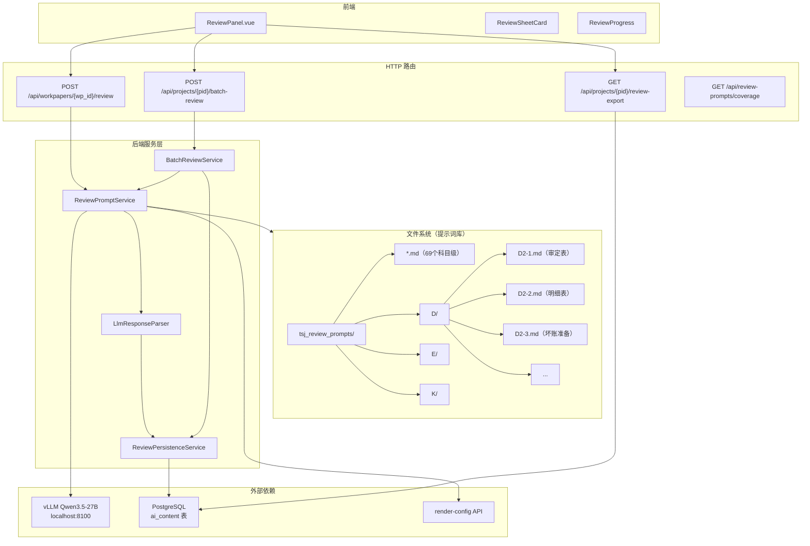

# Design Document — review-prompt-sheet-level-split

## Overview

将现有科目级审计复核提示词（69 个 .md 文件）拆分为底稿级（sheet-level），使 AI 复核精确聚焦单张底稿审计要点。核心架构：底稿级提示词文件系统 → Review_Prompt_Service（匹配/解析/降级） → 单底稿/批量 HTTP 端点 → LLM 调用 → 结构化解析 → 持久化 → 前端 ReviewPanel + Excel 导出。

试点范围：D2 应收账款（8 张底稿），设计支持按目录自动发现实现零代码推广。

## Architecture



## Components and Interfaces

### 1. ReviewPromptService（后端核心服务）

**职责**：按 wp_code + sheet_name 匹配加载底稿级提示词，支持三级降级（sheet → subject → base）。

```python
class ReviewPromptService:
    """底稿级提示词匹配加载服务"""

    def __init__(self, base_dir: Path | None = None):
        self._base_dir = base_dir or _DEFAULT_TSJ_DIR

    def resolve_sheet_suffix(self, sheet_name: str) -> str | None:
        """从 sheet_name 提取底稿编号后缀
        
        Examples:
            "审定表D2-1" → "D2-1"
            "明细表D2-2" → "D2-2"
            "D2-note-listed" → "D2-note-listed"
        """

    def load_prompt(self, wp_code: str, sheet_name: str | None = None) -> PromptResult:
        """三级降级加载提示词
        
        1. sheet-level: {cycle_letter}/{suffix}.md
        2. subject-level: {科目名}审计复核提示词.md
        3. base: 通用复核模板
        
        Returns:
            PromptResult(content, source_level, file_path, parsed_sections)
        """

    def get_coverage(self) -> CoverageReport:
        """统计提示词覆盖率"""
```

**接口契约**：
```python
@dataclass
class PromptResult:
    content: str                    # 完整提示词文本
    source_level: str               # "sheet" | "subject" | "base"
    file_path: str | None           # 来源文件路径
    tips: list[str]                 # 解析后审计要点
    checklist: list[str]            # 检查清单项
    risk_areas: list[RiskArea]      # 风险领域分级

@dataclass
class RiskArea:
    level: str   # "high" | "medium" | "low"
    text: str

@dataclass
class CoverageReport:
    total_subjects: int
    subjects_with_sheet_prompts: int
    sheet_breakdown: dict[str, list[str]]  # {wp_code_prefix: [suffixes]}
    missing_gaps: list[str]
```

### 2. BatchReviewService（批量复核编排）

**职责**：对一个科目的所有底稿逐份调用 LLM 复核，容错续行，汇总结果。

```python
class BatchReviewService:
    """批量复核编排服务"""

    def __init__(self, db: AsyncSession, prompt_service: ReviewPromptService):
        self._db = db
        self._prompt_service = prompt_service

    async def execute_batch(
        self,
        project_id: UUID,
        wp_code_prefix: str,
        year: int,
    ) -> BatchReviewReport:
        """执行批量复核
        
        1. 查 wp_index + working_paper 获取该前缀下所有底稿
        2. 对每张底稿获取 render-config 内容
        3. 逐份调用 LLM 复核（顺序执行，避免 LLM 并发压力）
        4. 解析结果 → 持久化
        5. 汇总统计返回
        """
```

### 3. LlmResponseParser（LLM 输出结构化解析）

**职责**：将 LLM 返回的复核文本解析为结构化 Review_Finding 列表。

```python
class LlmResponseParser:
    """LLM 复核输出解析器"""

    @staticmethod
    def parse(raw_text: str) -> ParseResult:
        """解析 LLM 输出为结构化发现
        
        识别策略：
        1. 找 checklist 标记（- [ ] / - [x]）
        2. 未勾选项 → Review_Finding
        3. 风险等级从所在section标题推断
        4. 解析失败 → 降级为单条 unknown 发现
        """

    @staticmethod
    def determine_pass_status(findings: list[ReviewFinding]) -> str:
        """判定整体通过状态
        
        Rules:
        - zero high-risk AND < 3 medium-risk → "pass"
        - otherwise → "fail"
        """
```

### 4. HTTP 路由层

新建 `backend/app/routers/review_prompt.py`，注册到 router_registry。

| 端点 | 方法 | 请求体 | 响应 |
|------|------|--------|------|
| `/api/workpapers/{wp_id}/review` | POST | `{sheet_name?: string}` | `ReviewResponse` |
| `/api/projects/{pid}/batch-review` | POST | `{wp_code_prefix: str, year: int}` | `BatchReviewReport` |
| `/api/projects/{pid}/review-export` | GET | query: `wp_code_prefix`, `session_id?` | Excel StreamingResponse |
| `/api/review-prompts/coverage` | GET | - | `CoverageReport` |

### 5. 前端 ReviewPanel 组件

**位置**：`audit-platform/frontend/src/components/workpaper/review/ReviewPanel.vue`

```typescript
// Props
interface ReviewPanelProps {
  projectId: string
  wpCodePrefix: string
  year: number
}

// 内部状态
interface ReviewPanelState {
  sheets: SheetReviewCard[]
  isReviewing: boolean
  progress: { current: number; total: number; currentSheet: string }
  expandedSheet: string | null
}

interface SheetReviewCard {
  sheetName: string
  wpId: string
  passStatus: 'pass' | 'fail' | 'pending' | 'review_error'
  findingCount: number
  riskDistribution: { high: number; medium: number; low: number }
  findings: ReviewFinding[]
}
```

## Data Models

### ReviewFinding（复核发现）

```python
@dataclass
class ReviewFinding:
    id: str                          # UUID
    description: str                 # 问题描述
    risk_level: str                  # "high" | "medium" | "low" | "unknown"
    pass_status: bool                # 该项是否通过
    category: str                    # 发现类别（认定检查/程序执行/数据完整性/风险评估）
    sheet_location: str | None       # 涉及底稿定位
    suggestion: str | None           # 整改建议
```

### ReviewResult（单底稿复核结果）

```python
@dataclass
class ReviewResult:
    wp_id: str
    sheet_name: str
    wp_code: str
    pass_status: str                 # "pass" | "fail" | "review_error" | "manual_review_required"
    findings: list[ReviewFinding]
    risk_summary: dict[str, int]     # {"high": n, "medium": n, "low": n}
    reviewed_at: str                 # ISO datetime
    model_used: str
    prompt_source: str               # "sheet" | "subject" | "base"
    error_message: str | None        # 仅 review_error 时有值
```

### BatchReviewReport（批量复核报告）

```python
@dataclass
class BatchReviewReport:
    session_id: str                  # 本次批量复核会话 ID
    wp_code_prefix: str
    project_id: str
    results: list[ReviewResult]      # 每张底稿的复核结果
    statistics: BatchStatistics
    execution: ExecutionMetadata

@dataclass
class BatchStatistics:
    total_sheets: int
    passed_count: int
    failed_count: int
    error_count: int
    total_findings: int
    findings_by_risk: dict[str, int]  # {"high": n, "medium": n, "low": n}

@dataclass
class ExecutionMetadata:
    start_time: str
    end_time: str
    duration_seconds: float
    model_used: str
```

### 持久化映射

| 数据 | 存储位置 | 字段映射 |
|------|---------|---------|
| 单条 Review_Finding | `ai_content` 表 | content_type="review_finding", data_sources={sheet_name, risk_level, pass_status, category, session_id, wp_code} |
| 批量复核汇总 | `ai_content` 表 | content_type="review_finding", data_sources含 batch_session_id |
| 复核会话索引 | `checklist_responses` 表 | item_id=`{wp_code}-review-session-{timestamp}`, remark=JSON(session_id, stats) |

## Correctness Properties

*A property is a characteristic or behavior that should hold true across all valid executions of a system—essentially, a formal statement about what the system should do. Properties serve as the bridge between human-readable specifications and machine-verifiable correctness guarantees.*

### Property 1: Sheet suffix extraction round-trip

*For any* sheet_name string containing a valid wp_code pattern (e.g., "审定表D2-1", "D2-note-listed"), the `resolve_sheet_suffix` function SHALL extract a suffix that, when used to construct a file path, produces a path containing that suffix.

**Validates: Requirements 2.1**

### Property 2: Prompt resolution specificity ordering

*For any* wp_code and sheet_name where both a sheet-level prompt file and a subject-level prompt file exist, `load_prompt` SHALL return the sheet-level prompt (source_level="sheet"), never the less-specific subject-level.

**Validates: Requirements 2.4**

### Property 3: Fallback completeness

*For any* wp_code and sheet_name combination where no sheet-level prompt file exists, `load_prompt` SHALL return a non-empty prompt (either subject-level or base), never returning empty/None.

**Validates: Requirements 1.4, 10.4**

### Property 4: File path construction determinism

*For any* valid wp_code (matching pattern `[A-Z]\d+(-\d+|-[a-z]+-[a-z]+)?`), the cycle_letter derivation SHALL equal the first character of the wp_code, and the constructed path SHALL be `{base_dir}/{cycle_letter}/{suffix}.md`.

**Validates: Requirements 2.2**

### Property 5: Pass/fail determination correctness

*For any* set of ReviewFinding objects, the overall pass_status SHALL be "pass" if and only if the count of findings with risk_level="high" is zero AND the count with risk_level="medium" is fewer than 3.

**Validates: Requirements 8.3**

### Property 6: Batch resilience (error isolation)

*For any* batch of N sheets where K sheets (0 ≤ K < N) produce LLM errors, the BatchReviewReport SHALL contain exactly N results, with K marked as "review_error" and (N-K) containing valid ReviewResult with findings.

**Validates: Requirements 4.4**

### Property 7: Append-only persistence

*For any* sequence of M reviews triggered for the same sheet (same wp_id + sheet_name), the total count of ai_content records for that workpaper SHALL be monotonically non-decreasing (never fewer records after a new review).

**Validates: Requirements 5.3**

### Property 8: Finding traceability

*For any* persisted ReviewFinding, the associated ai_content record SHALL have non-null project_id, non-null workpaper_id, and data_sources containing a non-empty review_session_id.

**Validates: Requirements 5.4**

### Property 9: Batch statistics consistency

*For any* BatchReviewReport, statistics.total_sheets SHALL equal len(results), and statistics.passed_count + statistics.failed_count + statistics.error_count SHALL equal statistics.total_sheets.

**Validates: Requirements 4.3**

### Property 10: Export worksheet count

*For any* batch review export, the generated Excel workbook SHALL contain exactly (number of reviewed sheets + 1) worksheets, where the first worksheet is the summary sheet.

**Validates: Requirements 7.1**

### Property 11: RFC5987 filename encoding validity

*For any* Chinese filename string, the RFC5987 encoded Content-Disposition header SHALL contain `filename*=UTF-8''` followed by percent-encoded UTF-8 bytes, and SHALL be decodable back to the original filename.

**Validates: Requirements 7.4**

### Property 12: Parse degradation safety

*For any* raw LLM output string (including empty, purely garbage, or well-formed), the `LlmResponseParser.parse` SHALL return a ParseResult with at least one finding (possibly risk_level="unknown" for malformed input), never raising an unhandled exception.

**Validates: Requirements 8.4**

## Error Handling

| 场景 | 处理策略 | 用户感知 |
|------|---------|---------|
| 提示词文件不存在 | 三级降级（sheet→subject→base） | 无感，复核正常执行 |
| LLM 不可用/超时 | 熔断器（已有 llm_client._CircuitBreaker）+ 返回降级文本 | 提示 "AI 复核暂时不可用" |
| 单底稿 LLM 调用失败 | 标记 review_error，批量模式继续下一张 | 该张显示错误图标 |
| LLM 输出无法解析 | 存储原文为单条 unknown finding | 显示 "需人工复核" 标签 |
| render-config 获取失败 | 跳过该底稿，标记 review_error | 同上 |
| 导出时无复核结果 | 返回 404 + 提示信息 | 按钮 disabled 或提示"请先执行复核" |
| 并发批量复核 | per-project 串行（锁或 409）| 提示 "该项目正在复核中" |
| 数据库写入失败 | 事务回滚，返回 500 | ElMessage.error |

## Testing Strategy

### Property-Based Tests (Hypothesis)

使用 `hypothesis` 库，每个属性最少 100 次迭代，标签格式 `Feature: review-prompt-sheet-level-split, Property {N}: {text}`。

- **P1**: 生成各种 sheet_name 字符串（含中文+编号），测试 suffix 提取
- **P2**: 生成有/无 sheet 文件的目录结构，测试优先级
- **P3**: 生成不存在的 wp_code，测试降级返回非空
- **P4**: 生成合法 wp_code，测试路径构造
- **P5**: 生成 findings 列表（不同 risk_level 组合），测试 pass/fail 判定
- **P6**: 生成批量 N 张底稿 + K 个失败位，测试结果完整性
- **P7**: 多次调用同一 sheet review，测试记录数单调递增
- **P9**: 生成批量报告，测试统计一致性
- **P10**: 生成不同底稿数量，测试 Excel worksheet 数
- **P11**: 生成随机中文文件名，测试 RFC5987 编码/解码 round-trip
- **P12**: 生成各种（含乱码）LLM 输出，测试解析不崩溃

### Unit Tests (pytest)

- ReviewPromptService.resolve_sheet_suffix: 具体 sheet_name → suffix 映射示例
- LlmResponseParser.parse: 已知 LLM 输出格式的解析验证
- BatchStatistics 聚合计算
- Excel 导出列结构与格式

### Integration Tests

- POST /api/workpapers/{wp_id}/review 端点路由与响应结构
- POST /api/projects/{pid}/batch-review 批量调用端点
- GET /api/review-prompts/coverage 覆盖率端点
- ai_content 表写入与查询
- 前端 ReviewPanel 挂载与数据展示（Playwright）
