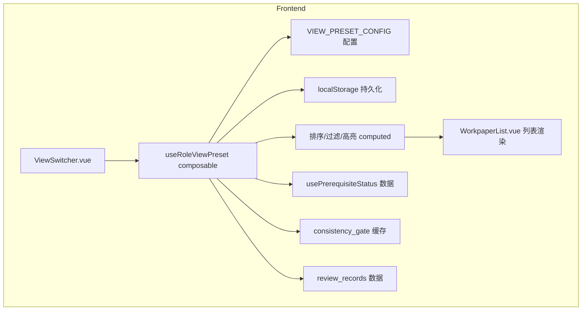

# Design Document — 角色视图切换 (Role-Based View Switching)

## 变更记录

| 版本 | 日期 | 变更内容 |
|------|------|----------|
| v0.1 | 2026-05-20 | 初始设计 |

---

## Overview

本设计实现 WorkpaperList 页面的"角色视图切换"功能：在筛选栏左侧新增 ViewSwitcher 下拉组件，提供 4 种角色视图预设（助理/经理/合伙人/质控），每种预设定义独立的排序/过滤/高亮规则。视图偏好持久化到 localStorage，页面刷新后自动恢复。

核心设计原则：
- **纯前端实现**：不新增后端端点，所有排序/过滤/高亮在前端完成，复用已有缓存数据
- **配置驱动**：4 种视图预设通过声明式 JSON 配置定义，新增视图只需添加配置
- **数据不变性**：视图切换仅改变展示方式，不修改底层数据（质控视图为过滤子集但不删除）
- **渐进增强**：ViewSwitcher 仅在 viewMode='list' 时显示，不影响其他 6 种视图模式

---

## Architecture

### 系统分层



### 数据流

1. 页面加载 → `useRoleViewPreset` 初始化：读 localStorage → 无效则按角色选默认视图
2. 用户切换视图 → 更新 `activePreset` ref → 写 localStorage → 触发 computed 重算
3. computed 链：`sortedList` / `filteredList` / `highlightMap` 根据 activePreset 配置重新计算
4. WorkpaperList 模板消费 computed 结果渲染列表行（样式/排序/分组/badge）

---

## Components and Interfaces

### 前端组件层级

```
WorkpaperList.vue
├── [现有] GtPageHeader + GtToolbar + 筛选栏
├── [新增] ViewSwitcher.vue          ← 筛选栏左侧 el-select
└── [现有] el-table / 分组渲染
    └── [新增] 行级高亮样式 + badge（由 useRoleViewPreset 驱动）
```

### useRoleViewPreset Composable

```typescript
// frontend/src/composables/useRoleViewPreset.ts

export type ViewPresetId = 'assistant' | 'manager' | 'partner' | 'qc'

export interface ViewPresetConfig {
  id: ViewPresetId
  label: string
  sortFn: (a: WpItem, b: WpItem) => number
  filterFn?: (item: WpItem) => boolean          // 质控视图用
  groupBy?: (item: WpItem) => string            // 经理视图用
  highlightRules: HighlightRule[]
  badgeRules?: BadgeRule[]
  summaryFn?: (items: WpItem[]) => SummaryData  // 合伙人/质控顶部汇总
}

export interface HighlightRule {
  condition: (item: WpItem, ctx: HighlightContext) => boolean
  style: Record<string, string>   // CSS 样式对象
  tooltip?: (item: WpItem, ctx: HighlightContext) => string
}

export interface BadgeRule {
  position: 'right'
  value: (item: WpItem) => number
  type: (val: number) => 'danger' | 'warning' | 'info'
  visible: (val: number) => boolean
}

export interface HighlightContext {
  prerequisiteStatus: Map<string, PrereqResult>   // wp_code → overall/items
  consistencyGate: Map<string, VRResult>          // wp_code → blocking/warning/info
  reviewRecords: Map<string, ReviewRecord[]>      // wp_code → open review records
}

export function useRoleViewPreset(
  projectId: Ref<string>,
  userId: Ref<string>,
  wpList: Ref<WpItem[]>,
  searchKeyword: Ref<string>,
  manualFilters: Ref<ManualFilters>
) {
  const activePreset: Ref<ViewPresetId>
  const presetConfig: ComputedRef<ViewPresetConfig>

  // 输出
  const processedList: ComputedRef<WpItem[]>       // 排序+过滤后的列表
  const highlightMap: ComputedRef<Map<string, RowHighlight>>  // wp_id → 行样式
  const badgeMap: ComputedRef<Map<string, BadgeData>>         // wp_id → badge 数据
  const groupedList: ComputedRef<GroupedData[] | null>        // 经理视图分组
  const summaryData: ComputedRef<SummaryData | null>          // 顶部汇总

  function switchPreset(id: ViewPresetId): void
  function getDefaultPreset(role: string): ViewPresetId

  return {
    activePreset, presetConfig,
    processedList, highlightMap, badgeMap, groupedList, summaryData,
    switchPreset, getDefaultPreset
  }
}
```

### ViewSwitcher.vue 组件

```typescript
// frontend/src/components/workpaper/ViewSwitcher.vue
// Props
interface Props {
  modelValue: ViewPresetId
  disabled?: boolean
}
// Emits
const emit = defineEmits<{
  'update:modelValue': [value: ViewPresetId]
}>()
```

简单的 `el-select` 包装组件，4 个选项带图标前缀：
- 👤 助理视图
- 📊 经理视图
- 🔍 合伙人视图
- ✅ 质控视图

---

## Data Models

### VIEW_PRESET_CONFIG 配置 Schema

```typescript
// frontend/src/composables/viewPresetConfig.ts

export const VIEW_PRESET_CONFIG: Record<ViewPresetId, ViewPresetConfig> = {
  assistant: {
    id: 'assistant',
    label: '助理视图',
    sortFn: statusPrioritySort,  // pending→in_progress→completed→reviewed
    highlightRules: [
      {
        // 前置依赖未满足 → 橙色左边框
        condition: (item, ctx) => ctx.prerequisiteStatus.get(item.wp_code)?.overall === 'blocked',
        style: { borderLeft: '3px solid #e6a23c' },
        tooltip: (item, ctx) => `缺失前置: ${ctx.prerequisiteStatus.get(item.wp_code)?.items.map(i => i.wp_code).join(', ')}`
      },
      {
        // 已完成/已复核 → 灰色文字
        condition: (item) => ['completed', 'reviewed'].includes(item.status),
        style: { color: '#999' }
      }
    ]
  },
  manager: {
    id: 'manager',
    label: '经理视图',
    sortFn: wpCodeNaturalSort,   // 分组内按 wp_code 自然排序
    groupBy: (item) => item.audit_cycle,
    highlightRules: []           // 经理视图无行级高亮，用分组头进度条
  },
  partner: {
    id: 'partner',
    label: '合伙人视图',
    sortFn: riskLevelSort,       // 高风险→中风险→低风险
    highlightRules: [
      {
        // blocking VR 未通过 → 红色背景 + 红色左边框
        condition: (item, ctx) => {
          const vr = ctx.consistencyGate.get(item.wp_code)
          return vr?.blocking_count > 0
        },
        style: { backgroundColor: 'rgba(255,0,0,0.08)', borderLeft: '3px solid #f56c6c' }
      }
    ],
    badgeRules: [
      {
        position: 'right',
        value: (item) => item._openReviewCount ?? 0,
        type: (val) => val > 0 ? 'danger' : 'info',
        visible: (val) => val > 0
      }
    ],
    summaryFn: partnerSummary    // blocking 总数 + 未解决复核意见总数
  },
  qc: {
    id: 'qc',
    label: '质控视图',
    sortFn: riskLevelSort,
    filterFn: isKeyJudgmentPoint, // B15/A15/B50-4/各循环审定表
    highlightRules: [
      {
        // 未复核 → 黄色背景
        condition: (item) => item.review_status !== 'reviewed',
        style: { backgroundColor: 'rgba(255,200,0,0.08)' }
      }
    ],
    summaryFn: qcSummary         // 抽查路径建议
  }
}
```

### localStorage 持久化 Schema

```
Key:    gt_wp_view_preset_{userId}
Value:  "assistant" | "manager" | "partner" | "qc"
```

读取时校验值是否为有效 ViewPresetId，无效则忽略并回退角色默认。

### 角色→默认视图映射

```typescript
const ROLE_DEFAULT_MAP: Record<string, ViewPresetId> = {
  assistant: 'assistant',
  auditor: 'assistant',
  manager: 'manager',
  partner: 'partner',
  qc: 'qc',
  admin: 'partner',
  eqcr: 'qc'
}
```

### 辅助排序函数

```typescript
// 状态优先级排序（助理视图）
const STATUS_PRIORITY: Record<string, number> = {
  pending: 0, in_progress: 1, completed: 2, reviewed: 3
}
function statusPrioritySort(a: WpItem, b: WpItem): number {
  return (STATUS_PRIORITY[a.status] ?? 99) - (STATUS_PRIORITY[b.status] ?? 99)
}

// 风险等级排序（合伙人视图）— 基于 consistency_gate 缓存
function riskLevelSort(a: WpItem, b: WpItem): number {
  return getRiskLevel(a) - getRiskLevel(b)  // 0=高 1=中 2=低
}

// wp_code 自然排序（经理视图分组内）
function wpCodeNaturalSort(a: WpItem, b: WpItem): number {
  return a.wp_code.localeCompare(b.wp_code, undefined, { numeric: true })
}

// 质控视图过滤：关键判断点底稿
const QC_FILTER_PATTERN = /^(B15|A15|B50-4|[A-Z]\d+-1$)/
function isKeyJudgmentPoint(item: WpItem): boolean {
  return QC_FILTER_PATTERN.test(item.wp_code)
}
```

### ADR (Architecture Decision Records)

**ADR-1: 配置驱动而非硬编码分支**

- 决策：4 种视图预设通过 `VIEW_PRESET_CONFIG` 声明式配置定义
- 理由：①新增视图只需添加配置对象 ②排序/过滤/高亮规则可独立测试 ③避免 WorkpaperList.vue 中大量 if/else 分支
- 权衡：配置对象需要类型安全，TypeScript 接口约束

**ADR-2: composable 封装而非 store**

- 决策：使用 `useRoleViewPreset` composable 而非 Pinia store
- 理由：①视图预设是页面级状态，不需要跨页面共享 ②composable 生命周期与组件绑定，自动清理 ③与现有 `usePrerequisiteStatus` / `usePermission` 模式一致
- 权衡：如果未来需要跨页面共享视图状态，需升级为 store（当前需求不需要）

**ADR-3: 复用已有缓存数据**

- 决策：高亮规则引擎通过 `HighlightContext` 注入已有数据源
- 理由：①`usePrerequisiteStatus` 已有前置依赖缓存 ②`consistency_gate` VR 结果已有缓存 ③`review_records` 已有数据 ④不新增 API 请求
- 权衡：数据可能有短暂不一致（缓存未刷新），但视图切换 ≤ 100ms 要求决定了不能等待网络

**ADR-4: 经理视图分组用 computed 而非虚拟滚动**

- 决策：经理视图按 audit_cycle 分组使用 computed + v-for 渲染折叠组
- 理由：①单项目底稿数通常 ≤ 500，分组后每组 ≤ 50 ②折叠交互需要 DOM 状态 ③虚拟滚动与分组折叠冲突
- 权衡：超大项目（>1000 底稿）可能有性能问题，但当前业务规模不需要

---

## Correctness Properties

*A property is a characteristic or behavior that should hold true across all valid executions of a system — essentially, a formal statement about what the system should do. Properties serve as the bridge between human-readable specifications and machine-verifiable correctness guarantees.*

### Property 1: View switch data invariant

*For any* workpaper list and any sequence of view switches between non-QC views (assistant/manager/partner), the set of workpaper IDs in the processed output must equal the set of workpaper IDs in the original input. For switches to QC view, the output ID set must be a subset of the input. For switches from QC view to any other view, the full original set must be restored.

**Validates: Requirements 7.2, 7.3**

### Property 2: Persistence round-trip

*For any* valid ViewPresetId and any userId, writing the preset to localStorage via `switchPreset()` and then reading it back via the initialization logic must produce the same ViewPresetId. Additionally, for any invalid string stored in localStorage, the read logic must return the role-appropriate default preset (not throw or return undefined).

**Validates: Requirements 2.1, 2.2, 2.3, 2.4**

### Property 3: Sort stability

*For any* workpaper list where multiple items share the same sort key (same status in assistant view, same risk level in partner view, same audit_cycle+wp_code prefix in manager view), the relative order of those equal-key items must be preserved across view switches — i.e., the sort is stable.

**Validates: Requirements 3.1, 4.5, 5.1**

---

## Error Handling

| 场景 | 处理方式 |
|------|----------|
| localStorage 写入失败（隐私模式/配额满） | console.warn + 降级为内存态（当前会话有效，刷新后回退角色默认） |
| localStorage 值被篡改为无效字符串 | 忽略无效值，回退角色默认视图 |
| usePrerequisiteStatus 数据未加载完成 | 高亮规则跳过该条件（不高亮），数据就绪后自动触发 computed 重算 |
| consistency_gate 缓存为空 | 合伙人视图所有底稿视为"低风险"（无高亮），不阻断渲染 |
| review_records 加载失败 | badge 显示 0，不阻断渲染 |
| 质控视图过滤结果为空 | 显示空状态提示"当前项目暂无关键判断点底稿" |

---

## Testing Strategy

### 双重测试方法

本功能采用 **单元测试 + 属性测试** 双轨覆盖：

- **单元测试**：验证具体示例、边界条件、UI 渲染、组件交互
- **属性测试**：验证跨所有输入的通用属性（数据守恒、持久化 round-trip、排序稳定性）

### 属性测试配置

- **库选择**：前端使用 `fast-check`（TypeScript）
- **最小迭代次数**：每个 property test 至少 100 次迭代
- **标签格式**：`Feature: role-based-view-switching, Property {N}: {property_text}`
- **每个 correctness property 对应一个 property-based test**

### 测试文件

| 文件 | 覆盖范围 |
|------|----------|
| `frontend/src/composables/__tests__/useRoleViewPreset.spec.ts` | composable 逻辑 + 角色默认映射 + localStorage 读写 + 排序/过滤/高亮计算 |
| `frontend/src/components/workpaper/__tests__/ViewSwitcher.spec.ts` | 下拉组件渲染 + 切换事件 + 选项列表 + disabled 状态 |
| `frontend/src/composables/__tests__/useRoleViewPreset.pbt.spec.ts` | Property 1-3 属性测试 |

### Property → Test 映射

| Property | 测试文件 | 标签 |
|----------|----------|------|
| P1 data invariant | useRoleViewPreset.pbt.spec.ts | `Feature: role-based-view-switching, Property 1: view switch data invariant` |
| P2 persistence round-trip | useRoleViewPreset.pbt.spec.ts | `Feature: role-based-view-switching, Property 2: persistence round-trip` |
| P3 sort stability | useRoleViewPreset.pbt.spec.ts | `Feature: role-based-view-switching, Property 3: sort stability` |

### 单元测试重点

- **具体示例**：助理视图 pending 排在 completed 前 / 合伙人视图 blocking 底稿红色高亮 / 质控视图仅显示 B15/A15 等
- **边界条件**：空底稿列表 / 所有底稿同状态 / localStorage 被清空 / 无 VR 数据
- **集成点**：ViewSwitcher 切换 → processedList 变更 / localStorage 写入 → 页面刷新恢复 / 搜索关键词 + 视图预设叠加
