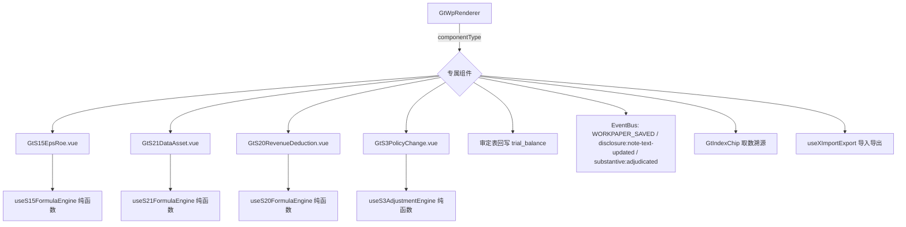

# Design Document

> S 类计算型专项底稿专属组件（S3 / S15 / S20 / S21）

## Overview

为 4 个计算密集型 S 类专项底稿开发专属组件，均对齐 D4 标准：**sheetName v-if 分发 + composable 公式引擎分层（纯函数）+ 审定表回写 trial_balance + EventBus 联动 + GtIndexChip + 导入导出**。不使用内部 el-tabs。

- `s15-eps-roe`：每股收益（基本/稀释）与净资产收益率（全面摊薄/加权平均）计算
- `s21-data-asset`：数据资产开发支出资本化按月归集与占比、成本归集分摊、摊销政策
- `s20-revenue-deduction`：营业收入扣除项目汇总、占比、扣除后金额
- `s3-policy-change`：会计政策变更/前期差错/估计变更 + 首次执行新准则调整 + 简化追溯调整法

## Architecture



每个组件接收 `sheetName` prop，用 v-if 分发其内部各 sheet（审定表 / 计算表 / 子表）。

## Components and Interfaces

### 组件与 sheet 分发

| 组件 | sheetName 分发的 sheet |
|------|------------------------|
| GtS15EpsRoe | 审定表S15-1 / 审计程序S15 / 基本每股收益S15-2 / 稀释每股收益S15-3 / 净资产收益率S15-4 |
| GtS21DataAsset | 数据资产S21 / 基本情况S21-1 / 开发支出资本化S21-2 / 成本归集分摊S21-3 / 摊销政策S21-4 |
| GtS20RevenueDeduction | 营业收入扣除情况核查（单 sheet 多区段） |
| GtS3PolicyChange | 审定表 / S3-1 / S3-2 / S3-4 / S3-6 / S3-8 / S3-9 / S3-10 |

### useS15FormulaEngine（纯函数）

```typescript
export interface EpsInput {
  npAttrParent: number      // 归母净利润 a1
  npAttrParentEx: number    // 扣非归母净利润 a2
  shareOpening: number      // 期初股份 b0
  shareCapitalized: number  // 转增/股票股利 b1
  newIssue: { count: number; monthsToEnd: number }  // c1,c2
  debtToEquity: { count: number; monthsToEnd: number } // d1,d2
  repurchase: { count: number; monthsToEnd: number }   // e1,e2
  merged: number            // 并股 b4
  periodMonths: number      // m0
}
// 加权平均股数 b = b0 + b1 + (c1*c2/m0 + d1*d2/m0) - (e1*e2/m0) - b4
export function calcWeightedAvgShares(i: EpsInput): number
export function calcBasicEps(i: EpsInput): { eps: number; epsEx: number; unable: boolean }

export interface RoeInput {
  np: number; npEx: number; e0: number; eEnd: number; minorityEquity: number
  ei: number; mi: number; ej: number; mj: number; ek: number; mk: number; m0: number
}
// 全面摊薄 ROE = P / E; 加权平均 ROE = P / (E0 + NP/2 + Ei*Mi/M0 - Ej*Mj/M0 ± Ek*Mk/M0)
export function calcDilutedRoe(i: RoeInput): { fullyDiluted: number; weightedAvg: number; unable: boolean }
```

### useS20FormulaEngine（纯函数）

```typescript
export interface RevenueDeductionInput {
  mainBusiness: number[]     // 主营业务收入明细
  otherBusiness: number[]    // 其他业务收入明细
  unrelatedRevenue: number   // 与主营业务无关的业务收入
  noSubstanceRevenue: number // 不具备商业实质的收入
}
export function calcRevenueDeduction(i: RevenueDeductionInput): {
  revenue: number            // = SUM(main) + SUM(other)
  deductionTotal: number     // = unrelated + noSubstance
  deductionRatio: number     // = deductionTotal / revenue
  revenueAfterDeduction: number // = revenue - deductionTotal
}
```

### useS21FormulaEngine（纯函数）

```typescript
export interface CapitalizationInput {
  monthly: Record<string, number[]>  // 类目 → 12 月金额
}
export function calcCapitalization(i: CapitalizationInput): {
  categoryTotals: Record<string, number>   // 各类目 = SUM(12 月)
  total: number                            // 资本化总额
  categoryRatios: Record<string, number>   // 各类目占比
  monthlyRatios: number[]                  // 各月比例
}
```

### 后端

- **wp_code_overrides.json**：`S3→s3-policy-change`、`S15→s15-eps-roe`、`S20→s20-revenue-deduction`、`S21→s21-data-asset`；各底稿子 sheet 编码由主组件内部分发（不单列目录）
- **VALID_COMPONENT_TYPES**：新增上述 4 类
- **htmlRendererRegistry.ts**：新增 4 个成员 + defineAsyncComponent + contextProps `standard`
- **RENDERER_DISPATCH**：为 4 类注册后端 render 策略（避免 onlyoffice-sheet 兜底吞掉）
- **render schema yaml + guidance**：各底稿新增 wp_render_schema 与 wp_guidance
- **审定表回写**：service 层将 audited_amount 写回 trial_balance（v2 正数），仅 flush 不 commit
- **导入导出三端点**：复用现有导出模板/导出数据/导入数据端点

## Data Models

### trial_balance 回写

- `trial_balance`：standard_account_code / unadjusted_amount / aje_adjustment / audited_amount（v2 正数口径）
- S15/S20 取审定数（audited_amount）作为净利润/营业收入计算输入
- 损益类取发生额从 tb_ledger（若涉及）

### 数据流

```
点击 S3/S15/S20/S21 → GtWpRenderer(componentType) → 对应专属组件(sheetName v-if 分发)
  onMounted:
    1. 加载底稿数据 + auto_data_source resolver 自动取数（未审数/调整/审定数）
    2. useXFormulaEngine 计算派生单元格（实时重算，公式列只读）
    3. 审定表编辑 → 回写 trial_balance（flush） → EventBus WORKPAPER_SAVED
    4. 披露文本编辑 → EventBus disclosure:note-text-updated
    5. 订阅 substantive:adjudicated → 刷新取数
```

## Correctness Properties

*属性是系统在所有合法执行路径下都应保持为真的行为声明。*

### Property 1: componentType 注册与分发完整性

*For any* wp_code 属于 {S3, S15, S20, S21}，其 wp_code_overrides 映射应为对应专属 componentType，且该 componentType 在 htmlRendererRegistry 与 VALID_COMPONENT_TYPES 均已注册。

**Validates: Requirements 1.1, 1.2, 1.3**

### Property 2: 加权平均股数计算正确性

*For any* EpsInput，`calcWeightedAvgShares` 应等于 b0 + b1 + (c1×c2/m0 + d1×d2/m0) - (e1×e2/m0) - b4；且 m0 > 0。当 m0 = 0 时返回不可计算标识。

**Validates: Requirements 2.1, 2.2**

### Property 3: 基本每股收益计算正确性

*For any* EpsInput（加权平均股数 b ≠ 0），basicEps = a1/b，basicEpsEx = a2/b；b = 0 时 unable = true。

**Validates: Requirements 2.3**

### Property 4: 净资产收益率计算正确性

*For any* RoeInput（E、加权平均净资产 ≠ 0），fullyDiluted = P/E，weightedAvg = P/(E0 + NP/2 + Ei×Mi/M0 - Ej×Mj/M0 + Ek×Mk/M0)；分母为 0 时 unable = true。

**Validates: Requirements 3.1, 3.2, 3.5**

### Property 5: 营业收入扣除计算正确性

*For any* RevenueDeductionInput，revenue = SUM(main)+SUM(other)，deductionTotal = unrelated+noSubstance，deductionRatio = deductionTotal/revenue（revenue ≠ 0），revenueAfterDeduction = revenue - deductionTotal。

**Validates: Requirements 4.1, 4.2, 4.3**

### Property 6: 数据资产资本化归集正确性

*For any* CapitalizationInput，categoryTotals[k] = SUM(monthly[k])，total = SUM(categoryTotals)，categoryRatios[k] = categoryTotals[k]/total，且 SUM(categoryRatios) 在浮点误差内为 1（total ≠ 0）。

**Validates: Requirements 5.1, 5.2, 5.3**

### Property 7: 公式单元格不可手工覆盖

*For any* 计算表，派生（公式）单元格的值应恒等于引擎按输入重算的结果，任何手工写入公式单元格的尝试应被忽略。

**Validates: Requirements 2.5, 5.6, 11.1**

### Property 8: 审定表回写方向正确性

*For any* 审定金额，写回 trial_balance 的 audited_amount 应为 v2 正数口径；service 层仅 flush 不 commit。

**Validates: Requirements 7.1, 7.4**

### Property 9: readonly 禁编辑

*For any* readonly = true，所有输入单元格与明细行增删应被禁止，仅浏览与跳转可用。

**Validates: Requirements 11.4**

## Error Handling

| 场景 | 处理 |
|------|------|
| 分母为零（股数/净资产/营收） | 引擎返回 unable 标识，UI 显示「不可计算」而非 NaN/∞ |
| auto_data_source 取数失败 | 降级为手工输入，提示取数失败 |
| 审定表回写失败 | 事务回滚，提示错误，不发 WORKPAPER_SAVED |
| 导入格式错误 | 提示错误行，不写入 |
| S3 首执准则公式缺输入 | 该派生单元格显示空，不阻断其他计算 |
| 引用底稿不存在 | GtIndexChip 灰态 |

## Testing Strategy

### 属性测试（PBT）

fast-check（前端引擎）+ hypothesis（后端回写），每 property ≥ 100 次（后端 max_examples 依约定）。Tag：`Feature: s-estimate-calculation-workpapers, Property {N}: {title}`。

| Property | 生成器 |
|----------|--------|
| P1 注册 | 固定 {S3,S15,S20,S21} 遍历 overrides + registry |
| P2 加权平均股数 | `fc.record({shareOpening: fc.nat(), newIssue: fc.record({count: fc.nat(), monthsToEnd: fc.integer(0,12)}), periodMonths: fc.integer(1,12), ...})` |
| P3 基本 EPS | 同 P2 + `fc.integer()` 净利润 |
| P4 ROE | `fc.record({np, e0, eEnd, ei, mi, ...})` 保证分母非零分支 |
| P5 营收扣除 | `fc.record({mainBusiness: fc.array(fc.float()), otherBusiness: ..., unrelatedRevenue, noSubstanceRevenue})` |
| P6 资本化归集 | `fc.dictionary(fc.string(), fc.array(fc.float(), {minLength:12,maxLength:12}))` |
| P7 公式不可覆盖 | 随机输入 + 随机手工写入尝试，断言重算值 |
| P8 回写方向 | hypothesis 生成审定金额，断言 v2 正数 |
| P9 readonly | `fc.boolean()` |

### 单元/集成测试

- 4 组件注册表 + VALID_COMPONENT_TYPES + RENDERER_DISPATCH 覆盖
- 各引擎纯函数单元测试（含边界：零/负/缺失）
- sheetName v-if 分发正确渲染各 sheet
- 审定表回写集成（mock trial_balance service）
- 导入导出往返；披露 EventBus 发布/订阅
