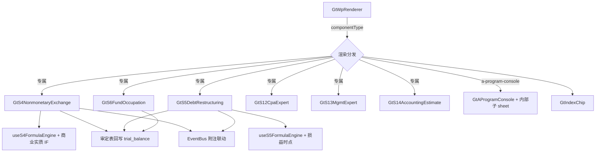

# Design Document

> S 类交易/专家/检查型专项底稿专属组件（S1/S2/S4/S5/S6/S8/S9/S10/S11/S12/S13/S14/S16/S17）

## Overview

为 14 个交易/专家/检查型 S 类专项底稿开发渲染方案，对齐 D4 标准（sheetName v-if 分发 + composable + 审定表回写 + 附注联动 + GtIndexChip）：

- **交易型专属组件**（含审定表/判断子表/多分支）：`s4-nonmonetary-exchange`、`s5-debt-restructuring`、`s6-fund-occupation`、`s12-cpa-expert`、`s13-mgmt-expert`、`s14-accounting-estimate`
- **检查表型**（较简，程序表 + 审定表/内控调查表子 sheet）：S1/S2/S8/S9/S10/S11/S16/S17 → `a-program-console`，子 sheet 内部分发

## Architecture



## Components and Interfaces

### 组件与 sheet 分发

| 组件 / 类型 | sheetName 分发的 sheet |
|-------------|------------------------|
| GtS4NonmonetaryExchange | 审计程序S4 / 审定表S4-1 / 商业实质判断S4-2 |
| GtS5DebtRestructuring | 审计程序S5 / 审定表S5-1 / 损益确认时点S5-2 |
| GtS6FundOccupation | 审定表S6-1 / 大型核查程序S6 / 监管风险提示第9号（上下文区块） |
| GtS12CpaExpert | 程序表S12 / S12-1 / S12-1-1 / S12-2 / S12-3 / S12-3-1~4 |
| GtS13MgmtExpert | 程序表S13 / S13-1 / S13-2 / S13-3 / S13-3-1~4 |
| GtS14AccountingEstimate | 程序表S14 / S14-1 / S14-2 / S14-3 / S14-4 |
| a-program-console (S1) | 违反法规S1 / S1-1 记录表 / S1-2 沟通记录 |
| a-program-console (S9) | 电子商务S9 / 审定表S9-1 / 内控调查表S9-2 / 程序说明 / 法律法规 |
| a-program-console (S10) | 环境S10 / 审定表S10-1 / 内控调查表S10-2 / 环境法规 |
| a-program-console (S2/S8/S11/S16/S17) | 各程序表 + 审定表（如有） |

### useS4FormulaEngine（纯函数）

```typescript
export interface S4ExchangeInput {
  inFairValue: number; outFairValue: number; outBookValue: number; taxes: number
}
// 以公允价值计量：换出损益 = outFairValue - outBookValue；换入成本 = outFairValue + taxes
export function calcExchangeGainLoss(i: S4ExchangeInput): { gainLoss: number; inCost: number }

export interface CommercialSubstanceInput {
  exclusions: boolean[]   // 6 项排除情形（true=属于该情形则不适用准则）
  cashflowDifferent: boolean  // 现金流量风险/时间/金额显著不同
}
// 6 项排除全为 false（"不属于"）→ 适用准则；商业实质 = cashflowDifferent
export function judgeApplicable(i: CommercialSubstanceInput): boolean
export function judgeCommercialSubstance(i: CommercialSubstanceInput): boolean
```

### useS5FormulaEngine（纯函数）

```typescript
export interface CreditorInput { origBook: number; origFair: number; recvFair: number; otherCost: number }
// 债权人重组损益（按源模板口径）
export function calcCreditorGainLoss(i: CreditorInput): number
export interface DebtorInput { debtBook: number; assetBook: number; equityFair: number }
// 债务人重组损益 = 所清偿债务账面 - 转让资产账面 - 权益工具公允
export function calcDebtorGainLoss(i: DebtorInput): number
```

### 专家多分支渲染（S12/S13）

```typescript
type ExpertDomain = 'general' | 'share-based-payment' | 'financial-instrument-fair-value'
// S12-3-2 general / S12-3-3 股份支付 / S12-3-4 金融工具公允价值
function resolveExpertSubSheet(domain: ExpertDomain): string
```

### 后端

- **wp_code_overrides.json**：交易型 → 各专属 componentType；检查表型（S1/S2/S8/S9/S10/S11/S16/S17）→ `a-program-console`；子 sheet 编码不单列目录
- **VALID_COMPONENT_TYPES**：新增 6 个专属类型
- **htmlRendererRegistry.ts**：新增 6 个成员 + defineAsyncComponent + contextProps `standard`
- **RENDERER_DISPATCH**：为 6 个专属类型注册后端 render 策略
- **审定表回写**：S4/S5/S6/S8/S9/S10 审定金额写回 trial_balance（v2 正数，flush 不 commit）
- **S17 .xls 转换**：Phase0 脚本将 S17 `.xls` 转 `.xlsx`（或 xlrd 读取）

## Data Models

```
点击 S4/S5/... → GtWpRenderer(componentType) → 专属组件 或 a-program-console
  专属组件 onMounted:
    1. 加载底稿 + auto_data_source resolver 取数
    2. useS4/useS5 引擎计算损益 + 判断（商业实质/损益时点）
    3. 审定表编辑 → 回写 trial_balance（flush） → EventBus WORKPAPER_SAVED
    4. 附注披露编辑 → EventBus disclosure:note-text-updated（标注非经常性损益）
  专家型 S12/S13：按 domain 分发对应评价子表
  检查表型：GtAProgramConsole + 内部子 sheet（审定表/内控调查表/法规折叠区块）
```

## Correctness Properties

*属性是系统在所有合法执行路径下都应保持为真的行为声明。*

### Property 1: componentType 注册与分发完整性

*For any* 交易型 wp_code（S4/S5/S6/S12/S13/S14）映射为对应专属 componentType 且已注册；检查表型（S1/S2/S8/S9/S10/S11/S16/S17）映射为 `a-program-console`。

**Validates: Requirements 1.1, 1.2, 1.3**

### Property 2: S4 交换损益计算正确性

*For any* S4ExchangeInput（公允价值计量），gainLoss = outFairValue - outBookValue，inCost = outFairValue + taxes。

**Validates: Requirements 2.2**

### Property 3: S4 商业实质判断正确性

*For any* CommercialSubstanceInput，judgeApplicable = 所有 exclusions 为 false（即全「不属于」）；judgeCommercialSubstance = cashflowDifferent。

**Validates: Requirements 2.3, 2.4**

### Property 4: S5 债务重组损益计算正确性

*For any* CreditorInput/DebtorInput，calcCreditorGainLoss 与 calcDebtorGainLoss 应等于源模板公式口径结果（债务人 = 所清偿债务账面 - 转让资产账面 - 权益工具公允）。

**Validates: Requirements 3.2**

### Property 5: 专家子表分支解析确定性

*For any* ExpertDomain，resolveExpertSubSheet 应确定性返回对应子表（general→S12-3-2 / share-based-payment→S12-3-3 / financial-instrument-fair-value→S12-3-4，S13 对应）。

**Validates: Requirements 4.3, 4.4**

### Property 6: 审定表回写方向正确性

*For any* 审定金额，写回 trial_balance 的 audited_amount 为 v2 正数口径；service 层仅 flush 不 commit。

**Validates: Requirements 9.1, 9.3**

### Property 7: 非经常性损益标注一致性

*For any* S4/S5 确认的交换/重组损益，附注披露应标注为非经常性损益，并发布 disclosure:note-text-updated。

**Validates: Requirements 2.5, 3.5, 9.4**

### Property 8: readonly 禁编辑

*For any* readonly = true，所有输入单元格与明细行增删被禁止，仅浏览与跳转可用。

**Validates: Requirements 11.4**

## Error Handling

| 场景 | 处理 |
|------|------|
| S17 .xls 读取失败 | Phase0 给出明确错误，不静默兜底空数据 |
| auto_data_source 取数失败 | 降级手工输入，提示 |
| 审定表回写失败 | 事务回滚，提示，不发 WORKPAPER_SAVED |
| 专家 domain 缺失 | 默认渲染 general 子表 |
| 法规长文本缺失 | 折叠区块显示空，不阻断主视图 |
| 引用底稿不存在 | GtIndexChip 灰态 |

## Testing Strategy

### 属性测试（PBT）

fast-check（前端引擎）+ hypothesis（后端回写），每 property ≥ 100 次。Tag：`Feature: s-special-transaction-workpapers, Property {N}: {title}`。

| Property | 生成器 |
|----------|--------|
| P1 注册 | 固定 wp_code 集合遍历 overrides + registry |
| P2 S4 损益 | `fc.record({inFairValue: fc.float(), outFairValue, outBookValue, taxes})` |
| P3 商业实质 | `fc.record({exclusions: fc.array(fc.boolean(),{minLength:6,maxLength:6}), cashflowDifferent: fc.boolean()})` |
| P4 S5 损益 | `fc.record({debtBook, assetBook, equityFair})` |
| P5 专家分支 | `fc.constantFrom('general','share-based-payment','financial-instrument-fair-value')` |
| P6 回写方向 | hypothesis 审定金额，断言 v2 正数 |
| P7 非经常性损益标注 | 随机损益，断言披露标注 + 事件发布 |
| P8 readonly | `fc.boolean()` |

### 单元/集成测试

- 6 专属组件 + a-program-console 映射注册 + RENDERER_DISPATCH 覆盖
- useS4/useS5 引擎单元测试（含边界）
- S4-2 商业实质 IF 判断真值表
- S12/S13 专家 domain 分支渲染
- S9/S10 内控调查表子 sheet 分发
- S17 .xls → .xlsx 转换脚本测试
- 审定表回写集成 + 附注 EventBus
