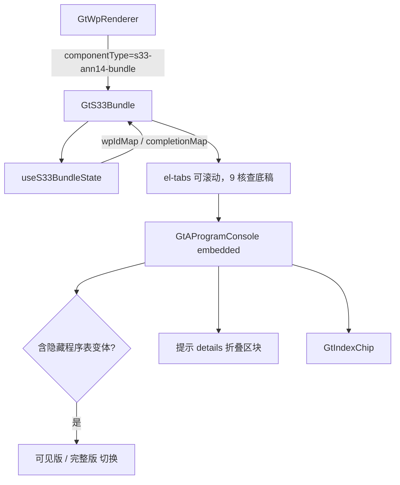

# Design Document

> S33 应对 14 号公告提示风险核查程序聚合组件

## Overview

将 S33 系列 9 个核查底稿（S33-1~S33-9）聚合为单一 `s33-ann14-bundle` 组件，内部以一行可滚动页签切换各核查底稿。遵循 `GtS34Bundle` / `GtA17Bundle` 已验证模式。

核心特征：每个 Tab 主体为 GtAProgramConsole 渲染的核查程序表；部分底稿含「提示」长文本折叠区块；S33-4 含隐藏程序表变体（默认渲染可见版，提供切换完整版入口）。

## Architecture



## Components and Interfaces

### GtS33Bundle.vue

```typescript
interface Props {
  wpId: string
  sheetName?: string   // 'S33-5' ...
  readonly?: boolean
}

interface TabDef {
  id: string           // 'S33-1'...'S33-9'
  label: string        // 核查底稿简称
  wpCode: string
  hiddenVariantSheet?: string  // 如 'S33-4(IB4)程序表-隐'
  tipSheet?: string    // '提示'
}
```

9 核查底稿：财务报告内部控制制度 / 财务与非财务信息印证 / 盈利异常增长和异常交易 / 关联方关系及其交易 / 收入及毛利率 / 主要客户和供应商 / 存货及其他资产 / 现金收付交易 / 财务异常信息。

### useS33BundleState composable

```typescript
export type CompletionStatus = 'completed' | 'in_progress' | 'not_started'
export interface UseS33BundleStateReturn {
  wpIdMap: ComputedRef<Record<string, string>>       // S33-x → wp_id
  completionMap: ComputedRef<Record<string, CompletionStatus>>
  progressSummary: ComputedRef<{ completed: number; inProgress: number; notStarted: number }>
  refreshCompletion: (wpCode?: string) => Promise<void>
}
```

### 后端

- **wp_code_overrides.json**：`"S33": "s33-ann14-bundle"`；`S33-1`~`S33-9` → `"skip"`
- **VALID_COMPONENT_TYPES**：新增 `"s33-ann14-bundle"`
- **htmlRendererRegistry.ts**：新增成员 `'s33-ann14-bundle'` + defineAsyncComponent + contextProps `standard`

## Data Models

```
点击 S33 → GtWpRenderer(componentType=s33-ann14-bundle) → GtS33Bundle
  onMounted:
    1. getWpIndex(projectId) → wpIdMap（S33-x → wp_id）
    2. 计算 visibleTabs（wpIdMap 有值的核查底稿）
    3. 渲染可滚动 el-tabs
    4. 选中 Tab → GtAProgramConsole(embedded, wp-id)；隐藏变体 → 切换入口；提示 → 折叠区块
联动：完成程序 → refreshCompletion(wpCode) → completionMap → 仪表盘刷新
```

## Correctness Properties

*属性是系统在所有合法执行路径下都应保持为真的行为声明。*

### Property 1: 子底稿 skip 映射完整性

*For any* wp_code 属于 {S33-1..S33-9}，映射值应为 `skip`；`S33` 映射为 `s33-ann14-bundle`。

**Validates: Requirements 1.2, 2.1, 2.2**

### Property 2: wp_id 解析与传播

*For any* wp_index 数据集，wpIdMap 正确映射，且每个 Tab 的 GtAProgramConsole 接收 wp-id = wpIdMap[tab.wpCode]。

**Validates: Requirements 5.1, 5.3**

### Property 3: Tab 可见性由 wp_index 存在性驱动

*For any* wp_index 数据集，仅 wpIdMap 有值的核查底稿显示为可见 Tab；无任何 S33 时显示空状态。

**Validates: Requirements 5.2, 5.4**

### Property 4: sheetName 路由正确激活 Tab

*For any* 合法 Tab id，经 sheetName / query 传入时 active 切换为该值；非法值时保持不变。

**Validates: Requirements 4.1, 4.2, 4.3, 4.4**

### Property 5: 完成进度统计一致性

*For any* completionMap，progressSummary 各计数之和等于可见底稿数，且各计数与状态一致。

**Validates: Requirements 7.1, 7.2**

### Property 6: readonly 透传

*For any* Tab 与任意 readonly 布尔值，GtAProgramConsole 接收的 readonly 与父 props.readonly 一致。

**Validates: Requirements 8.1, 8.2**

## Error Handling

| 场景 | 处理 |
|------|------|
| wp_index API 失败 | 提示错误，显示空状态 |
| 子底稿 wp_id 不存在 | 对应 Tab 隐藏 |
| sheetName 无效 | 保持当前 Tab |
| 子组件加载失败 | defineAsyncComponent errorComponent 兜底 |
| 程序行为空 | GtGridSheet 只读兜底 |
| 引用底稿不存在 | GtIndexChip 灰态 |

## Testing Strategy

### 属性测试（PBT）

fast-check，每 property ≥ 100 次。Tag：`Feature: s33-announcement14-bundle, Property {N}: {title}`。

| Property | 生成器 |
|----------|--------|
| P1 skip 映射 | 固定 S33 编码集合遍历 overrides |
| P2 wp_id 解析 | `fc.array(fc.record({wp_code: fc.constantFrom(...S33_CODES), wp_id: fc.uuid()}))` |
| P3 Tab 可见性 | `fc.subsetOf(S33_CODES)` |
| P4 sheetName 路由 | `fc.oneof(fc.constantFrom(...VALID_IDS), fc.string())` |
| P5 进度统计 | `fc.array(fc.constantFrom('completed','in_progress','not_started'))` |
| P6 readonly 透传 | `fc.boolean()` |

### 单元/集成测试

- 注册表含 `s33-ann14-bundle`，VALID_COMPONENT_TYPES 含之
- 9 Tab 配置与核查底稿一致
- S33-4 隐藏程序表变体切换
- 提示折叠区块渲染
- 挂载 mock wp_index，验证子组件渲染 + 只读透传
