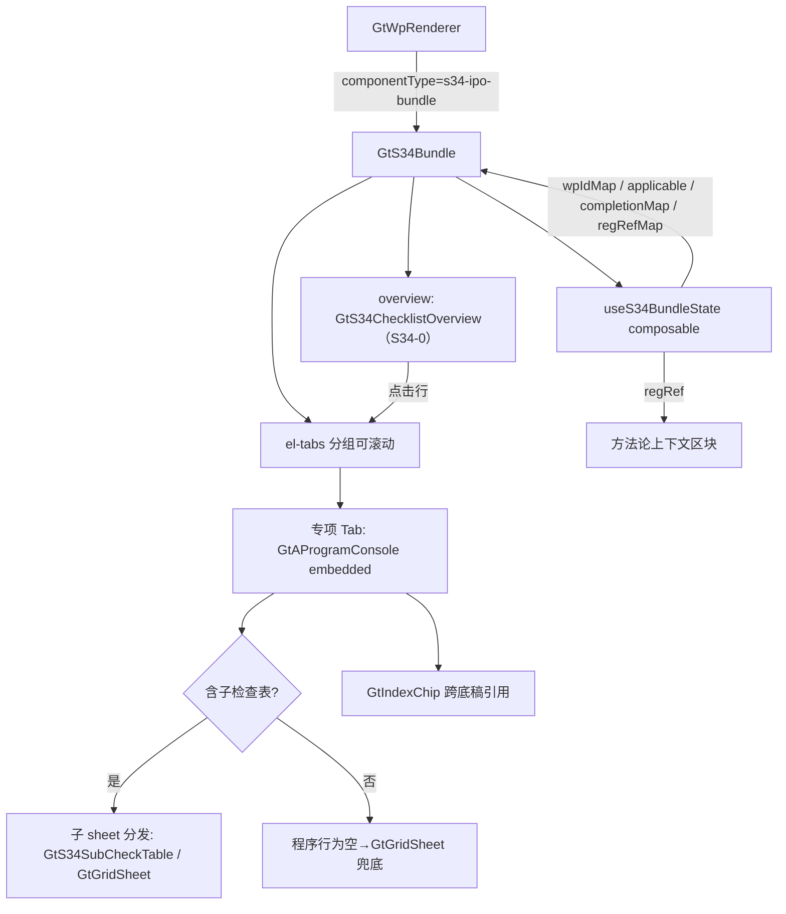

# Design Document

> S34 首发审核（IPO）特项底稿聚合组件

## Overview

将 S34（首发审核特项底稿）及其 41 个子底稿（S34-0 核查事项清单 + S34-1~S34-41）聚合为单一 `s34-ipo-bundle` 组件，内部以「核查清单总览面板 + 分组可滚动页签」切换渲染各专项核查底稿。遵循已验证的 `GtA17Bundle` 模式：静态 Tab 配置 + el-tabs 分发 + wp_index 查询子底稿 wp_id + 轻量 composable 管理跨 Tab 状态。

核心复杂度：
1. **Tab 数量大**（41 专项 + 1 总览），需分组 + 可滚动，不能单行平铺
2. **总览面板即导航**：S34-0 核查清单同时是法规溯源数据源与适用性/完成状态入口
3. **多渲染形态**：主体程序表（GtAProgramConsole embedded）+ 带公式子检查表（GtGridSheet / 专属子表）
4. **跨底稿引用**：程序索引列引用 D4/B23/C2/S34-16-1，需 GtIndexChip
5. **法规溯源**：每个专项底稿映射证监会/沪深北监管条目

## Architecture



数据源：S34-0 核查清单在后端解析为结构化 `S34ChecklistItem[]`（底稿编号→名称→各交易所监管条目），作为 overview 渲染与 regRefMap 的单一来源。

## Components and Interfaces

### GtS34Bundle.vue

```typescript
interface Props {
  wpId: string           // 父底稿 S34 的 wp_id
  sheetName?: string     // 外部跳转指定 Tab（如 'S34-3' / 'overview'）
  readonly?: boolean
}

interface TabDef {
  id: string             // Tab 标识 = sheetName 路由值（'overview' | 'S34-1'...）
  label: string          // Tab 显示名（专项简称）
  group: string          // 业务主题分组
  wpCode?: string        // 子底稿编码（wp_index 查 wp_id）
  hasSubTable?: boolean  // 是否含公式子检查表
  subSheets?: string[]   // 子 sheet 名列表（如 ['S34-16-1','S34-16-2']）
}
```

分组（对齐 requirements 需求 4.3，顺序以 S34-0 序号为基准）：
`股权与激励[S34-2/3]`、`关联与共同投资[S34-4/9]`、`收入与经销[S34-16/19/20/21/35]`、`成本费用与研发[S34-27/28/29/32]`、`资产与减值[S34-5/6/8/31/33/40]`、`财务规范与内控[S34-14/15/17/22/23/24]`、`资金与投资[S34-10/25/36/37/39]`、`特殊事项[S34-1/7/11/12/13/26/30/34/38/41]`。

### useS34BundleState composable

```typescript
// audit-platform/frontend/src/components/workpaper/composables/useS34BundleState.ts

export type CompletionStatus = 'completed' | 'in_progress' | 'not_started'
export type Applicability = 'applicable' | 'not_applicable' | 'unknown'

export interface RegRef {
  csrc?: string        // 证监会 发行类 4/5/9 号 条目
  sse?: string         // 上交所指南条目
  szse?: string        // 深交所指南条目
  bse?: string         // 北交所指引条目
  title: string        // 核查事项名称
}

export interface S34ChecklistItem {
  seq: number
  wpCode: string       // S34-x
  name: string
  regRef: RegRef
  applicability: Applicability
  status: CompletionStatus
}

export interface UseS34BundleStateReturn {
  wpIdMap: ComputedRef<Record<string, string>>       // S34-x → wp_id
  checklist: Ref<S34ChecklistItem[]>                 // S34-0 解析结果
  applicableCodes: ComputedRef<string[]>
  completionMap: ComputedRef<Record<string, CompletionStatus>>
  regRefMap: ComputedRef<Record<string, RegRef>>
  progressSummary: ComputedRef<{ completed: number; inProgress: number; notStarted: number; notApplicable: number }>
  refreshCompletion: (wpCode?: string) => Promise<void>
  loadChecklist: () => Promise<void>
}
```

### 子检查表清单（hasSubTable = true）

| 底稿 | 子 sheet | 公式要点 |
|------|----------|---------|
| S34-16 | S34-16-1 第三方回款情况检查表 / S34-16-2 同行业对比 | `=SUM(E8:E18)`、占比 `=C24/C23` |
| S34-2 | S34-2-1 期权激励对象数量 / S34-2-2 期后执行 | — |
| S34-8 | S34-8-1 非同控合并无形资产 / S34-8-2 客户关系 | — |
| S34-25 | S34-25-1~3 资金流水核查 | 核查范围公式 |
| S34-34 | S34-34-1 自然人客户 / S34-34-2 自然人供应商 | 各 26 公式 |
| S34-4/9/11/18/20/30 | S34-x-1 明细核查 | 见 Phase0 |

### wp_id 解析

```typescript
const wpIdMap = computed(() => {
  const map: Record<string, string> = {}
  for (const item of wpIndex.value) {
    if (item.wp_code?.startsWith('S34')) map[item.wp_code] = item.wp_id
  }
  return map
})
```

### 后端

- **wp_code_overrides.json**：`"S34": "s34-ipo-bundle"`；`S34-0`~`S34-41` 及子表编码 → `"skip"`
- **VALID_COMPONENT_TYPES**：新增 `"s34-ipo-bundle"`
- **htmlRendererRegistry.ts**：新增 `HtmlComponentType` 成员 `'s34-ipo-bundle'` + defineAsyncComponent 注册 + contextProps `standard`
- **S34-0 核查清单 API**：`GET /api/projects/{project_id}/s34-checklist` → `S34ChecklistItem[]`（从 S34-0 底稿数据 / 静态映射解析法规溯源 + 适用性 + 完成状态）

## Data Models

### 数据流

```
底稿目录点击 S34
  → GtWpRenderer 查 componentType = 's34-ipo-bundle'
  → 渲染 GtS34Bundle (props: wpId, sheetName?, readonly?)
  → onMounted:
      1. getWpIndex(projectId) → wpIdMap（S34-x → wp_id）
      2. loadChecklist() → S34-0 结构化清单（regRef + applicability + status）
      3. 计算 visibleTabs（overview 固定 + wpIdMap 有值的专项，按分组排序）
      4. 渲染 overview 面板 + 分组可滚动 el-tabs
      5. 选中专项 Tab → GtAProgramConsole(embedded, wp-id) + 顶部 regRef 上下文区块
      6. 含子表底稿 → 内部子 sheet 切换（GtS34SubCheckTable/GtGridSheet）

联动：
  用户完成某专项程序 → refreshCompletion(wpCode) → completionMap 更新 → 仪表盘 + overview 行状态实时刷新
```

## Correctness Properties

*属性是系统在所有合法执行路径下都应保持为真的行为声明。*

### Property 1: 子底稿 skip 映射完整性

*For any* wp_code 属于 {S34-0, S34-1..S34-41} 及其子表编码，其在 wp_code_overrides 中的映射值应为 `skip`；且 `S34` 映射为 `s34-ipo-bundle`。

**Validates: Requirements 1.2, 2.1, 2.2, 2.4**

### Property 2: wp_id 解析与传播

*For any* wp_index 数据集（含若干 S34-* 条目），wpIdMap 应正确映射每个 S34-* wp_code 到其 wp_id，且每个专项 Tab 的 GtAProgramConsole 接收的 wp-id 应等于 wpIdMap[tab.wpCode]。

**Validates: Requirements 8.1, 8.3, 8.4**

### Property 3: Tab 可见性由 wp_index 存在性驱动

*For any* wp_index 数据集，专项 Tab 中仅 wpIdMap 有值的底稿显示为可见 Tab；overview Tab 恒可见；无任何 S34 专项时仅显示 overview。

**Validates: Requirements 4.1, 8.3, 9.1, 9.4**

### Property 4: sheetName 路由正确激活 Tab

*For any* 合法 Tab id（属可见 Tab 列表），经 props.sheetName / route.query.sheet 传入时 active 切换为该值；非法值时 active 保持不变（默认 overview）。

**Validates: Requirements 7.1, 7.2, 7.3, 7.4**

### Property 5: 完成进度统计一致性

*For any* completionMap 与 applicability 组合，progressSummary 的 completed/inProgress/notStarted/notApplicable 计数之和应等于清单条目总数，且各计数与各条目状态一致。

**Validates: Requirements 10.1, 10.2**

### Property 6: 法规溯源映射稳定性

*For any* S34-0 清单条目，regRefMap[wpCode] 应返回该底稿的 RegRef（证监会/沪深北条目），且 overview 按来源分列展示时无对应条目的交易所列为空值而非报错。

**Validates: Requirements 3.2, 12.1, 12.3, 12.4**

### Property 7: readonly 透传

*For any* Tab 与任意 readonly 布尔值，子组件（GtAProgramConsole / 子检查表）接收的 readonly 应与父 props.readonly 一致。

**Validates: Requirements 11.1, 11.2, 11.3**

### Property 8: 子表汇总公式确定性

*For any* 子检查表明细行金额数组，汇总单元格（如 S34-16-1 的 `=SUM(E8:E18)`、占比 `=C24/C23`）应等于对应纯函数计算结果，且不受手工覆盖影响。

**Validates: Requirements 5.2, 5.5**

## Error Handling

| 场景 | 处理 |
|------|------|
| wp_index API 失败 | 提示错误，仅保留 overview Tab |
| 子底稿 wp_id 不存在 | 对应 Tab 隐藏（v-if 基于 wpIdMap） |
| S34-0 清单 API 失败 | overview 降级为「清单加载失败」，专项 Tab 仍可用（regRef 为空） |
| sheetName 无效 | 忽略，保持当前 Tab（默认 overview） |
| 子组件加载失败 | defineAsyncComponent errorComponent 兜底 |
| 程序行为空 | GtGridSheet 只读原样渲染 |
| 引用底稿不存在 | GtIndexChip 灰态不可跳转 |

## Testing Strategy

### 属性测试（PBT）

使用 `fast-check`（前端已有），每 property ≥ 100 次迭代。Tag：`Feature: s34-ipo-review-bundle, Property {N}: {title}`。

| Property | 生成器 |
|----------|--------|
| P1 skip 映射 | 固定 S34 编码集合遍历 wp_code_overrides.json |
| P2 wp_id 解析 | `fc.array(fc.record({wp_code: fc.constantFrom(...S34_CODES), wp_id: fc.uuid()}))` |
| P3 Tab 可见性 | `fc.subsetOf(S34_CODES)` |
| P4 sheetName 路由 | `fc.oneof(fc.constantFrom(...VALID_IDS), fc.string())` |
| P5 进度统计 | `fc.array(fc.record({status: fc.constantFrom(...), applicability: fc.constantFrom(...)}))` |
| P6 法规溯源 | `fc.array(fc.record({wpCode, regRef}))` |
| P7 readonly 透传 | `fc.boolean()` |
| P8 子表公式 | `fc.array(fc.float())` 断言 SUM/占比 |

### 单元/集成测试

- 注册表：htmlRendererRegistry 含 `s34-ipo-bundle`，contextProps=standard；VALID_COMPONENT_TYPES 含之
- Tab 分组顺序与 requirements 4.3 一致
- overview 点击行 → 切换对应 Tab
- 挂载组件 mock wp_index + S34-0 API，验证子组件渲染与 regRef 上下文
- 子检查表汇总公式重算 + 只读禁编辑

### 测试配置

- PBT 库 fast-check，最小 100 次/property
- 每 property test 注释引用设计 Property 编号
