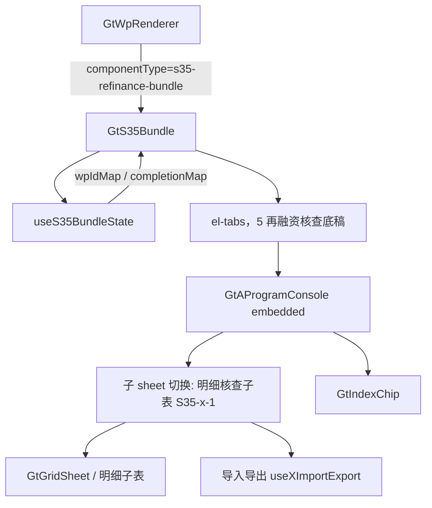

# Design Document

> S35 再融资审核特项底稿聚合组件

## Overview

将 S35 系列 5 个再融资核查底稿（S35-1~S35-5）聚合为单一 `s35-refinance-bundle` 组件，内部以一行页签切换各底稿。遵循 `GtS34Bundle` / `GtA17Bundle` 已验证模式。

核心特征：每个 Tab 主体为 GtAProgramConsole 渲染的核查程序表；每个底稿含明细核查子表（S35-x-1），在 Tab 内以子 sheet 切换（v-if 分发），保留公式与核查判断列，支持导入导出。

## Architecture



## Components and Interfaces

### GtS35Bundle.vue

```typescript
interface Props {
  wpId: string
  sheetName?: string   // 'S35-3' ...
  readonly?: boolean
}

interface TabDef {
  id: string           // 'S35-1'...'S35-5'
  label: string
  wpCode: string
  subSheets?: string[] // ['S35-1-1'] 明细核查子表
}
```

5 再融资核查底稿：关联交易 / 财务性投资核查 / 现金分红核查 / 商誉减值 / 募集资金涉及收购核查要点。

### useS35BundleState composable

```typescript
export type CompletionStatus = 'completed' | 'in_progress' | 'not_started'
export interface UseS35BundleStateReturn {
  wpIdMap: ComputedRef<Record<string, string>>       // S35-x（含子表） → wp_id
  completionMap: ComputedRef<Record<string, CompletionStatus>>
  progressSummary: ComputedRef<{ completed: number; inProgress: number; notStarted: number }>
  refreshCompletion: (wpCode?: string) => Promise<void>
}
```

### 后端

- **wp_code_overrides.json**：`"S35": "s35-refinance-bundle"`；`S35-1`~`S35-5` 及子表（S35-1-1 等）→ `"skip"`
- **VALID_COMPONENT_TYPES**：新增 `"s35-refinance-bundle"`
- **htmlRendererRegistry.ts**：新增成员 `'s35-refinance-bundle'` + defineAsyncComponent + contextProps `standard`
- **导入导出三端点**：复用现有 useXImportExport composable + 后端导出模板/导出数据/导入数据端点（http/axios，RFC5987 中文文件名）

## Data Models

```
点击 S35 → GtWpRenderer(componentType=s35-refinance-bundle) → GtS35Bundle
  onMounted:
    1. getWpIndex(projectId) → wpIdMap（S35-x + 子表 → wp_id）
    2. 计算 visibleTabs（wpIdMap 有值的底稿）
    3. 渲染 el-tabs
    4. 选中 Tab → GtAProgramConsole(embedded, wp-id)；子表 → 子 sheet 切换 + 导入导出
联动：完成程序/填写子表 → refreshCompletion(wpCode) → completionMap → 仪表盘刷新
```

## Correctness Properties

*属性是系统在所有合法执行路径下都应保持为真的行为声明。*

### Property 1: 子底稿 skip 映射完整性

*For any* wp_code 属于 {S35-1..S35-5} 及子表编码，映射值应为 `skip`；`S35` 映射为 `s35-refinance-bundle`。

**Validates: Requirements 1.2, 2.1, 2.2**

### Property 2: wp_id 解析与传播

*For any* wp_index 数据集，wpIdMap 正确映射，且每个 Tab 的 GtAProgramConsole/子表接收 wp-id = wpIdMap[tab.wpCode]。

**Validates: Requirements 6.1, 6.3**

### Property 3: Tab 可见性由 wp_index 存在性驱动

*For any* wp_index 数据集，仅 wpIdMap 有值的底稿显示为可见 Tab；无任何 S35 时显示空状态。

**Validates: Requirements 6.2, 6.4**

### Property 4: sheetName 路由正确激活 Tab

*For any* 合法 Tab id，经 sheetName / query 传入时 active 切换为该值；非法值时保持不变。

**Validates: Requirements 5.1, 5.2, 5.3, 5.4**

### Property 5: 明细子表汇总公式确定性

*For any* 明细核查子表金额数组，汇总/占比公式单元格应等于对应纯函数计算结果，且不受手工覆盖影响。

**Validates: Requirements 4.2**

### Property 6: 完成进度统计一致性

*For any* completionMap，progressSummary 各计数之和等于可见底稿数，且各计数与状态一致。

**Validates: Requirements 8.1, 8.2**

### Property 7: readonly 透传

*For any* Tab 与任意 readonly 布尔值，GtAProgramConsole 与子表接收的 readonly 与父 props.readonly 一致。

**Validates: Requirements 8.4, 8.5**

## Error Handling

| 场景 | 处理 |
|------|------|
| wp_index API 失败 | 提示错误，显示空状态 |
| 子底稿 wp_id 不存在 | 对应 Tab 隐藏 |
| sheetName 无效 | 保持当前 Tab |
| 子组件加载失败 | defineAsyncComponent errorComponent 兜底 |
| 程序行为空 | GtGridSheet 只读兜底 |
| 导入格式错误 | 提示错误行，不写入 |
| 引用底稿不存在 | GtIndexChip 灰态 |

## Testing Strategy

### 属性测试（PBT）

fast-check，每 property ≥ 100 次。Tag：`Feature: s35-refinancing-bundle, Property {N}: {title}`。

| Property | 生成器 |
|----------|--------|
| P1 skip 映射 | 固定 S35 编码集合遍历 overrides |
| P2 wp_id 解析 | `fc.array(fc.record({wp_code: fc.constantFrom(...S35_CODES), wp_id: fc.uuid()}))` |
| P3 Tab 可见性 | `fc.subsetOf(S35_CODES)` |
| P4 sheetName 路由 | `fc.oneof(fc.constantFrom(...VALID_IDS), fc.string())` |
| P5 子表公式 | `fc.array(fc.float())` 断言 SUM/占比 |
| P6 进度统计 | `fc.array(fc.constantFrom('completed','in_progress','not_started'))` |
| P7 readonly 透传 | `fc.boolean()` |

### 单元/集成测试

- 注册表含 `s35-refinance-bundle`，VALID_COMPONENT_TYPES 含之
- 5 Tab 配置与再融资核查底稿一致
- 子表子 sheet 切换 + 导入导出往返
- 挂载 mock wp_index，验证子组件渲染 + 只读透传
