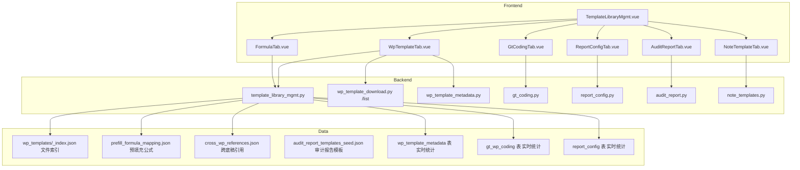
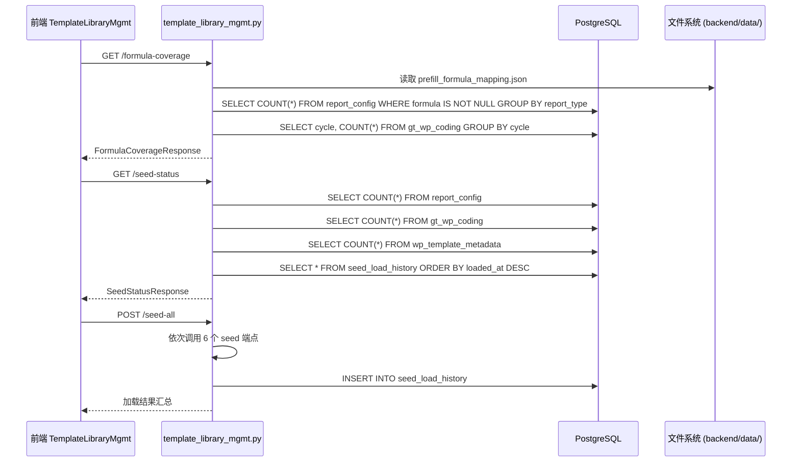

# 设计文档：全局模板库管理系统

## 变更记录

| 版本 | 日期 | 摘要 | 触发原因 |
|------|------|------|----------|
| v1 | 2026-05-15 | 初版：8 ADR + 12 Property | spec 创建 |
| v2 | 2026-05-16 | D11/D12 子表收敛 + 消费/生产关系 ADR | 与 audit-chain-generation 协同 |
| v3 | 2026-05-16 | D13/D14/D15 编辑路径分流 + 消费契约 + SAVEPOINT 边界 ADR；Property 16/17 后端二次校验 + JSON 只读 | spec 一致性二审 |
| v4 | 2026-05-16 | D16 ADR 硬编码计数审查规则 + Property 11 sheet_count 公式修订 | 收尾自检 |
| v5 | 2026-05-16 | 二轮复盘：Property 区块 17 条全部加 Coverage 标签 + 末尾覆盖矩阵汇总表 | P0 改进落地 |

## Overview

本设计整合致同审计平台 5 大模板库 + 1 套编码体系为统一管理页面，提供浏览、编辑、种子加载、版本管理、覆盖率统计等能力。

核心目标：
- 管理员在一个页面总览全部模板资源（**N_files** 物理文件 / **N_primary** 主编码 / **N_prefill_mappings** 公式映射 / **N_report_rows** 报表行次 / **N_gt_codes** 编码 / **N_opinion_types** 种审计报告模板 / **N_account_mappings** 科目映射）—— 所有 N_* 值均为运行时查询结果，narrative 当前快照参考：files=476 / primary≥179 / prefill=94 / report_rows=1191 / gt_codes=48 / opinion_types=8 / account_mappings=206
- 审计助理快速了解公式覆盖情况和底稿清单
- 项目经理查看模板与项目的关联状态
- WorkpaperWorkbench 树形数据源从旧 mappings 升级为**全部主编码完整模板**（数量从 `/list` 端点动态取）

**与 audit-chain-generation spec 的关系**（消费/生产）：

| 资源 | 生产方 | 消费方 |
|------|--------|--------|
| `wp_template_metadata` 表（运行时聚合 3 增量 seed 文件 entries 之和，当前 ≥ 179 条） | audit-chain-generation `_step_generate_workpapers` + `load_wp_template_metadata.py` | 本 spec 只读消费 |
| `wp_account_mapping.json`（206 条 v2025-R5） | audit-chain-generation 已扩展 | 本 spec 只读消费 |
| `prefill_formula_mapping.json`（94 映射 / 481 单元格） | audit-chain-generation 已生成 | 本 spec 只读消费 + UI 展示 |
| `cross_wp_references.json`（20 条） | audit-chain-generation 已生成 | 本 spec 只读消费 + UI 展示 |
| Subtable_Convergence（运行时 `wp_code.split("-")` 计算 + sheet merge） | audit-chain-generation `_step_generate_workpapers` + `init_workpaper_from_template._merge_sheets_from_other_files` | 本 spec UI 端正确展示 |

**关键事实**（实施前已核验，2026-05-16）：
- `_index.json` 是 **dict 结构** `{description, version, files: [...]}` 不是顶层 list
- `wp_account_mapping.json` 实际 **206 条**（spec 旧版写 118 已修正）
- `wp_template_metadata` 表条数 = **运行时聚合 3 个增量 seed 文件**（`wp_template_metadata_dn_seed.json` + `_b_seed.json` + `_cas_seed.json`）的 entries 数量之和；当前实测合计 ≥ 179；**禁止硬编码具体数字**，由 `load_wp_template_metadata.py` 加载并由 `chain_orchestrator` 运行时聚合
- 一个 wp_code 对应一个 wp_index 一个 xlsx 文件（多源文件自动合并为多 sheets）
- 子表收敛是**运行时计算**（`wp_code.split("-")`）不是元数据字段；`WpTemplateMetadata` ORM 无 `subtable_codes` 字段，禁止 spec 引用

## Architecture

### 架构决策

**D1: 新建独立路由 vs 扩展现有路由**
- 决策：新建 `backend/app/routers/template_library_mgmt.py`（prefix="/api/template-library-mgmt"）
- 理由：现有 `template_library.py` 负责三层体系（事务所/集团/项目），职责不同；新路由专注"全局管理视图"的聚合查询和种子加载状态

**D2: 前端页面架构**
- 决策：新建 `TemplateLibraryMgmt.vue` 单页面 + 6 个 Tab 子组件
- 理由：6 个子模块数据独立、交互独立，Tab 切换比路由跳转更轻量；不用 GtPageHeader 紫色渐变（简单 CRUD 页面用白色简洁工具栏）

**D3: WorkpaperWorkbench 树形数据源**
- 决策：复用现有 `GET /api/projects/{pid}/wp-templates/list` 端点，**补充 5 个字段**（component_type/has_formula/source_file_count/sheet_count/generated）
- 理由：该端点已返回 wp_code 主编码维度数据，不重写仅增强；与子表收敛策略对齐（一 wp_code 一记录）

**D4: 种子加载状态追踪**
- 决策：不新建表，通过 COUNT 查询各表记录数 + **运行时聚合 seed 文件 entries 数**对比推导状态
- 理由：避免额外表维护成本；expected_count 必须从 seed 文件实际读取（如 wp_template_metadata 来自 3 个增量 seed 文件 entries 之和），**禁止硬编码具体数字**避免 spec 与现实脱节

**D5: 公式覆盖率统计**
- 决策：实时计算（非缓存），从 `prefill_formula_mapping.json` + `report_config` 表聚合，**不硬编码任何百分比**
- 理由：数据量小（94 映射 + 1191 行），查询耗时 <100ms；避免 spec 写死数字与现实脱节（前版 spec 写"316/1191=26.5%"，实际值需 SQL 实时查）

**D6: 版本管理**
- 决策：轻量级方案——页面顶部显示硬编码版本标识 + seed_load_history 表记录加载时间戳
- 理由：当前模板版本固定为"致同 2025 修订版"，无需复杂版本控制系统

**D7: 权限控制**
- 决策：复用现有 `get_current_user` + 前端 `v-permission` 指令
- 理由：admin/partner 可编辑，其他角色只读；与现有权限体系一致

**D8: 前端表格样式**
- 决策：数字列统一 `.gt-amt` class（Arial Narrow + nowrap + tabular-nums）；最大化数据显示区域
- 理由：遵循用户偏好，工具栏按钮合并到 Tab 栏右侧

**D11（新增 ADR）：底稿子表收敛策略**
- 决策：UI 与 chain_orchestrator 子表收敛策略对齐——**一个 wp_code（主编码）一条树节点**，详情面板展示"主文件 + 合并后 sheets 列表 + 源 xlsx 物理文件清单"三组信息
- 主编码识别规则：`primary_code = wp_code.split("-")[0]`（运行时计算，不依赖任何持久化字段）
- 理由：audit-chain-generation 已落地"一 wp_code 一 xlsx 多 sheets"模型（D2 主编码合并 D2-1/D2-2/D2-3/D2-4 等子表），UI 不再展示"多个独立文件"避免与底稿生成结果矛盾
- 影响：
  - `/list` 端点新增 `source_file_count`（**从 `_index.json["files"]` 按 primary_code 前缀匹配运行时统计**：`count(file where file.wp_code == primary_code OR file.wp_code startswith primary_code + "-")`）
  - `/list` 端点新增 `sheet_count`（≈ source_file_count，spec 层近似展示；精确 sheet 数由 init_workpaper_from_template 实际合并产生，不持久化）
  - 详情面板"文件下载"区域改为：主文件下载（合并后） + "源文件参考下载"折叠区（保留对原始模板的访问）
  - Workbench 树节点旁可选展示 `(N 个源文件)` 标识（与 spec 需求 2.7 兼容）

**D12（新增 ADR）：与 audit-chain-generation 的消费/生产关系**
- 决策：本 spec 是 audit-chain-generation 的**纯消费方**——`wp_template_metadata` 表 / `wp_account_mapping.json` / `prefill_formula_mapping.json` / `cross_wp_references.json` / `_index.json` 全部由 audit-chain-generation 加载维护，本 spec 只读不写
- 理由：避免重复加载 + 单一真源；当 audit-chain-generation 后续扩展元数据时，本 spec 自动受益不需要重新发布
- 影响：
  - Task 1.3 不"加载"任何 seed，只"消费"已加载数据
  - Sprint 0 必加"前置依赖核验"任务（确认 wp_template_metadata 表 ≥ 179 条 / wp_account_mapping ≥ 206 条）
  - Seed Loader（需求 13）只调用 audit-chain-generation 已注册的 6 个 seed 端点，本 spec 不实现新 seed 加载逻辑

**D13（新增 ADR）：JSON 文件 vs DB 表的编辑路径分流**
- 决策：admin 编辑权限按数据来源分两类，**避免 JSON 文件与 DB 双写不一致**
  - **DB 表类（可在 UI 直接编辑）**：`report_config` / `gt_wp_coding` / `wp_template_metadata`（编辑后立即生效）
  - **JSON 文件类（UI 只读 + 引导更新流程）**：`prefill_formula_mapping.json` / `cross_wp_references.json` / `audit_report_templates_seed.json` / `wp_account_mapping.json`（UI 显示"只读"标识 + 提示"如需修改请编辑 backend/data/ 下 JSON 文件后重新加载种子"）
- 理由：JSON 文件作为 git 版本化的种子真源，UI 直接覆盖会让代码仓库与生产 DB 状态分叉；保持 git → seed → DB 单向流动
- 影响：
  - 需求 6.5（编辑预填充公式）/ 9.4（编辑审计报告段落）改为只读 + 引导信息
  - 需求 7.4（编辑报表公式）/ 11.5（编辑致同编码）保持可编辑（DB 表）
  - 前端组件加 `:readonly="isJsonSource"` prop 控制
  - 任何 mutation 端点对 JSON 类资源返回 `405 Method Not Allowed` + `{hint: "请编辑 JSON 文件后重新加载"}`

**D14（新增 ADR）：消费契约（依赖字段清单）**
- 决策：本 spec 依赖 audit-chain-generation 的具体字段需明确登记，**任一字段变更须同步更新本 spec**
- 依赖字段清单（生产方静默变更会导致本 spec breaking）：
  - `WpTemplateMetadata.linked_accounts`（JSONB 数组，用于"仅有数据"筛选）
  - `WpTemplateMetadata.component_type`（String，枚举：univer/form/word/hybrid）
  - `WpTemplateMetadata.audit_stage`（String，枚举：preliminary/risk/control/substantive/completion/specific）
  - `WpTemplateMetadata.cycle`（String，单字母 A/B/C/D-N/S）
  - `WpTemplateMetadata.procedure_steps`（JSONB 数组）
  - `WpTemplateMetadata.wp_code`（String，模板编码，含子表如 D2-2）
  - `wp_account_mapping.json` mappings[].account_codes / wp_code / trigger / applies_when 字段
  - `_index.json["files"]` 数组的 wp_code / filename / format / relative_path 字段
  - `prefill_formula_mapping.json` mappings[].wp_code / sheet / cells 字段
  - `cross_wp_references.json` references[].source_wp_code / target_wp_code / reference_type 字段
- **不依赖**（明确排除）：`subtable_codes` 字段（ORM 不存在，子表关系靠运行时 `wp_code.split("-")` 计算）/ `bound_workpapers` 字段（运行时计算）/ 任何持久化的"主表-子表"关系字段
- 理由：跨 spec 协作必须显式契约；避免 audit-chain-generation 重命名/删除字段时本 spec 静默 500
- 落地：每次 audit-chain-generation 改动 wp_template_metadata 模型或 seed JSON schema，必须同步更新本 spec D14 + tasks Sprint 0 核验脚本

**核验证据（二轮复盘 P2.7 落地 2026-05-16）**：
- **假设**：`WpTemplateMetadata.subtable_codes` 字段不存在
- **证据**：grep `class WpTemplateMetadata` `backend/app/models/wp_optimization_models.py` → 19 字段全部列出，无 `subtable_codes`
- **核验时间**：2026-05-16（Sprint 0.1 verifier 自动核验，详见 `snapshot.json` `orm_assertions.WpTemplateMetadata.must_not_have_field`）
- **失效条件**：上游 audit-chain-generation 给 ORM 加 subtable_codes 字段时，本 ADR 自动失效；触发方式 = `verify_spec_facts.py` 退出码 2 + UI 列表崩溃
- **同步更新点**：依赖字段清单中任一字段重命名/删除/新增时，必须更新此 ADR + Sprint 0 核验脚本 + snapshot.json `orm_assertions`

**D15（新增 ADR）：种子加载事务边界**
- 决策：`POST /seed-all` 每个 seed **独立事务**，失败仅该 seed 回滚；`seed_load_history` 每 seed 单独记一条 `status=loaded/failed`
- 理由：避免 "失败一半" 时已成功的 seed 也回滚（用户体验不一致）；独立事务允许 partial success + 精准重试
- 实现：
  ```python
  async def seed_all(db):
      results = []
      for seed_name, seed_fn in SEED_PIPELINE:
          try:
              async with db.begin_nested():  # SAVEPOINT
                  result = await seed_fn(db)
                  await record_history(db, seed_name, status="loaded", **result)
              results.append({"seed": seed_name, "status": "loaded", **result})
          except Exception as e:
              await db.rollback_to_savepoint()
              await record_history(db, seed_name, status="failed", error=str(e))
              results.append({"seed": seed_name, "status": "failed", "error": str(e)})
      return results
  ```

**D16（新增 ADR）：硬编码计数审查规则（可推广通用规约）**
- 决策：spec 文档中所有"数量/条数/百分比/容差"严格区分两种位置
  - **narrative 区域允许保留快照值**（仅作可读性参考）：标题描述 / Overview / 术语表 / 数据流图节点标签 / ADR 决策正文（如"当前快照 ≥ 179 条"）
  - **task / Property / 验收标准 / 错误处理表禁止硬编码具体数字**：必须改为运行时表达式 / API 动态调用 / SQL 实时统计 / 文件实时读取
- 检查清单（每次 spec 修订必跑）：
  ```python
  # 一次性核验脚本骨架
  hard_patterns = [r"全部 \d+ 个", r"全部 \d+ 条", r"\(.*?/ \d+\)", r"展示 \d+ 行"]
  for spec_file in [requirements, design, tasks]:
      for p in hard_patterns:
          if re.search(p, spec_file): raise ValueError(f"硬编码残留: {p} in {spec_file}")
  ```
- 例外白名单：
  - `48 条编码`、`1191 行` 等若**仅出现在 design Overview / Architecture 数据流节点标签 / ADR D5 决策正文**作为快照说明，可保留
  - **绝不允许出现在**：requirements 验收标准 / Property 公式 / tasks 实施文本 / UAT 清单 / 测试断言
- 违反代价：spec 与 production 数据分叉时，验收标准过时无法指导实施；下次 audit-chain-generation 加新 seed 文件时本 spec 静默失效
- 落地保障：每次 spec 修订收尾必跑核验脚本（用完即删），grep 命中即修

### 系统架构图



## Components and Interfaces

### 后端新增路由：template_library_mgmt.py

路由前缀：`/api/template-library-mgmt`（内部含完整 /api 前缀，注册时不加额外前缀）

| 端点 | 方法 | 描述 |
|------|------|------|
| `/formula-coverage` | GET | 公式覆盖率统计（按循环+按报表类型） |
| `/prefill-formulas` | GET | 全部预填充映射详情（数量动态从 JSON 读取） |
| `/cross-wp-references` | GET | 全部跨底稿引用规则（数量动态从 JSON 读取） |
| `/seed-status` | GET | 各种子数据加载状态 |
| `/seed-all` | POST | 一键加载全部种子 |
| `/version-info` | GET | 模板版本信息 |

### 现有端点增强：wp_template_download.py /list

增强 `GET /api/projects/{pid}/wp-templates/list` 返回字段：

```python
# 新增字段（与子表收敛策略对齐）
{
    "wp_code": "D2",
    "wp_name": "应收账款",
    "cycle": "D",
    "cycle_name": "D 销售循环",
    "filename": "D2 应收账款.xlsx",          # 主文件名
    "format": "xlsx",
    # --- 新增 ---
    "component_type": "univer",              # 从 wp_template_metadata 合并
    "audit_stage": "substantive",            # 从 wp_template_metadata 合并
    "linked_accounts": ["1122"],             # 从 wp_template_metadata 合并
    "has_formula": true,                     # 从 prefill_formula_mapping 判断
    "source_file_count": 3,                  # 源 xlsx 物理文件数（合并前）
    "sheet_count": 20,                       # 合并后 sheets 数
    "generated": false,                      # 是否已在当前项目生成底稿
    "sort_order": 4                          # 从 gt_wp_coding 取排序
}
```

**注意**：`source_file_count` 和 `sheet_count` 都从 `_index.json["files"]` **运行时计算**（按 primary_code 前缀匹配），不依赖任何持久化字段。

### 前端组件层级

```
views/
  TemplateLibraryMgmt.vue          # 主页面（6 Tab）
components/
  template-library/
    WpTemplateTab.vue              # Tab 1: 底稿模板库
    FormulaTab.vue                 # Tab 2: 公式管理
    AuditReportTab.vue             # Tab 3: 审计报告模板
    NoteTemplateTab.vue            # Tab 4: 附注模板
    GtCodingTab.vue                # Tab 5: 编码体系
    ReportConfigTab.vue            # Tab 6: 报表配置
    SeedLoaderPanel.vue            # 种子加载面板（嵌入主页面顶部）
    FormulaCoverageChart.vue       # 覆盖率仪表盘
    WpTemplateDetail.vue           # 底稿模板详情面板
```

### WorkpaperWorkbench.vue 改造

```
变更点：
- treeData 数据源从 mappings 改为 /api/projects/{pid}/wp-templates/list
- 按 gt_wp_coding.sort_order 排序循环节点
- 未生成底稿的节点灰色文字
- 循环节点旁显示进度（已完成/总数，分子分母均从 API 动态计算）
- 顶部全局进度条（已生成主编码数 / 主编码总数，分母 = templates.length）
```

## Data Models

### 新增表：seed_load_history

```sql
CREATE TABLE seed_load_history (
    id UUID PRIMARY KEY DEFAULT gen_random_uuid(),
    seed_name VARCHAR(100) NOT NULL,       -- report_config / gt_wp_coding / ...
    loaded_at TIMESTAMPTZ NOT NULL DEFAULT NOW(),
    loaded_by UUID REFERENCES users(id),
    record_count INTEGER NOT NULL DEFAULT 0,
    inserted INTEGER NOT NULL DEFAULT 0,
    updated INTEGER NOT NULL DEFAULT 0,
    errors JSONB DEFAULT '[]',
    status VARCHAR(20) NOT NULL DEFAULT 'loaded'  -- loaded / partial / failed
);
CREATE INDEX idx_seed_load_history_name ON seed_load_history(seed_name, loaded_at DESC);
```

### 现有表引用（只读聚合）

| 表名 | 用途 | 行数 |
|------|------|------|
| `gt_wp_coding` | 编码体系展示 | SELECT COUNT(*) 实时（当前快照 48） |
| `report_config` | 报表行次配置 | SELECT COUNT(*) 实时（当前快照 1191） |
| `wp_template_metadata` | 底稿模板元数据 | 运行时聚合 3 个增量 seed 文件 entries 数（当前快照 ≥ 179） |
| `working_paper` | 判断模板是否已生成底稿 | 动态 |

### 现有 JSON 文件引用（只读，由 audit-chain-generation 维护）

| 文件 | 用途 | 规模（实测 2026-05-16） | 结构 |
|------|------|------|------|
| `wp_templates/_index.json` | 模板文件索引 | 476 条 files | dict `{description, version, files: [...]}` |
| `prefill_formula_mapping.json` | 预填充公式 | 94 mappings / 481 单元格 | dict `{description, version, usage_guide, mappings: [...]}` |
| `cross_wp_references.json` | 跨底稿引用 | 20 references | dict `{description, version, usage_guide, references: [...], stats}` |
| `audit_report_templates_seed.json` | 审计报告模板 | 8 templates（意见类型） | dict `{description, placeholders_doc, templates: [...]}` |
| `wp_template_metadata_dn_seed.json` | D-N 类元数据（实质性程序） | 89 entries | dict `{description, version, entries: [...]}` |
| `wp_template_metadata_b_seed.json` | B 类元数据（业务承接+风险评估） | 19 entries | 同上 |
| `wp_template_metadata_cas_seed.json` | C/A/S 类元数据（控制测试+完成阶段+特定项目） | 71 entries | 同上 |
| `wp_template_metadata_seed.json` | **历史遗留**（仅 86 条 D-N 主表，已被 3 个增量 seed 取代，UI 不依赖） | 86 entries（不再使用） | dict（保留兼容） |
| `wp_account_mapping.json` | 科目→底稿映射 | 206 mappings（v2025-R5） | dict `{description, version, mappings: [...]}` |
| `note_template_soe.json` / `note_template_listed.json` | 附注模板 | SOE+Listed 双标准 | - |

### API 响应模型

```python
# 公式覆盖率响应
class FormulaCoverageResponse(BaseModel):
    prefill_coverage: list[CycleCoverage]      # 按循环的预填充覆盖率
    report_formula_coverage: list[ReportTypeCoverage]  # 按报表类型的公式覆盖率
    formula_type_distribution: list[FormulaTypeCount]  # 公式类型分布
    no_formula_templates: list[NoFormulaItem]   # 无公式底稿清单

class CycleCoverage(BaseModel):
    cycle: str
    cycle_name: str
    total_templates: int
    templates_with_formula: int
    coverage_percent: float

class ReportTypeCoverage(BaseModel):
    report_type: str
    total_rows: int
    rows_with_formula: int
    coverage_percent: float

# 种子状态响应
class SeedStatusResponse(BaseModel):
    seeds: list[SeedInfo]

class SeedInfo(BaseModel):
    seed_name: str
    last_loaded_at: str | None
    record_count: int
    expected_count: int
    status: str  # loaded / not_loaded / partial
```

### 数据流图




## Correctness Properties

*A property is a characteristic or behavior that should hold true across all valid executions of a system—essentially, a formal statement about what the system should do. Properties serve as the bridge between human-readable specifications and machine-verifiable correctness guarantees.*

### Property 1: Role-based edit visibility

*For any* user with a given role, edit/delete action buttons are visible if and only if the role is in {admin, partner}; all other roles see read-only content with no mutation controls.

**Validates: Requirements 1.2, 1.3, 11.4**
**Coverage: [Skipped: 前端范畴]**（前端 v-permission 模板渲染层，本质是 vitest/playwright E2E 范畴；后端 mutation 由 Property 16 兜底校验）

### Property 2: Template list completeness and field presence

*For any* item returned by `GET /api/projects/{pid}/wp-templates/list`, it must contain non-null values for wp_code, wp_name, cycle, cycle_name, format, source_file_count, sheet_count, and sort_order; and if the template has a wp_template_metadata record, component_type and linked_accounts must also be present.

**Validates: Requirements 2.3, 3.2, 16.2, 16.4, 16.6, 16.7**
**Coverage: [Tested: test_property_2_template_list_field_presence]**

### Property 3: Cycle sort order

*For any* two adjacent cycle groups in the template list response, the first group's sort_order (from gt_wp_coding) must be less than or equal to the second group's sort_order.

**Validates: Requirements 2.4, 16.3**
**Coverage: [Tested: test_property_3_cycle_sort_order]**

### Property 4: Template count per cycle

*For any* cycle node in the tree, the displayed count must equal the actual number of templates whose wp_code starts with that cycle's code_prefix.

**Validates: Requirements 2.5, 11.3**
**Coverage: [Tested: test_property_4_template_count_per_cycle]**

### Property 5: Search filter correctness

*For any* search query string and any filter combination (component_type, cycle), all returned templates must satisfy: (a) wp_code or wp_name contains the search string (case-insensitive), AND (b) component_type matches the filter if set, AND (c) cycle matches the filter if set.

**Validates: Requirements 5.1, 5.4, 5.5**
**Coverage: [Tested: test_property_5_search_filter_correctness]**

### Property 6: Coverage calculation correctness

*For any* coverage entry (whether by cycle for prefill or by report_type for report formulas), coverage_percent must equal (items_with_formula / total_items) × 100, rounded to one decimal place.

**Validates: Requirements 7.5, 8.2, 8.3, 17.2, 17.3**
**Coverage: [Tested: test_property_6_coverage_calculation, test_formula_coverage_calculation_correct]**

### Property 7: Coverage color coding

*For any* coverage percentage value, the assigned color level must be: green if ≥ 80, yellow if 40–79, red if < 40.

**Validates: Requirements 8.4, 20.4**
**Coverage: [Tested: test_property_7_coverage_color_coding]**

### Property 8: Seed status derivation

*For any* seed entry, status must be "not_loaded" when record_count = 0, "partial" when 0 < record_count < expected_count, and "loaded" when record_count ≥ expected_count.

**Validates: Requirements 18.4, 18.5**
**Coverage: [Tested: test_property_8_seed_status_derivation, test_seed_status_derivation_pure_function]**

### Property 9: Seed load resilience

*For any* batch seed load operation where one or more individual seeds fail, all remaining seeds must still be attempted, and the response must contain per-seed results (inserted/updated/failed counts) for every seed regardless of others' success or failure.

**Validates: Requirements 13.3, 13.4**
**Coverage: [Tested: test_property_9_seed_load_resilience, test_seed_all_savepoint_isolation]**

### Property 10: Generated field correctness

*For any* template in the list response for a given project, the `generated` boolean field must be true if and only if at least one working_paper record exists with that wp_code in the specified project.

**Validates: Requirements 4.8, 16.5**
**Coverage: [Tested: test_property_10_generated_field_correctness]**

### Property 11: File count and sheet count accuracy

*For any* template in the list response, both `source_file_count` and `sheet_count` are derived purely from `_index.json["files"]` runtime computation (no persistent metadata field):
- `source_file_count` MUST equal `count(entries in _index.json["files"] where wp_code matches primary_code OR wp_code starts with "{primary_code}-")` （主编码 + 所有子表前缀匹配的文件总数）
- `sheet_count` MUST equal `max(1, source_file_count)` （每个源文件 ≥ 1 sheet，无源文件时 fallback 1；实际 sheet 数由 `_merge_sheets_from_other_files` 运行时合并产生，spec 层用 source_file_count 近似展示，不要求精确）

**Validates: Requirements 3.3, 3.5, 16.6, 16.7; D11 子表收敛 + D14 不依赖 subtable_codes 字段**
**Coverage: [Tested: test_property_11_file_count_accuracy]**

### Property 12: Progress calculation

*For any* scope (global or per-cycle), the progress value must equal the count of templates with `generated=true` divided by the total template count in that scope.

**Validates: Requirements 4.10, 20.1, 20.2**
**Coverage: [Tested: test_property_12_progress_calculation]**

### Property 13: "Only with data" filter

*For any* template hidden by the "仅有数据" filter, all of its linked_accounts must have zero balance in the project's trial balance; templates without linked_accounts (B/C/A/S types) must never be hidden by this filter.

**Validates: Requirements 19.1, 19.2**
**Coverage: [Tested: test_property_13_only_with_data_filter]**

### Property 14: Seed load history audit trail

*For any* seed load operation (single or batch), a new record must be inserted into seed_load_history containing the correct seed_name, loaded_by (current user ID), loaded_at (current timestamp), and accurate record_count.

**Validates: Requirements 14.3, 13.6**
**Coverage: [Tested: test_property_14_seed_load_history]**

### Property 15: Invalid formula reference detection

*For any* report_config formula containing a `ROW('xxx')` reference, if 'xxx' does not exist as a row_code in the same applicable_standard's report_config entries, the formula must be flagged as having an invalid reference.

**Validates: Requirements 7.6**
**Coverage: [Tested: test_property_15_invalid_formula_reference]**

### Property 16: Backend-enforced mutation authorization

*For any* mutation request (POST/PUT/DELETE) to mutation endpoints (e.g. `POST /seed-all`, `PUT /api/system/dicts/{key}/items/{id}`, `PUT /api/report-config/{id}`), the backend must verify the caller's role is in {admin, partner} regardless of frontend button visibility; non-authorized requests must return HTTP 403, never rely solely on frontend `v-permission` directive for security.

**Validates: Requirements 1.2, 1.3, 6.5, 9.4, 11.5, 13.1, 21.3**
**Coverage: [Tested: test_property_16_backend_mutation_authorization, test_seed_all_requires_admin]**

### Property 17: JSON source readonly enforcement

*For any* mutation request targeting JSON-source resources (prefill_formula_mapping / cross_wp_references / audit_report_templates / wp_account_mapping), the backend must return HTTP 405 with hint message; the only allowed write path is editing JSON file then calling reseed endpoint.

**Validates: D13 ADR; Requirements 6.5, 9.4**
**Coverage: [Tested: test_property_17_json_source_readonly_enforcement, test_property_17_actual_endpoint_returns_405, test_mutation_endpoints_return_405_with_hint]**

## Property 覆盖矩阵汇总

| Property | Status | Test/标记 |
|---|---|---|
| 1: Role-based edit visibility | ⊘ Skipped | 前端 v-permission（vitest/E2E 范畴，Property 16 后端兜底） |
| 2: Template list completeness | ✓ Tested | test_property_2_template_list_field_presence |
| 3: Cycle sort order | ✓ Tested | test_property_3_cycle_sort_order |
| 4: Template count per cycle | ✓ Tested | test_property_4_template_count_per_cycle |
| 5: Search filter correctness | ✓ Tested | test_property_5_search_filter_correctness |
| 6: Coverage calculation correctness | ✓ Tested | test_property_6_coverage_calculation, test_formula_coverage_calculation_correct |
| 7: Coverage color coding | ✓ Tested | test_property_7_coverage_color_coding |
| 8: Seed status derivation | ✓ Tested | test_property_8_seed_status_derivation, test_seed_status_derivation_pure_function |
| 9: Seed load resilience | ✓ Tested | test_property_9_seed_load_resilience, test_seed_all_savepoint_isolation |
| 10: Generated field correctness | ✓ Tested | test_property_10_generated_field_correctness |
| 11: File count and sheet count accuracy | ✓ Tested | test_property_11_file_count_accuracy |
| 12: Progress calculation | ✓ Tested | test_property_12_progress_calculation |
| 13: "Only with data" filter | ✓ Tested | test_property_13_only_with_data_filter |
| 14: Seed load history audit trail | ✓ Tested | test_property_14_seed_load_history |
| 15: Invalid formula reference detection | ✓ Tested | test_property_15_invalid_formula_reference |
| 16: Backend-enforced mutation authorization | ✓ Tested | test_property_16_backend_mutation_authorization, test_seed_all_requires_admin |
| 17: JSON source readonly enforcement | ✓ Tested | test_property_17_json_source_readonly_enforcement, test_property_17_actual_endpoint_returns_405, test_mutation_endpoints_return_405_with_hint |

**当前覆盖率：16/16 = 100%**（后端范畴 Property 全部测试覆盖；Property 1 属前端模板渲染范畴，归入 vitest/E2E 独立 spec 跟踪，本 spec 后端层视为完成）

## Error Handling

| 场景 | 处理方式 |
|------|----------|
| `_index.json` 不存在或解析失败 | 返回空列表 + 日志 warning |
| `prefill_formula_mapping.json` 读取失败 | 公式覆盖率返回 0% + 日志 warning |
| 单个 seed 加载失败 | 记录错误到 seed_load_history(status=failed) + 继续后续 seed |
| gt_wp_coding 表为空 | 循环排序 fallback 到字母序 |
| wp_template_metadata 无记录 | component_type 返回 null，不影响列表展示 |
| 非 admin/partner 尝试编辑操作 | 后端返回 403 Forbidden |
| 项目不存在或无权限 | 复用现有 `require_project_access` 返回 404/403 |
| **JSON 类资源被前端尝试编辑（D13）** | 后端返回 `405 Method Not Allowed` + `{hint: "请编辑 backend/data/ 下 JSON 文件后重新加载种子"}` |
| **seed-all 中某 seed 失败（D15）** | 该 seed SAVEPOINT 回滚 + seed_load_history 记 status=failed + 继续后续 seed；不影响已成功的 seed |

## 补充设计：枚举字典管理 + 自定义查询（需求 21-22）

### D9: 枚举字典管理

- 决策：复用现有 `GET /api/system/dicts` 端点 + 前端 `useDictStore`，在模板库管理页新增 Tab 展示
- 现有基础：后端 `system_dicts.py` 已提供 9 套字典（wp_status/wp_review_status/project_status 等），前端 `GtStatusTag` 已从 dictStore 取值
- 新增能力：admin 可在 Tab 内新增/修改/禁用枚举项 + 显示引用计数 + 排序
- 前端组件：`components/template-library/EnumDictTab.vue`

### D10: 自定义查询

- 决策：复用现有 `backend/app/routers/custom_query.py`（已注册在 router_registry §6 合并报表组），前端**新建** `views/CustomQuery.vue`（grep 确认当前不存在）+ 可视化查询构建器
- 现有基础：后端 `/api/custom-query` 端点已存在；前端**无任何 CustomQuery.vue 或 /custom-query 路由**（spec 旧版假设错误已纠正）
- 新增能力：查询模板保存/共享 + 可视化条件构建器 + 结果导出 Excel + 在模板库管理页内嵌 Tab
- 数据源：底稿(working_paper) / 试算表(trial_balance) / 调整分录(adjustments) / 科目余额(tb_balance) / 序时账(tb_ledger) / 附注(disclosure_notes) / 报表行次(report_config) / 工时(work_hours)
- 前端组件：`components/template-library/CustomQueryTab.vue`（内嵌模式）+ 独立页面 `views/CustomQuery.vue`（**新建**）+ 路由 `/custom-query`（**新建**）

## Testing Strategy

### 单元测试

- `test_template_library_mgmt.py`：覆盖 formula-coverage/seed-status/prefill-formulas/cross-wp-references 端点
- `test_wp_template_list_enhanced.py`：覆盖增强后的 /list 端点字段完整性、排序、generated 字段
- `test_seed_load_history.py`：覆盖 seed_load_history 表的 CRUD 和状态推导

### 集成测试（Sprint 5 必做）

- `test_template_library_mgmt_integration.py`：
  - GET /list 完整链路（wp_template_metadata + working_paper + prefill_formula_mapping 三方合并），覆盖 N+1 防退化
  - GET /formula-coverage 端到端（mock report_config + prefill_formula_mapping 验证覆盖率公式正确）
  - POST /seed-all SAVEPOINT 边界（mock 第 3 个 seed raise → 验证前 2 个已 commit、后续继续、history 记 1 failed + N loaded）

### 性能要求（非功能需求）

- `GET /api/projects/{pid}/wp-templates/list`：响应时间 ≤ 500ms（**全部主编码**完整字段合并，当前快照 ≥ 179 行）
- DB 查询数 ≤ 4（一次批量预加载策略，禁止 per-row 查询）
- 集成测试用 `assert_query_count(db, max_count=4)` 装饰器在 CI 中防退化

### 属性测试（Property-Based Testing）

使用 `hypothesis` 库，每个属性测试 `max_examples=5`（MVP 阶段速度优先）。

```python
# 标签格式示例
# Feature: template-library-coordination, Property 8: Seed status derivation
@given(record_count=st.integers(min_value=0, max_value=2000),
       expected_count=st.integers(min_value=1, max_value=2000))
def test_seed_status_derivation(record_count, expected_count):
    status = derive_seed_status(record_count, expected_count)
    if record_count == 0:
        assert status == "not_loaded"
    elif record_count < expected_count:
        assert status == "partial"
    else:
        assert status == "loaded"
```

关键属性测试清单：
- Property 5: 搜索筛选正确性（生成随机 wp_code/wp_name + 随机查询串）
- Property 6: 覆盖率计算正确性（生成随机 total/with_formula 组合）
- Property 7: 颜色编码正确性（生成随机百分比值）
- Property 8: 种子状态推导（生成随机 record_count/expected_count）
- Property 11: 文件计数准确性（生成随机 _index 数据）
- Property 13: "仅有数据"筛选逻辑（生成随机余额数据 + linked_accounts）
- Property 15: 无效公式引用检测（生成随机 ROW() 引用 + row_code 集合）

### 前端测试

- Vitest 单测：覆盖 Tab 切换、搜索过滤、覆盖率颜色计算
- 手动 UAT：6 个 Tab 完整浏览、种子加载流程、WorkpaperWorkbench 树形展示

### 测试配置

- 属性测试库：`hypothesis`（Python，已安装）
- 每个属性测试 `max_examples=5`（MVP 阶段速度优先；与 tasks.md Notes 一致）
- 标签格式：`Feature: template-library-coordination, Property {number}: {title}`
