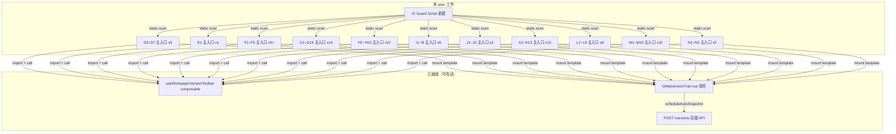

# Design Document: Version Trail Full Coverage

## Overview

将 `useWorkpaperVersionToolbar` composable + `GtWpVersionTrail` 组件 + 保存后自动快照的标准化接线推广至 D3~D7、E1、F1~F5、G1~G14、H1~H10、I1~I6、J1~J3、K1~K13、L1~L8、M1~M10、N1~N5 全部未接入底稿主入口组件（约 70+ 文件），并新建 CI 守卫脚本确保未来新增底稿不遗漏版本链集成。

**核心前提**：所有基础设施已就绪（composable、组件、后端 API），本 spec 为纯接线/集成工作，无新业务逻辑开发。D2（`GtD2AccountsReceivable.vue`）为参考实现。

## Architecture



## Components and Interfaces

### 5-Step Integration Pattern (per component)

每个主入口组件需完成以下 5 步标准接线（参照 D2）：

**Step 1: Import**
```typescript
import { useWorkpaperVersionToolbar } from './composables/useWorkpaperVersionToolbar'
const GtWpVersionTrail = defineAsyncComponent(() => import('./version-trail/GtWpVersionTrail.vue'))
```

**Step 2: Call composable**
```typescript
const {
  versionTrailRef,
  openVersionHistory,
  scheduleAutoSnapshot,
} = useWorkpaperVersionToolbar({
  wpId: toRef(props, 'wpId'),
  projectId: toRef(props, 'projectId'),
})
```

**Step 3: Hook save**
```typescript
// 在保存成功后调用
async function onSave(items) {
  await formData.saveItemsFromEvent(items)
  scheduleAutoSnapshot()  // 仅在保存成功后
}
```

**Step 4: Mount template**
```html
<!-- 模板末尾，root div 关闭前 -->
<GtWpVersionTrail ref="versionTrailRef" :workpaper-id="props.wpId" :project-id="props.projectId" />
```

**Step 5: Provide to children**
```typescript
provide('{cyclePrefix}VersionTrailRef', versionTrailRef)
provide('{cyclePrefix}OpenVersionHistory', openVersionHistory)
```

### Provide Key Naming Convention

| 循环 | versionTrailRef key | openVersionHistory key |
|------|--------------------|-----------------------|
| D3 | `d3VersionTrailRef` | `d3OpenVersionHistory` |
| D4 | `d4VersionTrailRef` | `d4OpenVersionHistory` |
| E1 | `e1VersionTrailRef` | `e1OpenVersionHistory` |
| F1 | `f1VersionTrailRef` | `f1OpenVersionHistory` |
| G4 | `g4VersionTrailRef` | `g4OpenVersionHistory` |
| ... | `{prefix}VersionTrailRef` | `{prefix}OpenVersionHistory` |

规则：`cyclePrefix` = 循环编码小写（如 `d3`、`g14`、`k13`）。

### CI Guard Script

**路径**: `backend/scripts/check/check_wp_version_trail.py`

**职责**：
- 扫描 `workpaper/` 目录下所有 D~N 循环主入口组件
- 检测两个必备标记：
  1. `useWorkpaperVersionToolbar` import/call
  2. `GtWpVersionTrail` 在 template 中出现
- 维护白名单文件（纯 OnlyOffice 底稿等豁免）
- `--strict` 模式以 exit code 1 阻断 CI

**设计要点**（参照 `check_wp_ref_contract.py`）：
- 零依赖（仅标准库）
- UTF-8 读取 + `sys.stdout.reconfigure(encoding='utf-8')` 防 Windows GBK
- 白名单路径：`backend/scripts/check/version_trail_whitelist.txt`（每行一个文件名，`#` 注释）

**主入口组件识别规则**：
- 文件名匹配 `Gt{Letter}{Digit}*.vue`（如 `GtD3PrepaidAccounts.vue`、`GtG14xxx.vue`）
- 位于 `workpaper/` 直接子目录或 `workpaper/{cycle}/` 目录
- 排除已知非主入口文件（Tab 组件、子组件等）

## Data Models

无新数据模型。使用现有：
- `useWorkpaperVersionToolbar` 返回 `{ versionTrailRef, openVersionHistory, scheduleAutoSnapshot }`
- `GtWpVersionTrail` props: `:workpaper-id` (string), `:project-id` (string)
- 白名单文件：纯文本，每行一个组件文件名

## Correctness Properties

*A property is a characteristic or behavior that should hold true across all valid executions of a system—essentially, a formal statement about what the system should do. Properties serve as the bridge between human-readable specifications and machine-verifiable correctness guarantees.*

### Property 1: CI Guard Detection Completeness

*For any* Vue SFC file content, the CI guard SHALL correctly classify it as non-compliant if and only if the file is missing `useWorkpaperVersionToolbar` import/call OR missing `GtWpVersionTrail` template mount. A file containing both markers SHALL be classified as compliant.

**Validates: Requirements 14.2, 14.3**

### Property 2: CI Guard Whitelist Exclusion

*For any* set of component files and any whitelist configuration, the CI guard SHALL exclude all whitelisted files from violation reporting regardless of their content. The reported violations SHALL equal the set of non-compliant files minus whitelisted files.

**Validates: Requirements 14.5**

## Error Handling

| 场景 | 处理 |
|------|------|
| 组件文件 UTF-8 解码失败 | CI guard 跳过该文件并打印 warning |
| wpId/projectId props 缺失 | 主入口从 route params 或 inject 获取（Req 12.4） |
| scheduleAutoSnapshot 调用时 wpId 为空 | composable 内部已有空值守卫，静默跳过 |
| GtWpVersionTrail 动态导入失败 | defineAsyncComponent 默认行为：不影响主组件渲染 |
| 白名单文件不存在 | CI guard 视为空白名单，扫描所有文件 |
| 保存失败 | 不调用 scheduleAutoSnapshot（Req 13.3） |

## Testing Strategy

### Property-Based Tests (CI Guard)

- **框架**: Hypothesis (Python)
- **最小迭代**: 100 次
- **标注格式**: `# Feature: version-trail-full-coverage, Property {N}: {text}`

测试 CI guard 的检测逻辑：
1. 生成随机 Vue SFC 内容（含/不含两个标记的组合），验证检测正确性（Property 1）
2. 生成随机文件列表 + 白名单，验证白名单排除逻辑（Property 2）

### Example-Based Tests

- 对 CI guard 运行 `--strict` 模式验证退出码
- 验证白名单注释行 `#` 被正确忽略
- 验证空文件/二进制文件不崩溃

### Integration Verification

由于本 spec 是纯接线工作，主要验证手段为：
1. CI guard 全树扫描通过（exit 0）= 所有组件已接入
2. Playwright 抽样验证（D3、G1、K1、N1 各一个 tab 保存后版本列表非空）

### 不使用 PBT 的范围

Req 1~11 的接线工作为静态代码修改，不涉及可变输入的运行时逻辑，由 CI guard + Playwright 覆盖，不适合 PBT。
