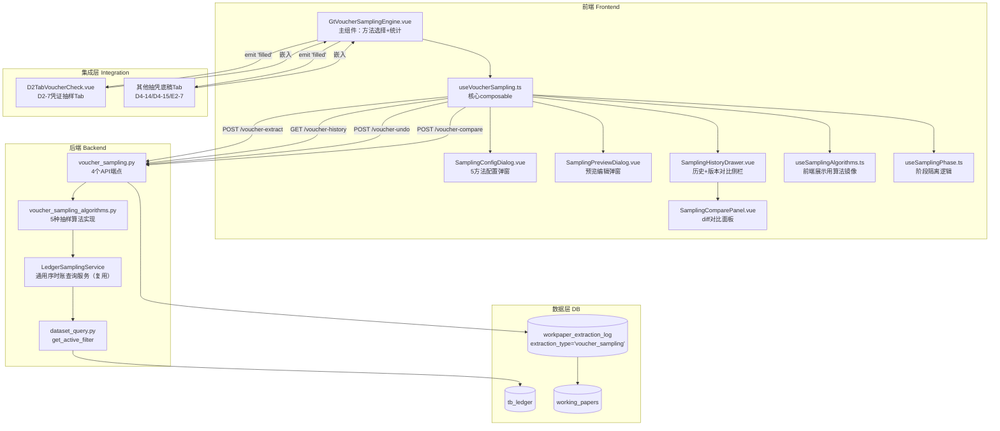
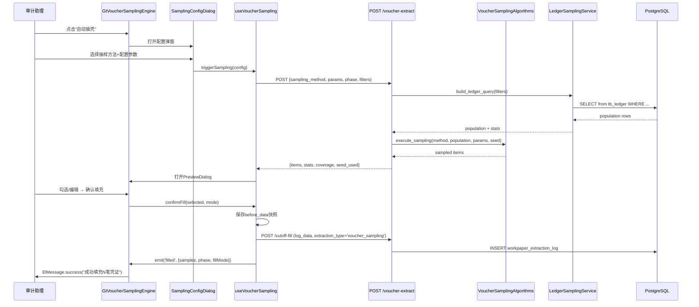

# Design Document: 通用抽凭引擎组件

## Overview

通用抽凭引擎组件（voucher-sampling-engine）从 `tb_ledger` 表按审计师配置的5种审计抽样方法自动提取凭证并填充到抽凭底稿。核心数据流：

**用户选择抽样方法+配置参数 → 后端执行抽样算法 → 返回抽样结果+覆盖率 → 前端预览弹窗 → 用户勾选确认 → 填充至底稿samples → 记录执行日志+覆盖率**

设计目标：
- 后端复用 `LedgerSamplingService`（cutoff spec 定义）的 `build_ledger_query` / `execute_with_stats`，新增 `voucher_sampling_algorithms.py` 实现5种抽样算法
- 前端 `GtVoucherSamplingEngine.vue` 作为通用组件，通过 props 配置适配 D2-7/D4-14/D4-15/E2-7 等所有抽凭底稿
- 支持预审/年审阶段隔离，年审不可覆盖预审数据
- 版本链+历史对比通过 `workpaper_extraction_log` 表（V095，extraction_type='voucher_sampling'）实现
- CAS 1314 合规性自动检查（覆盖率/方法合规/样本充分性）
- 行级编辑留痕（edit_trail 数组追加式记录）

## Architecture



### 文件结构

```
frontend/src/components/workpaper/
├── voucher-sampling/                          # 新增目录
│   ├── GtVoucherSamplingEngine.vue           # 主组件（~400行）
│   ├── SamplingConfigDialog.vue              # 5方法配置弹窗（~450行）
│   ├── SamplingPreviewDialog.vue             # 预览编辑弹窗（~350行）
│   ├── SamplingHistoryDrawer.vue             # 历史+版本对比侧栏（~300行）
│   └── SamplingComparePanel.vue              # diff对比面板（~200行）
├── composables/
│   ├── useVoucherSampling.ts                 # 核心composable（~500行）
│   ├── useSamplingAlgorithms.ts              # 前端展示用算法镜像（~200行）
│   └── useSamplingPhase.ts                   # 阶段隔离逻辑（~150行）

backend/app/services/
│   ├── ledger_sampling_service.py            # 已有（cutoff定义，复用）
│   └── voucher_sampling_algorithms.py        # 5种抽样算法实现（~300行）

backend/app/routers/
│   └── voucher_sampling.py                   # 4个API端点（~250行）

backend/tests/
│   └── test_voucher_sampling_pbt.py          # 后端PBT测试（hypothesis）

frontend/src/components/workpaper/__tests__/
│   ├── voucherSampling.spec.ts               # composable单元测试
│   ├── voucherSampling.property.spec.ts      # composable PBT测试（fast-check）
│   └── samplingAlgorithms.property.spec.ts   # 算法PBT测试（fast-check）
```

### 数据流序列图



## Components and Interfaces

### 1. voucher_sampling_algorithms.py — 5种抽样算法

```python
from decimal import Decimal
from dataclasses import dataclass
import random
from typing import Literal

SamplingMethod = Literal["random", "stratified", "specific_item", "systematic", "mus"]

@dataclass
class StratumConfig:
    """金额分层配置"""
    lower_bound: Decimal
    upper_bound: Decimal
    sample_size: int

@dataclass
class SamplingParams:
    """抽样参数（各方法特有字段按需填入）"""
    # random
    sample_size: int | None = None
    # stratified
    strata: list[StratumConfig] | None = None
    # specific_item
    materiality_threshold: Decimal | None = None
    # systematic
    start_point: int | None = None
    interval: int | None = None
    # mus
    mus_sample_size: int | None = None

@dataclass
class SamplingResult:
    """抽样结果"""
    items: list[dict]
    seed_used: int
    population_count: int
    population_debit_total: Decimal
    population_credit_total: Decimal
    sample_count: int
    sample_debit_total: Decimal
    sample_credit_total: Decimal
    count_coverage_rate: Decimal   # 笔数覆盖率 (%)
    amount_coverage_rate: Decimal  # 金额覆盖率 (%)
    truncated: bool


def execute_sampling(
    method: SamplingMethod,
    population: list[dict],
    params: SamplingParams,
    seed: int | None = None,
) -> SamplingResult:
    """执行抽样算法
    
    根据 method 分发到具体算法实现。
    若 seed 为 None，自动生成随机种子并记录到结果。
    """

def _random_sampling(population: list[dict], n: int, rng: random.Random) -> list[dict]:
    """随机抽样：random.sample(population, N)"""

def _stratified_sampling(
    population: list[dict], strata: list[StratumConfig], rng: random.Random
) -> list[dict]:
    """金额分层抽样：按金额区间分层，每层分别 random.sample"""

def _specific_item_sampling(
    population: list[dict], threshold: Decimal
) -> list[dict]:
    """特定项目选取：GREATEST(debit, credit) >= threshold"""

def _systematic_sampling(
    population: list[dict], start: int, interval: int
) -> list[dict]:
    """系统抽样：按 voucher_date+voucher_no 排序后，从 start 起每隔 K 取 1"""

def _mus_sampling(
    population: list[dict], sample_size: int, rng: random.Random
) -> list[dict]:
    """MUS 货币单元抽样：累积金额法（PPS）
    
    interval = total_amount / sample_size
    random_start = rng.uniform(0, interval)
    遍历凭证累积金额，每跨越一个间隔点选中当前凭证
    负数金额取绝对值参与权重
    """
```

### 2. useVoucherSampling.ts — 核心composable

```typescript
export type SamplingMethod = 'random' | 'stratified' | 'specific_item' | 'systematic' | 'mus'
export type Phase = 'preliminary' | 'final'
export type FillMode = 'append' | 'replace' | 'merge'
export type CheckResult = 'Y' | 'N' | '异常' | ''

export interface StratumConfig {
  lowerBound: string   // Decimal字符串
  upperBound: string
  sampleSize: number
}

export interface SamplingConfig {
  samplingMethod: SamplingMethod
  // random
  sampleSize?: number
  // stratified
  strata?: StratumConfig[]
  // specific_item
  materialityThreshold?: string  // Decimal字符串
  // systematic
  startPoint?: number
  interval?: number
  // mus
  musSampleSize?: number
  // 通用
  randomSeed?: number | null
  // 过滤条件
  accountCodes: string[]
  periodRange: number[]          // 会计月份 1-12
  amountMin?: string
  amountMax?: string
  directionFilter: 'debit' | 'credit' | 'all'
  voucherTypeFilter: string[]
  summaryKeyword: string
  excludeExtracted: boolean
}

export interface SampledVoucher {
  voucherNo: string
  voucherDate: string
  summary: string | null
  debitAmount: string | null
  creditAmount: string | null
  accountCode: string
  accountName: string | null
  counterpartAccount: string | null
  voucherType: string | null
  accountingPeriod: number | null
  checkResult: CheckResult
  abnormal: boolean
  remark: string
  selected: boolean
  phase: Phase
  editTrail: EditTrailEntry[]
}

export interface EditTrailEntry {
  userId: string
  timestamp: string
  field: string
  oldValue: string
  newValue: string
}

export interface CoverageStats {
  populationCount: number
  populationAmount: string    // 总体金额合计
  sampleCount: number
  sampleAmount: string        // 样本金额合计
  countCoverageRate: string   // 笔数覆盖率%
  amountCoverageRate: string  // 金额覆盖率%
}

export interface ComplianceWarning {
  type: 'coverage_low' | 'specific_item_high' | 'mus_insufficient'
  message: string
  level: 'warning' | 'suggestion'
}

export interface ExtractionLogEntry {
  id: string
  createdAt: string
  userId: string
  samplingMethod: SamplingMethod
  sampleCount: number
  coverageStats: CoverageStats
  phase: Phase
  fillMode: FillMode
  isUndone: boolean
  extractionCriteria: Record<string, unknown>
}

export interface VoucherSamplingOptions {
  projectId: Ref<string>
  year: Ref<number>
  workpaperId: Ref<string>
  accountCode: string
  phase: Ref<Phase>
  defaultMethod?: SamplingMethod
}

export function useVoucherSampling(options: VoucherSamplingOptions) {
  return {
    // 状态
    config: Ref<SamplingConfig>,
    sampledVouchers: Ref<SampledVoucher[]>,
    coverageStats: Ref<CoverageStats | null>,
    complianceWarnings: Ref<ComplianceWarning[]>,
    loading: Ref<boolean>,
    configDialogVisible: Ref<boolean>,
    previewVisible: Ref<boolean>,
    historyVisible: Ref<boolean>,
    historyList: Ref<ExtractionLogEntry[]>,
    fillMode: Ref<FillMode>,
    seedUsed: Ref<number | null>,

    // 计算属性
    selectedVouchers: ComputedRef<SampledVoucher[]>,
    selectedCount: ComputedRef<number>,
    selectedDebitTotal: ComputedRef<number>,
    selectedCreditTotal: ComputedRef<number>,

    // 操作
    triggerSampling: () => Promise<void>,
    confirmFill: () => Promise<SampledVoucher[]>,
    loadHistory: () => Promise<void>,
    undoLastExtraction: (logId: string) => Promise<void>,
    compareVersions: (logIdA: string, logIdB: string) => Promise<CompareResult>,
    toggleSelectAll: (selected: boolean) => void,
    updateField: (index: number, field: string, value: unknown) => void,
    batchMarkChecked: (indices: number[]) => void,

    // 校验
    validateConfig: () => boolean,
    configErrors: Ref<Record<string, string>>,
    
    // CAS 1314 合规
    checkCompliance: () => ComplianceWarning[],
  }
}
```

### 3. useSamplingPhase.ts — 阶段隔离逻辑

```typescript
export interface PhaseOptions {
  phase: Ref<Phase>
  samples: Ref<SampledVoucher[]>
}

export type ViewMode = 'preliminary' | 'final' | 'all'

export function useSamplingPhase(options: PhaseOptions) {
  return {
    viewMode: Ref<ViewMode>,
    
    // 计算属性
    visibleSamples: ComputedRef<SampledVoucher[]>,
    preliminarySamples: ComputedRef<SampledVoucher[]>,
    finalSamples: ComputedRef<SampledVoucher[]>,
    isRowEditable: (row: SampledVoucher) => boolean,
    isFillModeRestricted: ComputedRef<boolean>,  // 年审时强制 append
    
    // 操作
    getPreliminaryVoucherNos: () => string[],  // 获取预审已抽凭证号用于排除
  }
}
```

### 4. GtVoucherSamplingEngine.vue — 主组件接口

```typescript
// Props
interface GtVoucherSamplingEngineProps {
  accountCode: string
  phase: Phase
  defaultMethod?: SamplingMethod
  workpaperId: string
  projectId: string
  year: number
}

// Emits
interface GtVoucherSamplingEngineEmits {
  (e: 'filled', payload: { samples: SampledVoucher[]; phase: Phase; fillMode: FillMode }): void
  (e: 'phase-changed', payload: { phase: Phase }): void
}
```

### 5. 版本对比接口

```typescript
export interface CompareResult {
  added: SampledVoucher[]     // log_id_b 有但 log_id_a 没有
  removed: SampledVoucher[]   // log_id_a 有但 log_id_b 没有
  retained: SampledVoucher[]  // 两者都有（按 voucher_no 匹配）
}
```

### 6. API 端点规格

```python
# POST /api/projects/{pid}/sampling/voucher-extract
# 请求体: VoucherExtractRequest（含 sampling_method, sampling_params, phase, filters, workpaper_id, random_seed）
# 响应: { items: [...], stats: CoverageStats, seed_used: int, truncated: bool }

# GET /api/projects/{pid}/sampling/voucher-history?wp_id={uuid}
# 响应: [ExtractionLogEntry, ...]（按 created_at DESC，仅 extraction_type='voucher_sampling'）

# POST /api/projects/{pid}/sampling/voucher-undo?log_id={uuid}
# 响应: { success: true, before_data: [...] }

# POST /api/projects/{pid}/sampling/voucher-compare
# 请求体: { log_id_a: uuid, log_id_b: uuid }
# 响应: { added: [...], removed: [...], retained: [...] }
```

## Data Models

### workpaper_extraction_log 复用（无新迁移）

复用 V095 创建的 `workpaper_extraction_log` 表，通过 `extraction_type='voucher_sampling'` 区分于截止测试。

| 列名 | 类型 | 说明 |
|------|------|------|
| id | UUID PK | 主键 |
| project_id | UUID FK | 项目ID |
| workpaper_id | UUID FK | 底稿ID |
| user_id | UUID | 操作人 |
| extraction_type | VARCHAR(50) | **'voucher_sampling'** |
| extraction_criteria | JSONB | 抽凭参数JSON（见下方结构） |
| total_matched | INTEGER | 总体笔数 |
| filled_count | INTEGER | 实际填充笔数 |
| fill_mode | VARCHAR(20) | 'append'/'replace'/'merge' |
| before_data | JSONB | 填充前数据快照 |
| is_undone | BOOLEAN | 是否已撤销 |
| created_at | TIMESTAMP | 操作时间 |

### extraction_criteria JSON 结构（voucher_sampling 类型）

```json
{
  "sampling_method": "random",
  "sampling_params": {
    "sample_size": 30
  },
  "random_seed": 42,
  "phase": "final",
  "coverage_stats": {
    "count_rate": "15.00",
    "amount_rate": "62.35"
  },
  "filters": {
    "account_codes": ["1122"],
    "period_range": [1, 2, 3, 4, 5, 6, 7, 8, 9, 10, 11, 12],
    "amount_min": "0",
    "amount_max": null,
    "direction_filter": "all",
    "voucher_type_filter": [],
    "summary_keyword": "",
    "exclude_extracted": true
  }
}
```

### 填充后 samples 数据结构（存入 checklist_responses）

| tb_ledger 字段 | 底稿 sample 字段 | 说明 |
|---------------|-----------------|------|
| voucher_no | 凭证号 | 原值 |
| voucher_date | 凭证日期 | YYYY-MM-DD |
| debit_amount | 借方金额 | Decimal字符串 |
| credit_amount | 贷方金额 | Decimal字符串 |
| summary | 摘要 | 原值 |
| counterpart_account | 对方科目 | 原值 |
| account_code | 科目编码 | 原值 |
| account_name | 科目名称 | 原值 |
| voucher_type | 凭证类型 | 原值 |
| accounting_period | 会计期间 | 原值 |
| — (user input) | 核查结果 | Y/N/异常/空 |
| — (user input) | 异常标记 | boolean |
| — (user input) | 备注 | 用户编辑 |
| — (system) | phase | 'preliminary'/'final' |
| — (system) | edit_trail | [{user_id, timestamp, field, old_value, new_value}] |
| — (system) | 数据来源 | "自动抽凭" |


## Correctness Properties

*A property is a characteristic or behavior that should hold true across all valid executions of a system—essentially, a formal statement about what the system should do. Properties serve as the bridge between human-readable specifications and machine-verifiable correctness guarantees.*

### Property 1: 随机抽样产生恰好 N 笔

*For any* population (length >= N) and sample size N (1 <= N <= len(population)), random sampling SHALL produce a result containing exactly N items, and every item in the result SHALL exist in the original population (subset invariant).

**Validates: Requirements 3.3**

### Property 2: 金额分层抽样尊重层级边界

*For any* population and strata configuration (list of {lower_bound, upper_bound, sample_size}), stratified sampling SHALL produce items where:
- Each sampled item's amount (GREATEST(debit, credit)) falls within its assigned stratum's [lower_bound, upper_bound] range
- Each stratum produces exactly its configured sample_size items (if stratum population >= sample_size)
- Total sample count equals sum of per-stratum sample_sizes (capped by actual stratum population)

**Validates: Requirements 3.4**

### Property 3: 特定项目选取恰好捕获 >= 阈值的全部凭证

*For any* population and materiality threshold T, specific_item sampling SHALL produce a result where:
- Every item's amount (GREATEST(COALESCE(debit,0), COALESCE(credit,0))) >= T
- Every item in the population with amount >= T appears in the result (completeness)
- No item with amount < T appears in the result (precision)

**Validates: Requirements 3.5**

### Property 4: 系统抽样间隔正确性

*For any* sorted population (by voucher_date + voucher_no), start point S (1 <= S <= len(population)), and interval K (K >= 2), systematic sampling SHALL select items at indices {S-1, S-1+K, S-1+2K, ...} (0-based), and no other items.

**Validates: Requirements 3.6**

### Property 5: MUS 累积金额选取覆盖

*For any* population with positive total amount and sample_size M, MUS sampling SHALL:
- Use interval = total_amount / M
- Select items where cumulative amount crosses interval boundaries
- Produce a sample count approximately equal to M (within ±1 due to boundary effects)
- Negative amounts are included via absolute value in cumulative calculation

**Validates: Requirements 3.7, 3.8**

### Property 6: 阶段隔离 — 年审永不覆盖预审

*For any* samples array containing preliminary-phase rows and any fill operation during final phase:
- Preliminary-phase rows SHALL remain unchanged after the operation (content + order preserved)
- Fill mode SHALL be forced to 'append' (replace/merge disabled)
- View mode filtering SHALL correctly partition: preliminary-only shows only phase='preliminary', final-only shows only phase='final', all shows union
- Editing is disabled for preliminary rows when current phase is 'final'

**Validates: Requirements 5.1, 5.2, 5.3, 5.4, 5.5, 5.6, 7.5, 9.4**

### Property 7: 排除已抽凭证正确性

*For any* set of previously extracted voucher numbers (from workpaper_extraction_log + current preliminary phase vouchers when in final phase) and a new query result, when exclude_extracted=true:
- The filtered result SHALL NOT contain any voucher_no in the previously extracted set
- The filtered result SHALL contain all voucher_no from the query result NOT in the previously extracted set (no false exclusions)

**Validates: Requirements 2.2, 2.3, 2.5**

### Property 8: 填充策略正确性

*For any* existing samples array (length N, filtered by current phase) and selected vouchers array (length M, all with unique voucher_no):
- **append**: result length of current-phase rows === existing_phase_count + M; preliminary rows untouched; new rows appended after existing
- **replace**: current-phase rows replaced entirely; result current-phase length === M; other-phase rows untouched
- **merge**: current-phase rows = N + (M - overlap_count) where overlap = voucher_no intersection; no duplicate voucher_no within same phase

**Validates: Requirements 7.1, 7.2, 7.3, 7.4**

### Property 9: 覆盖率计算准确性

*For any* population (count P, total amount A) and sample (count S, total amount B):
- 笔数覆盖率 === round(S / P × 100, 2) (when P > 0)
- 金额覆盖率 === round(B / A × 100, 2) (when A > 0)
- 金额取 GREATEST(debit_amount, credit_amount) 的绝对值之和
- CAS 1314 warnings correctly triggered: amount_rate < 60 → warning; specific_items / total_sample > 0.5 → suggestion

**Validates: Requirements 3.9, 8.3, 12.1, 12.2**

### Property 10: 版本对比 diff 正确性（完全分割）

*For any* two extraction log entries (log_a with vouchers set A, log_b with vouchers set B, matched by voucher_no):
- added = B \ A (in B but not in A)
- removed = A \ B (in A but not in B)
- retained = A ∩ B
- added ∪ removed ∪ retained === A ∪ B (completeness)
- added ∩ removed === ∅, added ∩ retained === ∅, removed ∩ retained === ∅ (mutual exclusivity)

**Validates: Requirements 6.3**

### Property 11: 随机种子可复现性

*For any* seed value, population, sampling method, and params, executing the sampling algorithm twice with identical inputs SHALL produce identical results (same items in same order).

**Validates: Requirements 1.7, 3.12**

### Property 12: 编辑留痕不可变性（仅追加）

*For any* sequence of field edits on a sample row:
- Each edit SHALL append exactly one entry to edit_trail (trail length increases by 1)
- Previous trail entries SHALL remain unchanged after new edits (immutability)
- Each trail entry SHALL contain: user_id, timestamp, field, old_value, new_value
- old_value in the new entry SHALL equal the current field value before the edit

**Validates: Requirements 9.2**

## Error Handling

| 场景 | 处理方式 |
|------|---------|
| 抽样总体为空（0条符合过滤条件） | 不打开预览弹窗，ElMessage.info "未找到符合条件的凭证，请调整过滤条件" |
| 样本量 > 总体笔数（random/stratified） | 自动调整为总体笔数，ElMessage.warning "样本量已调整为总体实际笔数" |
| 分层配置有重叠区间 | 前端校验拦截，红色提示"层级金额区间不可重叠" |
| 分层某层总体不足 | 该层取全部，返回实际数量，提示"第X层总体不足，已取全部N笔" |
| MUS 总体金额为0 | 无法计算间隔，ElMessage.error "总体金额为0，无法执行MUS抽样" |
| systematic 起始点 > 总体笔数 | 前端校验拦截 + 后端返回空结果 |
| 抽样结果超500条（specific_item可能发生） | 返回前500条 + truncated=true + 黄色 el-alert |
| 年审阶段选择 replace 模式 | el-radio disabled + tooltip "年审阶段不可覆盖预审数据" |
| replace 模式确认弹窗取消 | 不执行任何操作 |
| workpaper_extraction_log 写入失败 | 回滚填充 + ElMessage.error |
| 撤销非最新记录 | 按钮禁用 + tooltip "仅可撤销最近一次操作" |
| 撤销时 before_data 为 NULL | 恢复为空数组 [] |
| 版本对比选择同一条记录 | 前端校验"请选择两条不同的记录" |
| 网络断开时提取 | http.ts 全局重试机制 + ElMessage.error |
| 校验失败（缺必填字段） | 对应字段下方红色提示，不发起请求 |
| get_active_filter 失败 | 降级为 project_id + year + is_deleted=false 基础过滤 |
| 并发填充冲突 | before_data 以发起时快照为准，后续撤销可逐次回滚 |

## Testing Strategy

### 单元测试（vitest）

- `useSamplingAlgorithms.ts` 前端展示用算法镜像：各方法基本验证
- `useSamplingPhase.ts`：视图模式切换、行编辑权限判定、阶段强制 append
- `useVoucherSampling.ts`：配置初始化、校验逻辑、覆盖率计算、合规检查
- 填充策略三种模式：append/replace/merge 各含边界案例（含阶段隔离场景）
- 版本对比：added/removed/retained 分割验证
- 编辑留痕：updateField 追加 trail 正确性
- 金额格式化：displayPrefs.fmtAmount 适配

### Property-Based Tests（fast-check + hypothesis）

前端 PBT 库：**fast-check**（项目已有）
后端 PBT 库：**hypothesis**（项目已有）

每个 correctness property 对应一个 PBT 测试，最少 100 次迭代。

标签格式：`Feature: voucher-sampling-engine, Property {N}: {title}`

| Property | 测试文件 | 框架 | 生成器 |
|----------|---------|------|--------|
| P1 随机抽样N笔 | `test_voucher_sampling_pbt.py` | hypothesis | `st.lists(ledger_entry(), min_size=1)` + `st.integers(1, len)` |
| P2 分层抽样 | `test_voucher_sampling_pbt.py` | hypothesis | 自定义 population + strata 策略 |
| P3 特定项目 | `test_voucher_sampling_pbt.py` | hypothesis | `st.lists(ledger_entry())` + `st.decimals(min_value=0)` |
| P4 系统抽样 | `test_voucher_sampling_pbt.py` | hypothesis | `st.lists(ledger_entry(), min_size=2)` + `st.integers` × 2 |
| P5 MUS累积 | `test_voucher_sampling_pbt.py` | hypothesis | `st.lists(ledger_entry(positive=True), min_size=1)` + `st.integers(1,50)` |
| P6 阶段隔离 | `voucherSampling.property.spec.ts` | fast-check | 自定义 SampledVoucher[] + phase + fillMode |
| P7 排除去重 | `test_voucher_sampling_pbt.py` | hypothesis | `st.lists(st.text(min_size=1))` × 2 |
| P8 填充策略 | `voucherSampling.property.spec.ts` | fast-check | 自定义 SampledVoucher[] + `fc.oneof('append','replace','merge')` |
| P9 覆盖率 | `test_voucher_sampling_pbt.py` | hypothesis | `st.integers(1,1000)` × 2 + `st.decimals` × 2 |
| P10 版本对比 | `voucherSampling.property.spec.ts` | fast-check | `fc.array(fc.string())` × 2 |
| P11 种子复现 | `test_voucher_sampling_pbt.py` | hypothesis | `st.integers()` + population + method |
| P12 编辑留痕 | `voucherSampling.property.spec.ts` | fast-check | 自定义 edit sequence 生成器 |

### 后端集成测试（pytest）

- 完整流程：配置 → 抽样（5种方法各一次）→ 预览 → 填充 → 日志 → 撤销
- 安全隔离：跨项目不可见、跨年度不可见（复用 LedgerSamplingService）
- 阶段隔离：预审填充 → 切年审 → 验证预审行不被覆盖
- 版本对比：两次抽凭后对比 diff 正确性
- 排除去重：第一次抽凭后第二次排除已抽凭证
- 种子复现：同参数同种子得到相同结果

### 测试配置

```typescript
// fast-check 配置
fc.assert(fc.property(...), { numRuns: 100 })

// 标签示例
// Feature: voucher-sampling-engine, Property 6: 阶段隔离 — 年审永不覆盖预审
```

```python
# hypothesis 配置
@settings(max_examples=100)
@given(...)
def test_property_N_xxx(self, ...):
    # Feature: voucher-sampling-engine, Property N: xxx
    ...
```
