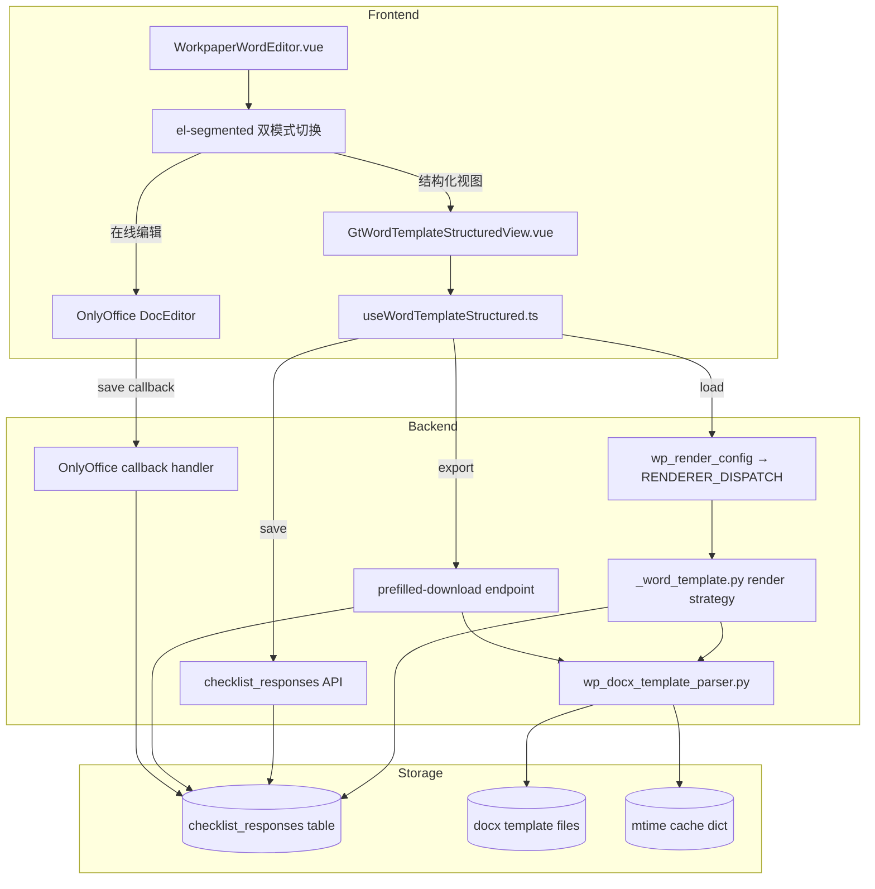

# Design Document: Word Template Dual Mode

## Overview

为所有 `word-template` 类型底稿（25 个 wp_code）在现有 `WorkpaperWordEditor.vue` 通用模式中增加结构化视图能力。用户通过 `el-segmented` 在「结构化视图」与「在线编辑」之间切换。后端使用 `python-docx` 解析 docx 模板提取占位符和文档结构，前端以卡片式 UI 渲染可编辑字段。数据持久化统一走 `checklist_responses`（item_id: `wt-{wp_code}-{field_id}`），两种模式共享同一数据源，切换时互刷新。

不引入新 componentType，不影响 A16 专用模式。

## Architecture



### 关键设计决策

| 决策 | 理由 |
|------|------|
| 不新建 componentType | word-template 已有 25 个 wp_code 映射，增加内部视图切换即可，避免 registry 膨胀 |
| 数据走 checklist_responses | 已有 batch API、已有 item_id 模式，复用成本最低 |
| python-docx 解析 + mtime 缓存 | python-docx 已是项目依赖，mtime 缓存模式与 wp_code_overrides 一致 |
| AI 按钮 disabled 预留 | UI/接口设计到位但不接入 vLLM，Phase3 接入时只需解除 disabled |
| OO callback 反写 | 保证两模式数据一致性，OO 编辑保存后自动同步回 checklist_responses |

## Components and Interfaces

### 后端组件

#### 1. `services/wp_docx_template_parser.py`

```python
@dataclass
class PlaceholderDef:
    field_id: str          # 唯一标识，如 "entity_name"
    label: str             # 显示标签，如 "被审计单位"
    data_type: str         # "text" | "date" | "textarea" | "number"
    default_value: str     # 模板中原始文本
    position: dict         # {"paragraph_index": int} 或 {"table_index": int, "row": int, "col": int}
    pattern: str           # 原始占位符模式，如 "${entity_name}" 或 "××公司"

@dataclass
class ParagraphDef:
    index: int
    text: str
    style: str             # "Heading 1" | "Normal" | etc.
    heading_level: int     # 0=非标题, 1~6=对应级别
    placeholder_ids: list[str]

@dataclass
class TableDef:
    index: int
    rows: list[list[str]]  # 每个单元格的文本
    placeholder_ids: list[str]

@dataclass
class TemplateStructure:
    paragraphs: list[ParagraphDef]
    tables: list[TableDef]
    placeholders: list[PlaceholderDef]
    metadata: dict         # {"template_name", "wp_code", "last_parsed_at"}

def parse_template(file_path: str) -> TemplateStructure: ...
def get_cached_structure(file_path: str, wp_code: str) -> TemplateStructure: ...
def format_placeholder_summary(structure: TemplateStructure) -> str: ...
```

#### 2. `routers/wp_render_strategies/_word_template.py`

```python
async def render(ctx: RenderContext) -> dict | None:
    """word-template 渲染策略：返回 template_structure + filled_responses"""
    # 1. 通过 parser 获取缓存的 TemplateStructure
    # 2. 从 checklist_responses 查询 item_id LIKE 'wt-{wp_code}-%'
    # 3. 合并 current_value 到 placeholders
    # 4. 返回 {template_structure, filled_responses, sign_status}
```

#### 3. 扩展 `wp_template_download.py` prefilled-download

新增 `include_responses: bool = False` 查询参数：
- `true`: 从 checklist_responses 读取 `wt-{wp_code}-*` 响应，替换对应占位符
- `false`: 保持现有行为（仅替换项目抬头信息）

#### 4. 扩展 `wp_onlyoffice_router.py` callback

在 word-template 类型底稿的 save callback 中：
- 下载保存后的 docx
- 使用 parser 提取当前占位符值
- 更新 checklist_responses 对应记录

### 前端组件

#### 5. `useWordTemplateStructured.ts` (composable)

```typescript
interface UseWordTemplateStructuredOptions {
  wpId: Ref<string>
  wpCode: Ref<string>
  projectId: Ref<string>
}

interface UseWordTemplateStructuredReturn {
  templateStructure: Ref<TemplateStructure | null>
  fieldValues: Ref<Record<string, string>>
  loading: Ref<boolean>
  saveStatus: Ref<'saved' | 'saving' | 'unsaved'>
  // methods
  loadStructure(): Promise<void>
  updateField(fieldId: string, value: string): void  // triggers debounce save
  flushPendingSaves(): Promise<void>
  exportDocx(): Promise<void>
  triggerAiFill(fieldId: string): Promise<void>
}

export function useWordTemplateStructured(opts: UseWordTemplateStructuredOptions): UseWordTemplateStructuredReturn
```

#### 6. `GtWordTemplateStructuredView.vue`

Props:
- `templateStructure: TemplateStructure`
- `fieldValues: Record<string, string>`
- `readonly: boolean`

Events:
- `@update:field(fieldId: string, value: string)`
- `@ai-fill(fieldId: string)`

渲染规则:
- heading → el-card title
- paragraph with placeholders → inline editable inputs
- paragraph without placeholders → read-only styled text
- table → el-table with editable cells at placeholder positions
- AI button → disabled el-button with tooltip (Phase3)

### API 接口

| Method | Path | Description |
|--------|------|-------------|
| GET | `/api/workpapers/{wp_id}/template-structure` | 返回解析后的模板结构 + 已填数据 |
| GET | `/api/workpapers/{wp_id}/render-config` | 现有端点，word-template 策略新增 template_structure |
| POST | `/api/checklist-responses/batch` | 现有端点，保存字段值 |
| GET | `/api/projects/{pid}/wp-templates/{wp_code}/prefilled-download?include_responses=true` | 扩展现有端点 |
| POST | `/api/ai-generate` | AI 预填（Phase3 预留，当前返回 501） |

## Data Models

### checklist_responses 存储格式

| 字段 | 值 |
|------|-----|
| item_id | `wt-{wp_code}-{field_id}` (如 `wt-A8-1-entity_name`) |
| conclusion | 字段值（短文本） |
| remark | 字段值（长文本/textarea 类型） |
| project_id | 项目 UUID |
| wp_id | 底稿 UUID |

### TemplateStructure API Response Schema

```json
{
  "placeholders": [
    {
      "field_id": "entity_name",
      "label": "被审计单位",
      "data_type": "text",
      "default_value": "××公司",
      "position": {"paragraph_index": 2},
      "current_value": "示例公司"
    }
  ],
  "paragraphs": [
    {
      "index": 0,
      "text": "关于对${entity_name}的...",
      "style": "Heading 1",
      "heading_level": 1,
      "placeholder_ids": ["entity_name"]
    }
  ],
  "tables": [
    {
      "index": 0,
      "rows": [["项目", "内容"], ["被审计单位", "${entity_name}"]],
      "placeholder_ids": ["entity_name"]
    }
  ],
  "metadata": {
    "template_name": "A8-1 审计业务约定书",
    "wp_code": "A8-1",
    "last_parsed_at": "2026-06-26T10:00:00Z"
  }
}
```

### mtime 缓存结构

```python
_TEMPLATE_CACHE: dict[str, tuple[float, TemplateStructure]] = {}
# key = file_path, value = (mtime, parsed_structure)
```

## Correctness Properties

*A property is a characteristic or behavior that should hold true across all valid executions of a system—essentially, a formal statement about what the system should do. Properties serve as the bridge between human-readable specifications and machine-verifiable correctness guarantees.*

### Property 1: Placeholder extraction completeness

*For any* valid docx template containing placeholders (in `${...}` format or legacy Chinese markers `××公司`/`XX公司`/`202X年`), the parser SHALL extract every placeholder and return it in the placeholder_list with a valid field_id, label, and position.

**Validates: Requirements 2.1, 2.3**

### Property 2: Parser structural completeness

*For any* valid docx template, the parsed TemplateStructure SHALL contain a paragraphs list where each entry has text, style, heading_level, and placeholder_ids; a tables list where each entry has rows and placeholder_ids; and a placeholders list where each entry has field_id, label, data_type, default_value, and position.

**Validates: Requirements 2.2, 2.3**

### Property 3: Parser mtime cache idempotence

*For any* template file path, calling `get_cached_structure` twice without modifying the file SHALL return the same TemplateStructure object (identity) without re-parsing. When the file mtime changes, the next call SHALL re-parse and return updated results.

**Validates: Requirements 2.5**

### Property 4: Placeholder extraction round-trip

*For any* valid TemplateStructure, formatting it to a placeholder summary string then re-extracting placeholders from the original template SHALL produce an equivalent placeholder_list (same field_ids, same count).

**Validates: Requirements 2.6**

### Property 5: API response merges checklist_responses correctly

*For any* set of checklist_responses stored with item_id pattern `wt-{wp_code}-{field_id}`, the template-structure API response SHALL include each stored value as `current_value` on the corresponding placeholder definition.

**Validates: Requirements 3.4, 4.4**

### Property 6: Field value resolution in Structured View

*For any* placeholder in the template structure: if a current_value exists, the rendered input SHALL display that value; if no current_value exists but a default_value exists, the input SHALL show default_value as placeholder text; if neither exists, the input SHALL be empty.

**Validates: Requirements 4.4, 4.5**

### Property 7: Save produces correct item_id format

*For any* field edit in Structured View with wp_code and field_id, the debounced save SHALL produce a checklist_responses batch request where item_id equals `wt-{wp_code}-{field_id}`.

**Validates: Requirements 5.1, 5.2**

### Property 8: Flush-before-switch ordering guarantee

*For any* pending unsaved field edits, switching from Structured_View to Online_Editor SHALL first complete all pending saves (flush) before initializing the OnlyOffice editor.

**Validates: Requirements 5.6, 8.2**

### Property 9: Export placeholder replacement with format preservation

*For any* word-template export with `include_responses=true`: placeholders with corresponding checklist_responses values SHALL be replaced in the output docx (preserving original run formatting); placeholders without values SHALL remain unchanged as original text.

**Validates: Requirements 6.2, 6.3, 6.4**

### Property 10: Export round-trip

*For any* TemplateStructure with all placeholders fully populated via checklist_responses, exporting to docx then re-parsing the exported docx SHALL produce the same field values for each placeholder.

**Validates: Requirements 6.5**

### Property 11: OO callback extracts and syncs placeholder values

*For any* word-template docx saved via OnlyOffice callback, the system SHALL extract current placeholder values from the saved document and update corresponding checklist_responses records (item_id pattern `wt-{wp_code}-{field_id}`).

**Validates: Requirements 8.4**

### Property 12: Render strategy response structure

*For any* word-template wp_code, the RENDERER_DISPATCH word-template strategy SHALL return a dict containing `template_structure` (valid TemplateStructure), `filled_responses` (dict of field_id→value), and `sign_status`.

**Validates: Requirements 10.1, 10.2, 10.4**

### Property 13: Dual-mode scope — all 25 wp_codes

*For any* wp_code mapped to componentType "word-template" in wp_code_overrides (excluding A16), the WorkpaperWordEditor SHALL render the el-segmented dual-mode switch.

**Validates: Requirements 9.1, 9.3**

### Property 14: AI Fill button presence for text/paragraph fields

*For any* placeholder with data_type "text" or "textarea" in the rendered Structured View, an AI Fill button SHALL be present adjacent to the input field.

**Validates: Requirements 7.1**

## Error Handling

| 场景 | 处理 |
|------|------|
| 模板文件不存在 | 后端返回 404 `"模板文件不存在: {wp_code}"`，前端 fallback 到纯 OnlyOffice 模式 |
| 模板解析失败（非 docx/损坏） | 后端返回 422，前端显示 el-alert 提示并 fallback 到在线编辑 |
| wp_code 非 word-template | API 返回 400 `"该底稿不是 word-template 类型"` |
| checklist_responses 保存失败 | 前端显示 el-message error，saveStatus 标为 "未保存"，不丢失本地数据 |
| 网络离线 | 前端队列化保存操作，恢复后自动重试 |
| OnlyOffice 不可用 | 禁用"在线编辑"选项，结构化视图独立可用 |
| AI 服务未部署 | 按钮 disabled + tooltip "AI 填充功能即将上线" |
| OO callback 下载失败 | 记录 warning 日志，不影响 OO 保存本身 |
| 模板无可编辑占位符 | 结构化视图显示 read-only 内容 + 提示 "该模板无可编辑字段，请使用在线编辑模式" |

## Testing Strategy

### Property-Based Testing (Hypothesis)

使用 `hypothesis` 库（项目已有），每个 property test 最少 100 iterations。

| Property | 测试文件 | 策略 |
|----------|---------|------|
| P1 Placeholder extraction | `test_wp_docx_parser_pbt.py` | 生成含随机占位符的 docx |
| P2 Structural completeness | `test_wp_docx_parser_pbt.py` | 验证输出 schema |
| P3 Cache idempotence | `test_wp_docx_parser_pbt.py` | 相同文件多次调用 |
| P4 Round-trip | `test_wp_docx_parser_pbt.py` | parse→summary→re-parse |
| P5 Response merge | `test_word_template_render_pbt.py` | 随机 responses + merge |
| P9 Export replacement | `test_word_template_export_pbt.py` | 随机 values + export |
| P10 Export round-trip | `test_word_template_export_pbt.py` | full populate→export→re-parse |
| P11 Callback sync | `test_word_template_callback_pbt.py` | 随机编辑后 callback |
| P12 Render strategy | `test_word_template_render_pbt.py` | 任意 word-template wp_code |

### 前端 Property-Based Testing (fast-check)

使用 `fast-check` 库（项目已有），每个 property test 最少 100 iterations。

| Property | 测试文件 | 策略 |
|----------|---------|------|
| P6 Field value resolution | `useWordTemplateStructured.spec.ts` | 随机 placeholders + values |
| P7 Item_id format | `useWordTemplateStructured.spec.ts` | 随机 wp_code + field_id |
| P8 Flush ordering | `useWordTemplateStructured.spec.ts` | 随机 pending edits + switch |
| P13 Dual-mode scope | `WorkpaperWordEditor.spec.ts` | 所有 25 wp_codes |
| P14 AI button presence | `GtWordTemplateStructuredView.spec.ts` | 随机 text/textarea fields |

### Unit Tests (pytest / vitest)

- 后端: 解析器 edge cases（空文档、纯静态、legacy 标记）、API 端点 400/404/422、export 格式保留
- 前端: 组件渲染（card/table/input 类型映射）、mode switch、debounce save、offline queue、AI disabled state

### Integration Tests

- 后端: prefilled-download with include_responses=true 端到端
- OO callback → checklist_responses 写入验证
- render-config 返回 word-template 策略数据完整性

### 测试标签格式

```
Feature: word-template-dual-mode, Property {N}: {title}
```
