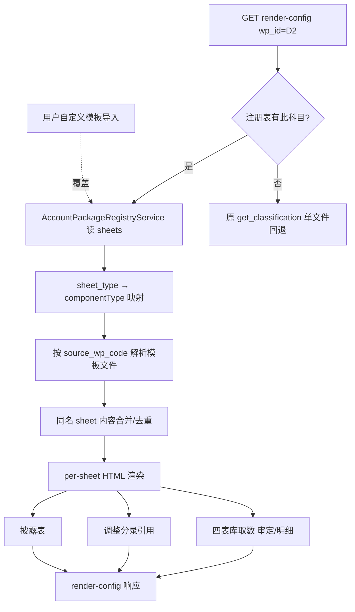

# 设计文档：科目底稿多文件聚合、联动与行业可扩展

## 概述

本设计复用平台**已实施**的 `account_package_registry.json` + `account_package_registry_service.py`（科目工作包注册表），让 `get_render_config` 消费注册表实现多文件聚合，修正前端格式选型（HTML 优先），完善底稿间联动，并扩展为支持行业模板包 + 用户自定义导出/导入。

核心修正（针对上一版问题）：
1. **不重写聚合器**——改为消费已有注册表（registry 已人工校准 sheet 来源/sheet_type）
2. **前端格式选型为设计核心**——明确 sheet_type → componentType → 前端形态映射，杜绝"显示不出来"
3. **三文件合并为一个底稿**——registry 的 sheets 数组即合并后清单
4. **联动 + 行业扩展 + 自定义导入** 纳入设计

## 现状（已查证）

### 已实施资产（复用）
- `backend/data/account_package_registry.json`：D1/D2 工作包，声明全部 sheet（sheet_name/sheet_type/source_wp_code/schema_ref）
  - D2 已列 14 sheet：D2A 程序表 / D2-1 审定表 / D2-2 明细 / D2-3 坏账 / D2-4 调整 / D2-5 分析 / D2-6~D2-13 检查 / 披露 / D2-C 结论
- `backend/app/services/account_package_registry_service.py`：注册表读取服务
- `get_render_config` per-sheet dispatch + RENDERER_DISPATCH 策略
- `find_all_template_files` / `_normalize_sheet_name` / `_content_hash`（待建）

### 问题根因
- registry 状态 `pending_inventory_reconciliation`，render-config 未接它 → D2 仍走 classification 单文件回退
- 上一版误用 univer 等渲染不出的类型 → 空白

## 架构

### 数据流



### sheet_type → componentType → 前端格式映射表（设计核心）

| sheet_type | componentType | 前端组件 | 前端格式 | 说明 |
|------------|---------------|---------|---------|------|
| control_panel | a-program-console | GtAProgramConsole | HTML 中控台 | 程序表 D2A，认定矩阵+程序清单 |
| procedure | a-program-console | GtAProgramConsole | HTML 中控台 | 检查表 D2-6~D2-13 |
| audit_sheet | audit-sheet | GtAuditSheet | HTML el-table | 审定表 D2-1，列结构动态解析 |
| detail_table | audit-sheet | GtAuditSheet | HTML el-table | 明细表 D2-2 |
| analysis | audit-sheet | GtAuditSheet | HTML el-table | 分析表 D2-5/测算 D2-9/D2-10/D2-13 |
| adjustment | d-form-table | GtDFormTable | HTML 表单 | 调整分录 D2-4（无复杂公式时 HTML） |
| disclosure | c-note-table | GtCNoteTable | HTML 附注表 | 附注披露 |
| conclusion | d-form-paragraph | GtDFormParagraph | HTML 段落 | D2-C 科目结论 |
| control_panel(目录) | b-index | GtBIndex | HTML 架构树 | 底稿目录（自动生成导航） |

**铁律遵从**：memory「三表 HTML 渲染，仅复杂公式/DCF/图表保留 OnlyOffice」。坏账明细嵌套结构特殊保留 `bad-debt-sheet`（HTML 嵌套 table）。**禁止 univer 兜底导致空白**——analysis 改用 audit-sheet。

## 组件与接口

### 1. AccountPackageResolver（新增 `wp_account_package_resolver.py`）

```python
async def resolve_package_sheets(
    db, wp_code, project_id
) -> list[ClassificationResult] | None:
    """读注册表 → 返回聚合 sheet 的 ClassificationResult 列表。
    None 表示该科目无注册表条目（调用方回退原逻辑）。

    1. registry_service.get_package(wp_code)；含项目级/事务所级自定义覆盖
    2. 对每个 sheet：sheet_type → class_code（反查映射）→ componentType
    3. 解析 source_wp_code → 模板文件路径（find_template_file_any）
    4. 填充 ClassificationResult（sheet_name/class_code/source_files）
    """

# sheet_type → class_code（复用既有 derive 链 + class_code_to_component）
# 已核验：每个 class_code 经 class_code_to_component 返回非 None 且为 HTML 白名单类型
_SHEET_TYPE_TO_CLASS = {
    "control_panel": "A-实质性程序",  # → a-program-console
    "procedure": "A-检查程序",         # → a-program-console
    "audit_sheet": "F-审定表",         # → audit-sheet（_F_SUB_ROUTING 精确命中）
    "detail_table": "F-明细表",        # → audit-sheet
    "analysis": "F-明细表",            # → audit-sheet（非 univer，根治"显示不出来"）
    "adjustment": "D-调整",            # → d-form-table（D- 默认）
    "disclosure": "C-附注披露",        # → c-note-table
    "conclusion": "D-政策检查",        # → d-form-paragraph
}
# ⚠ 禁止映射到 "F-分析表"/"G-*" 等 fallback 到 univer 的键（会渲染空白）
```

**mapping_status 门控约定**：`account_package_registry.json` 的 `mapping_status`（当前 `pending_inventory_reconciliation`）**不作为消费门控** —— 只要 package 存在即直接消费其 `sheets` 数组，registry 已人工校准来源/sheet_type，状态字段仅供后续盘点用。

### 2. 同名内容合并（`wp_multifile_sheet_merge.py`）

```python
def content_hash(file_path, sheet_name) -> str:
    """单元格值 md5，(mtime,sheet) LRU 缓存。"""

def merge_or_dedup(sheet_name, occurrences) -> AggregatedSheet:
    """内容哈希全同→去重；不同→合并 source_files，is_merged=True。"""

def merge_sheet_content(source_files, sheet_name, component_type) -> dict:
    """多源同名 sheet 内容拼接为单 html_data，区块间插来源标识行。"""
```

### 3. get_render_config 接入

Step 4 后插入：
```python
pkg_sheets = await resolve_package_sheets(db, wp_code, project_id)
if pkg_sheets:
    classifications = pkg_sheets   # 多文件聚合
# else 走原 classification（零回归）
```
per-sheet dispatch 时按 sheet 的 `source_files` 读模板（多源走 merge_sheet_content）。

### 4. 联动（复用既有，需求 4）

| 联动 | 复用 | 动作 |
|------|------|------|
| 审定表/明细表取四表库 | `refresh_audit_sheet_from_ledger`+`_resolve_auto_fill_values` | 确认 D2 科目码(1122)映射；audit-sheet 触发取数 |
| 审定表→TB回写 | `_on_d_audit_determination_saved` | 确认聚合后审定表 sheet 匹配 `[D-N]\d+-1` |
| 明细↔审定 ref | 既有 cross_ref + ref_index chip | 审定行引用明细合计 |
| 调整分录 | 项目级 AJE/RJE + D2-4 sheet | D2-4 引用本科目分录 |
| 披露联动 | sync-to-disclosure-notes | 披露引用审定金额 |
| stale | TRIAL_BALANCE_UPDATED + useStaleRefresh | 复用 |

### 5. 行业可扩展 + 用户自定义（需求 6）

#### 5.1 注册表扩展行业维度
`account_package_registry.json` 每个 package 增 `industry` 字段（`["通用"]`/`["制造业"]`/`["商贸"]`…）。解析优先级：项目级自定义 > 事务所级 > 匹配行业 > 通用。

#### 5.2 导出模板
新端点 `GET /api/account-packages/{wp_code}/export-template`：
- 导出该科目工作包结构为可编辑文件（xlsx：每 sheet 一页 + 元信息页含 sheet_type/字段定义；或结构化 YAML）
- 用户可增删 sheet、改 sheet_type、调字段

#### 5.3 导入自定义模板
新端点 `POST /api/account-packages/import-template`：
- 解析上传文件 → 校验（sheet_type 在白名单 / componentType 可渲染 / 必填字段齐全）
- 校验通过 → 写 `custom_account_packages` 表（project_id/firm_id 级）
- 校验失败 → 返回明确错误清单（需求 6.6）

#### 5.4 自定义存储（新表）
```sql
CREATE TABLE custom_account_packages (
    id UUID PK, scope VARCHAR(16),  -- 'project'|'firm'
    scope_id UUID, wp_code VARCHAR(32),
    industry VARCHAR(32), package_json JSONB,
    created_by UUID, created_at TIMESTAMPTZ,
    UNIQUE(scope, scope_id, wp_code)
);
```
`resolve_package_sheets` 先查 custom 表（按优先级），未命中再读内置 registry。

## 数据模型

- 复用 `account_package_registry.json`（增 industry 字段）
- 新增 `custom_account_packages` 表（用户自定义）
- 聚合运行时计算 + LRU 缓存，不持久化聚合结果

## 错误处理

1. 模板文件缺失 → 跳过该 sheet，warning
2. 内容哈希失败 → 退化按名去重
3. 联动取数失败 → 空值+提示，不阻断（需求 4.8）
4. 聚合为空 → 回退原 classification
5. 自定义模板非法 → 明确校验错误清单

## 测试策略

### 后端
- `test_account_package_resolver.py`：D2 聚合返回 14 sheet，每 sheet componentType 正确（HTML 类，无 univer 空白）
- `test_multifile_sheet_merge.py`：同名披露多源合并 + 来源标识；GT_Custom 去重
- `test_custom_account_package.py`：导出→编辑→导入往返；非法校验拒绝；优先级解析
- 行业回退 PBT；内容哈希幂等 PBT
- 回归：render-config smoke + cycle 验证零回归

### 前端
- 聚合后 tab 全 sheet + HTML 渲染无空白
- 底稿目录 4 阶段
- Playwright D2 三项目实测：全 sheet 显示 + 联动 + 跳转 0 error

### 实测验收
- D2 三项目：14 sheet 全 HTML 渲染、审定表取数、审定→TB 回写、披露合并、目录跳转
- 自定义：导出 D2 模板→加一个 sheet→导入→渲染生效

## 关键设计决策

1. **复用注册表而非新写扫描器**——registry 已人工校准，比运行时扫描可靠
2. **前端 HTML 优先**——analysis/adjustment 用 audit-sheet/d-form-table，杜绝 univer 空白（遵 memory 铁律）
3. **sheet_type 是格式选型唯一依据**——注册表声明 sheet_type，映射表定 componentType
4. **行业分层 + 自定义覆盖**——项目>事务所>行业>通用，导出/导入闭环支持非制造业
5. **同名内容合并保留来源标识**——审计轨迹可追溯
6. **单文件零回归**——无注册表条目走原路径
