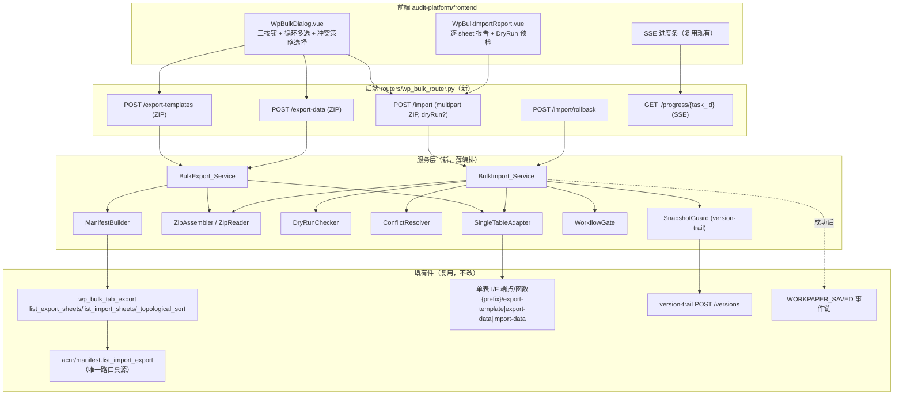
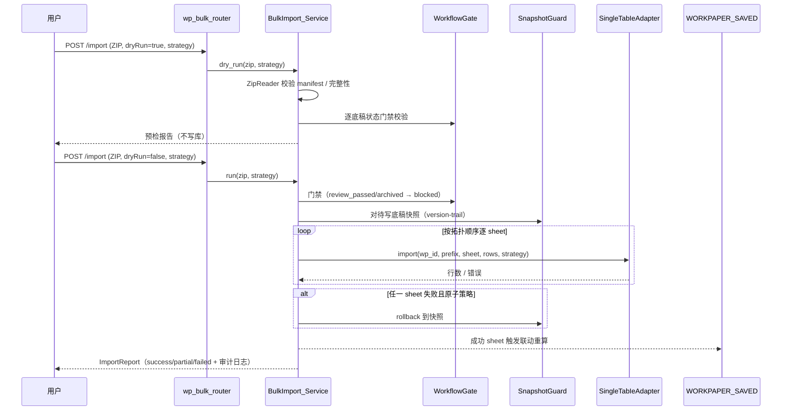

# Design Document · 项目级底稿批量导入导出（workpaper-bulk-tab-import-export）

## Overview

本设计把 `requirements.md` 的 9 条需求转化为**可落地、非破坏、复用优先**的编排层方案。核心判断（对齐需求对齐文档复盘）：**bulk 能否做成不取决于 ZIP 打包技术，而取决于是否有统一的路由真源（ACNR）与执行层（单表 I/E）**。二者均已就绪，故本 spec 只做「编排 + 端点 + dry-run + 快照回滚 + 异步/SSE + 前端 + 报告 + 权限门禁」，**不重写执行层、不新造 Excel 格式、不新造 manifest 真源**。

### 设计原则

- **三层复用**：路由真源=ACNR `manifest.list_import_export`；排序=`wp_bulk_tab_export._topological_sort`；Excel 执行=单表 I/E 端点。本 spec 只加一层薄编排。
- **内部 HTTP 复用 vs 直调**：优先**服务层直调**单表 I/E 的底层生成/解析函数（避免自调 HTTP 的鉴权/序列化开销）；仅当某循环 I/E 只暴露为路由时，才走内部调用封装。设计采用「适配器」抽象屏蔽差异（见 §Components `SingleTabIeAdapter`）。
- **fail-soft 编排**：单个 Tab 失败（resolve miss / 超限 / 缺文件 / 状态门禁）不使整包失败，逐条记入报告（Req 1.6/1.8/2.7/2.8/2.9/9.1）。
- **快照优先**：正式导入前先经 version-trail 快照，保证可回滚（Req 2.4/6.2）。
- **安全边界在后端**：权限（Req 5）、工作流状态门禁（Req 9）在后端 deps 层强制，前端只做体验。

### 需求 → 组件映射

| 需求 | 组件 |
|------|------|
| Req 1/3 导出 | `BulkExport_Service` + `ZipAssembler` + `ManifestBuilder` |
| Req 2/8 导入 + 冲突 | `BulkImport_Service` + `ZipReader` + `DryRunChecker` + `ConflictResolver` + `SnapshotGuard` |
| Req 4/9 导入后行为 + 状态门禁 | `BulkImport_Service`（复用 `WORKPAPER_SAVED` 事件链）+ `WorkflowGate` |
| Req 5 权限入口 | 路由 deps + 前端 `WpBulkDialog` 三按钮 |
| Req 6 异步/SSE | `BulkAsyncTask`（复用现有 batch-export-async / SSE） |
| Req 7 manifest 契约 | `ManifestBuilder`（唯一读 ACNR）+ CI 契约测试 |

## Architecture

### 分层与调用链



### 导入序列（含 dry-run / 快照 / 回滚）



## Components and Interfaces

### 1. ManifestBuilder（新，唯一读 ACNR）

职责：把 ACNR_Manifest 的 entries 转成 bulk `manifest.json` 结构（§8.6.6 字段），组装 `zip_path` 与 `sha256`。

```python
# backend/app/services/bulk_tab/manifest_builder.py
async def build_manifest(
    db, project_id: UUID, cycles: list[str] | None, mode: Literal["template", "data"]
) -> BulkManifest:
    """从 wp_bulk_tab_export.list_export_sheets(逐 cycle) 汇总 entries，
    生成 manifest（含 addr_id/wp_code/sheet_code/sheet_name/api_prefix/item_id/
    wp_id/zip_path/origin/skip_reason），并写入 exported_at/exported_by/platform_version。
    路由元数据只来自 ACNR，不手写清单（Req 7.1）。"""
```

- `zip_path` 模板：`{cycle}/{parent_wp_code}/{sheet_code}_{short_label}_{模板|数据}.xlsx`（§8.6.6）。`short_label` = `sheet_name` 去 `sheet_code` 后缀并 slug 化。
- `skip_reason`/`wp_id=None` 的条目仍写入 manifest（标注），但不产出 xlsx（Req 1.6/1.8/7.3）。

### 2. SingleTabIeAdapter（新，屏蔽执行层差异）

职责：给定 `(wp_id, api_prefix, sheet_code, mode)`，产出/解析该 Tab 的 xlsx，**复用单表 I/E 执行层**。

```python
# backend/app/services/bulk_tab/single_tab_adapter.py
async def export_tab(db, wp_id, api_prefix, sheet_code, mode) -> bytes: ...
async def import_tab(db, wp_id, api_prefix, sheet_code, xlsx_bytes,
                     strategy: ConflictStrategy) -> TabImportResult: ...
```

- 首选直调各循环 `_{cycle}_import_export.py` 的 workbook 构建/解析纯函数（避免自调 HTTP）。
- 差异循环通过注册表 `IE_ADAPTER_REGISTRY[api_prefix]` 适配；未注册 → manifest `skip_reason=no_adapter`（fail-soft）。
- 冲突策略在 adapter 的解析→写库阶段应用（见 ConflictResolver）。

### 3. BulkExport_Service（新，Req 1/3/6）

```python
# backend/app/services/bulk_tab/bulk_export_service.py
async def export(db, project_id, cycles, mode, only_with_data=False,
                 progress=None) -> BytesIO:
    entries = await build_manifest(db, project_id, cycles, mode)   # 只读 ACNR
    for e in entries.exportable():        # 跳过 skip_reason / wp_id=None
        xlsx = await export_tab(db, e.wp_id, e.api_prefix, e.sheet_code, mode)
        if mode == "data" and only_with_data and is_empty(xlsx):   # Req 3.3
            e.mark_skipped("no_data"); continue
        zip.write(e.zip_path, xlsx)
        progress and progress.tick()
    zip.write("manifest.json", entries.to_json())
    zip.write("README.txt", render_readme(entries))               # Req 1.7
    return zip.finalize()
```

### 4. BulkImport_Service（新，Req 2/4/8/9）

```python
# backend/app/services/bulk_tab/bulk_import_service.py
async def dry_run(db, project_id, zip_bytes, strategy) -> ImportReport:
    """校验 manifest / 文件完整性 / 表头 / 工作流状态门禁；不写库（Req 2.3）。"""

async def run(db, project_id, zip_bytes, strategy, user, progress=None) -> ImportReport:
    manifest = ZipReader(zip_bytes).manifest
    sheets = await list_import_sheets(db, project_id, cycle=None)  # 拓扑顺序
    plan = align(manifest, sheets)     # missing/unlisted 标注（Req 2.8/2.9）
    gate = WorkflowGate(user).classify(plan)  # blocked_by_status（Req 9.1）
    snapshots = await SnapshotGuard.snapshot(db, plan.writable_wp_ids)  # Req 2.4
    try:
        for item in plan.topo_order():      # Req 2.2
            if item.blocked: report.mark(item, "blocked_by_status"); continue
            await WorkflowGate.revert_if_under_review(db, item, user)  # Req 4.3/9.2
            res = await import_tab(db, item.wp_id, item.api_prefix,
                                   item.sheet_code, item.xlsx, strategy)
            report.merge(res)   # success/partial/failed + 行数 + 超限告警(Req 2.7)
    except FatalImportError:
        await SnapshotGuard.rollback(db, snapshots)   # Req 2.4/6.2
        report.mark_all_rolled_back()
    await audit_log(user, project_id, report)   # Req 4.2
    # 成功 sheet 已由单表 import 内部触发 WORKPAPER_SAVED → 联动重算（Req 4.1）
    return report
```

### 5. ConflictResolver（新，Req 8）

- `overwrite`（默认）：全量替换该 `item_id` 行数据（等同现有单表 import 语义）。
- `fill-empty`：读现有 `checklist_responses` → 仅对空字段/空行写入 → 不覆盖非空。
- `reject`：目标 `item_id` 已有非空数据 → 该 sheet 抛 `ConflictRejected`，不部分写入（Req 8.3）。
- 策略对整包统一，回显于报告（Req 8.4）。

### 6. SnapshotGuard（新，复用 version-trail，Req 2.4/6.2）

- `snapshot(db, wp_ids)`：对每个待写底稿调用 version-trail `POST /versions`（或其服务层）创建 pre-import 快照，记 `snapshot_id`。
- `rollback(db, snapshots)`：将底稿恢复到 `snapshot_id`。
- 原子性策略：默认 **per-sheet 尽力**（失败 sheet 回滚自身），提供 **all-or-nothing**（任一失败全回滚）开关，缺省 per-sheet。

### 7. WorkflowGate（新，Req 9）

- `classify(plan)`：按底稿状态分类——`review_passed`/`archived`/锁定 → `blocked`；`under_review` → `revert_needed`；其余 → `writable`。
- `revert_if_under_review`：有编制权限时回退为编制中并记审计日志（Req 4.3/9.2）；无权限不改状态、不写（Req 9.3）。

### 8. 路由（新，Req 5/6）

`backend/app/routers/wp_bulk_router.py`（经 `router_registry` 注册）：

| 方法 | 路径 | 权限 | 说明 |
|------|------|------|------|
| POST | `/api/projects/{project_id}/bulk-tab/export-templates` | ≥ 只读 | 循环多选，返回 ZIP 或异步 task_id |
| POST | `/api/projects/{project_id}/bulk-tab/export-data` | ≥ 只读 | `only_with_data?` |
| POST | `/api/projects/{project_id}/bulk-tab/import` | 编制权（`require_wp_edit_permission`）| multipart ZIP，`dryRun?`、`strategy` |
| POST | `/api/projects/{project_id}/bulk-tab/import/rollback` | 项目经理 | 按 `import_id` 回滚 |
| GET | `/api/projects/{project_id}/bulk-tab/progress/{task_id}` | ≥ 只读 | SSE 进度 |

### 9. 前端（新，Req 5）

- `WpBulkDialog.vue`：三按钮 + 循环多选 + 冲突策略 radio + `only_with_data` 勾选 + DryRun 开关；与 `WpBatchExportDialog` 并列（Req 5.1）。
- `WpBulkImportReport.vue`：逐 sheet 表格（`success`/`partial`/`failed`/`missing`/`unlisted`/`blocked_by_status`/`conflict_rejected` + 行数 + 错误），DryRun 结果与正式结果共用。
- SSE 进度复用现有进度条组件。

## Data Models

**不新增数据库表**——最大限度复用：
- 数据存储：`checklist_responses`（`wp_id` + `item_id`），由单表 import 写入。
- 快照：version-trail 既有版本表（`working_paper_snapshots` 等）。
- 审计日志：既有审计日志表 / `broadcast_raw` 通知。

### manifest.json 结构（ZIP 内文件，非 DB）

```jsonc
{
  "schema_version": "1.0",
  "project_id": "…", "audit_year": 2025,
  "exported_at": "2026-07-12T…Z", "exported_by": "user_name",
  "platform_version": "…", "mode": "template",   // template | data
  "cycles": ["D"],
  "files": [
    {
      "addr_id": "D2/D2-2/D2-vc-rows",
      "wp_code": "D2", "parent_wp_code": "D2",
      "sheet_code": "D2-2", "sheet_name": "明细表D2-2",
      "origin": "standard",                       // standard | custom
      "api_prefix": "d2", "item_id": "D2-vc-rows",
      "storage_field": "remark", "wp_id": "…",
      "import_order": 2, "depends_on_sheets": [],
      "zip_path": "D/D2/D2-2_明细表_模板.xlsx",
      "sha256": "…"
    }
  ],
  "skipped": [
    { "sheet_code": "D2-index", "skip_reason": "no_import_export" }
  ]
}
```

### ImportReport 结构（响应体，非 DB）

```jsonc
{
  "import_id": "…", "strategy": "overwrite", "dry_run": false,
  "snapshots": [{ "wp_id": "…", "snapshot_id": "…" }],
  "sheets": [
    { "sheet_code": "D2-2", "status": "success", "rows": 42 },
    { "sheet_code": "D2-1", "status": "partial", "rows": 10,
      "warnings": ["row_limit_exceeded: 520 > 500"] },
    { "sheet_code": "D2-7", "status": "blocked_by_status", "reason": "review_passed" },
    { "sheet_code": "D2-3", "status": "missing" }
  ],
  "summary": { "success": 1, "partial": 1, "failed": 0, "blocked": 1, "missing": 1 }
}
```

## Correctness Properties

*属性是系统在所有合法执行下都应成立的特征——人类可读规格与机器可验证正确性之间的桥梁。* 每条属性以单一 PBT 实现，最少 100 次迭代（后端 hypothesis `@settings(max_examples=100)`，前端 fast-check `{ numRuns: 100 }`）。

### Property 1: 导入拓扑顺序满足依赖

*For any* 合法 manifest entry 集合（含任意 `depends_on_sheets` 无环组合）：BulkImport 的执行顺序中，任一 sheet 的所有 `depends_on_sheets` SHALL 先于该 sheet 出现；存在环时 SHALL 回退为 `import_order` 数值排序且不丢条目。
**Validates: Requirements 2.2**（复用 `_topological_sort`，已有 PBT `test_bulk_topological_sort_pbt.py`，本 spec 断言编排层不改变该性质）

### Property 2: manifest 路由元数据仅来自 ACNR

*For any* 生成的 manifest：每个 file 条目的 `(api_prefix, item_id, sheet_code, wp_id)` SHALL 与 `ACNR_Manifest.list_import_export` 对同一 `addr_id` 的输出一致，SHALL NOT 出现 ACNR 未提供的路由字段。
**Validates: Requirements 7.1, 7.2**

### Property 3: 跳过项不影响其余导出/导入

*For any* 含任意 `skip_reason` / `wp_id=None` / `missing` / `unlisted` 子集的输入：BulkExport/BulkImport SHALL 处理完全部可处理条目，且被跳过项 SHALL 逐条记入 manifest.skipped / ImportReport，SHALL NOT 使整包失败。
**Validates: Requirements 1.6, 1.8, 2.7, 2.8, 2.9**

### Property 4: ConflictStrategy 语义正确

*For any* 库中已有数据状态 D0（空/部分/全满）与导入数据 I 及策略 s：
- `overwrite` → 结果等于 I 的全量替换；
- `fill-empty` → 结果中 D0 的非空字段/行恒保持不变，仅空位被 I 填充；
- `reject` → 若 D0 存在非空则该 sheet 结果为「未写入 + `conflict_rejected`」（无部分写入）。
**Validates: Requirements 8.1, 8.2, 8.3**

### Property 5: DryRun 不写库

*For any* 输入 ZIP 与策略：`dry_run` 执行前后，库中 `checklist_responses` 状态 SHALL 完全不变，且 SHALL 返回与正式导入同构的逐文件报告。
**Validates: Requirements 2.3**

### Property 6: 失败回滚恢复到导入前状态

*For any* 在第 k 个 sheet 注入失败（all-or-nothing 策略）：回滚后所有目标底稿的状态 SHALL 等于导入前快照，SHALL NOT 残留半写入数据。
**Validates: Requirements 2.4, 6.2**

### Property 7: 工作流状态门禁

*For any* 底稿状态组合与用户角色：`review_passed`/`archived`/锁定 目标 SHALL 恒被标 `blocked_by_status` 且不被写入；`under_review` 目标当且仅当用户有编制权限时才被回退并写入；无编制权限时 SHALL NOT 改变任何状态或写入。
**Validates: Requirements 9.1, 9.2, 9.3, 4.3, 4.4**

### Property 8: ZIP 不含敏感信息且路径规范

*For any* 导出：生成的 ZIP 内 SHALL NOT 含密钥/Token 文本模式，且每个文件 `zip_path` SHALL 匹配 `{cycle}/{parent_wp_code}/{sheet_code}_…\.xlsx` 规则。
**Validates: Requirements 6.3, 1.4**

## Error Handling

- **ACNR 加载失败（Req 7.4）**：`ManifestBuilder` 抛明确错误，路由返回 5xx + 提示「ACNR catalog 不可用」，绝不静默退回分散 JSON。
- **resolve_instance miss（Req 1.8）**：`list_export_sheets`/`list_import_sheets` 已过滤 `wp_id=None` 并 log warning；编排层记入 manifest.skipped，继续。
- **单 Tab 无 adapter**：manifest `skip_reason=no_adapter`，fail-soft。
- **行数超限（Req 2.7）**：adapter 返回 `partial` + `row_limit_exceeded` 告警，不整包失败。
- **ZIP 大小超限（Req 6.5）**：ZipReader 校验单文件 + 总大小上限，超限拒绝并返回明确错误。
- **权限/状态门禁（Req 5/9）**：后端 deps 层强制；被拒条目记 `blocked_by_status`/`403`，不影响其余。
- **异步任务失败**：SSE 上报错误状态，保留已快照可回滚。
- **中文文件名**：ZIP 内文件名与下载响应 `Content-Disposition` 用 RFC5987 编码（复用平台既有 helper）。

## Testing Strategy

- **PBT（P1–P8）**：拓扑顺序（复用已有）、manifest 契约、fail-soft、冲突策略、dry-run 不写库、回滚、门禁、ZIP 规范。
- **单元/示例**：`ManifestBuilder` 字段映射、`SingleTabIeAdapter` 注册表、`ConflictResolver` 三策略、`WorkflowGate` 分类。
- **集成**：D 循环 export→线下改→import 往返（3 张代表表：D2-1/D2-2/检查表），断言数据一致 + D2-1↔D2-2 SUMIF 联动（MVP 场景 1/2）。
- **回滚集成**：注入某 sheet 失败，断言回滚一致（MVP 场景 3）。
- **Playwright（反假绿）**：三按钮入口渲染 + DryRun 报告 + 正式导入报告 0 console error；异步导出 SSE 进度可见（MVP 场景 4，需 start-dev.bat）。
- **契约测试（Req 7）**：CI 校验 manifest 字段 100% 来自 ACNR catalog（drift guard）。
- **纪律**：PBT 用平台 `fast` profile；Vue 文件仅结构化编辑（禁 PowerShell，U+FFFD 铁律）；改动后必 Playwright。

## Migration / Rollout Strategy

- **Phase 1（D 试点）**：`ManifestBuilder` + `SingleTabIeAdapter`（D 循环 d1~d7）+ `BulkExport_Service`（模板/数据）+ `BulkImport_Service`（dry-run/快照/回滚/冲突）+ 路由 + 前端三按钮 + 报告。MVP 4 场景验收。
- **Phase 2（扩循环）**：adapter 注册表扩 K/F/G/H（ACNR manifest 已覆盖），逐循环 Playwright 往返回归。
- **Phase 3（异步/审计强化）**：异步任务 + SSE 全量 + 审计日志看板 + all-or-nothing 开关。
- **Phase 4（异构评估）**：OnlyOffice/程序表/自定义底稿 bulk 可行性评估（按业务优先级）。
- **回滚**：功能为增量新增端点/服务/前端组件，不改现有单表 I/E；异常直接下线路由 + `git revert`，零存量影响。
- **与现有 batch-export 并存**（Req 5.1/Q6）：不替代整份底稿文件导出，UI 区分「Tab 结构化数据包」vs「整份文件」。
